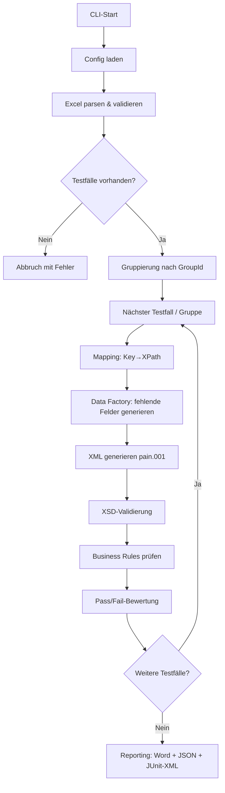
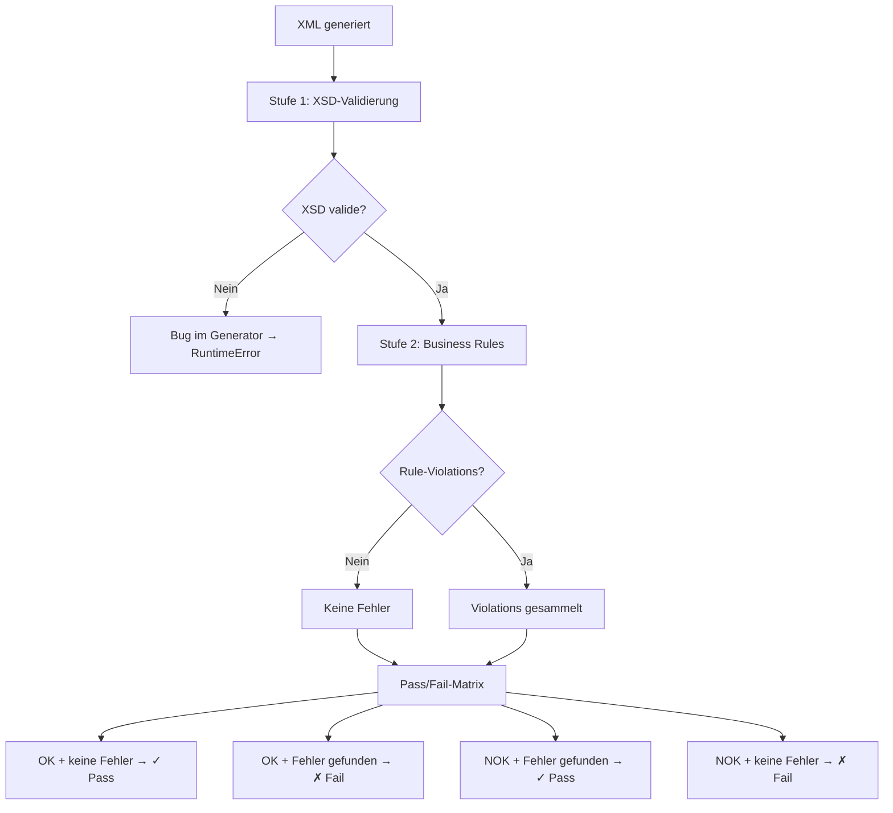
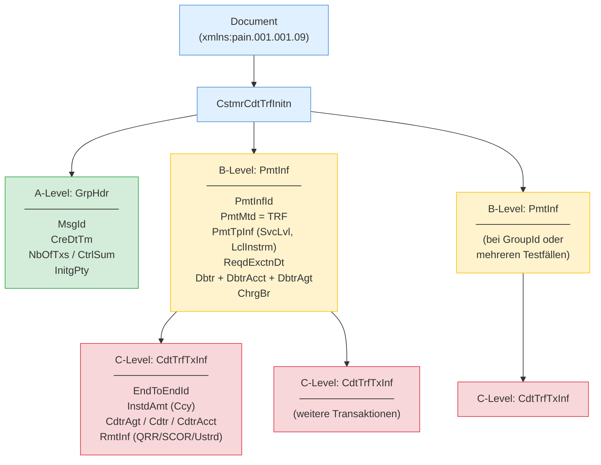

# ISO 20022 pain.001 Test Generator

Automatisierte Erstellung von ISO 20022-konformen **pain.001.001.09** Zahlungsdateien auf Basis von Excel-Testfalldefinitionen. Validierung gegen das XSD-Schema und die Business Rules der **Swiss Payment Standards (SPS) 2025**.

## Features

- **Excel-basierte Testfalldefinition** — ein Testfall pro Zeile, zusätzliche Transaktionen als Folgezeilen ohne TestcaseID
- **4 Zahlungstypen** — SEPA, Domestic-QR, Domestic-IBAN, CBPR+ mit typ-spezifischen Regeln und automatischer Erkennung
- **36 Business Rules** — zentraler Rule-Katalog mit Spec-Referenzen, organisiert in 9 Kategorien
- **Multi-Payment** — mehrere Testfälle in einer XML-Datei via `GroupId` (mehrere PmtInf-Blöcke pro Dokument)
- **Negative Testing** — 10 violatable Rules für gezielte Regelverletzungen via `ViolateRule=<RuleID>`
- **Reproduzierbare Testdaten** — Seed-basierte Generierung von IBANs (Mod-97), QR-Referenzen (Mod-10), SCOR-Referenzen (ISO 11649), Namen und Adressen
- **Minimale Pflichtfelder** — nur TestcaseID, Titel, Ziel, Erwartetes Ergebnis und Debtor-IBAN sind Pflicht; alles andere wird automatisch generiert
- **Second-Opinion-Validierung** — unabhängige Gegenprüfung mit `xmlschema`-Library zusätzlich zur lxml-Validierung
- **Reporting** — Word (.docx), JSON und JUnit-XML Reports pro Testlauf
- **59 Beispiel-XMLs** — vorab generierte Beispieldateien im `examples/`-Verzeichnis

---

## Ablauf & Architektur

### Pipeline



### Validierungs- und Pass/Fail-Logik



> XSD-Fehler werden als Bug im Generator behandelt und werfen einen `RuntimeError`. Generierte XMLs **müssen** immer schema-valide sein — auch bei negativen Testfällen.

### pain.001 XML-Struktur (A/B/C-Level)



---

## Voraussetzungen

- Python 3.10+
- [Poetry](https://python-poetry.org/) (Paketmanagement)

## Installation

```bash
git clone https://github.com/Sebastenhauer/iso20022tester.git
cd iso20022tester
poetry install
```

## Verwendung

```bash
poetry run python -m src.main --input <excel-datei> --config config.yaml [--seed 42] [--verbose]
```

**Beispiel mit dem mitgelieferten Template (65 Testfälle):**

```bash
poetry run python -m src.main --input templates/testfaelle_vorlage.xlsx --config config.yaml --verbose
```

### CLI-Argumente

| Argument | Pflicht | Beschreibung |
|----------|---------|-------------|
| `--input` | Ja | Pfad zur Excel-Datei mit Testfällen |
| `--config` | Ja | Pfad zur `config.yaml` |
| `--seed` | Nein | Seed für reproduzierbare Zufallsdaten (übersteuert config.yaml) |
| `--verbose` | Nein | Ausführliche Konsolenausgabe |

### Konfiguration (`config.yaml`)

```yaml
output_path: "./output"                              # Ausgabepfad
xsd_path: "schemas/pain.001.001.09.ch.03.xsd"       # XSD-Schema
seed: null                                           # Seed (null = zufällig)
report_format: "docx"                                # "docx" oder "txt"
```

---

## Excel-Format (v2)

Das Excel verwendet ein **zeilenbasiertes Format**: Jede Zeile mit einer `TestcaseID` startet einen neuen Testfall. Folgezeilen **ohne** TestcaseID werden als zusätzliche Transaktionen zum vorherigen Testfall hinzugefügt.

### Spalten

| Spalte | Pflicht | Beschreibung |
|--------|---------|-------------|
| TestcaseID | Ja | Eindeutige ID. Zeilen ohne ID = zusätzliche Transaktion |
| Titel | Ja | Kurzbeschreibung des Testfalls |
| Ziel | Ja | Testziel |
| Erwartetes Ergebnis | Ja | `OK` oder `NOK` |
| Zahlungstyp | Nein | `SEPA`, `Domestic-QR`, `Domestic-IBAN`, `CBPR+` (wird automatisch erkannt wenn leer) |
| Betrag | Nein | Dezimalzahl (wird generiert wenn leer) |
| Waehrung | Nein | ISO 4217, z.B. `EUR`, `CHF`, `USD` (wird aus Zahlungstyp abgeleitet wenn leer) |
| Debtor IBAN | Ja | IBAN des Auftraggebers |
| Debtor Name | Nein | Name des Auftraggebers (wird generiert wenn leer) |
| Debtor BIC | Nein | BIC des Auftraggebers |
| Creditor Name | Nein | Name des Begünstigten (wird generiert wenn leer) |
| Creditor IBAN | Nein | IBAN des Begünstigten (wird passend zum Zahlungstyp generiert) |
| Creditor BIC | Nein | BIC des Begünstigten |
| Verwendungszweck | Nein | Freitext-Zahlungsreferenz |
| ViolateRule | Nein | Rule-ID für gezielten Regelverstoss (z.B. `BR-SEPA-001`) |
| Weitere Testdaten | Nein | Key=Value Overrides (z.B. `ChrgBr=DEBT; CtgyPurp.Cd=SALA`) |
| Bemerkungen | Nein | Freitext |

### Minimale Beispiele

**Einfachster Testfall** (nur Pflichtfelder):

| TestcaseID | Titel | Ziel | Erwartetes Ergebnis | Debtor IBAN |
|-----------|-------|------|-------------------|-------------|
| TC-001 | SEPA Test | Positive Zahlung | OK | CH5604835012345678009 |

Zahlungstyp, Betrag, Währung, Creditor — alles wird automatisch generiert.

**Multi-Transaktion** (Folgezeilen ohne TestcaseID):

| TestcaseID | Titel | Erwartetes Ergebnis | Debtor IBAN | Betrag | Creditor Name |
|-----------|-------|-------------------|-------------|--------|--------------|
| TC-002 | Sammelzahlung | OK | CH5604835012345678009 | 1500.00 | Firma A |
| | | | | 2300.00 | Firma B |
| | | | | 800.50 | Firma C |

→ 1 XML mit 3 Transaktionen im selben PmtInf-Block.

**Multi-Payment via GroupId** (mehrere PmtInf in einer XML):

| TestcaseID | Titel | Erwartetes Ergebnis | Debtor IBAN | Weitere Testdaten |
|-----------|-------|-------------------|-------------|------------------|
| TC-003 | SEPA in Batch | OK | CH5604835012345678009 | GroupId=BATCH-A |
| TC-004 | QR in Batch | OK | CH5604835012345678009 | GroupId=BATCH-A |

→ 1 XML mit 2 PmtInf-Blöcken (TC-003 und TC-004 teilen sich die GroupId).

Das vollständige Template mit 65 Testfällen liegt unter `templates/testfaelle_vorlage.xlsx`.

---

## Zahlungstypen

| Typ | SPS-Typ | Währung | Besonderheiten |
|-----|---------|---------|----------------|
| **SEPA** | S | EUR | SvcLvl=SEPA, ChrgBr=SLEV, Creditor-Name max. 70 Zeichen |
| **Domestic-QR** | D | CHF/EUR | QR-IBAN (IID 30000–31999), QRR-Referenz zwingend (Prtry) |
| **Domestic-IBAN** | D | CHF | Reguläre CH-IBAN, SCOR optional (Mod-97), keine QRR |
| **CBPR+** | X | vom User | Creditor-Agent BIC Pflicht (`CdtrAgt.BICFI=...`) |

Wenn kein Zahlungstyp angegeben wird, erkennt das System den Typ automatisch anhand von Creditor-IBAN und Währung.

---

## Business Rules

**36 Business Rules** in einem zentralen Katalog (`src/validation/rule_catalog.py`), organisiert in 9 Kategorien:

| Kategorie | Anzahl | Beispiele |
|-----------|--------|-----------|
| **HDR** | 3 | MsgId-Eindeutigkeit, NbOfTxs/CtrlSum-Konsistenz |
| **GEN** | 8 | Betrag > 0, Zeichensatz, Adresse, Referenzfelder, Bankarbeitstag |
| **SEPA** | 5 | EUR-Pflicht, SLEV, Name max. 70, Betragsgrenzen |
| **QR** | 7 | QR-IBAN-Pflicht, QRR-Pflicht, keine SCOR, Mod-10-Prüfziffer |
| **IBAN** | 6 | Keine QR-IBAN, keine QRR, CHF-Pflicht, SCOR-Validierung |
| **CBPR** | 3 | Creditor-Agent-Pflicht, strukturierte Adressen |
| **ADDR** | 1 | Adressformat-Validierung (strukturiert/hybrid) |
| **IBAN-V** | 2 | Mod-97-Prüfziffer, Längenvalidierung |
| **REF-V** | 1 | SCOR RF-Prüfziffer (ISO 11649) |

Davon sind **10 Rules violatable** für Negative Testing (z.B. `BR-SEPA-001`, `BR-QR-002`, `BR-CBPR-005`).

Vollständiger Katalog mit Spec-Referenzen: `docs/SDD_v2.md` §5.7

---

## Output

Pro Testlauf wird ein Unterordner `output/YYYY-MM-DD_HHMMSS/` erstellt mit:

| Datei | Beschreibung |
|-------|-------------|
| `[Timestamp]_[TestCaseID]_[UUID].xml` | Generierte pain.001 XML-Datei |
| `[Timestamp]_Group-[GroupId]_[UUID].xml` | Multi-Payment XML (bei GroupId) |
| `Testlauf_Zusammenfassung.docx` | Fachlicher Report mit Pass/Fail pro Testfall |
| `testlauf_ergebnis.json` | Maschinenlesbares Ergebnis |
| `testlauf_ergebnis.xml` | JUnit-XML für CI/CD-Integration |

Vorab generierte Beispiele: `examples/` (59 XML-Dateien + Reports)

---

## Tests & Validierung

### Unit Tests

```bash
poetry run pytest                      # alle Tests
poetry run pytest tests/ -v            # mit Details
poetry run pytest tests/test_iban.py   # einzelner Test
```

### Second-Opinion-Validierung

Unabhängige Gegenprüfung der generierten XMLs mit der `xmlschema`-Library (nicht lxml):

```bash
poetry run python scripts/validate_external.py output/2026-03-21_*/
poetry run python scripts/validate_external.py examples/ --report report.json
```

### Externe Validierung

Für die unabhängige Prüfung durch Dritte stehen folgende Optionen zur Verfügung:

1. **SIX Validation Portal** (empfohlen) — [validation.iso-payments.ch/SPS](https://validation.iso-payments.ch/sps/account/logon) — kostenlos, offiziell, SPS 2025
2. **TreasuryHost** — [treasuryhost.eu](https://www.treasuryhost.eu/solutions/painp/) — kostenlos, keine Registrierung
3. **XMLdation** — [xmldation.com](https://www.xmldation.com/en/solutions/components/validator) — Enterprise, API-fähig

Details: `docs/external_validation_guide.md` und `docs/xml_validation_services.md`

---

## Projektstruktur

```
iso20022tester/
├── config.yaml                          # Laufzeit-Konfiguration
├── pyproject.toml                       # Poetry Dependencies
├── schemas/
│   └── pain.001.001.09.ch.03.xsd       # Offizielles XSD-Schema (SIX Group)
├── docs/
│   ├── SDD_v2.md                        # Software Design Dokument v2.1
│   ├── xml_validation_services.md       # Analyse externer Validierungsdienste
│   ├── external_validation_guide.md     # Anleitung zur externen Validierung
│   └── specs/                           # SPS 2025 Spezifikationen (~10k Zeilen)
├── templates/
│   └── testfaelle_vorlage.xlsx          # Beispiel-Excel mit 65 Testfällen
├── examples/                            # 59 vorab generierte XML-Dateien + Reports
├── scripts/
│   └── validate_external.py             # Second-Opinion-Validator (xmlschema)
├── src/
│   ├── main.py                          # CLI Entry Point
│   ├── config.py                        # Config-Loader (YAML → Pydantic)
│   ├── models/                          # Pydantic-Datenmodelle
│   ├── input_handler/                   # Excel-Parser (v2, Transaktionszeilen)
│   ├── mapping/                         # Deterministisches Key→XPath Mapping
│   ├── data_factory/                    # IBAN-, Referenz-, Adressgenerierung
│   ├── xml_generator/                   # pain.001 XML-Aufbau (lxml)
│   │   ├── pain001_builder.py           # A/B/C-Level Builder (Single + Multi)
│   │   └── builders.py                  # Wiederverwendbare XML-Bausteine
│   ├── payment_types/                   # SEPA, Domestic-QR/IBAN, CBPR+
│   ├── validation/
│   │   ├── xsd_validator.py             # XSD-Schema-Validierung
│   │   ├── business_rules.py            # Validierungs- & Violation-Logik
│   │   └── rule_catalog.py              # Zentraler Rule-Katalog (36 Rules)
│   ├── reporting/                       # Word, JSON, JUnit Reports
│   └── cache/                           # Mapping-Cache (vorbereitet für Phase 2)
├── tests/                               # Unit Tests (pytest)
└── pain001_generator_anforderungen.md   # Anforderungsdokument (FR-01 bis FR-105)
```

---

## Dokumentation

| Dokument | Beschreibung |
|----------|-------------|
| `docs/SDD_v2.md` | Software Design Dokument v2.1 — Architektur, Datenmodelle, vollständiger Business-Rule-Katalog |
| `docs/xml_validation_services.md` | Analyse von 11 externen Validierungsdiensten mit Preisen und Empfehlungen |
| `docs/external_validation_guide.md` | Schritt-für-Schritt-Anleitung für SIX Portal, TreasuryHost und lokale Validierung |
| `pain001_generator_anforderungen.md` | Anforderungsspezifikation (FR-01 bis FR-105) |
| `docs/specs/` | SPS 2025 Business Rules und Credit Transfer Implementation Guidelines |

---

## Lizenz

Proprietär. XSD-Schema: Copyright SIX Group.
