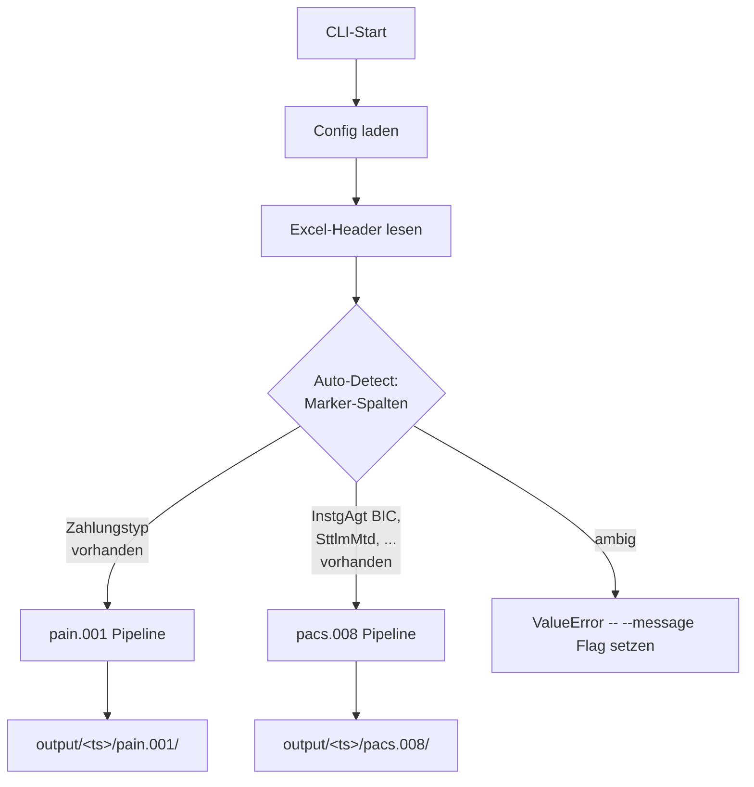
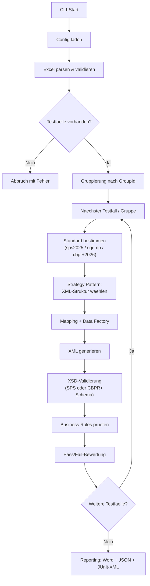
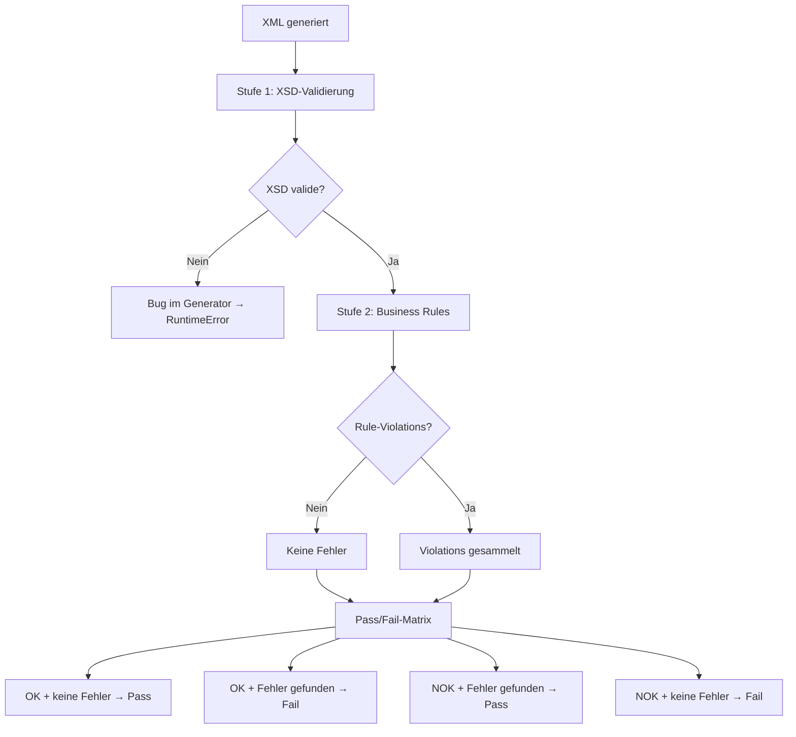
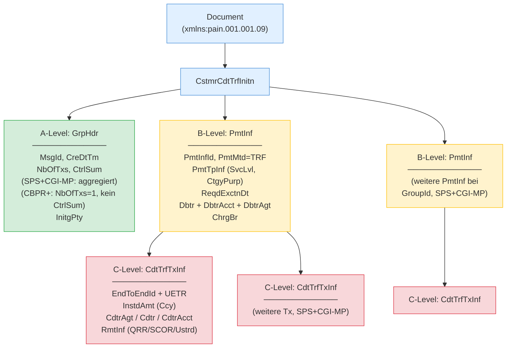

# ISO 20022 Payment Test Generator

Automatisierte Erstellung von ISO 20022-konformen Zahlungsnachrichten auf Basis von Excel-Testfalldefinitionen. Unterstuetzt zwei Message-Familien parallel:

- **pain.001.001.09** (Customer Credit Transfer Initiation) — C2B-Messages fuer **Swiss Payment Standards (SPS) 2025**, **CGI-MP** und **SWIFT CBPR+ SR2026**
- **pacs.008.001.08** (FI-to-FI Customer Credit Transfer) — Interbank-Messages fuer **CBPR+ SR2026**, ermoeglicht **Inflow-Testing** (eingehende Zahlungen simulieren) und **Outflow-Testing** (ausgehende Zahlungen generieren). TARGET2/SEPA/SIC-Flavors sind im Datenmodell vorbereitet fuer V2.

Die CLI erkennt den Message-Type automatisch anhand des Excel-Headers; beide Pipelines laufen mit derselben `src.main`-Entry.

## Quick Start

```bash
poetry install

# pain.001 run
poetry run python -m src.main \
    --input templates/testfaelle_comprehensive.xlsx \
    --config config.yaml

# pacs.008 run (Message-Type wird automatisch erkannt)
poetry run python -m src.main \
    --input templates/testfaelle_pacs008_comprehensive.xlsx \
    --config config.yaml

# pacs.008 mit externer external validation (benoetigt API-Key)
poetry run python -m src.main \
    --input templates/testfaelle_pacs008_comprehensive.xlsx \
    --config config.yaml \
    --external-validate
```

Output landet in `output/<timestamp>/pain.001/` bzw. `output/<timestamp>/pacs.008/` (getrennt pro Message-Type) und enthaelt die generierten XML-Files plus Reports (`testlauf_ergebnis.json` + `Testlauf_Zusammenfassung.docx`).

---

## pain.001 Standards-Vergleich (SPS / CGI-MP / CBPR+)

### Drei Standards -- Drei Use Cases

| | **SPS 2025** | **CGI-MP** | **CBPR+ SR2026** |
|-|-------------|-----------|-----------------|
| **Use Case** | Schweizer Corporate sendet Zahlung an CH-Bank | Multinationaler Corporate sendet Zahlung an Hausbank weltweit | Bank leitet Zahlung an Korrespondenzbank weiter |
| **Scope** | Customer-to-Bank (Schweiz) | Customer-to-Bank (global) | Bank-to-Bank (Relay) |
| **Schema** | `pain.001.001.09.ch.03` (im Repo) | Standard ISO pain.001.001.09 (SPS XSD kompatibel) | CBPR+ Restriction (proprietaer, MyStandards) |
| **Excel-Wert** | `sps2025` (Default) | `cgi-mp` | `cbpr+2026` |

> **Typischer Einsatz:** Ein Schweizer Corporate nutzt **SPS** fuer Domestic/SEPA und **CGI-MP** fuer internationale Zahlungen. **CBPR+** ist relevant fuer Banken, die pain.001 im Relay-Szenario weiterleiten.

### Strukturelle Unterschiede

| Element | SPS 2025 | CGI-MP | CBPR+ SR2026 |
|---------|----------|--------|-------------|
| GrpHdr/NbOfTxs | Summe aller Tx | Summe aller Tx | Immer "1" |
| GrpHdr/CtrlSum | Summe aller Betraege | Summe aller Betraege | **Entfaellt** |
| PmtInf/NbOfTxs | Anzahl Tx im Block | Anzahl Tx im Block | **Entfaellt** |
| PmtInf/CtrlSum | Summe im Block | Summe im Block | **Entfaellt** |
| PmtInfId | Generiert (eindeutig) | Kann = MsgId oder verschieden | **= MsgId** (Rule R8) |
| UETR | Optional | Optional (empfohlen) | **Pflicht** (UUIDv4) |
| CreDtTm | ISO 8601 lokal | ISO 8601 lokal | **Pflicht UTC-Offset** |
| ChrgBr | DEBT/CRED/SHAR/SLEV | DEBT/CRED/SHAR/SLEV | DEBT/CRED/SHAR (**kein SLEV**) |
| Transaktionen/Msg | 1..n PmtInf, 1..n Tx | 1..n PmtInf, 1..n Tx | **Genau 1 PmtInf, 1 Tx** |
| Zeichensatz | SPS Latin-1 Subset | UTF-8 (voll) | FIN-X Restricted |
| Leere Tags | **Verboten** (IG Kapitel 3.4) | **Verboten** (Best Practice) | Verboten |
| Regulatory Reporting | Optional `0..10`, fuer Domestic V2 verboten, Pflicht z.B. fuer UAE | Optional `0..10`, `DbtCdtRptgInd` Pflicht wenn verwendet | Optional `0..10`, dieselbe CH21-Constraint fuer `Dtls/Cd`+`Dtls/Ctry` |
| Structured Remittance | CdtrRefInf (SCOR, QRR) | Voll (RfrdDocInf, TaxRmt) | Wie CGI-MP |

Detaillierte Vergleiche:
- `docs/specs/pain.001/vergleich-sps-cgi-2025.md` (SPS vs. CGI-MP)
- `docs/specs/pain.001/vergleich-sps-cbprplus-2025.md` (SPS vs. CBPR+)
- `docs/specs/pain.001/vergleich-sps-epc-sepa-2025.md` (SPS vs. EPC SEPA)

## Features

- **Tri-Standard fuer pain.001** -- pro Testfall waehlbar: `sps2025` (Default), `cgi-mp` oder `cbpr+2026`, mit standard-spezifischer XML-Generierung und XSD-Validierung via Strategy Pattern
- **CBPR+ fuer pacs.008** -- FI-zu-FI Interbank-Generator mit BAH (head.001.001.02) als BusinessMessage-Envelope
- **Excel-basierte Testfalldefinition** -- ein Testfall pro Zeile, zusaetzliche Transaktionen als Folgezeilen ohne TestcaseID; Auto-Detection des Message-Typs aus dem Header
- **4 pain.001-Zahlungstypen** -- SEPA, Domestic-QR, Domestic-IBAN, CBPR+ mit typ-spezifischen Regeln
- **75+ Business Rules** -- zentraler Rule-Katalog in 13 Kategorien (HDR/GEN/ADDR/SEPA/QR/IBAN/DOM/SIC5/SCT-INST/CGI/CBPR/CBPR-PACS/SPS-CH21/IBAN-V/REF-V/CCY/REM/PURP/CTGP/BIC)
- **CGI-MP C2B-Konformitaet** -- globaler Corporate-to-Bank Standard mit Address-, Remittance-, Purpose-, Tax- und Infrastructure-Rules
- **CBPR+ Relay-Konformitaet** -- UETR Pflicht, SLEV verboten, kein CtrlSum, PmtInfId=MsgId, UTC-Offset, FIN-X Charset
- **CBPR+ pacs.008 SR2026** -- single-Tx, BAH-Envelope, currency-aware Amount-Formatting (Zero/Two/Three-Decimal), per-Flavor external XML Validator service Endpoint-Dispatch
- **Multi-Payment** -- mehrere Testfaelle in einer XML via `GroupId` (SPS und CGI-MP; CBPR+ pain.001 und pacs.008 jeweils nur Single-Tx)
- **Negative Testing** -- violatable Rules fuer gezielte Regelverletzungen via `ViolateRule=<RuleID>` (eigene Registry pro Message-Familie)
- **Externe Validation** -- optionaler **XML Validator API**-Aufruf fuer pacs.008 als Second-Opinion (CBPR+ -> `/cbpr/validate`, TARGET2/SEPA/SIC vorbereitet)
- **Reproduzierbare Testdaten** -- Seed-basierte Generierung von IBANs (Mod-97), QR-Referenzen (Mod-10), SCOR (ISO 11649)
- **Minimale Pflichtfelder** -- nur TestcaseID, Titel, Ziel, Erwartetes Ergebnis und (pain.001) Debtor-IBAN bzw. (pacs.008) Agent-BICs
- **Second-Opinion + Round-Trip-Validierung** -- `xmlschema`-Gegenpruefung und XML-Roundtrip-Konsistenzcheck
- **50+ Laender IBAN-Generierung** -- Europa, Naher Osten, Asien, Amerika, Afrika
- **Reporting** -- Word (.docx), JSON und JUnit-XML Reports pro Testlauf
- **188 Beispiel-Testfaelle** -- 138 pain.001 (`testfaelle_comprehensive.xlsx`, inkl. TC-DEMO-CGI-AR fuer Standards-Differenz-Demo) + 50 pacs.008 (`testfaelle_pacs008_comprehensive.xlsx`)
- **800+ Unit Tests** -- alle pytest gruen, separate Coverage fuer Builders, Rules, Violations, Pipeline, Excel-Parser, external XML Validator service-Client

---

## Ablauf & Architektur

### Unified Dispatch (pain.001 + pacs.008)



### pain.001 Pipeline



### pacs.008 Pipeline

```mermaid
flowchart TD
    A[Excel-Datei] --> B[parse_pacs008_excel]
    B --> C[Pacs008TestCase]
    C --> D["apply_defaults_to_testcase\n(SttlmMtd=INDA, ChrgBr=SHAR, T+1, IntrmyAgt1)"]
    D --> E[Pacs008BusinessMessage bauen]
    E --> F{ViolateRule\nim Excel?}
    F -- Ja --> G[apply_pacs008_violation]
    F -- Nein --> H[BAH + Document zusammenfuegen]
    G --> H
    H --> I[XSD validieren\n&#40;CBPR+ SR2026 Schema&#41;]
    I --> J[BR-CBPR-PACS-* pruefen]
    J --> K{--external-validate aktiv?}
    K -- Ja --> L["external XML Validator service /cbpr/validate"]
    K -- Nein --> M[Pacs008TestCaseResult]
    L --> M
    M --> N[XML + JSON Report]
```



### Validierungs- und Pass/Fail-Logik



> XSD-Fehler werden als Bug im Generator behandelt und werfen einen `RuntimeError`. Generierte XMLs **muessen** immer schema-valide sein -- auch bei negativen Testfaellen.

### pain.001 XML-Struktur (A/B/C-Level)



---

## Voraussetzungen

- Python 3.10+
- [Poetry](https://python-poetry.org/) (Paketmanagement)
- **SPS pain.001:** XSD im Repo (`schemas/pain.001/pain.001.001.09.ch.03.xsd`, SIX Group)
- **CBPR+ pacs.008:** XSD im Repo (`schemas/pacs.008/CBPRPlus_SR2026_..._iso15enriched.xsd`)
- **CGI-MP pain.001:** Kein zusaetzliches XSD noetig (SPS XSD wird verwendet)
- **CBPR+ pain.001 (optional):** SWIFT CBPR+ XSD von [MyStandards](https://www2.swift.com/mystandards/) (kostenloser Login, proprietaer, nicht im Repo)
- **external XML Validator service (optional, fuer pacs.008 External Validation):** Account auf [<XML_VALIDATOR_PROVIDER_PORTAL>](<XML_VALIDATOR_PROVIDER_PORTAL>), 7-Tage Trial oder Paid-Tier

## Installation

```bash
git clone https://github.com/Sebastenhauer/iso20022tester.git
cd iso20022tester
poetry install
```

### CBPR+ pain.001 XSD einrichten (optional)

1. Auf [SWIFT MyStandards](https://www2.swift.com/mystandards/) einloggen (kostenlose Registration)
2. CBPR+ Collection oeffnen, pain.001.001.09 Usage Guideline XSD herunterladen
3. Ablegen unter `docs/specs/cbpr+nonpublic/` (wird per `.gitignore` nicht gepusht)
4. Pfad in `config.yaml` eintragen:
   ```yaml
   cbpr_xsd_path: "docs/specs/cbpr+nonpublic/<dateiname>.xsd"
   ```

### XML Validator API Key einrichten (optional, fuer pacs.008 `--external-validate`)

1. API-Key auf validator service dashboard generieren
2. Im gitignored Ordner `xml_validator/` ablegen:
   ```
   xml_validator/api-key-<date>.txt    # Bearer-Token, eine Zeile
   xml_validator/base-url-<date>.txt   # <XML_VALIDATOR_BASE_URL>
   ```
3. Alternativ: Environment-Variablen `XML_VALIDATOR_API_KEY` und `XML_VALIDATOR_BASE_URL`

Details: `docs/xml_validator_integration.md`.

## Verwendung

```bash
# XML generieren (Message-Type wird aus dem Header automatisch erkannt)
poetry run python -m src.main --input <excel-datei> --config config.yaml [--seed 42] [--verbose]

# Message-Type explizit setzen (bei ambigen Headers)
poetry run python -m src.main --input <excel-datei> --config config.yaml --message pain.001
poetry run python -m src.main --input <excel-datei> --config config.yaml --message pacs.008

# pacs.008 mit externer external validation
poetry run python -m src.main --input <excel-datei> --config config.yaml --external-validate

# Round-Trip-Validierung (pain.001)
poetry run python -m src.main roundtrip <xml-dateien-oder-verzeichnis> --config config.yaml [--verbose]
```

**Beispiele:**

```bash
# 138 pain.001 Testfaelle (SPS + CGI-MP + CBPR+ gemischt)
poetry run python -m src.main --input templates/testfaelle_comprehensive.xlsx --config config.yaml

# 50 pacs.008 CBPR+ Testfaelle (auto-detected)
poetry run python -m src.main --input templates/testfaelle_pacs008_comprehensive.xlsx --config config.yaml

# Mit external XML Validator service (benoetigt API-Key in xml_validator/api-key-*.txt)
poetry run python -m src.main --input templates/testfaelle_pacs008_comprehensive.xlsx --config config.yaml --external-validate
```

### Konfiguration (`config.yaml`)

```yaml
output_path: "./output"
xsd_path: "schemas/pain.001/pain.001.001.09.ch.03.xsd"  # SPS XSD (im Repo, auch fuer CGI-MP)
cbpr_xsd_path: "docs/specs/cbpr+nonpublic/(...).xsd"    # CBPR+ pain.001 XSD (optional, proprietaer)
seed: null
report_format: "docx"
# bic_directory_path: "data/swift_bic_directory.csv"     # Optionales BIC-Verzeichnis
```

Das CBPR+ pacs.008 Schema (`schemas/pacs.008/...`) wird automatisch von der Pacs008TestPipeline geladen, ein expliziter Pfad in `config.yaml` ist nicht noetig.

---

## Excel-Format pain.001 (v2)

Jede Zeile mit `TestcaseID` startet einen neuen Testfall. Folgezeilen ohne TestcaseID = zusaetzliche Transaktionen (Multi-Tx). Marker-Spalte fuer die Auto-Detection: `Zahlungstyp`.

### Spalten

| Spalte | Pflicht | Beschreibung |
|--------|---------|-------------|
| TestcaseID | Ja | Eindeutige ID |
| Titel | Ja | Kurzbeschreibung |
| Ziel | Ja | Testziel |
| Erwartetes Ergebnis | Ja | `OK` oder `NOK` |
| Zahlungstyp | Nein | `SEPA`, `Domestic-QR`, `Domestic-IBAN`, `CBPR+` (auto wenn leer) |
| Betrag | Nein | Dezimalzahl (wird generiert wenn leer) |
| Währung | Nein | ISO 4217 (wird abgeleitet wenn leer) -- Spaltenname mit Umlaut |
| Debtor IBAN | Ja | IBAN des Auftraggebers |
| Debtor Name / Strasse / Hausnummer / PLZ / Ort / Land | Nein | Strukturierte Debtor-Adresse (wird generiert wenn leer) |
| Debtor BIC | Nein | BIC des Auftraggebers |
| Creditor Name / Strasse / Hausnummer / PLZ / Ort / Land | Nein | Strukturierte Creditor-Adresse |
| Creditor IBAN | Nein | IBAN (wird passend generiert) |
| Creditor BIC | Nein | BIC des Beguenstigten |
| Verwendungszweck | Nein | Freitext-Zahlungsreferenz |
| Verwendungszweck-Code | Nein | Purpose Code (Purp/Cd) |
| Instant | Nein | Bool, triggert SCT-Inst (SEPA) bzw. SIC5-Inst (Domestic-IBAN) |
| Sammelauftrag | Nein | Bool, BatchBooking-Indikator |
| ViolateRule | Nein | Rule-ID fuer Regelverstoss (z.B. `BR-SEPA-001`) |
| Weitere Testdaten | Nein | Key=Value Overrides in Dot-Notation (z.B. `ChrgBr=DEBT; CtgyPurp.Cd=SALA; UltmtDbtr.Nm=...`) |
| **Standard** | Nein | **`sps2025`** (Default), **`cgi-mp`** oder **`cbpr+2026`** |
| Bemerkungen | Nein | Freitext |

## Excel-Format pacs.008 (CBPR+ Flavor)

Eigenes Schema, getrennt vom pain.001-Format. Marker-Spalten fuer die Auto-Detection: mindestens 2 von `InstgAgt BIC`, `InstdAgt BIC`, `IntrBkSttlmDt`, `IntrBkSttlmAmt`, `SttlmMtd`, `BAH From BIC`. Single-Tx pro Zeile (CBPR+ erlaubt nur 1 CdtTrfTxInf pro Message).

Ueberblick der ~48 Spalten siehe Sektion ["pacs.008 Test Generator"](#pacs008-test-generator-fi-to-fi-interbank) weiter unten oder die ausfuehrliche Doku in `docs/pacs008_implementation.md`.

---

## Zahlungstypen

| Typ | SPS-Typ | Waehrung | Besonderheiten |
|-----|---------|---------|----------------|
| **SEPA** | S | EUR | SvcLvl=SEPA, ChrgBr=SLEV, Name max. 70 Zeichen |
| **Domestic-QR** | D | CHF/EUR | QR-IBAN (IID 30000-31999), QRR-Referenz zwingend |
| **Domestic-IBAN** | D | CHF | Regulaere CH-IBAN, SCOR optional, keine QRR |
| **CBPR+** | X | vom User | Creditor-Agent BIC Pflicht, UETR bei cbpr+2026 |

---

## Business Rules

**75+ Business Rules** in einem zentralen Katalog (`src/validation/rule_catalog.py`), aufgeteilt in folgende Kategorien:

| Kategorie | Beschreibung |
|-----------|-------------|
| **HDR** | A-Level Header: MsgId-Format, NbOfTxs-Konsistenz, CtrlSum-Konsistenz, InitgPty/Nm Pflicht |
| **GEN** | Uebergreifend: Betrag, SPS-Zeichensatz (BR-GEN-012), BIC, Country-Code, Bankarbeitstag |
| **ADDR** | Adress-Rules: Strukturiert Pflicht/empfohlen, TwnNm+Ctry-Pflicht |
| **REM** | Remittance: USTRD max 140 Zeichen, Structured/Unstructured exklusiv |
| **CCY** | Waehrung: ISO 4217 Format |
| **PURP / CTGP** | Purpose- und CategoryPurpose-Codes |
| **SEPA** | EUR-Pflicht, SvcLvl=SEPA, ChrgBr=SLEV, Creditor Name max 70 |
| **QR** | QR-IBAN-Range (30000-31999), QRR Pflicht, kein SCOR |
| **IBAN** | Domestic-IBAN: CH/LI, kein QRR |
| **DOM** | Domestic uebergreifend: kein ChrgBr |
| **SIC5** | SIC5 Instant: CHF Pflicht, IBAN CH/LI, INST SvcLvl/LclInstrm |
| **SCT-INST** | SEPA Instant: EUR, max 100k, INST SvcLvl/LclInstrm, SLEV |
| **CBPR** | CBPR+ pain.001: SLEV verboten, UETR Pflicht, BAH-Korrelation, Creditor-Agent BIC |
| **CGI** | CGI-MP pain.001: Adress-Rules, Remittance exklusiv, RgltryRptg, Tax, leere Tags, PmtMtd=TRF, OrgId Cd-only, PmtTpInf+SvcLvl, SEPA-SvcLvl=SEPA |
| **CBPR-PACS** | CBPR+ pacs.008 SR2026: 15 Rules (UETR UUIDv4, InstgAgt/InstdAgt, SttlmMtd, BAH MsgDefIdr/BizSvc, ChrgsInf, NbOfTxs, CtrlSum, ...) |
| **SPS / SPS-CH21** | SPS-CH21 spezifisch: RgltryRptg/Dtls/Cd nur mit Dtls/Ctry; OrgId LEI als Othr/SchmeNm |
| **IBAN-V** | IBAN: Mod-97, Laengenvalidierung |
| **REF-V** | Referenz: SCOR ISO 11649 |
| **BIC** | BIC-Verzeichnis-Validierung (optional, wenn `bic_directory_path` gesetzt) |

Vollstaendige Liste mit Beschreibungen: `src/validation/rule_catalog.py` (Konstanten `BR_*`).

---

## Output

Pro Testlauf entsteht ein neues Verzeichnis `output/YYYY-MM-DD_HHMMSS/` mit getrennten Subfolders pro Message-Typ:

```
output/2026-04-08_140000/
├── pain.001/
│   ├── *.xml                          (138 generierte pain.001 Files)
│   ├── testlauf_ergebnis.json
│   ├── testlauf_ergebnis.xml          (JUnit)
│   └── Testlauf_Zusammenfassung.docx
└── pacs.008/
    ├── *.xml                          (50 BusinessMessage-Envelopes mit BAH+Document)
    └── testlauf_ergebnis.json
```

Beide Pipelines koennen unabhaengig laufen; ein einzelner Run produziert immer nur einen der beiden Subfolders.

---

## Standards-Differenz-Demo-Files

Im Ordner `examples/violations/` liegen drei kuratierte XML-Dateien, die konkrete Unterschiede zwischen den Implementation Guides **SPS 2025** und **CGI-MP November 2025** illustrieren. Sie ergaenzen das analytische Vergleichsdokument `docs/specs/pain.001/vergleich-sps-cgi-2025.md` mit lauffaehigen XML-Beispielen, die jeweils gegen die offiziellen Validatoren (lokal das SPS-XSD, extern z.B. SIX Validation Portal / GEFEG.FX und XMLdation) abgenommen wurden.

| Datei | SPS | CGI-MP | Was es zeigt |
|---|---|---|---|
| `cgi_mp_argentina_baseline.xml` | ✅ PASS | ✅ PASS | Sauberer Baseline-Run: CGI-MP konformer EUR-Auftrag CH→AR mit vollstaendigem RgltryRptg + TaxRmt |
| `cgi_mp_violates_sps_xsd.xml` | ❌ FAIL | ✅ PASS | Das `★`-Zeichen (U+2605) in `Cdtr/Nm` ist unter CGI-MP UTF-8-konform, verletzt aber das SPS Latin-1+Extended-A Pattern-Facet |
| `sps_violates_cgi_proprietary_orgid.xml` | ✅ PASS | ❌ FAIL | `Dbtr/Id/OrgId/Othr/SchmeNm/Prtry` (proprietary scheme name fuer Schweizer UID) ist SPS-XSD-valide ueber den XSD-Choice; CGI verbietet die `Prtry`-Form per `BR-CGI-ORG-01` |

Re-Generierung jederzeit moeglich:

```bash
# 1. Pipeline-Run fuer den Source-Testcase TC-DEMO-CGI-AR + frischen TC-S-001
poetry run python -m src.main --input templates/testfaelle_comprehensive.xlsx --config config.yaml

# 2. Mutator: nimmt die zuletzt generierten XMLs und schreibt die 3 Demo-Files
poetry run python scripts/generate_violation_demos.py
```

Voller Hintergrund (warum die ersten zwei Iterationen mit Empty-Tags und unstrukturierten Adressen verworfen wurden) in `examples/violations/README.md` unter "Frühere Iterationen".

---

## Tests & Validierung

```bash
poetry run pytest                                                # 800+ Unit Tests
poetry run pytest tests/test_pacs008_builders.py                 # Subset (Datei)
poetry run pytest tests/test_pacs008_pipeline.py::Testexternal XML Validator serviceIntegration  # Subset (Klasse)
poetry run python scripts/validate_external.py examples/        # Second-Opinion
```

### Externe Validierung

| Dienst | Fuer | URL | Integration |
|--------|------|-----|-------------|
| **SIX Validation Portal** | SPS 2025 pain.001 | [validation.iso-payments.ch](https://validation.iso-payments.ch/sps/account/logon) | Manuell, Web-UI |
| **SWIFT MyStandards** | CBPR+ pain.001 + pacs.008 SR2026 | [mystandards.swift.com](https://www2.swift.com/mystandards/) | Manuell, Web-UI (Free Tier) |
| **XML Validator API** | CBPR+ pacs.008 (TARGET2/SEPA vorbereitet) | [<XML_VALIDATOR_PROVIDER_PORTAL>](<XML_VALIDATOR_PROVIDER_PORTAL>) | **Automatisiert** via `--external-validate` Flag |
| **TreasuryHost** | pain.001 allgemein (XSD) | [treasuryhost.eu](https://www.treasuryhost.eu/solutions/painp/) | Manuell |

Details zu allen Validierungsdiensten und ihrer aktuellen Eignung: `docs/xml_validation_services.md`. external XML Validator service-Setup: `docs/xml_validator_integration.md`.

---

## Projektstruktur

```
iso20022tester/
├── config.yaml                                # Konfiguration (Schema-Pfade, Output, BIC-Dir)
├── schemas/
│   ├── pain.001/
│   │   ├── pain.001.001.09.ch.03.xsd          # SPS XSD (SIX Group, auch fuer CGI-MP)
│   │   └── head.001.001.02.xsd                # BAH fuer CBPR+ pain.001
│   └── pacs.008/
│       └── CBPRPlus_SR2026_..._pacs_008_001_08_..._iso15enriched.xsd
├── docs/
│   ├── SDD_v2.md                              # Software Design Dokument (pain.001)
│   ├── pacs008_implementation.md              # pacs.008 Architektur Deep-Dive
│   ├── xml_validator_integration.md                 # XML Validator Setup + Pipeline-Integration
│   ├── xml_validation_services.md             # Landscape externer Validatoren
│   ├── roadmap/
│   │   ├── 2026-04-06_pacs008_implementation_plan.md
│   │   ├── 2026-04-06_pacs008_xml_validator_auto_repair_log.md
│   │   ├── 2026-04-06_pain001_pacs008_chain_analysis.md   # V2 Idee
│   │   └── 2026-04-06_correspondent_lookup_map.md         # V2 Idee
│   ├── archive/                               # Archivierte Dokumente
│   └── specs/
│       ├── pain.001/
│       │   ├── ig-credit-transfer-sps-2025-de.md
│       │   ├── business-rules-sps-2025-de.md
│       │   ├── vergleich-sps-cgi-2025.md      # NEU
│       │   ├── vergleich-sps-cbprplus-2025.md
│       │   └── vergleich-sps-epc-sepa-2025.md
│       ├── pacs.008/                          # CBPR+ pacs.008 IGs (proprietaer, .gitignore)
│       ├── cbpr+nonpublic/                    # proprietaer, .gitignore
│       └── cgi_nonpublic/                     # proprietaer, .gitignore
├── templates/
│   ├── testfaelle_comprehensive.xlsx          # 138 pain.001 Testfaelle
│   ├── testfaelle_vorlage.xlsx                # pain.001 Quick-Smoke (13 Cases)
│   ├── testfaelle_pacs008_comprehensive.xlsx  # 50 pacs.008 Testfaelle
│   └── testfaelle_pacs008_minimal.xlsx        # pacs.008 Quick-Smoke (3 Cases)
├── examples/
│   ├── *.xml                                  # vorab generierte pain.001 XML-Dateien
│   ├── pacs.008/                              # vorab generierte pacs.008 BusinessMessage XMLs (50)
│   └── violations/                            # Standards-Differenz-Demos (SPS vs CGI-MP)
├── xml_validator/                             # XML Validator API Credentials (.gitignore)
├── scripts/
│   ├── generate_pacs008_testcases.py          # 50-Case Generator
│   ├── generate_violation_demos.py            # SPS-vs-CGI-MP Demo-Generator
│   └── validate_external.py                   # Second-Opinion-Validator
├── src/
│   ├── main.py                                # Unified CLI mit Auto-Detection
│   ├── pipeline.py                            # PaymentTestPipeline (pain.001)
│   ├── pacs008_pipeline.py                    # Pacs008TestPipeline (pacs.008)
│   ├── input_handler/excel_parser.py          # Beide Excel-Formate + detect_message_type
│   ├── models/
│   │   ├── testcase.py                        # pain.001 Modelle + Standard Enum
│   │   └── pacs008.py                         # pacs.008 Modelle + Pacs008Flavor Enum
│   ├── xml_generator/
│   │   ├── pain001_builder.py                 # pain.001 XML-Aufbau
│   │   ├── builders.py                        # pain.001 Element-Builder
│   │   ├── bah_builder.py                     # BAH fuer pain.001 CBPR+
│   │   ├── standard_strategy.py               # Strategy Pattern (SPS/CGI-MP/CBPR+)
│   │   └── pacs008/
│   │       ├── namespaces.py
│   │       ├── builders.py                    # pacs.008 Element-Builder
│   │       └── message_builder.py             # Document + BAH Envelope
│   ├── payment_types/
│   │   ├── sepa.py / domestic_qr.py / domestic_iban.py / cbpr_plus.py
│   │   └── pacs008/defaults.py                # Defaults fuer pacs.008
│   ├── validation/
│   │   ├── xsd_validator.py                   # Generischer XSD-Validator
│   │   ├── rule_catalog.py                    # 75+ Rules, alle Kategorien
│   │   ├── business_rules.py                  # pain.001 Rule Executor + Violations
│   │   ├── pacs008_rules.py                   # pacs.008 Rule Executor
│   │   └── pacs008_violations.py              # pacs.008 Violations Registry
│   ├── xml_validator/client.py                      # external XML Validator service REST Client (Bearer + Per-Flavor)
│   └── reporting/                             # Word, JSON, JUnit
└── tests/                                     # 800+ Unit Tests
```

---

## Dokumentation

### Architektur & Design
| Dokument | Beschreibung |
|----------|-------------|
| `CLAUDE.md` | Top-Level Architektur-Guide (pain.001 + pacs.008), Domain-Regeln, Konventionen |
| `docs/SDD_v2.md` | Software Design Dokument pain.001 — Architektur, Datenmodelle, Business Rules |
| `docs/pacs008_implementation.md` | pacs.008 Architektur-Deep-Dive, XSD-Reihenfolge, Default-Module, Violations |
| `docs/xml_validator_integration.md` | XML Validator API Setup, Pipeline-Integration, Trial-Quota-Handling, Troubleshooting |
| `docs/xml_validation_services.md` | Landscape externer Validierungs-Services (SIX, SWIFT, external XML Validator service, XMLdation, ...) |

### Standards-Vergleiche
| Dokument | Beschreibung |
|----------|-------------|
| `docs/specs/pain.001/vergleich-sps-cgi-2025.md` | **NEU** -- SPS 2025 vs. CGI-MP November 2025 Update |
| `docs/specs/pain.001/vergleich-sps-cbprplus-2025.md` | SPS 2025 vs. SWIFT CBPR+ SR2025 |
| `docs/specs/pain.001/vergleich-sps-epc-sepa-2025.md` | SPS 2025 vs. EPC SEPA |

### Roadmap & Implementation Plans
| Dokument | Beschreibung |
|----------|-------------|
| `docs/roadmap/2026-04-06_pacs008_implementation_plan.md` | pacs.008 V1 Plan -- 13 abgeschlossene Work Packages |
| `docs/roadmap/2026-04-06_pacs008_external_validator_audit_log.md` | WP-12 External Validator Audit Session-Log mit JPY-Bug-Fund |
| `docs/roadmap/2026-04-06_pain001_pacs008_chain_analysis.md` | V2 Idee: pain.001→pacs.008 Chain-Derivation |
| `docs/roadmap/2026-04-06_correspondent_lookup_map.md` | V2 Idee: statische Correspondent-Bank-Map |

---

## pacs.008 Test Generator (FI-to-FI Interbank)

Der pacs.008-Generator erzeugt **Financial Institution to Financial Institution Credit Transfer** Nachrichten fuer den **CBPR+ SR2026** Flavor. Hauptnutzen ist das Testen von **Inflows** (eingehende pacs.008 gegen die eigenen Systeme) und **Outflows** (ausgehende pacs.008 an Partner-FIs).

### Inflow vs Outflow

Das Excel kennt keinen dedizierten Richtungs-Flag. Die Richtung ergibt sich implizit aus den Agenten-BICs:

- **Outflow testen:** `InstgAgt BIC = eigener FI`, `InstdAgt BIC = Partner-FI`
- **Inflow testen:** `InstgAgt BIC = Partner-FI`, `InstdAgt BIC = eigener FI`

Das erzeugte XML (BAH + Document in einem BusinessMessage-Envelope) kann dann in die eigene Inbound-Pipeline eingespeist oder an den Partner-FI geschickt werden.

### Excel Template

`templates/testfaelle_pacs008_comprehensive.xlsx` enthaelt 50 Testcases (30 positive + 20 negative), die folgende Szenarien abdecken:

| Gruppe | Cases | Coverage |
|---|---|---|
| A — Basis-Positiv | TC-PCS-001..010 | 10 Waehrungen/Korridore (EUR, USD, GBP, JPY, CHF, CNY, SGD, AUD, CAD, HKD) |
| B — Intermediary Agents | TC-PCS-011..015 | 1-Hop, 2-Hop, 3-Hop Chains; Fedwire ClrSysMmbId statt BIC |
| C — Ultimate Parties + LEI | TC-PCS-016..020 | UltmtDbtr, UltmtCdtr, Dbtr/Cdtr LEI, Intercompany-Chain |
| D — Purpose / Charges | TC-PCS-021..025 | PurposeCode, CategoryPurpose (SALA, SUPP, TRAD), ChrgBr (DEBT, CRED, SHAR) |
| E — Clearing / Settlement | TC-PCS-026..030 | CdtrAgt via Fedwire ABA, SttlmMtd INGA, T+2 Settlement, High-value |
| F — Negative Tests | TC-PCS-N01..N20 | ViolateRule pro Regel, gestreut ueber mehrere Korridore |

Neue Cases koennen mit dem Generator-Script `scripts/generate_pacs008_testcases.py` deterministisch erzeugt werden.

### Excel-Spalten (Auszug)

```
TestcaseID, Titel, Ziel, Erwartetes Ergebnis, Flavor,
BAH From BIC, BAH To BIC,
InstgAgt BIC, InstdAgt BIC,
Debtor Name, Debtor {Strasse,Hausnummer,PLZ,Ort,Land}, Debtor IBAN, DbtrAgt BIC, DbtrAgt ClrSysMmbId,
IntrmyAgt1 BIC, IntrmyAgt1 ClrSysMmbId, IntrmyAgt2 BIC, IntrmyAgt3 BIC,
Creditor Name, Creditor {Strasse,Hausnummer,PLZ,Ort,Land}, Creditor IBAN, Creditor Kontonummer, Creditor Kontoschema, CdtrAgt BIC, CdtrAgt ClrSysMmbId,
IntrBkSttlmAmt, Waehrung, IntrBkSttlmDt, SttlmMtd,
ChrgBr, UETR,
PurposeCode, CategoryPurpose, Verwendungszweck,
ViolateRule, Weitere Testdaten, Bemerkungen
```

`Weitere Testdaten` akzeptiert Dot-Notation-Overrides wie `IntrmyAgt1.FinInstnId.BICFI=CHASUS33XXX` oder `UltmtDbtr.Nm=Muster Holding AG`.

### BusinessMessage-Envelope

Jedes generierte pacs.008-File enthaelt BAH + Document in einem einzigen XML-Wrapper (der Form, die auch SWIFT MyStandards + external XML Validator service erwarten):

```xml
<BusinessMessage>
  <AppHdr xmlns="urn:iso:std:iso:20022:tech:xsd:head.001.001.02">
    <Fr>...</Fr>
    <To>...</To>
    <BizMsgIdr>MSG...</BizMsgIdr>
    <MsgDefIdr>pacs.008.001.08</MsgDefIdr>
    <BizSvc>swift.cbprplus.04</BizSvc>
    <CreDt>2026-04-06T14:30:00+00:00</CreDt>
  </AppHdr>
  <Document xmlns="urn:iso:std:iso:20022:tech:xsd:pacs.008.001.08">
    <FIToFICstmrCdtTrf>
      <GrpHdr>...</GrpHdr>
      <CdtTrfTxInf>...</CdtTrfTxInf>
    </FIToFICstmrCdtTrf>
  </Document>
</BusinessMessage>
```

### Business Rules BR-CBPR-PACS-\*

15 Business Rules spezifisch fuer CBPR+ pacs.008 (Kategorie `CBPR-PACS` im Rule-Katalog):

| ID | Beschreibung |
|---|---|
| BR-CBPR-PACS-001 | UETR (ISO 17442) ist Pflicht auf PmtId |
| BR-CBPR-PACS-002 | InstgAgt muss identifiziert sein (BICFI oder ClrSysMmbId) |
| BR-CBPR-PACS-003 | InstdAgt muss identifiziert sein |
| BR-CBPR-PACS-004 | SttlmMtd muss INDA oder INGA sein (COVE out of scope, CLRG nicht in CBPR+) |
| BR-CBPR-PACS-005 | Creditor-Adresse muss strukturiert sein |
| BR-CBPR-PACS-006 | Debtor-Adresse muss strukturiert sein |
| BR-CBPR-PACS-007 | BAH MsgDefIdr muss 'pacs.008.001.08' sein |
| BR-CBPR-PACS-008 | BAH BizSvc muss 'swift.cbprplus.04' sein |
| BR-CBPR-PACS-009 | IntrBkSttlmDt muss ein Banktag sein |
| BR-CBPR-PACS-010 | ChrgBr muss DEBT/CRED/SHAR sein |
| BR-CBPR-PACS-011 | Waehrung muss ISO 4217 sein |
| BR-CBPR-PACS-012 | ChrgsInf: jeder Eintrag braucht Agt |
| BR-CBPR-PACS-013 | NbOfTxs muss der Anzahl CdtTrfTxInf entsprechen |
| BR-CBPR-PACS-014 | CtrlSum muss Summe der IntrBkSttlmAmt sein |
| BR-CBPR-PACS-015 | UETR muss UUIDv4-Format haben |

### external XML Validator service External Validation

Optionale externe Validation gegen die [external XML Validator service Financial Messaging API](<XML_VALIDATOR_BASE_URL>) von the XML Validator service provider.

**Setup:**

1. Account auf [<XML_VALIDATOR_PROVIDER_PORTAL>](<XML_VALIDATOR_PROVIDER_PORTAL>) erstellen (7-Tage-Trial oder Paid-Tier)
2. API-Key in den gitignored Ordner `xml_validator/` im Repo-Root legen:
   - `xml_validator/api-key-<date>.txt` — Bearer-Token (eine Zeile)
   - `xml_validator/base-url-<date>.txt` — Base-URL (`<XML_VALIDATOR_BASE_URL>` fuer LIVE)
   - Alternativ: Environment-Variablen `XML_VALIDATOR_API_KEY` und `XML_VALIDATOR_BASE_URL`
3. Run mit `--external-validate` Flag:
   ```bash
   poetry run python -m src.main \
       --input templates/testfaelle_pacs008_comprehensive.xlsx \
       --config config.yaml \
       --external-validate
   ```

Die Pipeline ruft pro positivem Testcase den Endpoint `/cbpr/validate` auf und integriert das Ergebnis als dritte Validation-Spalte im Report (XSD + Business Rules + external XML Validator service). Negative Testcases werden geskippt, um Quota zu sparen.

Bei erschoepfter Quota (HTTP 412 `subscription.expired`) wechselt die Pipeline in den Skip-Mode: alle verbleibenden Testcases laufen mit `external_valid=None` weiter, der Run bricht nicht ab.

**Per-Flavor-Endpoint-Dispatch** (R1 aus dem Planning):

| Flavor | Endpoint |
|---|---|
| CBPR+ | `POST /cbpr/validate` ✅ aktiv |
| TARGET2 | `POST /target2/validate` (vorbereitet, V2) |
| SEPA | `POST /sepa/{scheme}/validate` (vorbereitet, V2) |

### Weiterfuehrende Dokumentation

- `docs/roadmap/2026-04-06_pacs008_implementation_plan.md` — V1-Implementation-Plan mit 13 Work Packages
- `docs/roadmap/2026-04-06_pacs008_external_validator_audit_log.md` — WP-12 Auto-Repair-Session-Log
- `docs/roadmap/2026-04-06_pain001_pacs008_chain_analysis.md` — Deep-Dive fuer pain.001→pacs.008 Chain-Derivation (V2 Idee)
- `docs/roadmap/2026-04-06_correspondent_lookup_map.md` — Deep-Dive fuer statische Correspondent-Bank-Map (V2 Idee)

---

## Lizenz und Drittanbieter-Hinweise

Eigenes Code: proprietaer.

Verwendete externe Spezifikationen / Schemata:
- **SPS pain.001 XSD** -- Copyright SIX Group, im Repo unter `schemas/pain.001/` (oeffentlich von [iso-payments.ch](https://www.iso-payments.ch))
- **CBPR+ pacs.008 XSD (SR2026)** -- Copyright SWIFT, im Repo unter `schemas/pacs.008/`
- **CBPR+ pain.001 XSD** -- Copyright SWIFT, NICHT im Repo (proprietaer, ueber MyStandards)
- **CBPR+ Usage Guidelines (Excel + Handbook)** -- Copyright SWIFT, NICHT im Repo (`.gitignore`)
- **CGI-MP WG1 User Handbook** -- Copyright SWIFT, NICHT im Repo (`.gitignore`)
- **XML Validator API** -- the XML Validator service provider, Trial- bzw. Paid-Subscription erforderlich

Test-Daten in `templates/*.xlsx` und `examples/` enthalten **keine echten Kundendaten**. Verwendete BICs sind oeffentlich bekannte Identifikatoren bekannter Banken; sie werden ausschliesslich fuer die Generierung von synthetischen Test-Messages eingesetzt und sollten nicht in produktive Zahlungsverkehrs-Systeme uebernommen werden.
