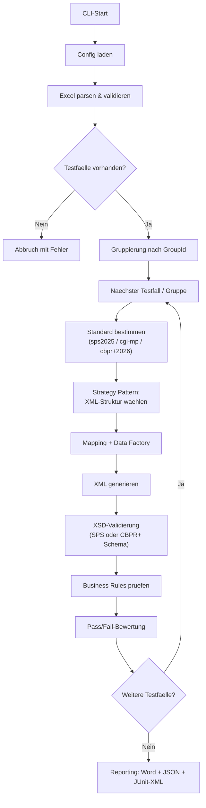
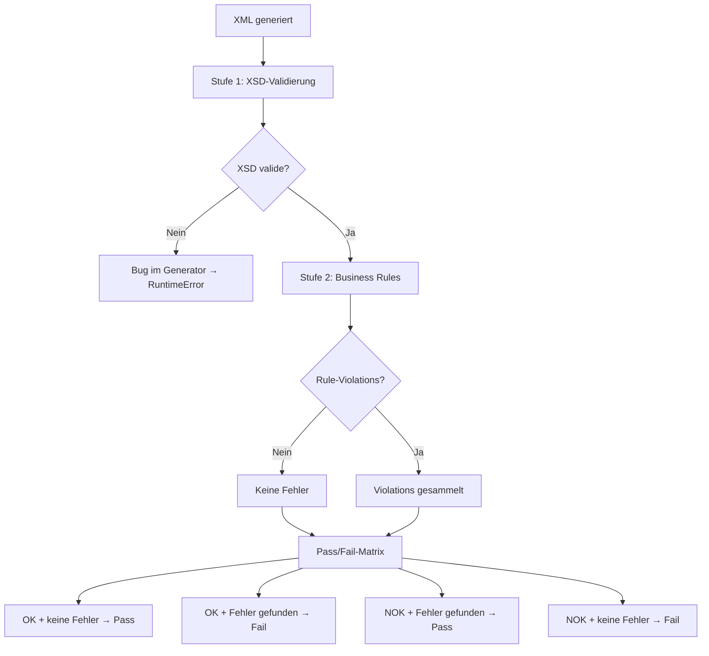
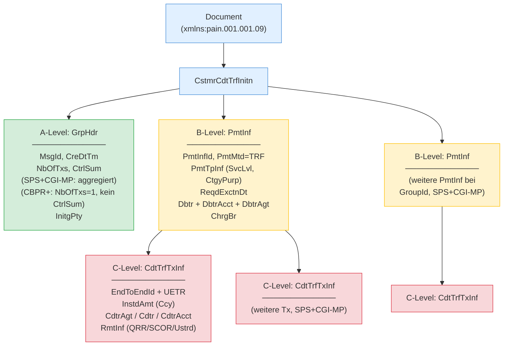

# ISO 20022 pain.001 Test Generator

Automatisierte Erstellung von ISO 20022-konformen **pain.001.001.09** Zahlungsdateien auf Basis von Excel-Testfalldefinitionen. Tri-Standard-Validierung gegen **Swiss Payment Standards (SPS) 2025**, **CGI-MP** (globaler C2B-Standard) und **SWIFT CBPR+ SR2026** (B2B Relay).

### Drei Standards -- Drei Use Cases

| | **SPS 2025** | **CGI-MP** | **CBPR+ SR2026** |
|-|-------------|-----------|-----------------|
| **Use Case** | Schweizer Corporate sendet Zahlung an CH-Bank | Multinationaler Corporate sendet Zahlung an Hausbank weltweit | Bank leitet Zahlung an Korrespondenzbank weiter |
| **Scope** | Customer-to-Bank (Schweiz) | Customer-to-Bank (global) | Bank-to-Bank (Relay) |
| **Schema** | `pain.001.001.09.ch.03` (im Repo) | Standard ISO pain.001.001.09 (SPS XSD kompatibel) | CBPR+ Restriction (proprietaer, MyStandards) |
| **Excel-Wert** | `sps2025` (Default) | `cgi-mp` | `cbpr+2026` |

> **Typischer Einsatz:** Ein Schweizer Corporate nutzt **SPS** fuer Domestic/SEPA und **CGI-MP** fuer internationale Zahlungen. **CBPR+** ist relevant fuer Banken, die pain.001 im Relay-Szenario weiterleiten.

### Strukturelle Unterschiede

| Element | SPS 2025 | CGI-MP | CBPR+ SR2026 |
|---------|----------|--------|-------------|
| GrpHdr/NbOfTxs | Summe aller Tx | Summe aller Tx | Immer "1" |
| GrpHdr/CtrlSum | Summe aller Betraege | Summe aller Betraege | **Entfaellt** |
| PmtInf/NbOfTxs | Anzahl Tx im Block | Anzahl Tx im Block | **Entfaellt** |
| PmtInf/CtrlSum | Summe im Block | Summe im Block | **Entfaellt** |
| PmtInfId | Generiert (eindeutig) | Kann = MsgId oder verschieden | **= MsgId** (Rule R8) |
| UETR | Optional | Optional (empfohlen) | **Pflicht** (UUIDv4) |
| CreDtTm | ISO 8601 lokal | ISO 8601 lokal | **Pflicht UTC-Offset** |
| ChrgBr | DEBT/CRED/SHAR/SLEV | DEBT/CRED/SHAR/SLEV | DEBT/CRED/SHAR (**kein SLEV**) |
| Transaktionen/Msg | 1..n PmtInf, 1..n Tx | 1..n PmtInf, 1..n Tx | **Genau 1 PmtInf, 1 Tx** |
| Zeichensatz | SPS Latin-1 Subset | UTF-8 (voll) | FIN-X Restricted |
| Leere Tags | Erlaubt | **Verboten** | Verboten |
| Regulatory Reporting | -- | Unterstuetzt | Wie CGI-MP |
| Structured Remittance | CdtrRefInf (SCOR, QRR) | Voll (RfrdDocInf, TaxRmt) | Wie CGI-MP |

Detaillierte Vergleiche: `docs/specs/vergleich-sps-epc-sepa-2025.md`, `docs/specs/vergleich-sps-cbprplus-2025.md`

## Features

- **Tri-Standard-Validierung** -- pro Testfall waehlbar: `sps2025` (Default), `cgi-mp` oder `cbpr+2026`, mit standard-spezifischer XML-Generierung und XSD-Validierung via Strategy Pattern
- **Excel-basierte Testfalldefinition** -- ein Testfall pro Zeile, zusaetzliche Transaktionen als Folgezeilen ohne TestcaseID
- **4 Zahlungstypen** -- SEPA, Domestic-QR, Domestic-IBAN, CBPR+ mit typ-spezifischen Regeln und automatischer Erkennung
- **55+ Business Rules** -- zentraler Rule-Katalog in 12 Kategorien inkl. SPS, CGI-MP und CBPR+-spezifische Regeln
- **CGI-MP C2B-Konformitaet** -- globaler Corporate-to-Bank Standard mit Address-, Remittance-, Purpose- und Tax-Rules
- **CBPR+ Relay-Konformitaet** -- UETR Pflicht, SLEV verboten, kein CtrlSum, PmtInfId=MsgId, UTC-Offset, FIN-X Charset
- **Multi-Payment** -- mehrere Testfaelle in einer XML via `GroupId` (SPS und CGI-MP; CBPR+ nur Single-Tx)
- **Negative Testing** -- violatable Rules fuer gezielte Regelverletzungen via `ViolateRule=<RuleID>`
- **Reproduzierbare Testdaten** -- Seed-basierte Generierung von IBANs (Mod-97), QR-Referenzen (Mod-10), SCOR (ISO 11649)
- **Minimale Pflichtfelder** -- nur TestcaseID, Titel, Ziel, Erwartetes Ergebnis und Debtor-IBAN
- **Second-Opinion + Round-Trip-Validierung** -- `xmlschema`-Gegenpruefung und XML-Roundtrip-Konsistenzcheck
- **50+ Laender IBAN-Generierung** -- Europa, Naher Osten, Asien, Amerika, Afrika
- **Reporting** -- Word (.docx), JSON und JUnit-XML Reports pro Testlauf
- **122 Testfaelle** -- 104 SPS + 10 CGI-MP + 8 CBPR+, alle XSD-validiert

---

## Ablauf & Architektur

### Pipeline



### Validierungs- und Pass/Fail-Logik



> XSD-Fehler werden als Bug im Generator behandelt und werfen einen `RuntimeError`. Generierte XMLs **muessen** immer schema-valide sein -- auch bei negativen Testfaellen.

### pain.001 XML-Struktur (A/B/C-Level)



---

## Voraussetzungen

- Python 3.10+
- [Poetry](https://python-poetry.org/) (Paketmanagement)
- **Fuer CBPR+:** SWIFT CBPR+ XSD von [MyStandards](https://www2.swift.com/mystandards/) (kostenloser Login, proprietaer, nicht im Repo)
- **Fuer CGI-MP:** Kein zusaetzliches XSD noetig (SPS XSD wird verwendet)

## Installation

```bash
git clone https://github.com/Sebastenhauer/iso20022tester.git
cd iso20022tester
poetry install
```

### CBPR+ XSD einrichten (optional)

1. Auf [SWIFT MyStandards](https://www2.swift.com/mystandards/) einloggen (kostenlose Registration)
2. CBPR+ Collection oeffnen, pain.001.001.09 Usage Guideline XSD herunterladen
3. Ablegen unter `docs/specs/cbpr+nonpublic/` (wird per `.gitignore` nicht gepusht)
4. Pfad in `config.yaml` eintragen:
   ```yaml
   cbpr_xsd_path: "docs/specs/cbpr+nonpublic/<dateiname>.xsd"
   ```

## Verwendung

```bash
# XML generieren
poetry run python -m src.main --input <excel-datei> --config config.yaml [--seed 42] [--verbose]

# Round-Trip-Validierung
poetry run python -m src.main roundtrip <xml-dateien-oder-verzeichnis> --config config.yaml [--verbose]
```

**Beispiele:**

```bash
# 122 Testfaelle generieren (SPS + CGI-MP + CBPR+ gemischt)
poetry run python -m src.main --input templates/testfaelle_comprehensive.xlsx --config config.yaml --verbose
```

### Konfiguration (`config.yaml`)

```yaml
output_path: "./output"
xsd_path: "schemas/pain.001.001.09.ch.03.xsd"       # SPS XSD (im Repo, auch fuer CGI-MP)
cbpr_xsd_path: "docs/specs/cbpr+nonpublic/(...).xsd" # CBPR+ XSD (optional, proprietaer)
seed: null
report_format: "docx"
```

---

## Excel-Format (v2)

Jede Zeile mit `TestcaseID` startet einen neuen Testfall. Folgezeilen ohne TestcaseID = zusaetzliche Transaktionen.

### Spalten

| Spalte | Pflicht | Beschreibung |
|--------|---------|-------------|
| TestcaseID | Ja | Eindeutige ID |
| Titel | Ja | Kurzbeschreibung |
| Ziel | Ja | Testziel |
| Erwartetes Ergebnis | Ja | `OK` oder `NOK` |
| Zahlungstyp | Nein | `SEPA`, `Domestic-QR`, `Domestic-IBAN`, `CBPR+` (auto wenn leer) |
| Betrag | Nein | Dezimalzahl (wird generiert wenn leer) |
| Waehrung | Nein | ISO 4217 (wird abgeleitet wenn leer) |
| Debtor IBAN | Ja | IBAN des Auftraggebers |
| Debtor Name | Nein | Name (wird generiert wenn leer) |
| Debtor BIC | Nein | BIC des Auftraggebers |
| Creditor Name | Nein | Name (wird generiert wenn leer) |
| Creditor IBAN | Nein | IBAN (wird passend generiert) |
| Creditor BIC | Nein | BIC des Beguenstigten |
| Verwendungszweck | Nein | Freitext-Zahlungsreferenz |
| ViolateRule | Nein | Rule-ID fuer Regelverstoss (z.B. `BR-SEPA-001`) |
| Weitere Testdaten | Nein | Key=Value Overrides (z.B. `ChrgBr=DEBT; CtgyPurp.Cd=SALA`) |
| **Standard** | Nein | **`sps2025`** (Default), **`cgi-mp`** oder **`cbpr+2026`** |
| Bemerkungen | Nein | Freitext |

---

## Zahlungstypen

| Typ | SPS-Typ | Waehrung | Besonderheiten |
|-----|---------|---------|----------------|
| **SEPA** | S | EUR | SvcLvl=SEPA, ChrgBr=SLEV, Name max. 70 Zeichen |
| **Domestic-QR** | D | CHF/EUR | QR-IBAN (IID 30000-31999), QRR-Referenz zwingend |
| **Domestic-IBAN** | D | CHF | Regulaere CH-IBAN, SCOR optional, keine QRR |
| **CBPR+** | X | vom User | Creditor-Agent BIC Pflicht, UETR bei cbpr+2026 |

---

## Business Rules

**55+ Business Rules** in 12 Kategorien:

| Kategorie | Anzahl | Beschreibung |
|-----------|--------|-------------|
| **HDR** | 3 | Header: MsgId, NbOfTxs, CtrlSum |
| **GEN** | 8 | Uebergreifend: Betrag, Zeichensatz, BIC, Country-Code |
| **ADDR** | 3 | Adressen: Strukturiert Pflicht, TwnNm+Ctry |
| **REM** | 1 | Remittance: USTRD max 140 Zeichen |
| **CCY** | 1 | Waehrung: ISO 4217 Format |
| **SEPA** | 5 | SEPA: EUR, SLEV, Name max. 70 |
| **QR** | 7 | QR: QR-IBAN, QRR, keine SCOR |
| **IBAN** | 6 | Domestic-IBAN: CH/LI, keine QRR |
| **CBPR** | 5 | CBPR+: SLEV verboten, UETR Pflicht, Agent-Pflicht |
| **CGI** | 13 | CGI-MP: Adress-Rules, Remittance exklusiv, Reg. Reporting, Tax, leere Tags |
| **IBAN-V** | 2 | IBAN: Mod-97, Laengenvalidierung |
| **REF-V** | 1 | Referenz: SCOR ISO 11649 |

---

## Output

Pro Testlauf: `output/YYYY-MM-DD_HHMMSS/` mit XML-Dateien, Word-Report, JSON und JUnit-XML.

Vorab generierte Beispiele: `examples/` (122 XML-Dateien: 104 SPS + 10 CGI-MP + 8 CBPR+)

---

## Tests & Validierung

```bash
poetry run pytest                                    # 114 Unit Tests
poetry run python scripts/validate_external.py examples/  # Second-Opinion
```

### Externe Validierung

| Dienst | Fuer | URL |
|--------|------|-----|
| **SIX Validation Portal** | SPS 2025 | [validation.iso-payments.ch](https://validation.iso-payments.ch/sps/account/logon) |
| **SWIFT MyStandards** | CBPR+ SR2026 | [mystandards.swift.com](https://www2.swift.com/mystandards/) |
| **TreasuryHost** | pain.001 allgemein | [treasuryhost.eu](https://www.treasuryhost.eu/solutions/painp/) |

---

## Projektstruktur

```
iso20022tester/
├── config.yaml                          # Konfiguration (SPS + CBPR+ XSD Pfade)
├── schemas/
│   └── pain.001.001.09.ch.03.xsd       # SPS XSD (SIX Group, auch fuer CGI-MP)
├── docs/
│   ├── SDD_v2.md                        # Software Design Dokument
│   ├── roadmap/
│   │   └── REQ_tri_standard_sps_cbpr_cgimp.md  # Requirements Tri-Standard
│   ├── archive/                         # Archivierte Dokumente
│   └── specs/
│       ├── vergleich-sps-epc-sepa-2025.md
│       ├── vergleich-sps-cbprplus-2025.md
│       ├── cbpr+nonpublic/              # CBPR+ XSD (proprietaer, .gitignore)
│       └── cgi_nonpublic/               # CGI-MP Handbook (proprietaer, .gitignore)
├── templates/
│   └── testfaelle_comprehensive.xlsx    # 122 Testfaelle (SPS + CGI-MP + CBPR+)
├── examples/                            # 122 vorab generierte XML-Dateien
├── src/
│   ├── main.py / pipeline.py            # CLI + Pipeline
│   ├── models/testcase.py               # Standard Enum (sps2025/cgi-mp/cbpr+2026)
│   ├── xml_generator/
│   │   ├── pain001_builder.py           # XML-Aufbau
│   │   ├── builders.py                  # Wiederverwendbare Bausteine
│   │   └── standard_strategy.py         # Strategy Pattern (SPS/CGI-MP/CBPR+)
│   ├── payment_types/                   # SEPA, Domestic-QR/IBAN, CBPR+
│   ├── validation/
│   │   ├── xsd_validator.py             # Dual-XSD (SPS + CBPR+)
│   │   ├── rule_catalog.py              # 55+ Rules in 12 Kategorien
│   │   └── business_rules.py            # Validierungs- & Violation-Logik
│   └── reporting/                       # Word, JSON, JUnit
├── tests/                               # 114 Unit Tests
└── scripts/validate_external.py         # Second-Opinion-Validator
```

---

## Dokumentation

| Dokument | Beschreibung |
|----------|-------------|
| `docs/SDD_v2.md` | Software Design Dokument -- Architektur, Datenmodelle |
| `docs/roadmap/REQ_tri_standard_sps_cbpr_cgimp.md` | Requirements Tri-Standard (SPS + CGI-MP + CBPR+) |
| `docs/specs/vergleich-sps-epc-sepa-2025.md` | SPS vs. EPC SEPA Vergleich |
| `docs/specs/vergleich-sps-cbprplus-2025.md` | SPS vs. CBPR+ Vergleich |

---

## Lizenz

Proprietaer. SPS XSD: Copyright SIX Group. CBPR+ XSD: Copyright SWIFT (nicht im Repo). CGI-MP Handbook: Copyright SWIFT (nicht im Repo).
