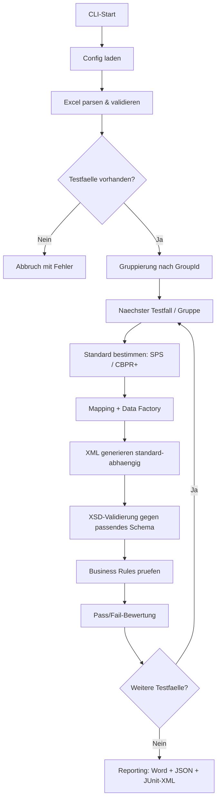
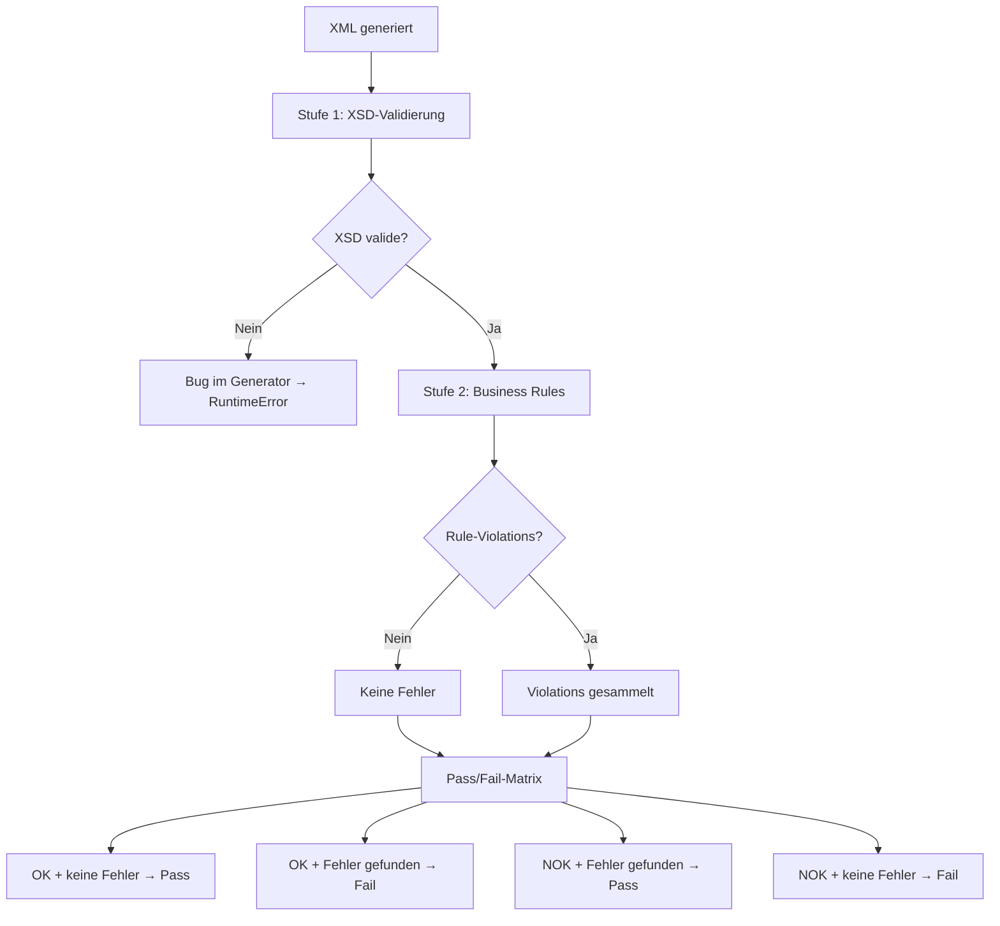
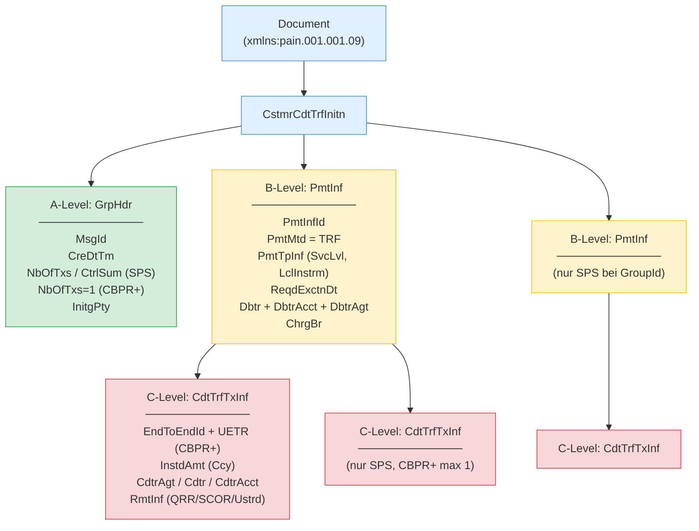

# ISO 20022 pain.001 Test Generator

Automatisierte Erstellung von ISO 20022-konformen **pain.001.001.09** Zahlungsdateien auf Basis von Excel-Testfalldefinitionen. Dual-Standard-Validierung gegen **Swiss Payment Standards (SPS) 2025** und **SWIFT CBPR+ SR2026**.

### Schema-Version und Kompatibilitaet

| Standard | Schema | Status |
|----------|--------|--------|
| **SPS (Schweiz)** | `pain.001.001.09.ch.03` | Im Repo, SIX Group. Deckt D/S/X/C ab |
| **CBPR+ (SWIFT)** | `pain.001.001.09` (CBPR+ Restriction) | Via SWIFT MyStandards (kostenloser Login). Proprietaer, nicht im Repo |
| **EPC SEPA** | `pain.001.001.09` | CH-Schema ist Obermenge der EPC-Restriktionen |

Beide Standards verwenden denselben XML-Namespace (`urn:iso:std:iso:20022:tech:xsd:pain.001.001.09`), aber unterschiedliche XSD-Restrictions. Die Standardauswahl erfolgt **pro Testfall** ueber die Excel-Spalte "Standard".

### Strukturelle Unterschiede SPS vs. CBPR+

| Element | SPS 2025 | CBPR+ SR2026 |
|---------|----------|-------------|
| GrpHdr/NbOfTxs | Summe aller Tx | Immer "1" |
| GrpHdr/CtrlSum | Summe aller Betraege | Entfaellt |
| PmtInf/NbOfTxs | Anzahl Tx im Block | Entfaellt |
| PmtInf/CtrlSum | Summe im Block | Entfaellt |
| PmtInfId | Generiert (eindeutig) | = MsgId (CBPR+ Rule R8) |
| UETR | Optional | Pflicht (UUIDv4) |
| CreDtTm | ISO 8601 | Pflicht UTC-Offset |
| ChrgBr | DEBT/CRED/SHAR/SLEV | DEBT/CRED/SHAR (kein SLEV) |
| Transaktionen/Msg | 1..n PmtInf, 1..n Tx | Genau 1 PmtInf, 1 Tx |

Detaillierter Vergleich: `docs/specs/vergleich-sps-cbprplus-2025.md`

## Features

- **Dual-Standard-Validierung** -- pro Testfall waehlbar: `sps2025` (Default) oder `cbpr+2026`, mit standard-spezifischer XML-Generierung und XSD-Validierung
- **Excel-basierte Testfalldefinition** -- ein Testfall pro Zeile, zusaetzliche Transaktionen als Folgezeilen ohne TestcaseID
- **4 Zahlungstypen** -- SEPA, Domestic-QR, Domestic-IBAN, CBPR+ mit typ-spezifischen Regeln und automatischer Erkennung
- **40+ Business Rules** -- zentraler Rule-Katalog mit Spec-Referenzen, organisiert in 11 Kategorien inkl. Zeichensatz, Adressen, Waehrungen
- **CBPR+-Konformitaet** -- UETR (UUIDv4) mandatory, SLEV verboten, kein CtrlSum auf B-Level, PmtInfId=MsgId, UTC-Offset in CreDtTm
- **Multi-Payment** -- mehrere Testfaelle in einer XML-Datei via `GroupId` (mehrere PmtInf-Bloecke pro Dokument, nur SPS)
- **Negative Testing** -- violatable Rules fuer gezielte Regelverletzungen via `ViolateRule=<RuleID>`
- **Reproduzierbare Testdaten** -- Seed-basierte Generierung von IBANs (Mod-97), QR-Referenzen (Mod-10), SCOR-Referenzen (ISO 11649), Namen und Adressen
- **Minimale Pflichtfelder** -- nur TestcaseID, Titel, Ziel, Erwartetes Ergebnis und Debtor-IBAN sind Pflicht; alles andere wird automatisch generiert
- **Second-Opinion-Validierung** -- unabhaengige Gegenpruefung mit `xmlschema`-Library zusaetzlich zur lxml-Validierung
- **Round-Trip-Validierung** -- CLI-Modus `roundtrip` parst XMLs zurueck und prueft Konsistenz
- **Per-Transaction C-Level-Overrides** -- individuelle Creditor-Daten pro Transaktion
- **Strukturierte Adressen (SPS 2026)** -- Creditor-Adressen muessen StrtNm, TwnNm und Ctry enthalten (BR-ADDR-002)
- **50+ Laender IBAN-Generierung** -- Europa, Naher Osten, Asien, Amerika, Afrika
- **Reporting** -- Word (.docx), JSON und JUnit-XML Reports pro Testlauf
- **112 Testfaelle** -- 104 SPS + 8 CBPR+, alle XSD-validiert

---

## Ablauf & Architektur

### Pipeline



### Validierungs- und Pass/Fail-Logik



> XSD-Fehler werden als Bug im Generator behandelt und werfen einen `RuntimeError`. Generierte XMLs **muessen** immer schema-valide sein -- auch bei negativen Testfaellen.

### pain.001 XML-Struktur (A/B/C-Level)



---

## Voraussetzungen

- Python 3.10+
- [Poetry](https://python-poetry.org/) (Paketmanagement)
- **Fuer CBPR+:** SWIFT CBPR+ XSD von [MyStandards](https://www2.swift.com/mystandards/) (kostenloser Login, proprietaer, nicht im Repo)

## Installation

```bash
git clone https://github.com/Sebastenhauer/iso20022tester.git
cd iso20022tester
poetry install
```

### CBPR+ XSD einrichten (optional)

1. Auf [SWIFT MyStandards](https://www2.swift.com/mystandards/) einloggen (kostenlose Registration)
2. CBPR+ Collection oeffnen, pain.001.001.09 Usage Guideline XSD herunterladen
3. Ablegen unter `docs/specs/cbpr+nonpublic/` (wird per `.gitignore` nicht gepusht)
4. Pfad in `config.yaml` eintragen:
   ```yaml
   cbpr_xsd_path: "docs/specs/cbpr+nonpublic/<dateiname>.xsd"
   ```

## Verwendung

```bash
# XML generieren (Standard-Modus)
poetry run python -m src.main --input <excel-datei> --config config.yaml [--seed 42] [--verbose]

# Round-Trip-Validierung
poetry run python -m src.main roundtrip <xml-dateien-oder-verzeichnis> --config config.yaml [--verbose]
```

**Beispiele:**

```bash
# 112 Testfaelle generieren (SPS + CBPR+ gemischt)
poetry run python -m src.main --input templates/testfaelle_comprehensive.xlsx --config config.yaml --verbose

# Round-Trip: alle generierten XMLs zurueck parsen und pruefen
poetry run python -m src.main roundtrip output/2026-03-28_*/ --config config.yaml --verbose
```

### CLI-Argumente

**Generierung (`--input` oder `generate` Subcommand):**

| Argument | Pflicht | Beschreibung |
|----------|---------|-------------|
| `--input` | Ja | Pfad zur Excel-Datei mit Testfaellen |
| `--config` | Ja | Pfad zur `config.yaml` |
| `--seed` | Nein | Seed fuer reproduzierbare Zufallsdaten |
| `--verbose` | Nein | Ausfuehrliche Konsolenausgabe |

**Round-Trip (`roundtrip` Subcommand):**

| Argument | Pflicht | Beschreibung |
|----------|---------|-------------|
| `xml_files` | Ja | XML-Dateien oder Verzeichnis |
| `--config` | Ja | Pfad zur `config.yaml` (fuer XSD re-validation) |
| `--verbose` | Nein | Zeigt Abweichungs-Details |

### Konfiguration (`config.yaml`)

```yaml
output_path: "./output"
xsd_path: "schemas/pain.001.001.09.ch.03.xsd"       # SPS XSD (im Repo)
cbpr_xsd_path: "docs/specs/cbpr+nonpublic/(...).xsd" # CBPR+ XSD (optional, proprietaer)
seed: null
report_format: "docx"
```

---

## Excel-Format (v2)

Das Excel verwendet ein **zeilenbasiertes Format**: Jede Zeile mit einer `TestcaseID` startet einen neuen Testfall. Folgezeilen **ohne** TestcaseID werden als zusaetzliche Transaktionen zum vorherigen Testfall hinzugefuegt.

### Spalten

| Spalte | Pflicht | Beschreibung |
|--------|---------|-------------|
| TestcaseID | Ja | Eindeutige ID. Zeilen ohne ID = zusaetzliche Transaktion |
| Titel | Ja | Kurzbeschreibung des Testfalls |
| Ziel | Ja | Testziel |
| Erwartetes Ergebnis | Ja | `OK` oder `NOK` |
| Zahlungstyp | Nein | `SEPA`, `Domestic-QR`, `Domestic-IBAN`, `CBPR+` (auto wenn leer) |
| Betrag | Nein | Dezimalzahl (wird generiert wenn leer) |
| Waehrung | Nein | ISO 4217, z.B. `EUR`, `CHF`, `USD` (wird abgeleitet wenn leer) |
| Debtor IBAN | Ja | IBAN des Auftraggebers |
| Debtor Name | Nein | Name des Auftraggebers (wird generiert wenn leer) |
| Debtor BIC | Nein | BIC des Auftraggebers |
| Creditor Name | Nein | Name des Beguenstigten (wird generiert wenn leer) |
| Creditor IBAN | Nein | IBAN des Beguenstigten (wird passend generiert) |
| Creditor BIC | Nein | BIC des Beguenstigten |
| Verwendungszweck | Nein | Freitext-Zahlungsreferenz |
| ViolateRule | Nein | Rule-ID fuer gezielten Regelverstoss (z.B. `BR-SEPA-001`) |
| Weitere Testdaten | Nein | Key=Value Overrides (z.B. `ChrgBr=DEBT; CtgyPurp.Cd=SALA`) |
| Standard | Nein | `sps2025` (Default) oder `cbpr+2026` |
| Bemerkungen | Nein | Freitext |

### Minimale Beispiele

**SPS-Testfall** (nur Pflichtfelder, Standard=sps2025 per Default):

| TestcaseID | Titel | Ziel | Erwartetes Ergebnis | Debtor IBAN |
|-----------|-------|------|-------------------|-------------|
| TC-001 | SEPA Test | Positive Zahlung | OK | CH5604835012345678009 |

**CBPR+-Testfall:**

| TestcaseID | Titel | Erwartetes Ergebnis | Debtor IBAN | Creditor BIC | Waehrung | Standard |
|-----------|-------|-------------------|-------------|-------------|----------|----------|
| TC-002 | CBPR+ USD | OK | CH5604835012345678009 | CHASUS33 | USD | cbpr+2026 |

Das vollstaendige Template mit 112 Testfaellen liegt unter `templates/testfaelle_comprehensive.xlsx`.

---

## Zahlungstypen

| Typ | SPS-Typ | Waehrung | Besonderheiten |
|-----|---------|---------|----------------|
| **SEPA** | S | EUR | SvcLvl=SEPA, ChrgBr=SLEV, Creditor-Name max. 70 Zeichen |
| **Domestic-QR** | D | CHF/EUR | QR-IBAN (IID 30000-31999), QRR-Referenz zwingend (Prtry) |
| **Domestic-IBAN** | D | CHF | Regulaere CH-IBAN, SCOR optional (Mod-97), keine QRR |
| **CBPR+** | X | vom User | Creditor-Agent BIC Pflicht, ChrgBr: DEBT/CRED/SHAR, UETR Pflicht (cbpr+2026) |

Wenn kein Zahlungstyp angegeben wird, erkennt das System den Typ automatisch anhand von Creditor-IBAN und Waehrung.

---

## Business Rules

**40+ Business Rules** in einem zentralen Katalog (`src/validation/rule_catalog.py`), organisiert in 11 Kategorien:

| Kategorie | Anzahl | Beispiele |
|-----------|--------|-----------|
| **HDR** | 3 | MsgId-Eindeutigkeit, NbOfTxs/CtrlSum-Konsistenz |
| **GEN** | 8 | Betrag > 0, Zeichensatz, BIC-Format, Country-Code |
| **ADDR** | 3 | Strukturierte Adressen Pflicht (StrtNm+TwnNm+Ctry) |
| **REM** | 1 | USTRD max 140 Zeichen |
| **CCY** | 1 | ISO 4217 Waehrungscode-Format |
| **SEPA** | 5 | EUR-Pflicht, SLEV, Name max. 70, Betragsgrenzen |
| **QR** | 7 | QR-IBAN-Pflicht, QRR-Pflicht, keine SCOR, Mod-10 |
| **IBAN** | 6 | Keine QR-IBAN, keine QRR, CHF-Pflicht, SCOR-Validierung |
| **CBPR** | 5 | Agent-Pflicht, SLEV verboten, UETR Pflicht, ChrgBr DEBT/CRED/SHAR |
| **IBAN-V** | 2 | Mod-97-Pruefziffer, Laengenvalidierung |
| **REF-V** | 1 | SCOR RF-Pruefziffer (ISO 11649) |

---

## Output

Pro Testlauf wird ein Unterordner `output/YYYY-MM-DD_HHMMSS/` erstellt mit:

| Datei | Beschreibung |
|-------|-------------|
| `[Timestamp]_[TestCaseID]_[UUID].xml` | Generierte pain.001 XML-Datei |
| `[Timestamp]_Group-[GroupId]_[UUID].xml` | Multi-Payment XML (bei GroupId, nur SPS) |
| `Testlauf_Zusammenfassung.docx` | Fachlicher Report mit Pass/Fail pro Testfall |
| `testlauf_ergebnis.json` | Maschinenlesbares Ergebnis |
| `testlauf_ergebnis.xml` | JUnit-XML fuer CI/CD-Integration |

Vorab generierte Beispiele: `examples/` (111 XML-Dateien, 103 SPS + 8 CBPR+)

---

## Tests & Validierung

### Unit Tests

```bash
poetry run pytest                      # alle Tests
poetry run pytest tests/ -v            # mit Details
poetry run pytest tests/test_iban.py   # einzelner Test
```

### Second-Opinion-Validierung

Unabhaengige Gegenpruefung der generierten XMLs mit der `xmlschema`-Library (nicht lxml):

```bash
poetry run python scripts/validate_external.py output/2026-03-28_*/
poetry run python scripts/validate_external.py examples/ --report report.json
```

### Externe Validierung

| Dienst | Fuer | URL |
|--------|------|-----|
| **SIX Validation Portal** | SPS 2025 | [validation.iso-payments.ch](https://validation.iso-payments.ch/sps/account/logon) |
| **SWIFT MyStandards** | CBPR+ SR2026 | [mystandards.swift.com](https://www2.swift.com/mystandards/) |
| **TreasuryHost** | pain.001 allgemein | [treasuryhost.eu](https://www.treasuryhost.eu/solutions/painp/) |

---

## Projektstruktur

```
iso20022tester/
├── config.yaml                          # Laufzeit-Konfiguration (SPS + CBPR+ XSD Pfade)
├── pyproject.toml                       # Poetry Dependencies
├── schemas/
│   └── pain.001.001.09.ch.03.xsd       # SPS XSD (SIX Group, im Repo)
├── docs/
│   ├── SDD_v2.md                        # Software Design Dokument v2.1
│   ├── roadmap/
│   │   └── SDD_dual_standard_cbprplus.md  # SDD Dual-Standard (SPS + CBPR+)
│   └── specs/
│       ├── business-rules-sps-2025-de.md        # SPS Business Rules
│       ├── ig-credit-transfer-sps-2025-de.md    # SPS Implementation Guidelines
│       ├── vergleich-sps-epc-sepa-2025.md       # SPS vs. EPC Vergleich
│       ├── vergleich-sps-cbprplus-2025.md        # SPS vs. CBPR+ Vergleich
│       └── cbpr+nonpublic/                       # CBPR+ XSD (proprietaer, .gitignore)
├── templates/
│   └── testfaelle_comprehensive.xlsx    # 112 Testfaelle (104 SPS + 8 CBPR+)
├── examples/                            # 111 vorab generierte XML-Dateien + Reports
├── scripts/
│   └── validate_external.py             # Second-Opinion-Validator (xmlschema)
├── src/
│   ├── main.py                          # CLI Entry Point (generate / roundtrip)
│   ├── config.py                        # Config-Loader (YAML → Pydantic)
│   ├── models/
│   │   ├── testcase.py                  # Standard Enum, TestCase, Transaction, etc.
│   │   └── config.py                    # AppConfig (xsd_path, cbpr_xsd_path)
│   ├── input_handler/                   # Excel-Parser (v2, Standard-Spalte)
│   ├── mapping/                         # Deterministisches Key→XPath Mapping
│   ├── data_factory/                    # IBAN-, Referenz-, Adressgenerierung
│   ├── xml_generator/
│   │   ├── pain001_builder.py           # Standard-abhaengiger XML-Aufbau
│   │   └── builders.py                  # Wiederverwendbare XML-Bausteine
│   ├── payment_types/                   # SEPA, Domestic-QR/IBAN, CBPR+
│   ├── validation/
│   │   ├── xsd_validator.py             # Dual-XSD-Validierung (SPS + CBPR+)
│   │   ├── business_rules.py            # Validierungs- & Violation-Logik
│   │   ├── rule_catalog.py              # Zentraler Rule-Katalog (40+ Rules)
│   │   └── roundtrip.py                 # Round-Trip-Validierung
│   ├── reporting/                       # Word, JSON, JUnit Reports
│   └── cache/                           # Mapping-Cache (vorbereitet fuer Phase 2)
├── tests/                               # Unit Tests (pytest)
└── pain001_generator_anforderungen.md   # Anforderungsdokument (FR-01 bis FR-105)
```

---

## Dokumentation

| Dokument | Beschreibung |
|----------|-------------|
| `docs/SDD_v2.md` | Software Design Dokument v2.1 -- Architektur, Datenmodelle, Business-Rule-Katalog |
| `docs/roadmap/SDD_dual_standard_cbprplus.md` | SDD fuer Dual-Standard SPS + CBPR+ |
| `docs/specs/vergleich-sps-epc-sepa-2025.md` | Vergleich SPS vs. EPC SEPA (offizielles EPC Rulebook) |
| `docs/specs/vergleich-sps-cbprplus-2025.md` | Vergleich SPS vs. CBPR+ (SWIFT SR2025) |
| `docs/xml_validation_services.md` | Analyse externer Validierungsdienste |
| `docs/external_validation_guide.md` | Anleitung fuer SIX Portal, TreasuryHost, MyStandards |
| `pain001_generator_anforderungen.md` | Anforderungsspezifikation (FR-01 bis FR-105) |

---

## Lizenz

Proprietaer. SPS XSD: Copyright SIX Group. CBPR+ XSD: Copyright SWIFT (nicht im Repo).
