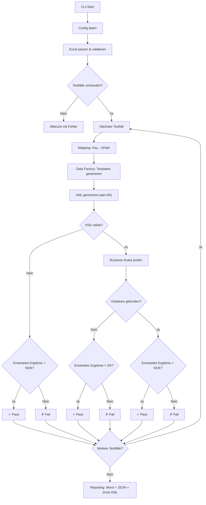
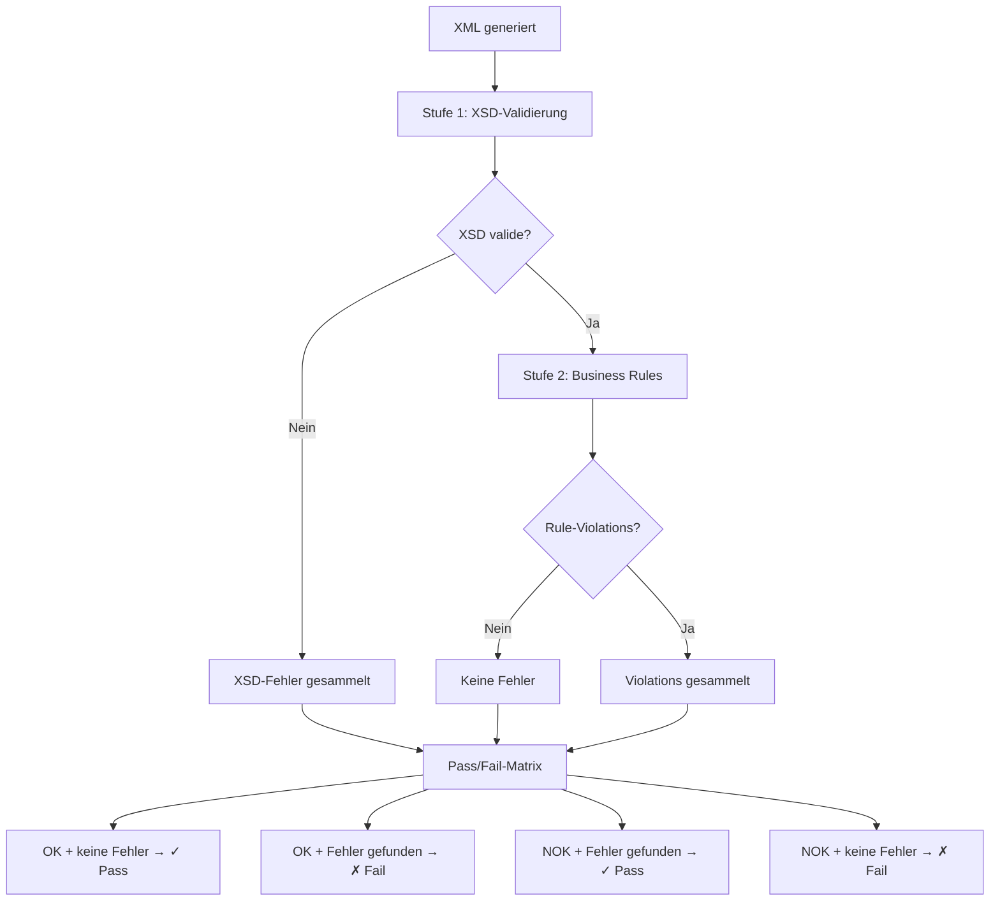
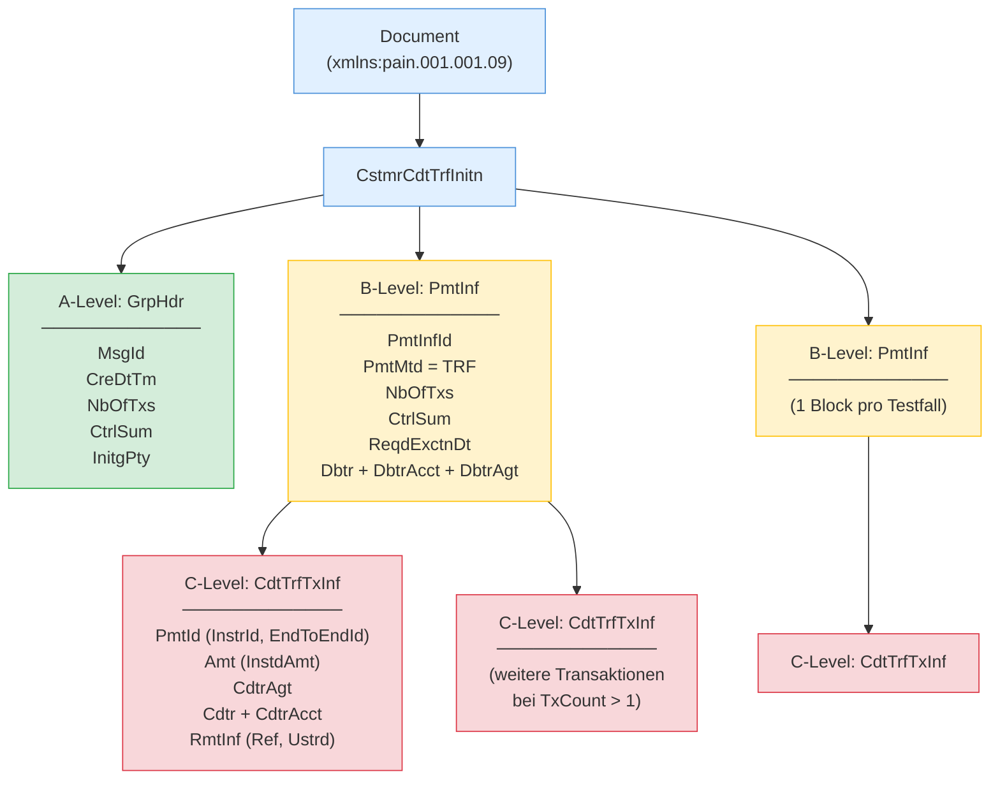

# ISO 20022 pain.001 Test Generator

Automatisierte Erstellung von ISO 20022-konformen **pain.001.001.09** Zahlungsdateien auf Basis von Excel-Testfalldefinitionen. Validierung gegen das XSD-Schema und die Business Rules der **Swiss Payment Standards (SPS) 2025**.

## Features

- **Excel-basierte Testfalldefinition** — Testfälle werden in einer `.xlsx`-Datei definiert, inklusive Debtor-Daten, Zahlungstyp, Betrag und Overrides
- **4 Zahlungstypen** — SEPA, Domestic-QR, Domestic-IBAN, CBPR+ mit typ-spezifischen Regeln
- **XSD- und Business-Rule-Validierung** — Zweistufige Prüfung gegen das offizielle SPS-Schema und 30+ implementierte Business Rules
- **Negative Testing** — Gezielte Regelverletzungen via `ViolateRule=<RuleID>` für NOK-Testfälle
- **Reproduzierbare Testdaten** — Seed-basierte Generierung von IBANs (Mod-97), QR-Referenzen (Mod-10), SCOR-Referenzen (ISO 11649), Namen und Adressen
- **Mehrere Transaktionen** — `TxCount=<n>` für mehrere Transaktionen pro XML-Datei
- **Reporting** — Word (.docx), JSON und JUnit-XML Reports pro Testlauf
- **Deterministisches Feld-Mapping** — Key=Value Overrides werden auf XML-XPaths gemappt (KI-Mapping vorbereitet)

## Ablauf & Architektur

### Gesamtablauf



### Validierungs- und Pass/Fail-Logik



### pain.001 XML-Struktur (A/B/C-Level)



## Voraussetzungen

- Python 3.10+
- [Poetry](https://python-poetry.org/) (Paketmanagement)

## Installation

```bash
git clone https://github.com/Sebastenhauer/iso20022tester.git
cd iso20022tester
poetry install
```

## Verwendung

```bash
poetry run python -m src.main --input <excel-datei> --config config.yaml [--seed 42] [--verbose]
```

**Beispiel mit dem mitgelieferten Template:**

```bash
poetry run python -m src.main --input templates/testfaelle_vorlage.xlsx --config config.yaml --verbose
```

### CLI-Argumente

| Argument | Pflicht | Beschreibung |
|----------|---------|-------------|
| `--input` | Ja | Pfad zur Excel-Datei mit Testfällen |
| `--config` | Ja | Pfad zur `config.yaml` |
| `--seed` | Nein | Seed für reproduzierbare Zufallsdaten (übersteuert config.yaml) |
| `--verbose` | Nein | Ausführliche Konsolenausgabe |

### Konfiguration (`config.yaml`)

```yaml
output_path: "./output"                              # Ausgabepfad
xsd_path: "schemas/pain.001.001.09.ch.03.xsd"       # XSD-Schema
seed: null                                           # Seed (null = zufällig)
report_format: "docx"                                # "docx" oder "txt"
```

## Excel-Format

Jede Zeile ab Zeile 2 ist ein Testfall. Spalten (Reihenfolge fix):

| Spalte | Pflicht | Beschreibung |
|--------|---------|-------------|
| TestcaseID | Ja | Eindeutige ID (Zeilen ohne ID werden übersprungen) |
| Titel | Ja | Kurzbeschreibung |
| Ziel | Ja | Testziel |
| Erwartetes Ergebnis | Ja | `OK` oder `NOK` |
| Zahlungstyp | Ja | `SEPA`, `Domestic-QR`, `Domestic-IBAN`, `CBPR+` |
| Betrag | Ja | Dezimalzahl |
| Währung | Ja | ISO 4217 (z.B. `EUR`, `CHF`, `USD`) |
| Debtor Infos | Ja | `Name=...; IBAN=...; BIC=...; Strasse=...; PLZ=...; Ort=...; Land=...` |
| Weitere Testdaten | Nein | Key=Value Overrides (z.B. `Cdtr.Nm=Müller AG; ChrgBr=SLEV`) |
| Erwartete API-Antwort | Nein | Phase 2 |
| Ergebnis (OK/NOK) | Nein | Wird vom System befüllt |
| Bemerkungen | Nein | Freitext |

**Spezial-Keys in "Weitere Testdaten":**

- `ViolateRule=<RuleID>` — Gezielte Business-Rule-Verletzung für negative Testfälle
- `TxCount=<n>` — Mehrere Transaktionen pro XML-Datei

Ein Beispiel-Template mit 10 Testfällen liegt unter `templates/testfaelle_vorlage.xlsx`.

## Zahlungstypen

| Typ | SPS-Typ | Währung | Besonderheiten |
|-----|---------|---------|----------------|
| SEPA | S | EUR | SvcLvl=SEPA, ChrgBr=SLEV, Creditor-Name max. 70 Zeichen |
| Domestic-QR | D | CHF/EUR | QR-IBAN (IID 30000–31999), QRR-Referenz zwingend |
| Domestic-IBAN | D | CHF | Reguläre CH-IBAN, SCOR optional, keine QRR |
| CBPR+ | X | vom User | Creditor-Agent BIC Pflicht (`CdtrAgt.BICFI=...`) |

## Output

Pro Testlauf wird ein Unterordner `output/YYYY-MM-DD_HHMMSS/` erstellt mit:

- **XML-Dateien** — `[Timestamp]_[TestCaseID]_[UUID_Short].xml` (nur bei XSD-Validität)
- **Testlauf_Zusammenfassung.docx** — Fachlicher Report mit Pass/Fail pro Testfall
- **testlauf_ergebnis.json** — Maschinenlesbares Ergebnis
- **testlauf_ergebnis.xml** — JUnit-XML für CI/CD-Integration

## Tests

```bash
poetry run pytest                   # alle Tests
poetry run pytest tests/ -v         # mit Details
poetry run pytest tests/test_iban.py  # einzelner Test
```

## Projektstruktur

```
iso20022tester/
├── config.yaml                          # Konfiguration
├── pyproject.toml                       # Poetry Dependencies
├── schemas/
│   └── pain.001.001.09.ch.03.xsd       # Offizielles XSD-Schema (SIX Group)
├── docs/
│   ├── SDD_v2.md                        # Software Design Dokument
│   └── specs/                           # SPS 2025 Spezifikationen
├── templates/
│   └── testfaelle_vorlage.xlsx          # Beispiel-Excel mit 10 Testfällen
├── src/
│   ├── main.py                          # CLI Entry Point
│   ├── config.py                        # Config-Loader
│   ├── models/                          # Pydantic-Datenmodelle
│   ├── input_handler/                   # Excel-Parser
│   ├── mapping/                         # Deterministisches Key→XPath Mapping
│   ├── data_factory/                    # IBAN-, Referenz-, Adressgenerierung
│   ├── xml_generator/                   # pain.001 XML-Aufbau (lxml)
│   ├── payment_types/                   # SEPA, Domestic-QR/IBAN, CBPR+
│   ├── validation/                      # XSD + Business Rules Engine
│   ├── reporting/                       # Word, JSON, JUnit Reports
│   └── cache/                           # Mapping-Cache (vorbereitet)
├── tests/                               # Unit Tests (pytest)
└── pain001_generator_anforderungen.md   # Anforderungsdokument
```

## Business Rules

Über 30 Business Rules implementiert, organisiert in Kategorien:

- **BR-HDR-xxx** — Header-Regeln (MsgId, NbOfTxs, CtrlSum)
- **BR-GEN-xxx** — Übergreifende Regeln (Zeichensatz, Beträge, Adressen)
- **BR-SEPA-xxx** — SEPA-spezifisch (EUR, SLEV, Name-Länge)
- **BR-QR-xxx** — QR-IBAN-spezifisch (QRR-Pflicht, kein SCOR)
- **BR-IBAN-xxx** — Domestic-IBAN-spezifisch (CHF, kein QRR)
- **BR-CBPR-xxx** — CBPR+-spezifisch (Agent-Pflicht)
- **BR-IBAN-Vxx** — IBAN-Validierung (Mod-97, Länge)
- **BR-REF-Vxx** — Referenz-Validierung (QRR Mod-10, SCOR Mod-97)

Vollständiger Katalog: siehe `docs/SDD_v2.md` §5.7.

## Lizenz

Proprietär. XSD-Schema: Copyright SIX Group.
