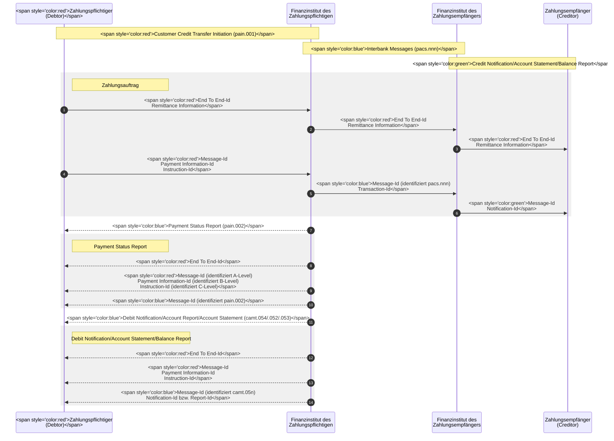

SIX

# Swiss Payment Standards

## **Schweizer Business Rules für Zahlungen und Cash Management für Kunde-Bank-Meldungen**

SPS 2025 Version 3.2, gültig ab 22. November 2025

Version 3.2 – 24.02.2025

SIX
Business Rules für Zahlungen und Cash Management
Revisionsnachweis

# Revisionsnachweis

Nachfolgend werden alle in diesem Handbuch durchgeführten Änderungen mit Versionsangabe, Änderungsdatum, kurzer Änderungsbeschreibung und Angabe der betroffenen Kapitel aufgelistet.

<table>
  <thead>
    <tr>
        <th>Version</th>
        <th>Datum</th>
        <th>Änderungsbeschreibung</th>
        <th>Kapitel</th>
    </tr>
  </thead>
  <tbody>
    <tr>
        <td>3.2</td>
        <td>24.02.2025</td>
        <td>Verschiedene redaktionelle Anpassungen<br/>Klarstellungen zur Avisierung von Instant-Zahlungen<br/>Einführung der hybriden Adresse<br/>Ausführlichere Beschreibung des standardisierten Verfahrens<br/>Anpassung Nummerierung Kapitel</td>
        <td>divers<br/>2.4.4 – 2.4.6<br/>3.1<br/>4<br/>5, 6</td>
    </tr>
    <tr>
        <td>3.1.1</td>
        <td>08.03.2024</td>
        <td>Redaktionelle Anpassungen<br/>Einfügung eines neuen Kapitels mit zusätzlichen Regeln für Instant-Zahlungen</td>
        <td>2.1.10</td>
    </tr>
    <tr>
        <td>3.1</td>
        <td>20.02.2024</td>
        <td>Ergänzung in Bezug auf Instant-Zahlungen (siehe separates Delta-Dokument)</td>
        <td>alle</td>
    </tr>
    <tr>
        <td>3.0.2</td>
        <td>03.01.2024</td>
        <td>Korrektur des End-Datums der Parallelphase<br/>Korrektur diverser Schreibfehler</td>
        <td>6.1.2</td>
    </tr>
    <tr>
        <td>3.0.1</td>
        <td>20.12.2023</td>
        <td>Überarbeitung des Kapitels «Verpflichtende Einführung auf November 2026 »</td>
        <td>3.1.2</td>
    </tr>
    <tr>
        <td>3.0</td>
        <td>11.03.2022</td>
        <td>Vollständige Überarbeitung aufgrund des Wechsels auf den ISO-20022-Versionsstand 2019</td>
        <td>alle</td>
    </tr>
    <tr>
        <td>2.10</td>
        <td>26.02.2021</td>
        <td>Letzte Ausgabe basierend auf den vorherigen ISO-20022-Versionsstand</td>
        <td>alle</td>
    </tr>
    <tr>
        <td>1.0</td>
        <td>15.05.2009</td>
        <td>Erstausgabe</td>
        <td>alle</td>
    </tr>
  </tbody>
</table>

Tabelle 1: Revisionsnachweis

Bitte richten Sie sämtliche Anregungen, Korrekturen und Verbesserungsvorschläge zu diesem Dokument ausschliesslich an:

**SIX Interbank Clearing AG**
Hardturmstrasse 201
CH-8021 Zürich
E-Mail: <u>contact.sic@six-group.com</u>
<u>www.six-group.com</u>

Version 3.2 – 24.02.2025
Seite 2 von 35

SIX
Business Rules für Zahlungen und Cash Management Allgemeine Hinweise

# Allgemeine Hinweise

SIX Interbank Clearing AG («**SIC AG**») behält sich vor, dieses Dokument bei Bedarf jederzeit ohne vorherige Benachrichtigung zu ändern.

Für dieses Dokument werden alle Rechte vorbehalten, auch die der fotomechanischen Wiedergabe und der Speicherung in elektronischen Medien sowie der Übersetzung in fremde Sprachen.

Das Dokument ist mit grösster Sorgfalt erstellt worden, doch können Fehler und Ungenauigkeiten nicht vollständig ausgeschlossen werden. SIC AG kann für Fehler in diesem Dokument und deren Folgen weder eine juristische Verantwortung noch irgendwelche Haftung übernehmen.

Sollten Sie allfällige Fehler in diesem Dokument feststellen oder Verbesserungsvorschläge haben, sind wir Ihnen dankbar für Ihre Rückmeldung per E-Mail an <u>**contact.sic@six-group.com**</u>.

© Copyright 2025 SIX Interbank Clearing AG, CH-8021 Zürich
Version 3.2 – 24.02.2025 Seite 3 von 35

SIX
Business Rules für Zahlungen und Cash Management
Inhaltsverzeichnis

# Inhaltsverzeichnis

* **Revisionsnachweis ........................................................................................................................................................2**
* **Allgemeine Hinweise ....................................................................................................................................................3**
* **Inhaltsverzeichnis.........................................................................................................................................................4**
* **Tabellenverzeichnis ......................................................................................................................................................6**
* **Abbildungsverzeichnis ..................................................................................................................................................7**
* **1 Einleitung ...................................................................................................................................................................8**
  - 1.1 Zweck ................................................................................................................................................................... 8
  - 1.2 Änderungskontrolle .............................................................................................................................................. 8
  - 1.3 Nutzeraspekte ...................................................................................................................................................... 9
  - 1.4 Abgrenzungen ...................................................................................................................................................... 9
    - 1.4.1 Anwendungsbereich ...................................................................................................................................... 9
    - 1.4.2 Angebot der Finanzinstitute .......................................................................................................................... 9
    - 1.4.3 Elemente ohne Relevanz für die *Swiss Payment Standards* ..................................................................... 10
    - 1.4.4 Additional Optional Services (AOS) ............................................................................................................ 10
  - 1.5 Wirkung auf andere Kanäle ............................................................................................................................... 10
  - 1.6 Referenzen ......................................................................................................................................................... 11
* **2 Geschäftsfälle ..........................................................................................................................................................12**
  - 2.1 Überweisungen – Credit Transfer Initiation (pain.001) ...................................................................................... 12
    - 2.1.1 Allgemeines ................................................................................................................................................. 12
    - 2.1.2 Zahlungsarten ............................................................................................................................................. 12
    - 2.1.3 Instant-Zahlungen in der Schweiz und Liechtenstein ................................................................................. 15
    - 2.1.4 Vererbung von Instruktionen ....................................................................................................................... 15
    - 2.1.5 Gruppierung der Zahlungen ........................................................................................................................ 15
    - 2.1.6 Bildung der Gruppierung ............................................................................................................................. 16
    - 2.1.7 Gruppierung aufgrund «Payment Type Information» ................................................................................. 16
    - 2.1.8 Buchungsangaben (Batch Booking) ............................................................................................................ 17
    - 2.1.9 Anwendung der Buchungsangaben in der Schweiz .................................................................................... 17
    - 2.1.10 Ergänzende Regeln für Instant-Zahlungen ................................................................................................ 18
  - 2.2 Schweizer Lastschriften – Direct Debit Initiation (pain.008) ............................................................................... 18
  - 2.3 Status Report (pain.002) .................................................................................................................................... 19
  - 2.4 Kunde-Bank-Meldungen (Reports) – Cash Management (camt.05x) ............................................................... 19
    - 2.4.1 Meldungsstruktur-Grundsätze ..................................................................................................................... 19
    - 2.4.2 «camt.053» Buchungsrelevante Meldungen (Tagesende) .......................................................................... 20
    - 2.4.3 «camt.052»-Meldungen (Intraday) .............................................................................................................. 21
    - 2.4.4 «camt.054»-Meldung (Transkations-Avisierung) ........................................................................................ 21
    - 2.4.5 Avisierung bei Instant-Zahlungen ............................................................................................................... 21
    - 2.4.6 Sammelbuchungsszenarien ........................................................................................................................ 22
* **3 Übergreifende Themen ...........................................................................................................................................23**
  - 3.1 Hybride und strukturierte Adresse ..................................................................................................................... 23
    - 3.1.1 Aufbau und Definition ................................................................................................................................. 23
    - 3.1.2 Verpflichtende Einführung auf November 2026 .......................................................................................... 23
  - 3.2 Referenzen in Meldungen .................................................................................................................................. 24
    - 3.2.1 Referenzen in der Verarbeitungskette ........................................................................................................ 25
    - 3.2.2 Kundenreferenzen ....................................................................................................................................... 25

Version 3.2 – 24.02.2025
Seite 4 von 35

SIX
Business Rules für Zahlungen und Cash Management Inhaltsverzeichnis

3.2.3 Geschäftsfall-Referenzen in Cash Management-Meldungen ................................................................27
3.2.4 Erstellung einer Referenz............................................................................................................................27
**4 Standardisierte Verfahren ...............................................................................................................29**
4.1 Beschreibung................................................................................................................................................29
4.2 Einbindung in die *Swiss Payment Standards*..............................................................................................29
4.3 Avisierung von Zahlungseingängen aus dem standardisierten Verfahren.........................................29
4.3.1 Identifikation im Element «Entry Reference» (`<NtryRef>`)......................................................................29
4.3.2 Sammlung/Verdichtung von Eingängen ..................................................................................................30
4.3.3 Empfehlung bei Eingängen aus dem Ausland oder anderen Netzwerken .........................................30
**5 Zentrale Validierungsstelle..............................................................................................................31**
5.1 Zielsetzung ....................................................................................................................................................31
5.2 Validierungsportal........................................................................................................................................31
5.2.1 Umfang ..........................................................................................................................................................31
5.2.2 Nutzung.........................................................................................................................................................31
5.2.3 Einschränkung ..............................................................................................................................................31
**6 Standard Release-Zyklus ..................................................................................................................32**
6.1 Schnittstellen-Versionen .............................................................................................................................32
6.1.1 Generelle Regelung .....................................................................................................................................32
6.1.2 Parallelphase: November 2022 bis November 2026...............................................................................32
6.1.3 Information zu den jeweils gültigen Versionen.......................................................................................32
6.2 Anpassungen ................................................................................................................................................33
6.2.1 Eingabe von Änderungswünschen............................................................................................................33
6.2.2 Konsultationsverfahren...............................................................................................................................33
**Anhang A: Symbole zur grafischen XML-Darstellung ...................................................................................34**

Version 3.2 – 24.02.2025 Seite 5 von 35

SIX
Business Rules für Zahlungen und Cash Management
Tabellenverzeichnis

# Tabellenverzeichnis

Tabelle 1: Revisionsnachweis ............................................................................................................................... 2
Tabelle 2: Links zu entsprechenden Internetseiten ........................................................................................11
Tabelle 3: SPS-Zahlungsarten.............................................................................................................................14
Tabelle 4: Gruppierungsvarianten («einzeln», «gruppiert», «gemischt») ....................................................16
Tabelle 5: Ausprägungen der Cash Management-Meldungen .....................................................................20
Tabelle 6: Buchungsrelevante Meldungen ......................................................................................................20
Tabelle 7: Cash Management-Meldungen: «camt.052» .................................................................................21
Tabelle 8: Cash Management-Meldung: «camt.054»...................................................................................... 21

Version 3.2 – 24.02.2025
Seite 6 von 35

SIX
Business Rules für Zahlungen und Cash Management | Abbildungsverzeichnis

# Abbildungsverzeichnis

Abbildung 1: Grundsätzliche Meldungsstruktur der XML-Meldung «pain.001» ..............................................12
Abbildung 2: Gruppierungsvarianten («einzeln», «gruppiert», «gemischt») ....................................................15
Abbildung 3: Batch Booking FALSE .........................................................................................................................17
Abbildung 4: Batch Booking TRUE ..........................................................................................................................18
Abbildung 5: Referenzen..........................................................................................................................................25
Abbildung 6: Referenzerstellung nach Akteuren..................................................................................................28
Abbildung 7: Bestandteile eines komplexen Elements........................................................................................35

Version 3.2 – 24.02.2025 | Seite 7 von 35

SIX
Business Rules für Zahlungen und Cash Management
Einleitung

# 1 Einleitung

## 1.1 Zweck

Die *Swiss Payment Standards* für die Umsetzung des Meldungsstandards für «*Payments Initiation*» und «*Cash Management*», basierend auf dem ISO-20022-Standard, werden im Auftrag des PaCoS (Payments Committee Switzerland) erarbeitet. Basis für diese Version bilden der «*ISO 20022 Maintenance Release 2019*», die aktuellen Empfehlungen des European Payment Council (EPC) sowie die «*Cross-Border Payments and Reporting Plus (CBPR+) Guidelines*» von Swift.

Die *Swiss Payment Standards* bestehen aus den Dokumenten:

* Schweizer *Business Rules* (vorliegendes Dokument)
* Schweizer *Implementation Guidelines*
    - für Überweisungen (pain.001)
    - für das Schweizer Lastschriftverfahren (pain.008)*
    - für Cash Management (camt.052, camt.053 und camt.054)
    - für Status Report (pain.002)
    - QR-Rechnung

Im Dokument *Business Rules* werden die folgenden, übergeordneten Themen beschrieben:

* Definition und Beschreibung der einzelnen Geschäftsfälle mit den relevanten Akteuren und den eingesetzten Meldungen (Zahlungsarten, Reportvarianten).
* Beschreibung der wichtigsten Validierungsregeln und Fehlerbehandlungen.
* Beschreibung von übergreifenden Themen mit Einfluss auf die Verarbeitung von Zahlungsaufträgen.
* Beschreibung des standardisierten Verfahrens mit der strukturierten Remittance-Referenz.

Die jeweiligen *Implementation Guidelines* dienen als Anleitung für die technische Umsetzung des Standards und bieten Hilfestellung für die Realisierung der einzelnen Meldungstypen. Sie beschreiben die XML-Strukturen und Validierungsregeln im Detail. Im Anhang A der *Business Rules* werden die verwendeten Symbole zur grafischen XML-Darstellung erläutert.

## 1.2 Änderungskontrolle

Die Dokumente Schweizer *Business Rules* und *Implementation Guidelines* unterstehen der Änderungshoheit der

SIX Interbank Clearing AG
Hardturmstrasse 201
CH-8021 Zürich

Änderungen und Erweiterungen erfolgen durch SIX Interbank Clearing AG.

---

* Die *Implementation Guidelines* für das Schweizer Lastschriftverfahren (pain.008) basieren weiterhin auf dem «ISO 20022 Maintenance Release 2009».

Version 3.2 – 24.02.2025
Seite 8 von 35

SIX
Business Rules für Zahlungen und Cash Management
Einleitung

Die aktuellste Version dieses Dokuments kann von der SIX-Webseite an der folgenden Adresse heruntergeladen werden: <u>www.iso-payments.ch</u>.

## 1.3 Nutzeraspekte

Die *Swiss Payment Standards* sind darauf ausgelegt, den Finanzinstituten und ihren Kunden einen effizienten Zahlungsverkehr in der Schweiz und Lichtenstein zu ermöglichen.

Die Grundlage dazu sind die Regelwerke und *Implementation Guidelines* für SIC (inklusive Instant-Zahlungen) und euroSIC, das *SEPA Credit Transfer Rulebook* und die dazugehörigen *Implementation Guidelines* des EPC, sowie die spezifische Market Practice von Swift für den grenzüberschreitenden Zahlungsverkehr *Cross-Border Payments and Reporting Plus (CBPR+)*.

Die *Swiss Payment Standards* beschreiben dabei die minimal zu unterstützenden Elemente und Regel und stellen sicher, dass ein Auftrag korrekt ausgeführt werden kann. Der Umfang des Kundenangebotes und die Anwendung der Regeln der jeweiligen Systeme und Netzwerke können von den einzelnen Finanzinstituten unterschiedlich gehandhabt werden.

Die *Swiss Payment Standards* unterstützen die durchgehende Nutzung von IBAN (International Bank Account Number) und strukturierten Datenelementen, insbesondere im Bereich der Adressen der verschiedenen Parteien.

Die zum Teil bestehende Verpflichtung zur Nutzung dieser Elemente ergibt sich aus den zu Grunde liegenden Regelwerken und Vorgaben und ist ein integraler Bestandteil der *Swiss Payment Standards*.

## 1.4 Abgrenzungen

### 1.4.1 Anwendungsbereich

Das vorliegende Dokument befasst sich mit den Meldungen für den Zahlungsverkehr (pain) und das Cash Management (camt). Die folgenden Meldungen werden beschrieben:

* Customer Credit Transfer Initiation (ISO pain.001)
* Customer Direct Debit Initiation (ISO pain.008)
* Customer Payment Status Report (ISO pain.002), nachfolgend «Payment Status Report» genannt
* Customer Account Report (ISO camt.052)
* Customer Statement (ISO camt.053)
* Customer Debit/Credit Notification (ISO camt.054)

### 1.4.2 Angebot der Finanzinstitutes

Die *Swiss Payment Standards* sind eine freiwillige Market Practice, die eine einheitliche Auftragserteilung für die vom PaCoS (Payments Committee Switzerland) definierten Markt-Infrastrukturen und Schemes ermöglicht, bzw. eine einheitliche Lieferung von Statusmeldungen und Kontodaten erlaubt.

Die Regeln für die Verarbeitung von Kunden-Aufträgen (z. B. Cut-off-Zeiten, Behandlung von einzelnen Attributen, Behandlung von fehlerhaften Aufträgen oder das Rückmelden von spezifischen Auftragsstatus usw.) sind nicht in dieser Market Practice beschrieben. Stattdessen sind sie vielmehr Teil des Kundenangebotes und können in den einzelnen Finanzinstituten unterschiedlich gehandhabt werden.

Version 3.2 – 24.02.2025
Seite 9 von 35

SIX
Business Rules für Zahlungen und Cash Management
Einleitung

### 1.4.3 Elemente ohne Relevanz für die *Swiss Payment Standards*

Es steht den Finanzinstituten frei, Elemente, die in den *Business Rules* und *Implementation Guidelines* der *Swiss Payment Standards* nicht beschrieben sind, anzunehmen und zu verarbeiten. Es ist die Aufgabe des jeweiligen Finanzinstitutes, diese Erweiterungen zu dokumentieren und den Endkunden über die entsprechenden Verarbeitungsregeln zu informieren.

Bei den Cash Management-Meldungen (Lieferung von Kontodaten an Endkunden) werden nur die Elemente beschrieben, die für den Zahlungsverkehr in der Schweiz massgebend sind. Die Finanzinstitute können auch zusätzliche in den Meldungen vorgesehene Elemente mitliefern, welche nicht in den *Swiss Payment Standards* beschrieben sind.

### 1.4.4 Additional Optional Services (AOS)

<table>
  <tbody>
    <tr>
        <td>[x]<br/>**AOS**</td>
        <td>Die Empfehlungen in diesem Dokument werden von allen Schweizer Finanzinstituten unterstützt. Zusätzliche Services, die nicht von allen Finanzinstituten angeboten werden, sind als sogenannte Additional Optional Services (AOS) gekennzeichnet und an den entsprechenden Stellen markiert.</td>
    </tr>
  </tbody>
</table>

### 1.5 Wirkung auf andere Kanäle

Die *Swiss Payment Standards* beziehen sich auf den direkten Austausch von ISO-20022-Meldungen. Die Beschreibung der jeweiligen Elemente und deren Validierung ist auch für die anderen Kanäle in der Kunde-Bank-Beziehung sinngemäss anwendbar. Dies erleichtert die Interoperabilität zwischen den Kanälen sowie eine einheitliche Behandlung von Kundenaufträgen und dem Kunden zur Verfügung gestellten Kontodaten.

Insbesondere bei den folgenden Merkmalen werden die *Swiss Payment Standards* direkt oder sinngemäss angewendet: Eigenschaften von Eingabefeldern wie z. B. Länge, Struktur oder deren Validierung; Umfang und Struktur der dem Kunden zur Verfügung gestellten Daten; Benennung von Elementen in Schnittstellen; Art und Verwendung von Referenzen (siehe Kapitel 3.2).

Beispiele sind die Eingabemasken im Onlinebanking, auf API («Application Programming Interface») basierende Angebote oder sonstige Softwarelösungen, die zur Erteilung eines Zahlungsauftrages oder zum Empfang und Darstellung von Kontodaten genutzt werden können.

Die Bezeichnungen der Meldungen, der Variante und der spezifischen Nutzung gemäss den *Swiss Payment Standards* dienen auch als Basis für die Beschreibung von Angeboten in technischen Kanälen oder Schnittstellen, sowie bei Dateinamen.

Kanalspezifische Eigenschaften oder regulatorische Vorgaben, wie z. B. bei der Einzahlung am Schalter, sind den *Swiss Payment Standards* übergeordnet und stehen nicht im Widerspruch zu deren Anwendung.

Die Regeln für die Verarbeitung von Aufträgen, sowie die Bereitstellung von Rückmeldungen und Kontodaten sind Teil des Kundenangebotes und können in den einzelnen Finanzinstituten unterschiedlich gehandhabt werden.

Version 3.2 – 24.02.2025
Seite 10 von 35

SIX
Business Rules für Zahlungen und Cash Management
Einleitung

## 1.6 Referenzen

Weiterführende Informationen zu den *Swiss Payment Standards* und den jeweiligen Grundlagen sind auf den folgenden Webseiten zu finden.

<table>
  <thead>
    <tr>
        <th>Organisation</th>
        <th>Link</th>
    </tr>
  </thead>
  <tbody>
    <tr>
        <td>SIX</td>
        <td><u>www.iso-payments.ch</u><br/><u>validation.iso-payments.ch</u><br/><u>www.einfach-zahlen.ch</u><br/><u>www.paymentstandards.ch</u></td>
    </tr>
    <tr>
        <td>SIC AG (SIX Interbank Clearing AG)</td>
        <td><u>www.six-group.com/interbank-clearing</u></td>
    </tr>
    <tr>
        <td>EPC</td>
        <td><u>www.europeanpaymentscouncil.eu</u></td>
    </tr>
    <tr>
        <td>Swift</td>
        <td><u>www.swift.com</u></td>
    </tr>
    <tr>
        <td>ISO 20022</td>
        <td><u>www.iso20022.org</u></td>
    </tr>
    <tr>
        <td>The Wolfsberg Group</td>
        <td><u>www.wolfsberg-principles.com</u></td>
    </tr>
  </tbody>
</table>
*Tabelle 2: Links zu entsprechenden Internetseiten*

Version 3.2 – 24.02.2025
Seite 11 von 35

Business Rules für Zahlungen und Cash Management
Geschäftsfälle

# 2 Geschäftsfälle

Die *Swiss Payment Standards* unterstützen die gängigsten Geschäftsfälle im Zahlungsverkehr für die Kunde-Bank-Schnittstelle.

Nachfolgende Erläuterungen beschreiben Regelungen, welche zusätzlich zu den *Implementation Guidelines* im Rahmen der *Swiss Payment Standards* einheitlich angewendet werden.

## 2.1 Überweisungen – Credit Transfer Initiation (pain.001)

### 2.1.1 Allgemeines

Die XML-Meldung «Customer Credit Transfer Initiation» (pain.001) wird zur elektronischen Beauftragung von Überweisungsaufträgen durch Kunden an das überweisende Finanzinstitut verwendet. Sie wird auf der Basis des ISO-20022-XML-Schemas «pain.001.001.09» eingesetzt.

Der «Customer Credit Transfer Initiation» (pain.001) erlaubt eine Auftragserteilung von mehreren Zahlungsaufträgen für alle Zahlungsarten mit einer einzigen Meldung. Alle Regelungen gelten, wenn sinngemäss, auch für die Erteilung von einzelnen Aufträgen.

```mermaid
graph TD
    subgraph Document_Message [Document (Message)]
        A[A-Level<br/>Group Header [1..1]]
        subgraph B_Level [B-Level<br/>Payment Information [1..n]]
            C[C-Level<br/>Transaction Information [1..n]]
        end
    end
```

Die XML-Meldung «pain.001» ist grundsätzlich wie folgt strukturiert:

*   **A-Level:** Meldungsebene, «Group Header». Dieser Block muss genau einmal vorhanden sein.
*   **B-Level:** Beim Zahlungspflichtigen (auf der Belastungsseite), «Payment Information». Dieser Block muss mindestens einmal vorkommen und enthält in der Regel mehrere C-Levels.
*   **C-Level:** Beim Zahlungsempfänger (auf der Gutschriftsseite), «Credit Transfer Transaction Information». Dieser Block muss mindestens einmal pro B-Level vorkommen. Er enthält alle zum B-Level (Belastung) zugehörigen C-Levels (Transaktionen).

Abbildung 1: Grundsätzliche Meldungsstruktur der XML-Meldung «pain.001»

### 2.1.2 Zahlungsarten

Die *Swiss Payment Standards* unterscheiden vier Zahlungsarten.

**Zahlungsart «D» (Inland)**

Unter der Zahlungsart «D» werden Aufträge für Zahlungen innerhalb der Schweiz und Lichtenstein beschrieben, die in CHF und EUR über SIC oder euroSIC nach deren Regelwerken ausgeführt werden.

Die Version 1 (V1 Zahlungen) beschreibt allgemeine Zahlungsaufträge, während die Version 2 (V2 Instant-Zahlungen) Aufträge für Instant-Zahlungen beschreibt.

**Zahlungsart «S» (SEPA)**

Unter der Zahlungsart «S» werden Aufträge für Zahlungen beschrieben, die unter dem Rulebook und den Implementation Guidelines von SEPA Credit Transfer (SEPA CT) ausgeführt werden.

Version 3.2 – 24.02.2025
Seite 12 von 35

SIX
Business Rules für Zahlungen und Cash Management                                     Geschäftsfälle

Diese Zahlungsart kann nur in EUR ausgeführt werden und verlangt zwingend die Verwendung der IBAN. Zudem ist die Spesenregelung auf SLEV («FollowingServiceLevel») eingeschränkt.

Diese Zahlungsart kann nur verwendet werden, wenn sowohl das Finanzinstitut des Zahlers als auch des Zahlungsempfängers am SEPA CT-Verfahren teilnehmen.

Aufträge, welche diesen Bedingungen nicht entsprechen, können als Zahlungsart **«X»** (Ausland und Fremdwährung Inland) ausgeführt werden.

## Zahlungsart «X» (Ausland und Fremdwährung Inland)

Unter der Zahlungsart **«X»** werden Aufträge für Zahlungen beschrieben, die entweder an ein Finanzinstitut im Ausland bezahlt werden und dabei nicht im SEPA CT-Verfahren verarbeitet werden können oder innerhalb der Schweiz und Lichtenstein in anderen Währungen als CHF und EUR ausgeführt werden.

Die Version 1 (V1 Fremdwährung Inland) beschreibt Aufträge für Zahlungen an Finanzinstitute in der Schweiz und Liechtenstein in anderen Währungen als CHF oder, während die Version 2 (V2 Ausland) Aufträge für grenzüberschreitende Zahlungen beschreibt.

Der Umfang und die Regelungen für diese Zahlungsart richten sich an den *Cross-Border Payments and Reporting Plus (CBPR+) Guidelines* von Swift aus.

Diese Zahlungsart kann nur verwendet werden, wenn das Finanzinstitut dies anbietet. Die Finanzinstitute können die Verwendung auf einzelne Währungen oder Marktgebiete einschränken.

## Zahlungsart «C» (Bankcheck/Postcash)

Unter der Zahlungsart **«C»** werden Aufträge für die Ausstellung von Bankcheck/Postcash im In- und Ausland beschrieben.

Diese Zahlungsart kann nur in Absprache mit dem jeweiligen Finanzinstitut verwendet werden.

Version 3.2 – 24.02.2025                                                             Seite 13 von 35

Business Rules für Zahlungen und Cash Management Geschäftsfälle

<table>
  <thead>
    <tr>
        <th>Zahlungsart</th>
        <th>D</th>
        <th>S</th>
        <th>X</th>
        <th>C</th>
    </tr>
  </thead>
  <tbody>
    <tr>
        <td>Titel</td>
        <td>Inland</td>
        <td>SEPA</td>
        <td>Ausland und Fremdwährung Inland</td>
        <td>Bankcheck/ Postcash In- und Ausland</td>
    </tr>
    <tr>
        <td>Bemerkung</td>
        <td>V1: Zahlung<br/>V2: Instant-Zahlung</td>
        <td></td>
        <td>V1: Fremdwährung (FW) Inland<br/>V2: Ausland</td>
        <td></td>
    </tr>
    <tr>
        <td>Payment Method</td>
        <td>TRF</td>
        <td>TRF</td>
        <td>TRF</td>
        <td>CHK</td>
    </tr>
    <tr>
        <td>Service Level</td>
        <td>Darf nicht SEPA sein</td>
        <td>SEPA</td>
        <td>Darf nicht SEPA sein</td>
        <td>Darf nicht SEPA sein</td>
    </tr>
    <tr>
        <td>Local Instrument</td>
        <td>V2: INST/ITP</td>
        <td></td>
        <td></td>
        <td></td>
    </tr>
    <tr>
        <td>Creditor Account</td>
        <td>V1: IBAN (QR-IBAN) oder Konto<br/>V2: IBAN (QR-IBAN)</td>
        <td>IBAN</td>
        <td>IBAN oder Konto</td>
        <td>Darf nicht geliefert werden</td>
    </tr>
    <tr>
        <td>Creditor Agent</td>
        <td>Finanzinstitut Inland (CH/LI oder mit SIC Anschluss): verpflichtende Angaben, wenn die Kontonummer anstelle der IBAN* verwendet wird:<br/>a. IID<br/>oder<br/>b. BICFI</td>
        <td>BICFI (optional)</td>
        <td>V1: Finanzinstitut Inland (CH/LI): wenn IBAN*, dann Agent optional<br/><br/>a. BICFI (CH)<br/><br/>b. IID (optional: Name und Adresse FI)<br/>c. Name und Adresse FI<br/><br/>V2: Finanzinstitut Ausland<br/>a. BICFI International<br/>b. Bankcode* und Name und Adresse FI<br/>c. Name und Adresse FI</td>
        <td>Darf nicht geliefert werden</td>
    </tr>
    <tr>
        <td>Currency</td>
        <td>V1: CHF/EUR<br/>V2: CHF</td>
        <td>EUR</td>
        <td>V1: alle ausser CHF/EUR<br/>V2: alle</td>
        <td>alle</td>
    </tr>
  </tbody>
</table>

*Tabelle 3: SPS-Zahlungsarten*

\* *Optional bei Verwendung einer IBAN/QR-IBAN, da der Creditor Agent dann aus IBAN/QR-IBAN ermittelt wird*

Version 3.2 – 24.02.2025 Seite 14 von 35

SIX
Business Rules für Zahlungen und Cash Management | Geschäftsfälle

### 2.1.3 Instant-Zahlungen in der Schweiz und Liechtenstein

Instant-Zahlungen – Zahlungsart «D» V2 – in der Schweiz können nur in CHF und zu Gunsten einer IBAN ausgeführt werden. Die Finanzinstitute können im Rahmen ihre Kundenangebotes Aufträge für Instant-Zahlungen mit «pain.001» entgegennehmen. In den *Implementation Guidelines für Kunde-Bank-Meldungen für Überweisungen im Zahlungsverkehr* wird zudem beschrieben, welche Subelemente der «Remittance Information» für Instant-Zahlungen zugelassen sind.

Die Kennzeichnung erfolgt mit dem Element «Local Instrument» mit dem Code «INST». Kann ein Auftrag nicht als Instant-Zahlung ausgeführt werden, wird der Auftrag zurückgewiesen und mit einem entsprechende Status Report (pain.002) quittiert.

Die Finanzinstitute können zusätzlich die Option anbieten, dass eine als Instant-Zahlung abgelehnter Auftrag als normale Zahlung ausgeführt wird. Die Kennzeichnung erfolgt ebenfalls im Element «Local Instrument» mit dem Code «ITP». Das Finanzinstitut kann dies mit einem Status Report (pain.002) und dem Code «ACWC» avisieren.

### 2.1.4 Vererbung von Instruktionen

Alle Instruktionen, welche auf B-Level definiert sind, gelten automatisch auch für alle dazugehörenden C-Levels. Bei Elementen, die auf mehreren Levels zulässig sind, ist die Definition nur auf einem Level erlaubt (also entweder auf B- **oder** C-Level). Dies entspricht der ISO-20022-Regel.

Beispiel: Element «Category Purpose» (`<CtgyPurp>`): Existiert die Instruktion SALA auf B-Level, dann werden alle C-Levels automatisch auch als SALA interpretiert.

### 2.1.5 Gruppierung der Zahlungen

In einer Meldung (einer Credit Transfer Initiation) können Zahlungen nach verschiedenen Kriterien gruppiert werden. Dabei werden alle Zahlungen (C-Level) in einem Payment Information (B-Level) zusammengefasst, welche bestimmte Gemeinsamkeiten aufweisen, z. B. gleiches Ausführungsdatum (Requested Execution Date).

Es sind grundsätzlich drei Varianten denkbar, wie einzelne Zahlungen auf B-Level gruppiert werden können. Zusätzlich zu den Vorgaben aus dem ISO-Standard beeinflussen Bestimmungen aus diesen *Business Rules* und den *Implementation Guidelines* die Strukturierung des B- und C-Levels. Diese sind nachfolgend beschrieben.

<table>
  <thead>
    <tr>
        <th>pain.001 «einzeln»</th>
        <th>pain.001 «gruppiert»</th>
        <th>pain.001 «gemischt»</th>
    </tr>
  </thead>
  <tbody>
    <tr>
        <td>Group Header</td>
        <td>Group Header</td>
        <td>Group Header</td>
    </tr>
    <tr>
        <td>Payment Information 1<br/>Transaction Information 1</td>
        <td>Payment Information 1<br/>Transaction Information 1</td>
        <td>Payment Information 1<br/>Transaction Information 1</td>
    </tr>
    <tr>
        <td>Payment Information 2<br/>Transaction Information 2</td>
        <td>Transaction Information 2</td>
        <td>Payment Information 2<br/>Transaction Information 2</td>
    </tr>
    <tr>
        <td>Payment Information 3<br/>Transaction Information 3</td>
        <td>Transaction Information 3</td>
        <td>Transaction Information 3</td>
    </tr>
    <tr>
        <td>Payment Information 4<br/>Transaction Information 4</td>
        <td>Transaction Information 4</td>
        <td>Transaction Information 4</td>
    </tr>
  </tbody>
</table>

Abbildung 2: Gruppierungsvarianten («einzeln», «gruppiert», «gemischt»)

Version 3.2 – 24.02.2025 | Seite 15 von 35

SIX
Business Rules für Zahlungen und Cash Management
Geschäftsfälle

<table>
  <tbody>
    <tr>
        <td>Variante</td>
        <td>Beschreibung</td>
    </tr>
    <tr>
        <th>einzeln</th>
        <th>Jeder B-Level beinhaltet exakt einen C-Level. In dieser Variante werden die Elemente auf B-Level für jeden C-Level wiederholt, auch wenn diese identisch sind.<br/>Diese Strukturierung bewirkt in der Regel, dass sämtliche Zahlungen einzeln ausgeführt und verbucht werden.</th>
    </tr>
    <tr>
        <th>gruppiert</th>
        <th>Die Meldung beinhaltet nur einen einzigen B-Level. Sämtliche Elemente, die auf B-Level geliefert werden können, werden nur einmal pro Meldung verwendet. Dies setzt jedoch voraus, dass für alle Zahlungen die Ausprägungen in den Elementen «Payment Type Information», «Ultimate Debtor» und «Charge Bearer» identisch sind.</th>
    </tr>
    <tr>
        <th>gemischt</th>
        <th>Es werden mehrere B-Levels mit einem oder mehreren C-Levels verwendet.<br/>Diese Strukturierung erlaubt die Sammelbuchung der einzelnen C-Levels pro B-Level (eine Buchung pro B-Level).<br/>Dies ist die am häufigsten verwendete Strukturierung.</th>
    </tr>
  </tbody>
</table>

*Tabelle 4: Gruppierungsvarianten («einzeln», «gruppiert», «gemischt»)*

### 2.1.6 Bildung der Gruppierung

Zahlungen, für welche alle Elemente des B-Levels identisch sind, können zu einem B-Level zusammengefasst werden (Elemente des B-Levels siehe *Implementation Guidelines*).

Die nachfolgenden Elemente können entweder auf B- oder C-Level verwendet werden, aber nicht gleichzeitig auf B- und C-Level. Wenn diese Elemente (inklusive deren Subelemente) identisch sind, können sie im B-Level geliefert werden.

*   «Payment Type Information» (Details dazu siehe Kapitel 2.1.7)
*   «Ultimate Debtor»
*   «Charge Bearer»

### 2.1.7 Gruppierung aufgrund «Payment Type Information»

Die Subelemente «Instruction Priority» und «Category Purpose» werden nur bei Verwendung im B-Level berücksichtigt. Deren Verwendung führt daher immer zu einem eigenen B-Level. Wenn beide Elemente in zwei C-Levels identisch sind, können diese zu einem B-Level zusammengefasst werden, falls die C-Levels dies erlauben.

*   «Payment Type Information» / «Instruction Priority»
*   «Payment Type Information» / «Category Purpose»

Als Konsequenz daraus müssen auch die folgenden Subelemente identisch sein, da sie mit der Komponente «Payment Type Information» ebenfalls im B-Level geliefert werden müssen.

*   «Payment Type Information» / «Service Level»
*   «Payment Type Information» / «Local Instrument»

**Bildungsregel:** Für alle Zahlungen (C-Level), in welchen «Instruction Priority» oder «Category Purpose» verwendet werden soll, muss für jede Kombination aus «Instruction Priority», «Category Purpose», «Service Level» und «Local Instrument» ein eigener B-Level gebildet werden.

Version 3.2 – 24.02.2025
Seite 16 von 35

SIX
Business Rules für Zahlungen und Cash Management
Geschäftsfälle

## 2.1.8 Buchungsangaben (Batch Booking)

Das Element «Batch Booking» (`<BtchBookg>`) steuert, ob eine Sammel- oder Einzelbuchung durch das Finanzinstitut erfolgen soll:

*   **TRUE**: Es erfolgt eine Sammelbuchung pro Payment Information (B). Pro B-Level müssen die Währung sowie die Elemente «Spesenoption» und «Instruction Priority» identisch sein.
*   **FALSE**: Es soll eine Einzelbuchung pro Credit Transfer Transaction Information (C) erfolgen.

Wird das Element nicht geliefert, erfolgt die Buchung analog TRUE.

## 2.1.9 Anwendung der Buchungsangaben in der Schweiz

Die Instruktion Batch Booking TRUE führt zu einer Sammelbuchung, unabhängig von der Anzahl der Transaktionen (C-Level) in einem Sammelauftrag (B-Level).

**FALSE** ergibt eine Einzelbuchung pro Transaction Information (C):

```mermaid
graph TD
    subgraph "pain.001 «einzeln»"
        GH1[Group Header]
        PI1_1[Payment Information 1]
        TI1_1[Transaction Information 1]
        PI1_2[Payment Information 2]
        TI1_2[Transaction Information 2]
        PI1_3[Payment Information 3]
        TI1_3[Transaction Information 3]
        PI1_4[Payment Information 4]
        TI1_4[Transaction Information 4]

        GH1 --- PI1_1
        PI1_1 --- TI1_1
        GH1 --- PI1_2
        PI1_2 --- TI1_2
        GH1 --- PI1_3
        PI1_3 --- TI1_3
        GH1 --- PI1_4
        PI1_4 --- TI1_4

        TI1_1 --> B1_1[Buchung 1]
        TI1_2 --> B1_2[Buchung 2]
        TI1_3 --> B1_3[Buchung 3]
        TI1_4 --> B1_4[Buchung 4]
    end

    subgraph "pain.001 «gruppiert»"
        GH2[Group Header]
        PI2_1[Payment Information 1]
        TI2_1[Transaction Information 1]
        TI2_2[Transaction Information 2]
        TI2_3[Transaction Information 3]
        TI2_4[Transaction Information 4]

        GH2 --- PI2_1
        PI2_1 --- TI2_1
        PI2_1 --- TI2_2
        PI2_1 --- TI2_3
        PI2_1 --- TI2_4

        TI2_1 --> B2_1[Buchung 1]
        TI2_2 --> B2_2[Buchung 2]
        TI2_3 --> B2_3[Buchung 3]
        TI2_4 --> B2_4[Buchung 4]
    end

    subgraph "pain.001 «gemischt»"
        GH3[Group Header]
        PI3_1[Payment Information 1]
        TI3_1[Transaction Information 1]
        PI3_2[Payment Information 2]
        TI3_2[Transaction Information 2]
        TI3_3[Transaction Information 3]
        TI3_4[Transaction Information 4]

        GH3 --- PI3_1
        PI3_1 --- TI3_1
        GH3 --- PI3_2
        PI3_2 --- TI3_2
        PI3_2 --- TI3_3
        PI3_2 --- TI3_4

        TI3_1 --> B3_1[Buchung 1]
        TI3_2 --> B3_2[Buchung 2]
        TI3_3 --> B3_3[Buchung 3]
        TI3_4 --> B3_4[Buchung 4]
    end
```



Abbildung 3: Batch Booking FALSE

**TRUE** ergibt eine Sammelbuchung pro B-Level, soweit möglich (Voraussetzung: Währung, Spesenoption usw. sind gleich):

Version 3.2 – 24.02.2025
Seite 17 von 35

SIX
Business Rules für Zahlungen und Cash Management Geschäftsfälle

<table>
  <thead>
    <tr>
        <th>pain.001 «einzeln»</th>
        <th>pain.001 «gruppiert»</th>
        <th>pain.001 «gemischt»</th>
    </tr>
  </thead>
  <tbody>
    <tr>
        <td>Group Header</td>
        <td>Group Header</td>
        <td>Group Header</td>
    </tr>
    <tr>
        <td>Payment Information 1<br/>Transaction Information 1</td>
        <td rowspan="4">Payment Information 1<br/>Transaction Information 1<br/>Transaction Information 2<br/>Transaction Information 3<br/>Transaction Information 4</td>
        <td>Payment Information 1<br/>Transaction Information 1</td>
    </tr>
    <tr>
        <td>Payment Information 2<br/>Transaction Information 2</td>
        <td rowspan="3">Payment Information 2<br/>Transaction Information 2<br/>Transaction Information 3<br/>Transaction Information 4</td>
    </tr>
    <tr>
        <td>Payment Information 3<br/>Transaction Information 3</td>
        <td></td>
    </tr>
    <tr>
        <td>Payment Information 4<br/>Transaction Information 4</td>
        <td></td>
    </tr>
    <tr>
        <td>**Buchung 1**</td>
        <td>**Buchung 1**</td>
        <td>**Buchung 1**</td>
    </tr>
    <tr>
        <td>**Buchung 2**</td>
        <td></td>
        <td>**Buchung 2**</td>
    </tr>
    <tr>
        <td>**Buchung 3**</td>
        <td></td>
        <td></td>
    </tr>
    <tr>
        <td>**Buchung 4**</td>
        <td colspan="2"></td>
    </tr>
  </tbody>
</table>

*Abbildung 4: Batch Booking TRUE*

Die Meldungen werden entsprechend validiert und im Fehlerfall abgewiesen.

**Anmerkung:** Die Angabe im Element «Batch Booking» ist kein «*Auftrag*», sondern eine Anfrage des Kunden an das Finanzinstitut, welchem das Finanzinstitut, soweit möglich, entsprechen wird. Implizit hat die Anwendung dieses Elements auch einen Einfluss auf weitere Avisierungen, z. B. Kontoauszügen in Papierform oder in elektronischer Form.

### 2.1.10 Ergänzende Regeln für Instant-Zahlungen

* Sofern das Finanzinstitut dies anbietet, können Aufträge für Instant-Zahlungen auch mit einem «pain.001» übermittelt werden. Instant-Zahlungen werden mit entsprechenden Codes im Element «Local Instrument» gekennzeichnet (siehe Kapitel 2.1.3).
* **Bei der Gruppierung in einem B-Level müssen alle Zahlungen (C-Level) denselben Code aufweisen. Instant-Zahlungen dürfen zudem nicht mit Zahlungen (ohne «Local Instrument») kombiniert werden. Die sonstigen Regeln für die Gruppierung bleiben bestehen.**
* Die Finanzinstitute können verlangen, dass Instant-Zahlungen in einem separaten «pain.001» ohne Mischung mit sonstigen Zahlungen eingeliefert werden müssen.
* Die Finanzinstitute können die Verwendung von Batch Booking TRUE einschränken und für Instant-Zahlungen ausschliessen.

## 2.2 Schweizer Lastschriften – Direct Debit Initiation (pain.008)

Die A-, B- und C-Levels bei Lastschriften werden analog zu «Customer Credit Transfer» interpretiert, wobei die Rollen «Debtor» und «Creditor» vertauscht auftreten (B-Level entspricht «Creditor» und C-Level entspricht «Debtor»). Die Definitionen zu den Elementen im Kapitel 2.1 «Überweisungen – Credit Transfer Initiation (pain.001)» gelten entsprechend auch für den Bereich Lastschriften.

Die konkreten Angaben für die Verarbeitung der Meldung «Customer Direct Debit Initiation» (pain.008) sind in den *Implementation Guidelines* für das Schweizer Lastschriftverfahren beschrieben.

Version 3.2 – 24.02.2025 Seite 18 von 35

SIX
Business Rules für Zahlungen und Cash Management | Geschäftsfälle

Unterstützt wird der ISO 20022 Maintenance Release 2009 (pain.008.001.02 und pain.002.001.03). Aktuell ist kein Wechsel auf eine neuere Version geplant.

Analog zum Zahlungsauftrag stellen die Finanzinstitute in der Regel pro eingereichte Meldung einen Status Report im Format «pain.002» zur Verfügung, wobei hierfür auch ein pain.002.001.10 (Version 2019) verwendet werden kann.

SIX hat in Abstimmung mit den Gremien des schweizerischen Finanzplatzes entschieden, die bestehenden Lastschriftverfahren LSV<sup>+</sup>/BDD per 30. September 2028 einzustellen. Aus diesem Grund werden die entsprechenden *Implementation Guidelines* nicht aktualisiert.

## 2.3 Status Report (pain.002)

Eine eingelieferte «Customer Transfer Initiation» oder «Customer Direct Debit Initiation» wird immer mit mindestens einem «Payment Status Report» beantwortet.

Die Statusmeldung ist eine direkte augenblickliche Antwort des Finanzinstituts auf die empfangene «Customer Credit Transfer Initiation»- oder «Customer Direct Debit Initiation»-Meldung. Die Statusmeldung kann entweder eine Antwort auf die ganze Meldung oder nur auf einzelne B-Levels der Meldung sein. Dabei handelt es sich nicht um eine Ausführungsbestätigung des Finanzinstituts, daher kann die Statusmeldung nicht zum Abgleich von Belastungen oder Eingängen verwendet werden.

Bei Instant-Zahlungen kann neu für jede Transaktion ein zusätzlicher «Customer Payment Status Report» (pain.002) geliefert werden, der die Ausführung mit «ACSC» («Accepted, Settlement Completed», Belastung des Debtor Accounts) bestätigt oder über die Rückweisung mit RJCT informiert.

Die detaillierte Beschreibung des «Customer Payment Status Report» (pain.002) erfolgt in entsprechender *Implementation Guideline*. Diese *Guideline* enthält auch mehrere Additional Optional Services (AOS) für den Status Report.

## 2.4 Kunde-Bank-Meldungen (Reports) – Cash Management (camt.05x)

Die Cash Management-Meldungen werden für Reportingzwecke gegenüber Kunden als Zahlungspflichtigem («Debtor») und Zahlungsempfänger («Creditor») verwendet.

Die Schweizer Finanzinstitute können im Rahmen der *Swiss Payment Standards* die folgenden Meldungstypen anbieten.

### 2.4.1 Meldungsstruktur-Grundsätze

In Meldungen (A-Level, Document) werden B-, C- und D-Levels im Customer Cash Management wie folgt interpretiert:

*   **B-Level:** Kontoebene (Statement) – Angaben im Auszug (Report), welche das Konto betreffen, z. B. Kontonummer, -währung und -saldo.
*   **C-Level:** Betragsebene (Entry) – Angaben zu einer Buchung, z. B. Datum, Soll/Haben, Betrag und Währung. Der C-Level ist wiederholbar und kann fehlen, wenn keine Buchungen vorliegen.
*   **D-Level:** Betragsdetails (Entry Details) – Detailinformationen zu einer Buchung, z. B. zuvor mit «pain.001» eingelieferte Referenzen des Zahlungspflichtigen (z. B. «End To End Identification») oder Referenz des Zahlungsempfängers («Remittance Information», z. B. QR-Referenz oder Creditor Reference).

Die nachfolgende Übersicht zeigt die wichtigsten Unterschiede bei den signifikanten Informationen.

Version 3.2 – 24.02.2025 | Seite 19 von 35

SIX
Business Rules für Zahlungen und Cash Management | Geschäftsfälle

<table>
  <thead>
    <tr>
        <th>Information/Meldung</th>
        <th>camt.052<br/>Account Report</th>
        <th>camt.053<br/>Statement</th>
        <th>camt.054<br/>Debit/Credit<br/>Notification</th>
    </tr>
  </thead>
  <tbody>
    <tr>
        <td>**Header (A-Level)**</td>
        <td>muss</td>
        <td>muss</td>
        <td>muss</td>
    </tr>
    <tr>
        <td>**Konto (Statement: B-Level)**</td>
        <td>muss<sup>†</sup></td>
        <td>muss</td>
        <td>muss<sup>‡</sup></td>
    </tr>
    <tr>
        <td>**Buchung (Entry: C-Level)**</td>
        <td>optional</td>
        <td>optional</td>
        <td>muss</td>
    </tr>
    <tr>
        <td>**Details zur Buchung (Entry Details: D-Level)**</td>
        <td>optional</td>
        <td>optional</td>
        <td>muss</td>
    </tr>
    <tr>
        <td>Buchung</td>
        <td>✓</td>
        <td>✓</td>
        <td>✓</td>
    </tr>
    <tr>
        <td>Vormerkung</td>
        <td>✓</td>
        <td>–</td>
        <td>✓</td>
    </tr>
    <tr>
        <td>Buchungssdetails</td>
        <td>✓</td>
        <td>✓</td>
        <td>✓</td>
    </tr>
  </tbody>
</table>

✓ = Attribut kann vorkommen / – = Attribut kommt nicht vor

Tabelle 5: Ausprägungen der Cash Management-Meldungen

**Definitionen:**

**Buchung:** Es handelt sich um eine definitive Transaktion, bei der keine Anpassung oder Löschung mehr möglich ist. Eine Korrektur erfolgt nur über eine für den Kunden sichtbare Stornobuchung. Auch bei einer Buchung als Resultat einer Intraday-Verarbeitung ist eine Korrektur nur über eine Stornobuchung möglich.

**Vormerkung:** Die Vormerkung wird in der Regel in eine Buchung umgewandelt (siehe oben) oder gelöscht. Zudem kann es bei der Umwandlung in eine Buchung zu Anpassungen des effektiven Betrages kommen.

Die effektive Handhabung und Unterscheidung bzw. der Zeitpunkt der Umwandlung von Vormerkungen und Buchungen können sich pro Finanzinstitut unterscheiden.

## 2.4.2 «camt.053» Buchungsrelevante Meldungen (Tagesende)

Die XML-Meldung «Bank-to-Customer Statement» (camt.053) wird zur Kontoinformation seitens der Finanzinstitute an deren Kunden verwendet. Die folgenden buchungsrelevanten Meldungen stehen grundsätzlich gemäss *Swiss Payment Standards* zur Verfügung:

<table>
  <thead>
    <tr>
        <th>Neue ISO-20022-Meldungen</th>
        <th>Beispiele alternativer Meldungen</th>
    </tr>
  </thead>
  <tbody>
    <tr>
        <td>1. camt.053 Kontoauszug mit interner Sammelbuchungsauflösung</td>
        <td rowspan="2">**MT940** Customer Statement Message</td>
    </tr>
    <tr>
        <td>2. camt.053 Kontoauszug mit externer Sammelbuchungsauflösung im camt.054<sup>§</sup></td>
    </tr>
  </tbody>
</table>

Tabelle 6: Buchungsrelevante Meldungen

<sup>†</sup> Saldo optional
<sup>‡</sup> ohne Saldo
<sup>§</sup> Nicht jedes Finanzinstitut bietet die Meldung «camt.053» für den Kontoauszug mit externer Sammelbuchungsauflösung im «camt.054» an.

Version 3.2 – 24.02.2025 | Seite 20 von 35

SIX
Business Rules für Zahlungen und Cash Management | Geschäftsfälle

### 2.4.3 «camt.052»-Meldungen (Intraday)

Die Auslieferung der ISO-20022-Meldung «camt.052» für Intraday-Kontoreport\*\* (Kontoumsätze, Vormerkposten) ist periodisch (z. B. stündlich) oder täglich zu fixen Zeitpunkten möglich.

Es gibt zwei Varianten der Intraday-Meldungen. Die erste Variante enthält alle Transaktionen seit dem letzten ordentlichen Kontoauszug (camt.053), die zweite Variante enthält nur die Transaktionen seit dem letzten Intraday-Auszug.

Gemäss *Swiss Payment Standards* stehen folgende «camt.052»-Intraday-Cash Management-Meldungen zur Verfügung:

<table>
  <thead>
    <tr>
        <th>Neue ISO-20022-Meldungen</th>
        <th>Beispiele alternativer Meldungen</th>
    </tr>
  </thead>
  <tbody>
    <tr>
        <td>1. camt.052 Kontoreport mit interner Sammelbuchungsauflösung</td>
        <td rowspan="2">**MT941** Balance Report<br/>**MT942** Interim Transaction Report</td>
    </tr>
    <tr>
        <td>2. camt.052 Kontoreport mit externer Sammelbuchungsauflösung im camt.054</td>
    </tr>
  </tbody>
</table>
Tabelle 7: Cash Management-Meldungen: «camt.052»

### 2.4.4 «camt.054»-Meldung (Transkations-Avisierung)

Die «camt.054»-Meldung dient zur Avisierung von Gutschriften und Belastungen. Dies kann sowohl einzelne Transaktionen, als auch die Details einer Sammelbuchung (Detailavisierung) betreffen.

Eine einzelne «camt.054»-Meldung kann als Detailavisierung eine oder mehrere Buchungen (Einzel- und Sammelbuchungen) beinhalten.

Die Auflösung von Sammelbuchungen mittels «camt.054»-Detailavisierung kann unabhängig und zusätzlich zur Verwendung des «camt.054» für Belastungs- und Gutschriftsanzeigen angeboten werden.

<table>
  <thead>
    <tr>
        <th>ISO-20022-Meldung</th>
        <th>Beispiele alternativer Meldungen</th>
    </tr>
  </thead>
  <tbody>
    <tr>
        <td>camt.054 Avisierung (Belastungs- und Gutschriftsanzeige)</td>
        <td>**MT900** Confirmation of Debit<br/>**MT910** Confirmation of Credit<br/><br/>Proprietäre Reports (Detailavisierungen)</td>
    </tr>
  </tbody>
</table>
Tabelle 8: Cash Management-Meldung: «camt.054»

### 2.4.5 Avisierung bei Instant-Zahlungen

Der «camt.054» kann für die sofortige Anzeige von Belastungen und Gutschriften einer Instant-Zahlung verwendet werden und bei Eingängen mit einer strukturierten Referenz für den automatischen Debitorenabgleich genutzt werden.

Der «camt.054» kann mit folgenden Varianten und in Kombinationen davon angeboten werden:

- Sofortige Einzel-Avisierung (unabhängig davon, ob der Eingang als Einzelbuchung oder Teil einer Sammlung/Verdichtung gutgeschrieben wird).
- Periodische Detail-Avisierung als Einzel- oder Teil einer Sammelgutschrift.

\*\* Nicht jedes Finanzinstitut bietet Cash Management-relevante Meldungen an.

Version 3.2 – 24.02.2025 | Seite 21 von 35

SIX
Business Rules für Zahlungen und Cash Management Geschäftsfälle

Bei der Sammlung/Verdichtung von Zahlungseingängen im standardisierten Verfahren gemäss Kapitel 4 können die Finanzinstitute im Rahmen ihres Kundenangebotes für Eingänge von Instant-Zahlungen ein kombiniertes Angebot vorsehen. Dieses kann eine sofortige Avisierung (z. B. mit einem «camt.054»-Gutschriftsanzeige) bei gleichzeitiger Sammlung/Verdichtung der Eingänge mit periodischer Buchung und der entsprechenden Auflösung in einem «camt.053» und/oder in einem separaten «camt.054» umfassen.

Unabhängig von der Art der Avisierung muss eine «Account Servicer Reference» auf Stufe Transaction Details (D-Level) geliefert werden. Bei mehrfacher Avisierung (kombiniertes Angebot) kann mit der «Account Servicer Reference» eine Duplikatsprüfung durchgeführt werden.

## 2.4.6 Sammelbuchungsszenarien

Die *Swiss Payment Standards* unterstützten verschiedene Sammelbuchungsszenarien.
*   **Kunde sammelt:** Der Kunde beauftragt die Sammlung von Last- oder Gutschriften mit der Verwendung des Batch Booking-Indikators in den Überweisungsmeldungen (pain.001) bzw. den Aufträgen für SEPA-Lastschriften (pain.008).
*   **Finanzinstitut sammelt:** Die Sammlung von Last- oder Gutschriften erfolgt auf Grund von Einstellungen in den Stammdaten des Kunden oder im Rahmen eines spezifischen Kundenangebotes, zum Beispiel bei Eingängen aus einem standardisierten Verfahren (z. B. QR-Rechnungen oder aus dem Schweizer Lastschriftverfahren).

Die Regeln für Sammlung und Auflösung im Rahmen eines standardisierten Verfahrens werden im Kapitel 4 beschrieben.

Version 3.2 – 24.02.2025 Seite 22 von 35

SIX
Business Rules für Zahlungen und Cash Management Übergreifende Themen

# 3 Übergreifende Themen

Die in diesem Kapitel behandelten Themen betreffen Entwicklungen und Angebote, die auf alle *Implementation Guidelines* des SPS einen direkten oder indirekten Einfluss haben.

## 3.1 Hybride und strukturierte Adresse

### 3.1.1 Aufbau und Definition

Im ISO 20022-Datenmodell ist die Adresse als die in Zahlungsmeldungen verwendete Komponente «PostalAddress» beschrieben. Diese besteht aus verschiedenen Subelementen, die entweder spezifisch definiert, z.B. `<Flr>`: «Floor – Max70Text – [0..1] – Floor or storey within a building», oder offen beschrieben sind wie `<AdrLine>`: «AddressLine - Max70Text – [0..7] – Information that locates and identifies a specific address, as defined by postal services, presented in free format text». Die Begriffe «strukturierte» oder «hybride» Adresse stammen nicht aus ISO 20022, sondern sie beschreiben, welche Elemente für die Beschreibung der Adresse in einer konkreten Implementation verwendet werden.

Für die «strukturierte» Adresse von Parteien in der Schweiz und Liechtenstein werden die folgenden Subelemente empfohlen: «Street Name», «Building Number», «Post Code», «Town Name» und «Country».

Die Nutzung der weiteren Elemente für ausländische Adressen richten sich nach den Empfehlungen des jeweiligen Landes oder Marktgebietes.

Die «hybride» Adresse besteht aus einer Auswahl von definierten Elementen wie die «strukturierte» Adresse, ergänzt mit maximal zwei Subelementen `<AdrLine>`, wobei eine Information zur Adresse nicht mehrmals vorkommen darf (z.B. darf der Strassenname entweder im Subelement `<StrtNm>` oder im Subelement `<AdrLine>` geliefert werden, nicht aber in beiden).

Die Angabe des Ortes «Town Name» und Landes «Country» sind in jedem Fall verpflichtend anzugeben und sind in der Meldung obligatorische Elemente.

Die Umsetzung wird in den *Schweizer Implementation Guidelines für Kunde-Bank-Meldungen für Überweisungen im Zahlungsverkehr*, Kapitel 3.11 «Verwendung von Adressinformationen» beschrieben.

### 3.1.2 Verpflichtende Einführung auf November 2026

Bereits seit November 2022 muss im grenzüberschreitenden Zahlungsverkehr (Zahlungsart «**X**») für die Elemente «Ultimate Creditor» und «Ultimate Debtor» die strukturierte Adresse verwendet werden.

Auf Grund verschiedener Rückmeldungen aus dem Markt wurde die ursprünglich geplante Einführung auf November 2026 angepasst.

Ab November 2025 wird zudem die Option der «hybriden Adresse» für die Schweiz und Liechtenstein (SIC/euroSIC), die SEPA Schemes (SCT, SCT Inst, SDD Core, SDD Business) und Swift (CBPR+) eingeführt. Diese ergänzt die strukturierte Adresse um die Möglichkeit von Angaben in zwei allgemeinen Elementen «Address Line». Die Verpflichtung zur Lieferung von Ort und Land gilt auch bei der Verwendung der «hybriden Adresse».

Die konkrete Umsetzung wird in den *Implementation Guidelines für Überweisungen* (Version 2.2) beschrieben.

Auf Grund der bereits hohen Nutzung der strukturierten Adresse in der Schweiz und Liechtenstein werden die *Swiss Payment Standards* jedoch nicht generell angepasst. Um die Umsetzung zu erleichtern, wurde eine Toleranzregelung eingeführt.

Version 3.2 – 24.02.2025 Seite 23 von 35

SIX
Business Rules für Zahlungen und Cash Management Übergreifende Themen

Bis auf weiteres ist die Angabe der Hausnummer (Element «Building Number») im Element «Street Name» zugelassen und wird bei der Auftragserteilung nicht abgelehnt. Insbesondere bei SEPA- und grenzüberschreitenden Zahlungen kann die Transaktion je nach Regelung und Handhabung im Empfängerland dennoch zurückgewiesen werden. Es besteht eine ähnliche Toleranz für die QR-Rechnung, welche in der *Swiss Payment Standards: Schweizer Implementation Guidelines QR-Rechnung Version 2.3 vom 20. November 2023* beschrieben ist.

Die Nutzung der strukturierten Adresse wird ab November 2026 für alle Parteien und alle Zahlungsarten (**«D»** für Inland, **«S»** für SEPA, **«X»** für Ausland und Fremdwährung Inland) verbindlich eingeführt. Die Finanzinstitute können im Rahmen ihres Angebotes den Kunden auch die Nutzung der «hybriden Adresse» ermöglichen.

Desweitern besteht weiterhin je nach Zahlungsart die Möglichkeit, die Adresse durch ein anderes Element wie den BIC zu ersetzen. Die Details sind in den Implementation Guidelines beschrieben.

Die Mindestanforderungen orientieren sich an den Vorgaben im jeweiligen Interbank-Zahlungsverkehr wie den *Implementation Guidelines für die Interbank-Meldungen* im SIC/euroSIC, den Vorgaben des EPC und den Regeln für den grenzüberschreitenden Zahlungsverkehr, sowie den zu Grunde liegenden regulatorischen Vorschriften. Für die Einzahlung am Postschalter bestehen zusätzliche Anforderungen an die Daten des Zahlungspflichtigen «Ultimate Debtor».

Bei Nichteinhaltung der Mindestanforderungen können die Finanzinstitute die Zahlungsaufträge zurückweisen.

Zahlungsaufträge mit unstrukturierter Adresse gemäss *Implementation Guidelines für Überweisungen* (Versionen 1.11 Delta und 2.1.1) können nur bis zum SIC-Release vom 20. November 2026 verarbeitet werden. Die Finanzinstitute können zur Sicherstellung der fristgerechten Verarbeitung bereits vor diesem Stichtag die Annahme von Zahlungsaufträgen mit unstrukturierten Adressen verweigern.

Von der Verpflichtung zur strukturierten Adresse ausgenommen sind im Inland das LSV<sup>+</sup>/BDD-Verfahren sowie die Ausstellung und Verarbeitung von Bankchecks. Es steht den einzelnen Finanzinstituten frei, im Rahmen ihres Kundenangebotes auch für andere Zahlungsarten die unstrukturierte Adresse weiterhin zu akzeptieren.

## 3.2 Referenzen in Meldungen

Die in den verschiedenen ISO-20022-Meldungen verwendeten Referenzen dienen zur Identifikation einer Meldung, einer Transaktion oder eines bestimmten Geschäftsfalles.

Neben Punkt-zu-Punkt-Referenzen, die nur zwischen den einzelnen Akteuren einer Meldung verwendet werden, gibt es auch durchgängige Referenzen, die auf dem gesamten Übertragungsweg vom Zahlungspflichtigen bis zum Zahlungsempfänger unverändert übermittelt werden. Des Weiteren kann es Referenzen aus anderen Systemen geben, wie z. B. eine Buchungsreferenz oder eine Geschäftsfallreferenz ausserhalb des Zahlungsverkehrs im Falle von Cash Management-Meldungen.

Version 3.2 – 24.02.2025 Seite 24 von 35

SIX
Business Rules für Zahlungen und Cash Management | Übergreifende Themen

```mermaid
flowchart TD
    subgraph IDs [ ]
        direction TB
        ID3[③ Remittance Information]
        ID4[④ End To End Identification]
        ID1[① Payment Information Identification]
        ID2[② Instruction Identification]
        ID5[⑤ UETR]
    end

    ZP[Debtor<br/>(ZP)] -- pain.001 --> ZPFI[Debtor Bank<br/>(ZP-FI)]
    ZPFI -- pacs.008 --> ACH[ACH]
    ACH -- pacs.008 --> ZEFI[Creditor Bank<br/>(ZE-FI)]
    ZEFI -- Buchungsavisierung --> ZE[Creditor<br/>(ZE)]

    %% Scopes
    ZP -.-> ID3 -.-> ZE
    ZP -.-> ID4 -.-> ZE
    ZP -.-> ID1 -.-> ZPFI
    ZPFI -.-> ID2 -.-> ZEFI
    
    ZP -. Option 1 .-> ID5
    ZPFI -. Option 2 .-> ID5
    ID5 -.-> ZE

    style IDs fill:none,stroke:none
```

Abbildung 5: Referenzen

### 3.2.1 Referenzen in der Verarbeitungskette

Diese Art von Referenzen dient zur Kennzeichnung einer Meldung, eines Meldungsteiles (z. B. Payment Information Identification ① für eine Zahlungsgruppe) oder einer Transaktion (Instruction Identification ②) und wird in der Verarbeitungskette immer neu vergeben.

Diese Referenzen haben für den eigentlichen Geschäftsfall keine Bedeutung, werden jedoch unter anderem für technische Zuordnung verwendet.

### 3.2.2 Kundenreferenzen

Eine Kundenreferenz wird in der Regel über die gesamte Verarbeitungskette unverändert weitergereicht. Dies ermöglicht eine eindeutige Zuordnung der Transaktion oder des zu Grunde liegenden Geschäftsfalles.

Für die Zahlungsaufträge in den *Swiss Payment Standards* sind folgende Kundenreferenzen vorgesehen.

#### 3.2.2.1 Kundenreferenz als «Remittance Information» ③

Die Referenzen in der «Remittance Information» werden vom Rechnungssteller erstellt und dem Zahlungspflichtigen im Rahmen der Rechnungsstellung oder Instruktion zur Begleichung einer Forderung mitgeteilt.

Der Zahlungspflichtige gibt diese Referenz bei der Erstellung eines Zahlungsauftrages mit. Sofern die jeweiligen Systeme in der Abwicklung dies unterstützen, wird die Referenz unverändert über die ganze Abwicklungskette weitergereicht und dem Zahlungsempfänger zur Verfügung gestellt. Im Lastschriftverfahren wird die Referenz mit dem Lastschriftauftrag vom Einzüger mitgegeben und vom Finanzinstitut des Zahlungspflichtigen in der Zahlung weitergereicht.

Die «Remittance Information» kann in strukturierter (die Bildung der Referenz ist vorgegeben und kann validiert werden) oder unstrukturierter (Freitext) Form mitgegeben werden. Die strukturierte Referenz wird in der Schweiz und Liechtenstein für die standardisierten Verfahren gemäss Kapitel 4 verwendet.

Version 3.2 – 24.02.2025 | Seite 25 von 35

SIX
Business Rules für Zahlungen und Cash Management
Übergreifende Themen

Dies ermöglicht dem Zahlungsempfänger den Eingang dem jeweiligen Geschäftsfall zuzuordnen und seine Debitorenbuchhaltung nachzuführen. Bei der Verwendung von strukturierten Referenzen kann dieser Prozess einfach automatisiert werden.

In den **Swiss Payment Standards** werden folgende Referenzen für die **«Remittance Information»** beschrieben:

* Verwendung der Schweizer QR-Referenz
  In der Schweiz ermöglicht die QR-Referenz dem Zahlungsempfänger den automatischen Abgleich zwischen seinen Rechnungen und den eingehenden Zahlungen. Die QR-Referenz entspricht von der Form her der früheren ESR-Referenz: 26 Stellen numerisch (vom Kunden frei zu vergeben) plus Prüfziffer. Die QR-Referenz darf nur und muss in Zusammenhang mit einer QR-IBAN im Element «Creditor Account/IBAN» verwendet werden.
  Diese Referenz wird über die ganze Verarbeitungskette formal geprüft und im Fehlerfall zurückgewiesen.

* Verwendung der ISO-Creditor-Referenz
  Die ISO-Creditor-Referenz (ISO 11649) ermöglicht dem Zahlungsempfänger den automatischen Abgleich zwischen seinen Rechnungen und den eingehenden Zahlungen.
  Diese Referenz darf nicht verändert werden. Auf Position 1–2 muss sie den Wert «RF» und auf Position 3–4 eine korrekte Prüfziffer enthalten. Sie kann maximal 25 Zeichen umfassen.
  > **Anmerkung:** Für die Zahlungsart «D» (Inland, Zahlung in CHF und EUR) muss bei Verwendung des Referenz-Typ-Codes «SCOR» die ISO-Creditor-Referenz gemäss ISO 11649 geliefert werden.

* Verwendung der IPI-Referenz
  Die IPI-Referenz (IPI: International Payment Instruction) ist eine weitere in SPS unterstützte strukturierte Referenzart, die analog zur ISO-Creditor-Referenz verwendet werden kann. Sie findet heute nur im Lastschriftverfahren Anwendung.

* Unstrukturierte Kundenreferenz
  Anstelle der strukturierten Referenz kann auch eine Kundenreferenz in unstrukturierter Form mitgegeben werden (Länge maximal: 140 Zeichen).

### 3.2.2.2 «End To End Identification» <mark>4</mark>

Die «End To End Identification» dient der eindeutigen Kennzeichnung einer Transaktion und wird durch den Zahlungspflichtigen vergeben. Diese Referenz ermöglicht einerseits die automatische Zuordnung einer Belastung in der Buchhaltung des Zahlungspflichtigen, anderseits die Identifikation einer Transaktion bei Abklärungen oder Rückfragen, z. B. im Kontakt mit dem Zahlungsempfänger oder den involvierten Finanzinstituten.

### 3.2.2.3 «UETR» <mark>5</mark>

Die «UETR» («Unique End-to-End Transaction Reference») ist eine global eindeutige Referenz, die aus einem «Universally Unique Identifier» (UUID) besteht. Die so gebildete Referenz ist immer weltweit einmalig und eineindeutig und ermöglicht z. B. eine Nachverfolgung über mehrere Parteien oder Systeme. Sie enthält jedoch keine weitere Businesslogik und kann deshalb nur bedingt für den Abgleich von Transaktionen verwendet werden.

Version 3.2 – 24.02.2025
Seite 26 von 35

SIX
Business Rules für Zahlungen und Cash Management Übergreifende Themen

## **3.2.3 Geschäftsfall-Referenzen in Cash Management-Meldungen**

In Cash Management-Meldungen werden neben den Referenzen von ein- und ausgehenden Zahlungen auch Referenzen aus anderen Systemen des Finanzinstitutes oder anderen einer Buchung zu Grunde liegenden Geschäftsfällen geliefert.

Beispiele sind die eigentliche Buchungsreferenz («Account Servicer Reference») oder Referenzen von Kartentransaktionen.

## **3.2.4 Erstellung einer Referenz**

Referenzen werden je nach Art und Verwendung von allen Akteuren der Verarbeitungskette erstellt oder haben ihren Ursprung von ausserhalb und werden für eine bestimmte Transaktion mitgeliefert.

Ist eine Referenz auf Grund des verwendeten Schemas (XSD) verpflichtend, ist aber aus abwicklungstechnischen Gründen nicht vorhanden, wird diese, wenn erlaubt, durch «NOTPROVIDED» ersetzt.

Die folgende Grafik zeigt beispielhaft, welcher Akteur eine bestimmte Referenz erstellt.

Version 3.2 – 24.02.2025 Seite 27 von 35

**SIX**
Business Rules für Zahlungen und Cash Management Übergreifende Themen



Legende:
<mark>Rot markierte Elemente werden vom Zahlungspflichtigen erzeugt.</mark>
<mark>Blau markierte Elemente werden vom Finanzinstitut des Zahlungspflichtigen erzeugt.</mark>
<mark>Grün markierte Elemente werden vom Finanzinstitut des Zahlungsempfängers erzeugt.</mark>

Abbildung 6: Referenzerstellung nach Akteuren

Version 3.2 – 24.02.2025 Seite 28 von 35

SIX
Business Rules für Zahlungen und Cash Management | Standardisierte Verfahren

# 4 Standardisierte Verfahren

## 4.1 Beschreibung

Die standardisierten Verfahren in der Schweiz erlauben einem Rechnungssteller oder Leistungserbringer eine einfache und effiziente Zuordnung von Zahlungseingängen.

Basis der Verfahren ist eine strukturierte und standardisierte Referenz, die sowohl bei der Auftragserteilung als auch der Abwicklung von Zahlungen formal validiert werden kann. Aufträge mit einer formal nicht gültigen oder fehlenden Referenz werden in der Regel bei der Auftragserteilung von den Finanzinstituten und in gewissen Fällen im SIC/euroSIC abgewiesen.

Die Prüfung und Sicherstellung der Referenz erlaubt einen automatisierten Abgleich mit den jeweiligen Forderungen beim Zahlungseingang.

In der Schweiz und Liechtenstein fallen unter den Begriff «standardisiertes Verfahren» die QR-Rechnung mit QR-IBAN und QR-Referenz, die QR-Rechnung mit IBAN und SCOR-Referenz, LSV<sup>+</sup>/BDD, das CH-DD-Lastschriftverfahren der PostFinance und eBill Direct Debit.

Die Regelungen für das standardisierte Verfahren werden sinngemäss auch bei SEPA-Zahlungen mit einer SCOR-Referenz angewandt, wobei hier keine Validierung bei der Auftragserteilung oder Verarbeitung der Zahlung erfolgt.

## 4.2 Einbindung in die *Swiss Payment Standards*

Die Vorgaben für die Validierung von Zahlungs- oder Lastschriftaufträgen ist in den betreffenden *Implementation Guidelines «Customer Credit Transfer Initiation (ISO pain.001)»* und *«Customer Direct Debit Initiation (ISO pain.008)»* beschrieben. Für die Erstellung einer QR-Rechnung ist zudem die *Schweizer Implementation Guidelines: QR-Rechnung* zu beachten.

Die Gutschrift von Zahlungseingängen erfolgt gemäss den *Schweizer Implementation Guidelines für Kunde-Bank-Meldungen (Reports), Bank-to-Customer Account Report (camt.052), Bank-to-Customer Statement (camt.053)* und *Bank-to-Customer Debit/Credit Notification (camt.054)*.

## 4.3 Avisierung von Zahlungseingängen aus dem standardisierten Verfahren

### 4.3.1 Identifikation im Element «Entry Reference» (`<NtryRef>`)

Neben den Spezifikationen zu den Meldungsinhalten beinhaltet das standardisierte Verfahren eine spezifische Regelung zur Avisierung von Zahlungseingängen. In den `camt.05x`-Meldungen wird zu jeder Gutschrift immer eine Identifikation im Element «Entry Reference» (`<NtryRef>`) geliefert.

Die Information zu den einzelnen Eingängen wird mit einer Sammelauflösung im `«camt.053»` oder mit einem separaten `«camt.054»` dem Kunden zur Verfügung gestellt.

Die Identifikation («Entry Reference», `<NtryRef>`) hat die folgenden Varianten, die auch für die Sammellogik (siehe 4.3.2) verwendet werden:

**QR-Rechnung (inkl. Aufträge aus eBill mit (QR-)IBAN und QR-/ISO- Referenz)**
Variante 1: QR-IBAN im Format CH4431999123000889012
Variante 2: QR-IBAN und erste 6 Stellen der QR-Referenz (Beispiel: CH4431999123000889012/123456)
Variante 3: IBAN im Format CH4412345123000889012
Variante 4: IBAN und Stellen 5–10 der ISO Creditor Reference

Die Varianten 3 und 4 sind auf Eingänge aus SEPA sinngemäss anwendbar.

Version 3.2 – 24.02.2025 | Seite 29 von 35

SIX
Business Rules für Zahlungen und Cash Management | Standardisierte Verfahren

Die Gross-/Kleinschreibung ist für die Sammlung nicht relevant (Beispiel: CH4412345123000889012/123ABC).

**LSV<sup>+</sup>/BDD**
Variante 5: ESR-Teilnehmernummer in LSV<sup>+</sup> im Format 010001628
Variante 6: ESR-Teilnehmernummer in LSV<sup>+</sup> und BESR-ID (Beispiel: 010001628/123456)

**CH-DD-Lastschriftverfahren**
Variante 7: RS-PID im Format 41100000000872800

**eBill Direct Debit**

Die Abgrenzung zu Eingängen aus QR-Rechnung/eBill ist im unterschiedlichen BTC erkennbar. Ansonsten gelten die Varianten der QR-Rechnung sinngemäss.

## 4.3.2 Sammlung/Verdichtung von Eingängen

Falls im Rahmen des Angebotes eine Sammlung oder Verdichtung von Eingängen vorgesehen ist, führt diese pro Identifikation («Entry Reference») zu einer einzelnen Gutschrift auf dem jeweiligen Konto für einen bis mehrere Eingänge in einer bestimmten Periode oder nach einer bestimmten Anzahl von Eingängen.

Die verwendete Identifikation (z. B. BESR-ID, RS-PID) oder (QR-)IBAN gilt als erstes Kriterium für eine Sammlung. Als zusätzlicher Service kann eine Sammlung oder Verdichtung auf Grund eines bestimmten Bereichs der Referenz erfolgen. Bei eBill Direct Debit wird zudem der entsprechende BTC als zusätzliche Sammellogik und Unterscheidung verwendet.

Die Information zu den einzelnen Eingängen wird mit einer Sammelauflösung im «camt.053» oder mit einem separaten «camt.054» dem Kunden zur Verfügung gestellt.

Bei der Sammlung von Zahlungseingängen von Instant-Zahlungen können die Finanzinstitute im Rahmen ihres Kundenangebotes für Eingänge von Instant-Zahlungen ein kombiniertes Angebot von sofortiger und periodischer Avisierung gemäss Kapitel 2.4.5 vorsehen.

## 4.3.3 Empfehlung bei Eingängen aus dem Ausland oder anderen Netzwerken

Bei einer grenzüberschreitenden Zahlung via Swift oder SEPA ist es möglich, auf eine QR-IBAN zu zahlen. Dabei ist nicht sichergestellt, dass eine strukturierte QR-Referenz vorliegt, bzw. dass diese vollständig und korrekt ist. Der Entscheid über die Gutschrift oder Rückweisung eines solchen Einganges liegt beim Finanzinstitut des Zahlungsempfängers.

Zur Gutschrift von Zahlungseingängen auf eine QR-IBAN ohne gültige QR-Referenz wird das folgende Vorgehen empfohlen:

*   Die Gutschrift erfolgt als Einzelgutschrift direkt auf dem mit der QR-IBAN verbundenen Bankkonto ohne Angabe der QR-IBAN im Element «Entry Reference».
*   Die Gutschrift erfolgt als Eingang ohne strukturierte Referenz
*   Diese Zahlungseingänge werden somit weder gesammelt noch mittels Sammelbuchungsauflösung (camt.054) rapportiert.
*   Informationen aus «Additional Remittance Information» werden dem Kunden als unstrukturierte «Remittance Information» weitergegeben.

Version 3.2 – 24.02.2025 | Seite 30 von 35

Business Rules für Zahlungen und Cash Management [tab] Zentrale Validierungsstelle

SIX

# 5 Zentrale Validierungsstelle

## 5.1 Zielsetzung

Die Umsetzung bei Kunden, Softwareherstellern und Finanzinstituten wird durch ein zentrales Validierungsportal für Kunde-Bank-Meldungen unterstützt. Ziele dieses Portals sind:

*   Förderung des einheitlichen Gebrauchs des ISO-20022-Standards, insbesondere der Schweizer *Business Rules* und *Implementation Guidelines* durch alle Finanzinstitute und Softwarehersteller.
*   Vermeidung von Fehlern und Problemen bei der Ein- und Auslieferung von ISO-20022-Meldungen zwischen Kunden bzw. Softwareherstellern und Finanzinstituten.

## 5.2 Validierungsportal

### 5.2.1 Umfang

Das Validierungsportal deckt den folgenden Umfang ab:

*   Kunden, Softwarehersteller und Finanzinstitute können generierte «pain.001»-Meldungen (Customer Credit Transfer Initiation) auf das Validierungsportal hochladen.
*   Die Ergebnisse der Validierung werden in Form der «pain.002»-Meldung sowie einer generierten Beschreibung des Testergebnisses (Text und HTML) den Kunden, Softwareherstellern und Finanzinstituten bereitgestellt.
*   In der generierten Beschreibung der Validierungsergebnisse wird zwischen «Fehlern» und «Hinweisen» unterschieden. Meldungen mit «Fehlern» werden in der Regel vom Finanzinstitut abgewiesen. «Hinweise» sollten keine Abweisung der Meldung nach sich ziehen, sondern auf mögliche Abweichungen in der validierten Meldung aufmerksam machen.

### 5.2.2 Nutzung

Vor der erstmaligen Einlieferung einer neuen ISO-20022-Meldung, bzw. neuen Meldungsversion an ein Finanzinstitut muss der Softwarehersteller/Kunde mit dem jeweiligen Finanzinstitut in Kontakt treten und den Einsatz der einzelnen ISO-Meldungen abklären. Ein positives Resultat der Validierungsstelle ersetzt allfällige weiterreichende institutsspezifische Prüfungen nicht.

Es dürfen weder echte Aufträge noch produktive Daten (z. B. Zahlungspflichtiger, Kontoinhaber, Zahlungsempfänger) für das Validierungsportal genutzt werden, sondern es sind ausschliesslich künstliche Testdaten zu verwenden.

### 5.2.3 Einschränkung

Das zentrale Validierungsportal deckt nicht alle möglichen Kombinationen und Spezialfälle ab. Zudem können die Finanzinstitute weitergehende Optionen und Services anbieten. Für die Nutzung dieser Angebote sind die Informationen des jeweiligen Finanzinstitutes zu konsultieren und die allfällig angebotenen institutsspezifischen Validierungsangebote zu nutzen.

Version 3.2 – 24.02.2025 [tab] Seite 31 von 35

SIX
Business Rules für Zahlungen und Cash Management
Standard Release-Zyklus

# 6 Standard Release-Zyklus

## 6.1 Schnittstellen-Versionen

### 6.1.1 Generelle Regelung

Es wird in der Regel jährlich eine «Major»-Version der *Swiss Payment Standards* im Februar publiziert. Die publizierten Definitionen werden von den Finanzinstituten ab November desselben Jahres unterstützt (Stichtag: Datum des SIC/Swift-Releases).

Die Releases werden jeweils mit dem Jahr der Einführung bezeichnet und gelten bis zur nächsten «Major»-Version (z. B. SPS 2022: *Swiss Payment Standards* gültig ab November 2022).

Die Finanzinstitute stellen die folgende Schnittstellen-Kompatibilität sicher:

* Unterstützung der jeweils aktuell von SIX Interbank Clearing AG publizierten «Major»-Version der *Business Rules* und *Implementation Guidelines*.
* Unterstützung der jeweiligen Vorgänger-Version, vorbehältlich zwingender Änderungen oder Einschränkungen aus technischen oder regulatorischen Gründen, bzw. wegen Anpassungen in den jeweiligen Netzwerken und Market Practice.

Neben der jährlichen «Major»-Version können bei Bedarf «Minor»-Versionen von *Guidelines* für Korrekturen, Klarstellungen und Ergänzungen publiziert werden.

**Anmerkung:** Liefert der Kunde eine Auftragsdatei in der aktuellen ISO-20022-Meldungsversion ein, so erhält er auch den Status Report in derselben ISO-20022-Meldungsversion. Bei Einlieferung der Vorgängerversion wird auch der Status Report in der Vorgängerversion zurückgeliefert. Eine Mischung der ISO-20022-Meldungsversion ist nur in Absprache mit den Finanzinstituten möglich.

### 6.1.2 Parallelphase: November 2022 bis November 2026

Mit SPS 2022 war ein Wechsel auf eine neue ISO-20022–Meldungsversion verbunden. Um die Umstellung zu erleichtern, wird für die Kunde-Bank-Schnittstelle eine mehrjährige Parallelphase bis zum Standards Release im November 2026 gewährt.

Für diese Parallelphase gelten die *Implementation Guidelines* der SPS 2021 für den «pain.001», «pain.002» und Cash Management-Meldungen weiter bis November 2026. Ausgenommen davon ist die per 30. September 2022 eingestellte Nutzung der bisherigen Einzahlungsscheine (Zahlungsarten 1, 2.1 und 2.2), sowie jede allfällig zwingende Änderung auf Grund regulatorischer Vorgaben.

Die Anpassungen an den *Implementation Guidelines* zu SPS 2021 für die Parallelphase sind im Dokument *Swiss Payment Standards 2021 – Anpassungen für die Parallelphase* beschrieben.

### 6.1.3 Information zu den jeweils gültigen Versionen

SIX publiziert unter <u>www.iso-payments.ch</u>, Rubrik «Aktuell gültige Versionen», die von den Finanzinstituten im jeweiligen SPS-Release unterstützten Versionen der *Implementation Guidelines*.

Version 3.2 – 24.02.2025
Seite 32 von 35

SIX
Business Rules für Zahlungen und Cash Management
Standard Release-Zyklus

## 6.2 Anpassungen

### 6.2.1 Eingabe von Änderungswünschen

Der Zeitplan für Änderungswünsche und die Kontaktmöglichkeiten sind auch auf <u>www.iso-payments.ch</u> beschrieben.

Änderungswünsche, welche den regulatorischen Vorgaben widersprechen oder mit dem ISO 20022 nicht umsetzbar sind, können nicht berücksichtigt werden.

Für die Regelwerke des European Payment Council (z. B. SEPA Credit Transfer), der ISO-Standards sowie von Swift gelten eigene Prozesse, die auf den jeweiligen Webseiten publiziert sind.

### 6.2.2 Konsultationsverfahren

Vor der Veröffentlichung einer neuen Version der *Swiss Payment Standards* wird ein öffentliches Konsultationsverfahren zu den geplanten Änderungen durchgeführt.

Der entsprechende Zeitplan sowie die jeweiligen Unterlagen werden auf <u>www.iso-payments.ch</u> publiziert.

Version 3.2 – 24.02.2025
Seite 33 von 35

SIX
Business Rules für Zahlungen und Cash Management | Symbole zur grafischen XML-Darstellung

# Anhang A: Symbole zur grafischen XML-Darstellung

## Auf- bzw. Einklappsymbole

Überall, wo Teile der Baumstruktur auf- bzw. zugeklappt werden können, sind den Symbolen der grafischen Darstellung Auf- bzw. Einklappsymbole angefügt. Ein solcher Symbol besteht aus einem kleinen Quadrat, in dem ein Plus- oder Minuszeichen steht.

*   [+] **Aufklappsymbol:** Durch Klicken auf das Pluszeichen wird die Baumstruktur erweitert, so dass die nachfolgenden Symbole (Attribute oder sog. Child-Elemente) angezeigt werden. Das Aufklappsymbol wird dann zu einem Einklappsymbol.
*   [-] **Einklappsymbol:** Durch Klicken auf das Minuszeichen wird die Baumstruktur wieder eingeklappt, d. h. die nachfolgenden Symbole verschwinden. Das Einklappsymbol wird dann wieder zu einem Aufklappsymbol.

## Elemente

Elemente werden als Rechtecke dargestellt, in denen der Name des Elements steht. Für obligatorische Elemente ist das Rechteck mit ausgezogener Linie gezeichnet, für optionale Elemente mit gestrichelter Linie.

Bei komplexen Elementen, die im Gegensatz zu einfachen Elementen Attribute oder weitere Elemente (Child-Elemente) enthalten können, ist das Rechteck rechts mit einem Auf- bzw. Einklappsymbol ergänzt.

Drei kleine Striche oben links im Rechteck zeigen an, dass das Element Daten enthält (andernfalls enthält das Element Child-Elemente).

Elemente, die mehrfach vorkommen dürfen, werden als zwei hintereinander liegende Rechtecke dargestellt. Unten rechts ist die minimale und maximale Anzahl als Bereich angegeben.

<table>
  <thead>
    <tr>
        <th>Grafische Darstellung</th>
        <th>Beschreibung</th>
    </tr>
  </thead>
  <tbody>
    <tr>
        <td>[Rechteck mit durchgezogener Linie, drei Striche oben links] **MsgId**</td>
        <td>Obligatorisches einfaches Element</td>
    </tr>
    <tr>
        <td>[Rechteck mit gestrichelter Linie, drei Striche oben links] **XchgRate**</td>
        <td>Optionales einfaches Element</td>
    </tr>
    <tr>
        <td>[Zwei hintereinander liegende Rechtecke mit gestrichelter Linie, drei Striche oben links, Bereich 0..2] **AdrLine**</td>
        <td>Optionales einfaches Element, das maximal zweimal vorkommen darf</td>
    </tr>
    <tr>
        <td>[Rechteck mit durchgezogener Linie, Aufklappsymbol (+)] **PmtId**</td>
        <td>Obligatorisches komplexes Element (mit Child-Elementen) mit zugeklappter Baumstruktur</td>
    </tr>
    <tr>
        <td>[Rechteck mit durchgezogener Linie, Einklappsymbol (-)] **GrpHdr**</td>
        <td>Obligatorisches komplexes Element (mit Child-Elementen) mit aufgeklappter Baumstruktur</td>
    </tr>
    <tr>
        <td>[Zwei hintereinander liegende Rechtecke mit durchgezogener Linie, Bereich 1..∞] **CdtTrfTxInf**</td>
        <td>Obligatorisches komplexes Element (mit Child-Elementen), das beliebig oft vorkommen darf</td>
    </tr>
    <tr>
        <td>[Rechteck mit durchgezogener Linie, drei Striche oben links, Aufklappsymbol (+)] **InstdAmt**</td>
        <td>Obligatorisches komplexes Element (mit Attributen)</td>
    </tr>
  </tbody>
</table>

Version 3.2 – 24.02.2025 | Seite 34 von 35

SIX
Business Rules für Zahlungen und Cash Management
Symbole zur grafischen XML-Darstellung

### Attribute

Attribute werden ebenfalls als Rechtecke dargestellt, in denen der Name des Attributs steht. Sie sind von einem Kästchen umgeben, das die Bezeichnung «attributes» und ein Auf- bzw. Einklappsymbol enthält. Für obligatorische Attribute ist das Rechteck mit ausgezogener Linie gezeichnet, für optionale Attribute mit gestrichelter Linie.

<table>
    <tr>
        <th>Symbol</th>
        <th>Beschreibung</th>
    </tr>
    <tr>
        <td>[ - ] attributes&lt;br/&gt;┌───────┐&lt;br/&gt;│  Ccy  │&lt;br/&gt;└───────┘</td>
        <td>Aufgeklapptes Attribut</td>
    </tr>
    <tr>
        <td>[ + ] attributes</td>
        <td>Eingeklapptes Attribut</td>
    </tr>
</table>### Auswahl

Rechts von einem Auswahlsymbol («choice») verzweigen die Verbindungslinien zu den möglichen Elementen, von denen ausschliesslich ein Einzelnes in der XML-Meldung vorhanden sein darf.

<table>
    <tr>
        <th>Symbol</th>
        <th>Beschreibung</th>
    </tr>
    <tr>
        <td>( ⎇ )</td>
        <td>Auswahlsymbol</td>
    </tr>
</table>### Sequenz

Rechts von einem Sequenzsymbol («sequence») verzweigen die Verbindungslinien zu den Elementen, die in der angezeigten Reihenfolge in der XML-Meldung zu verwenden sind (optionale Elemente bzw. Attribute können natürlich auch weggelassen werden).

<table>
    <tr>
        <th>Symbol</th>
        <th>Beschreibung</th>
    </tr>
    <tr>
        <td>( ••• )</td>
        <td>Sequenzsymbol</td>
    </tr>
</table>### Rahmen

Zur Verbesserung der Übersichtlichkeit sind jeweils alle Child-Elemente, Attribute und zusätzliche Angaben, die zu einem komplexen Element gehören, von einem gestrichelten und gelb hinterlegten Rahmen umgeben.

```mermaid
graph LR
    Doc[Document_CH_pacs008] --- Seq1
    subgraph Frame1 [Document (restriction)]
        Seq1(( ••• )) --- Fit1[FIToFICstmrCdtTrf]
        Fit1 --- Seq2
        subgraph Frame2 [FIToFICustomerCreditTransferV08_...]
            Seq2(( ••• )) --- GrpHdr[GrpHdr]
            Seq2 --- CdtTrf[CdtTrfTxInf]
        end
    end
```

Abbildung 7: Bestandteile eines komplexen Elements

### In der Schweiz nicht verwendete Elemente

In der Schweiz nicht verwendete Elemente werden aus den Schemadefinitionen entfernt und sind in den Abbildungen nicht ersichtlich.

Version 3.2 – 24.02.2025
Seite 35 von 35