SIX

# Swiss Payment Standards

**Schweizer Implementation Guidelines<br/>für Kunde-Bank-Meldungen<br/>für Überweisungen im Zahlungsverkehr**

**Customer Credit Transfer Initiation (pain.001)**

SPS 2025 Version 2.2, gültig ab 22. November 2025

Version 2.2 – 24.02.2025

SIX
Customer Credit Transfer Initiation
Revisionsnachweis

# Revisionsnachweis

Nachfolgend werden alle in diesem Handbuch durchgeführten Änderungen mit Versionsangabe, Änderungsdatum, kurzer Änderungsbeschreibung und Angabe der betroffenen Kapitel aufgelistet.

<table>
  <thead>
    <tr>
        <th>Version</th>
        <th>Datum</th>
        <th>Änderungsbeschreibung</th>
        <th>Kapitel</th>
    </tr>
  </thead>
  <tbody>
    <tr>
        <td>2.2</td>
        <td>24.02.2025</td>
        <td>Redaktionelle Anpassungen</td>
        <td>Alle</td>
    </tr>
    <tr>
        <td>2.2</td>
        <td>24.02.2025</td>
        <td>Anpassung «Verwendung von Adressinformationen»</td>
        <td>3.11</td>
    </tr>
    <tr>
        <td>2.2</td>
        <td>24.02.2025</td>
        <td>Anpassung «XML-Schema-Validierung»</td>
        <td>3.6</td>
    </tr>
    <tr>
        <td>2.2</td>
        <td>24.02.2025</td>
        <td>Anpassung «Zeichensatz für Referenzelemente»</td>
        <td>3.2</td>
    </tr>
    <tr>
        <td>2.2</td>
        <td>24.02.2025</td>
        <td>Anpassungen «Name» auf 140 Zeichen (Aufhebung Restriktion 70<br/>Zeichen, ausser bei SEPA)</td>
        <td>Alle</td>
    </tr>
    <tr>
        <td>2.1.1</td>
        <td>22.03.2024</td>
        <td>Redaktionelle Anpassung</td>
        <td>3.12</td>
    </tr>
    <tr>
        <td>2.1</td>
        <td>20.02.2024</td>
        <td>Anpassungen in Bezug auf Instant-Zahlungen und redaktionelle<br/>Anpassungen (siehe separates Delta-Dokument)</td>
        <td>Alle</td>
    </tr>
    <tr>
        <td>2.0.2</td>
        <td>20.02.2023</td>
        <td>Redaktionelle Anpassungen<br/>Anpassungen in Bezug auf den Release SEPA 2023 (Weiterleitung<br/>der Datenelemente und angepasste Nummerierung der Attribute)</td>
        <td>Alle</td>
    </tr>
    <tr>
        <td>2.0.1</td>
        <td>28.02.2022</td>
        <td>Präzisierung zu Zeichenumwandlung, Diagramm zu ZA-<br/>Bestimmung, Fehlercodes</td>
        <td>3.1, Anhang,<br/>3.15, 4 ff</td>
    </tr>
    <tr>
        <td>2.0</td>
        <td>28.07.2021</td>
        <td>Vollständige Revision</td>
        <td>Alle</td>
    </tr>
    <tr>
        <td>1.11</td>
        <td>26.02.2021</td>
        <td>Letzte Version für Schema Version 2009</td>
        <td></td>
    </tr>
    <tr>
        <td>1.0</td>
        <td>15.02.2010</td>
        <td>Erstausgabe</td>
        <td></td>
    </tr>
  </tbody>
</table>
Tabelle 1: Revisionsnachweis

Bitte richten Sie sämtliche Anregungen, Korrekturen und Verbesserungsvorschläge zu diesem Dokument ausschliesslich an:

**SIX Interbank Clearing AG**
Hardturmstrasse 201
CH-8005 Zürich

SIC Operations
T +41 58 399 42 00
E-Mail: contact.sic@six-group.com
www.six-group.com

Version 2.2 – 24.02.2025
Seite 2 von 91

SIX
Customer Credit Transfer Initiation
Allgemeine Hinweise

# Allgemeine Hinweise

SIX Interbank Clearing («**SIC AG**») behält sich vor, dieses Dokument bei Bedarf jederzeit ohne vorherige Benachrichtigung zu ändern.

Für dieses Dokument werden alle Rechte vorbehalten, auch die der fotomechanischen Wiedergabe und der Speicherung in elektronischen Medien sowie der Übersetzung in fremde Sprachen.

Das Dokument ist mit grösster Sorgfalt erstellt worden, doch können Fehler und Ungenauigkeiten nicht vollständig ausgeschlossen werden. SIC AG kann für Fehler in diesem Dokument und deren Folgen weder eine juristische Verantwortung noch irgendwelche Haftung übernehmen.

Aus Gründen der besseren Lesbarkeit wird, wo immer möglich, auf die Verwendung männlicher und weiblicher Sprachformen verzichtet. Sämtliche Personenbezeichnungen sind als geschlechtsneutral zu betrachten.

Sollten Sie allfällige Fehler in diesem Dokument feststellen oder Verbesserungsvorschläge haben, sind wir Ihnen dankbar für Ihre Rückmeldung per E-Mail an <u>**contact.sic@six-group.com**</u>.

© Copyright 2025 SIX Interbank Clearing AG, CH-8021 Zürich
Version 2.2 – 24.02.2025
Seite 3 von 91

SIX
Customer Credit Transfer Initiation | Inhaltsverzeichnis

# Inhaltsverzeichnis

**Revisionsnachweis** ....................................................................................................................................................**2**
**Allgemeine Hinweise** ............................................................................................................................................**3**
**Inhaltsverzeichnis**..................................................................................................................................................**4**
**Tabellenverzeichnis** ...............................................................................................................................................**6**
**Abbildungsverzeichnis** ...........................................................................................................................................**7**
**1 Einleitung** ........................................................................................................................................................**8**
* 1.1 Änderungskontrolle ........................................................................................................................................ 8
* 1.2 Referenzdokumente ........................................................................................................................................ 9
* 1.3 Übersicht über Meldungsstandards............................................................................................................ 10
    - 1.3.1 ISO 20022 .................................................................................................................................................... 10
    - 1.3.2 SEPA-Meldungsstandard.............................................................................................................................. 11
* 1.4 Abgrenzungen ................................................................................................................................................ 11
* 1.5 Darstellungskonventionen .......................................................................................................................... 11
    - 1.5.1 Bezeichnung von XML-Elementen ............................................................................................................ 11
    - 1.5.2 Daten in den Tabellen ................................................................................................................................. 11
    - 1.5.3 Farbgebung in den Tabellen ....................................................................................................................... 12
    - 1.5.4 Darstellung der Baumstruktur in den Tabellen........................................................................................ 12
    - 1.5.5 Darstellung der Auswahl.............................................................................................................................. 12
    - 1.5.6 Status ............................................................................................................................................................ 13
    - 1.5.7 Felddefinitionen .......................................................................................................................................... 14
* 1.6 Darstellung von XML-Meldungen .............................................................................................................. 14
**2 Customer Credit Transfer Initiation (pain.001)** ................................................................................. **15**
* 2.1 Allgemeines.................................................................................................................................................... 15
**3 Fachliche Spezifikationen** ........................................................................................................................ **16**
* 3.1 Zeichensatz .................................................................................................................................................... 16
* 3.2 Zeichensatz für Referenzelemente.............................................................................................................. 17
* 3.3 Leerzeichen .................................................................................................................................................... 17
* 3.4 Lieferung leerer Elemente .......................................................................................................................... 18
* 3.5 Verwendung von XML-CDATA-Abschnitten.............................................................................................. 18
* 3.6 XML-Schema-Validierung ........................................................................................................................... 19
* 3.7 Darstellungskonventionen für Betragsfelder ............................................................................................ 20
* 3.8 Duplikatsprüfung ......................................................................................................................................... 20
* 3.9 Software-Informationen ............................................................................................................................. 21
* 3.10 Bezeichnung der Parteien einer Zahlung ................................................................................................... 22
* 3.11 Verwendung von Adressinformationen...................................................................................................... 23
* 3.12 Identifikation von Finanzinstituten (Agents) ............................................................................................ 27
* 3.13 Identifikation der sonstigen Parteien (Parties).......................................................................................... 30
* 3.14 Referenzen .................................................................................................................................................... 33
    - 3.14.1 Referenzen in der Verarbeitungskette........................................................................................................ 33
    - 3.14.2 Kundenreferenzen ....................................................................................................................................... 33
* 3.15 Zahlungsarten ................................................................................................................................................ 34
* 3.16 QR-Rechnung................................................................................................................................................ 37
* 3.17 Instant-Zahlungen in der Schweiz und Liechtenstein.............................................................................. 37
* 3.18 Weiterleitung und Trunkierung von Datenelementen ............................................................................ 37

Version 2.2 – 24.02.2025 | Seite 4 von 91

SIX
Customer Credit Transfer Initiation
Inhaltsverzeichnis

**4 Technische Spezifikationen .............................................................................................................38**
4.1 Group Header (GrpHdr, A-Level)................................................................................................................38
4.2 Payment Information (PmtInf, B-Level) ....................................................................................................42
4.3 Credit Transfer Transaction Information (CdtTrfTxInf, C-Level)............................................................52
**5 Beispiele von Zahlungsaufträgen als «pain.001»-Meldungen ....................................................74**
5.1 Geschäftsfall zu QR-Rechnung mit QR-Referenz und SCOR-Referenz .................................................74
5.1.1 Daten des Beispiels......................................................................................................................................74
5.2 Geschäftsfall zu Fremdwährungszahlung (Inland) und SEPA................................................................76
5.2.1 Daten des Beispiels......................................................................................................................................76
**Anhang A: XML-Schema und Beispiel ..............................................................................................................78**
**Anhang B: Mapping Swiss QR-Code im Zahlteil der QR-Rechnung in «pain.001»......................................79**
**Anhang C: Zeichenumwandlungstabelle ........................................................................................................83**

Version 2.2 – 24.02.2025
Seite 5 von 91

SIX
Customer Credit Transfer Initiation
Tabellenverzeichnis

# Tabellenverzeichnis

Tabelle 1: Revisionsnachweis ............................................................................................................................... 2
Tabelle 2: Referenzdokumente ............................................................................................................................ 9
Tabelle 3: Links zu entsprechenden Internetseiten .......................................................................................... 9
Tabelle 4: Status XML-Elemente......................................................................................................................... 13
Tabelle 5: Escape-Zeichen................................................................................................................................... 16
Tabelle 6: Sonderzeichen für Referenzelemente ............................................................................................ 17
Tabelle 7: Software-Informationen ................................................................................................................... 21
Tabelle 8: Bezeichnungen der Parteien in Überweisungen........................................................................... 22
Tabelle 9: Datenelemente für Adressdaten (generisch)................................................................................. 24
Tabelle 10: Identifikation von Finanzinstituten nach Zahlungsarten ............................................................. 28
Tabelle 11: SPS-Zahlungsarten............................................................................................................................. 29
Tabelle 12: Datenelemente zur Identifikation sonstiger Parteien (generisch) ............................................. 32
Tabelle 13: SPS-Zahlungsarten............................................................................................................................. 36
Tabelle 14: Group Header (GrpHdr, A-Level)...................................................................................................... 41
Tabelle 15: Payment Information (PmtInf, B-Level) .......................................................................................... 51
Tabelle 16: Credit Transfer Transaction Information (CdtTrfTxInf, C-Level) ................................................. 73
Tabelle 17: Daten der Zahlungsgruppe 1 ........................................................................................................... 74
Tabelle 18: Daten der Transaktion ...................................................................................................................... 74
Tabelle 19: Daten der Zahlungsgruppe 2 ........................................................................................................... 75
Tabelle 20: Daten der Transaktion ...................................................................................................................... 75
Tabelle 21: Daten der Zahlungsgruppe 1 ........................................................................................................... 76
Tabelle 22: Daten der Transaktion ...................................................................................................................... 76
Tabelle 23: Daten der Zahlungsgruppe 2 ........................................................................................................... 77
Tabelle 24: Daten der ersten Transaktion dieser Zahlungsgruppe ................................................................ 77
Tabelle 25: Daten der zweiten Transaktion dieser Zahlungsgruppe.............................................................. 77
Tabelle 26: Mapping Swiss QR-Code im Zahlteil der QR-Rechnung in «pain.001» ....................................... 81
Tabelle 27: Detailbeschreibung zu Remittance Information Structured und Unstructured....................... 82
Tabelle 28: Farbliche Codierung der Zeichenumwandlungstabelle ............................................................... 83
Tabelle 29: Zeichenumwandlung......................................................................................................................... 91

Version 2.2 – 24.02.2025
Seite 6 von 91

SIX
Customer Credit Transfer Initiation | Abbildungsverzeichnis

# Abbildungsverzeichnis

Abbildung 1: Payment Initiation Meldungsfluss-Übersicht ................................................................................10
Abbildung 2: Beispiel einer Auswahl ...................................................................................................................... 12
Abbildung 3: Beispiel einer grafischen XML-Meldungsdarstellung ...................................................................14
Abbildung 4: Grundsätzliche Meldungsstruktur der XML-Meldung «pain.001» ..............................................15
Abbildung 5: Verwendung des Schweizer XML-Schemas....................................................................................19
Abbildung 6: Datenelemente für Adressdaten (generisch).................................................................................23
Abbildung 7: Datenelemente zur Identifikation von Finanzinstituten (generisch) ..........................................27
Abbildung 8: Datenelemente zur Identifikation sonstiger Parteien (generisch) .............................................30
Abbildung 9: Referenzen..........................................................................................................................................33
Abbildung 10: Bestimmung der Zahlungsart ..........................................................................................................35
Abbildung 11: Group Header (GrpHdr) ....................................................................................................................38
Abbildung 12: Payment Information (PmtInf).........................................................................................................42
Abbildung 13: Credit Transfer Transaction Information (CdtTrfTxInf) ................................................................52

Version 2.2 – 24.02.2025 | Seite 7 von 91

SIX
Customer Credit Transfer Initiation
Einleitung

# 1 Einleitung

Die *Swiss Payment Standards* für die Umsetzung des Meldungsstandards für «Payments Initiation» und «Cash Management» basierend auf dem ISO-20022-Standard werden im Auftrag des PaCoS (Payments Committee Switzerland) erarbeitet. Basis für diese Version bilden der «ISO Maintenance Release 2019» und die aktuellen EPC-Empfehlungen.

Im Dokument **Business Rules** werden die Anforderungen der Business-Vertreter seitens Anwender, Finanzinstitute und Software-Hersteller aus der Prozesssicht beschrieben. Es behandelt folgende Themen:

*   Definition und Beschreibung der einzelnen Geschäftsfälle mit den relevanten Akteuren und den eingesetzten Meldungen (Zahlungsarten, Reportvarianten)
*   Darstellung der Meldungsstrukturen als Übersicht mit Vertiefung einzelner Strukturelemente
*   Beschreibung der wichtigsten Validierungsregeln und Fehlerbehandlungen.

Die **Implementation Guidelines** dienen als Anleitung für die technische Umsetzung des Standards und bieten Hilfestellung für die Realisierung der einzelnen Meldungstypen. Sie beschreiben die XML-Strukturen und Validierungsregeln im Detail.

## 1.1 Änderungskontrolle

Die Dokumente *Schweizer Business Rules* und *Implementation Guidelines* unterstehen der Änderungshoheit der

> SIX Interbank Clearing AG
> Hardturmstrasse 201
> CH-8021 Zürich

Änderungen und Erweiterungen erfolgen durch SIC AG.

Die aktuellste Version dieses Dokuments kann von der Webseite von SIC AG an der folgenden Adresse heruntergeladen werden: www.iso-payments.ch.

Version 2.2 – 24.02.2025
Seite 8 von 91

SIX
Customer Credit Transfer Initiation
Einleitung

## 1.2 Referenzdokumente

<table>
  <thead>
    <tr>
        <th>Ref.</th>
        <th>Dokument</th>
        <th>Titel</th>
        <th>Quelle</th>
    </tr>
  </thead>
  <tbody>
    <tr>
        <td>[1]</td>
        <td>Payments Maintenance 2019</td>
        <td>*Message Definition Report*, Edition September 2019</td>
        <td>ISO</td>
    </tr>
    <tr>
        <td>[2]</td>
        <td>pain.001.001.09</td>
        <td>*XML Schema Customer Credit Transfer Initiation, V09*</td>
        <td>ISO</td>
    </tr>
    <tr>
        <td>[3]</td>
        <td>pain.002.001.10</td>
        <td>*XML Schema Customer Payment Status Report, V10*</td>
        <td>ISO</td>
    </tr>
    <tr>
        <td>[4]</td>
        <td>EPC125-05</td>
        <td>*SEPA Credit Transfer Scheme Rulebook 2025, Version 1.0*</td>
        <td>EPC</td>
    </tr>
    <tr>
        <td>[5]</td>
        <td>EPC132-08</td>
        <td>*SEPA Credit Transfer Implementation Guidelines 2025, Version 1.0*</td>
        <td>EPC</td>
    </tr>
    <tr>
        <td>[6]</td>
        <td>Schweizer Business Rules</td>
        <td>*ISO 20022 Payments – Schweizer Business Rules für Zahlungen und Cash Management für Kunde-Bank-Meldungen*</td>
        <td>SIC</td>
    </tr>
    <tr>
        <td>[7]</td>
        <td>Schweizer Implementation Guidelines QR-Rechnung</td>
        <td>*Schweizer Implementation Guidelines QR-Rechnung Version 2.3 – Technische und fachliche Spezifikationen des Zahlteils mit Swiss QR Code*</td>
        <td>SIC</td>
    </tr>
    <tr>
        <td>[8]</td>
        <td>External Code Sets</td>
        <td>*Inventory of External Code Sets*</td>
        <td>ISO</td>
    </tr>
    <tr>
        <td>[9]</td>
        <td>EPC230-15</td>
        <td>*EPC Clarification Paper on the Use of Slashes in References, Identifications and Identifiers*</td>
        <td>EPC</td>
    </tr>
    <tr>
        <td>[10]</td>
        <td>QR-IBAN/QR-IID</td>
        <td>*Fachliche Informationen zur QR-IID und QR-IBAN*</td>
        <td>SIC</td>
    </tr>
  </tbody>
</table>
Tabelle 2: Referenzdokumente

<table>
  <thead>
    <tr>
        <th>Organisation</th>
        <th>Link</th>
    </tr>
  </thead>
  <tbody>
    <tr>
        <td>ISO</td>
        <td><u>www.iso20022.org</u></td>
    </tr>
    <tr>
        <td>EPC</td>
        <td><u>www.europeanpaymentscouncil.eu</u></td>
    </tr>
    <tr>
        <td>SIX</td>
        <td><u>www.iso-payments.ch</u><br/><u>www.sepa.ch</u><br/><u>www.six-group.com/interbank-clearing</u></td>
    </tr>
  </tbody>
</table>
Tabelle 3: Links zu entsprechenden Internetseiten

Version 2.2 – 24.02.2025
Seite 9 von 91

SIX
Customer Credit Transfer Initiation
Einleitung

## 1.3 Übersicht über Meldungsstandards

### 1.3.1 ISO 20022

Der ISO-20022-Meldungsstandard spezifiziert die «Payment Initiation Messages»:

* Customer Credit Transfer Initiation (pain.001) und
* Customer Direct Debit Initiation (pain.008)

Weitere zugehörige Meldungen sind zum Beispiel:

* Customer Payment Status Report (pain.002)

Alle diese Meldungen sind im Dokument *ISO 20022 Message Definition Report: Payments – Maintenance 2019 [1]* beschrieben.

Die Meldungen «pain.008» und «pain.002» werden in der Schweiz in separaten Dokumenten behandelt.

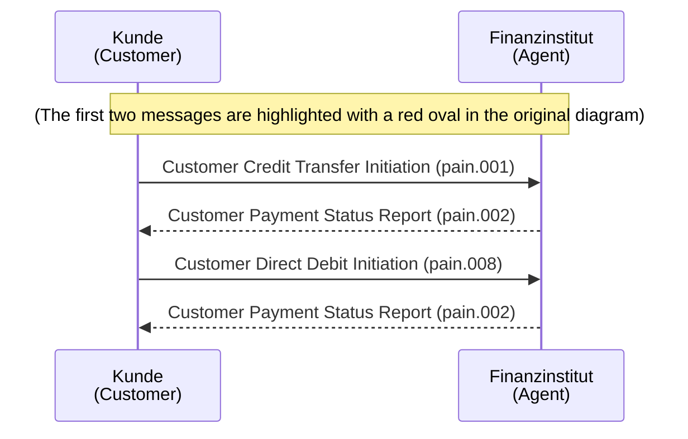

*Abbildung 1: Payment Initiation Meldungsfluss-Übersicht*

Die Meldungsflüsse sind in der vorstehenden Abbildung 1 verdeutlicht. Die Meldung «pain.002» wird vom Empfänger von Meldungen «pain.001» und «pain.008» zur Rückmeldung des Validierungsresultats an den Absender zurückgesendet.

Die im ISO-20022-Standard spezifizierten Meldungen sind universell einsetzbar, gelten für alle Währungen und umfassen alle Möglichkeiten. Für spezielle Einsatzgebiete und länderspezifische Gegebenheiten werden die Meldungen angepasst, d. h. es werden nicht alle Möglichkeiten des Standards verwendet.

Version 2.2 – 24.02.2025
Seite 10 von 91

SIX
Customer Credit Transfer Initiation
Einleitung

### 1.3.2 SEPA-Meldungsstandard

Für Zahlungen in den SEPA-Raum (Single Euro Payments Area) sind der SEPA-Meldungsstandard sowie die *Swiss Payment Standards* von Bedeutung (siehe Kapitel 3.15 «Zahlungsarten», Zahlungsart «S»).

Für eine effiziente Nutzung im SEPA-Raum (EU-Staaten, EWR-Länder, Monaco und Schweiz) wurden Einschränkungen im ISO-20022-Standard vorgenommen, welche durch den European Payments Council («EPC»), das Entscheidungsgremium der europäischen Banken und Bankenverbände für den Zahlungsverkehr, verabschiedet wurden.

Der SEPA-Meldungsstandard ist in den folgenden, auf der Webseite des European Payments Council («EPC») publizierten Dokumenten spezifiziert:

* EPC125-05 *SEPA Credit Transfer Rulebook* [4]
* EPC132-08 *SEPA Credit Transfer Implementation Guidelines* [5]

## 1.4 Abgrenzungen

Dieses Dokument spezifiziert ausschliesslich die Kunde-Bank-Meldungen «Customer Credit Transfer Initiation».

Alle Aspekte bezüglich der für die Meldungsübermittlung zwischen Kunde und Finanzinstitut verwendeten Kommunikationskanäle und deren Sicherheitsmerkmale werden in diesem Dokument nicht behandelt. Sie liegen vollumfänglich in der Verantwortung der involvierten Finanzinstitute und deren Kunden.

## 1.5 Darstellungskonventionen

Für dieses Dokument gelten die folgenden Darstellungskonventionen.

### 1.5.1 Bezeichnung von XML-Elementen

In verschiedenen Publikationen werden die Namen von XML-Elementen als ein Begriff ohne Leerzeichen geschrieben, also z. B. *CreditTransferTransactionInformation*. Um die Lesbarkeit zu verbessern, werden in diesem Dokument in der Regel Leerzeichen eingefügt.

### 1.5.2 Daten in den Tabellen

Die Tabellen enthalten Informationen aus ISO 20022 (Index, Multiplicity, Message Item, XML-Tag). Zusätzlich sind in den Tabellen folgende Informationen zu den *Swiss Payment Standards* zu finden:

* Status des Elements (gemäss Definition im Kapitel 1.5.6 «Status»)
* Generelle Definition
* Zahlungsartspezifische Definitionen
* Fehlercode, welcher bei allfälligen Fehlern im «Customer Payment Status Report» (pain.002) zurückgemeldet wird

**Hinweis:** Führt die Schema-Validierung zur Abweisung einer kompletten Meldung wird der Fehlercode «FF01» rückgemeldet. Da diese Reaktion generell für alle Elemente der Tabelle gilt, wird sie nicht bei jedem Element als Kommentar aufgeführt.

Version 2.2 – 24.02.2025
Seite 11 von 91

SIX
Customer Credit Transfer Initiation | Einleitung

### 1.5.3 Farbgebung in den Tabellen

Die Spaltenüberschriften sind für die Angaben zum ISO-20022-Standard <mark>braungrau</mark> und für Angaben zu den *Swiss Payment Standards* <mark>hellgrau</mark> eingefärbt.

Elemente, die mindestens ein Subelement enthalten, werden in den Spalten zum ISO-20022-Standard <mark>hellblau</mark> markiert.

### 1.5.4 Darstellung der Baumstruktur in den Tabellen

Um erkennen zu können, wo in der Baumstruktur ein Element angesiedelt ist, wird beim «Message Item» die Verschachtelungstiefe mit vorangestellten «+»-Zeichen angegeben. Die IBAN in der «Payment Information» wird zum Beispiel wie folgt dargestellt:

    Payment Information
    +Debtor Account
    ++Identification
    +++IBAN

### 1.5.5 Darstellung der Auswahl

Elemente mit einer Auswahl (choice) werden in der Spalte «XML Tag» wie folgt gekennzeichnet:

    {Or      für Beginn der Auswahl
    Or}      für Ende der Auswahl

Beispiel:

<table>
  <thead>
    <tr>
        <th>&lt;mark style="background-color: lightblue"&gt;Payment Information<br/>+Debtor Account<br/>++Identification</mark></th>
        <th>Id</th>
        <th>1..1</th>
        <th>M</th>
    </tr>
    <tr>
        <th>&lt;mark style="background-color: lightblue"&gt;Payment Information<br/>+Debtor Account<br/>++Identification<br/>+++IBAN</mark></th>
        <th>IBAN<br/>{Or</th>
        <th>1..1</th>
        <th>R</th>
    </tr>
    <tr>
        <th>&lt;mark style="background-color: lightblue"&gt;Payment Information<br/>+Debtor Account<br/>++Identification<br/>+++Other</mark></th>
        <th>Othr<br/>Or}</th>
        <th>1..1</th>
        <th>D</th>
    </tr>
  </thead>
</table>

*Abbildung 2: Beispiel einer Auswahl*

Version 2.2 – 24.02.2025 | Seite 12 von 91

SIX
Customer Credit Transfer Initiation
Einleitung

## 1.5.6 Status

Folgende Status (Angaben über die Verwendung) sind für die einzelnen XML-Elemente gemäss *Swiss Payment Standards* möglich:

<table>
  <thead>
    <tr>
        <th>Status</th>
        <th>Bezeichnung</th>
        <th>Beschreibung</th>
    </tr>
  </thead>
  <tbody>
    <tr>
        <td>**M**</td>
        <td>Mandatory</td>
        <td>Das Element ist obligatorisch.<br/>Wenn das Element nicht geliefert wird, weist ein Finanzinstitut die Verarbeitung der Meldung zurück.</td>
    </tr>
    <tr>
        <td>**R**</td>
        <td>Recommended</td>
        <td>Die Verwendung des Elementes ist empfohlen.<br/>Wenn das Element nicht geliefert wird, wird die Meldung von einem Finanzinstitut dennoch verarbeitet.</td>
    </tr>
    <tr>
        <td>**O**</td>
        <td>Optional</td>
        <td>Das Element ist optional<br/>\* Kunden können dieses Element liefern<br/>\* Falls geliefert, verarbeiten Finanzinstitute das Element gemäss SPS-Definition</td>
    </tr>
    <tr>
        <td>**D**</td>
        <td>Dependent</td>
        <td>Die Verwendung ist abhängig von der Verwendung anderer Elemente<br/>\* Muss geliefert werden<br/>\* Kann optional geliefert werden<br/>\* Darf nicht geliefert werden<br/>Es ist jeweils die entsprechende SPS-Definition des Elements zu konsultieren.</td>
    </tr>
    <tr>
        <td>**BD**</td>
        <td>Bilaterally Determined</td>
        <td>Das Element ist optional.<br/>Einige Finanzinstitut bieten bei Verwendung des Elements Zusatzdienste an. Diese sind mit dem Finanzinstitut zu vereinbaren.<br/>Besteht keine Vereinbarung wird das Element ignoriert (nicht verarbeitet und nicht im Interbankverkehr weitergegeben).</td>
    </tr>
    <tr>
        <td>**N**</td>
        <td>Not Allowed</td>
        <td>Das Element darf nicht verwendet werden. Wird das Element dennoch geliefert, weist ein Finanzinstitut die gesamte Meldung, den entsprechenden B- oder C-Level zurück.</td>
    </tr>
  </tbody>
</table>

*Tabelle 4: Status XML-Elemente*

Version 2.2 – 24.02.2025
Seite 13 von 91

SIX
Customer Credit Transfer Initiation
Einleitung

### 1.5.7 Felddefinitionen

In diesen *Implementation Guidelines* werden nur diejenigen Elemente beschrieben, für die SPS-spezifische Definitionen festgelegt wurden.

Elementgruppen, für die keine SPS-spezifischen Regeln definiert wurden, werden in den Tabellen ohne ihre Unterelemente angezeigt.

Beispiel:

<table>
  <tbody>
    <tr>
        <td>2.128</td>
        <td>Credit Transfer Transaction Information<br/>+Remittance Information<br/>++Structured<br/>+++Invoicee</td>
        <td>Invyee</td>
        <td>0..1</td>
        <td>O</td>
        <td></td>
        <td>S: Darf nicht verwendet werden.</td>
        <td>CH17</td>
    </tr>
  </tbody>
</table>

Elementgruppen, die im Schema mehrfach vorkommen (z. B. Postadressen) und in SPS gleichartig definiert sind, werden im Kapitel 3 «Fachliche Spezifikationen» generisch beschrieben und in den Tabellen des Kapitels 4 «Technische Spezifikationen» wird auf diese generellen Definitionen verwiesen.

Beispiel:

<table>
  <tbody>
    <tr>
        <td>2.81</td>
        <td>Credit Transfer Transaction Information<br/>+Ultimate Creditor<br/>++Postal Address</td>
        <td>PstlAdr</td>
        <td>0..1</td>
        <td>D</td>
        <td>Nur strukturierte Adresselemente zugelassen.<br/>&lt;mark style="background-color: red"&gt;Generelle Beschreibung der Subelemente siehe Kapitel 3.11<br/>«Verwendung von Adressinformationen»</mark></td>
        <td>S: Wird im Interbankenverkehr nicht weitergeleitet.</td>
        <td>CH17</td>
    </tr>
  </tbody>
</table>

Lediglich im Fall von Abweichungen (z. B. ein Subelement wird ausnahmsweise nicht unterstützt), werden diese Abweichungen beim entsprechenden Vorkommen in den Tabellen näher beschrieben.

Gibt es keine Abweichungen, wird die Datengruppe in der Haupttabelle «nicht aufgeklappt» (ohne ihre Unterelemente) angezeigt.

## 1.6 Darstellung von XML-Meldungen

Der logische Aufbau von XML-Meldungen entspricht einer Baumstruktur. Diese Struktur kann auf verschiedene Arten dargestellt werden: grafisch, tabellarisch oder textlich. Die textliche Darstellung eignet sich gut für konkrete Meldungsbeispiele, während die tabellarische und die grafische Darstellung vor allem der übersichtlichen Erläuterung von XML-Schemas dienen. Die in diesem Dokument verwendeten Abbildungen basieren auf dem Schema der *Swiss Payment Standards*.

XML-Editoren mit der Möglichkeit zur grafischen Darstellung verwenden Symbole, die je nach Editortyp leicht abweichend aussehen können (die Abbildungen in diesem Dokument wurden mit dem Editor *XMLSpy* von Altova GmbH erzeugt). Die wichtigsten Symbole werden in den *Schweizer Business Rules* [6] kurz vorgestellt. Detaillierte Angaben sind im Benutzerhandbuch bzw. der Online-Hilfe des verwendeten XML-Editors zu finden.

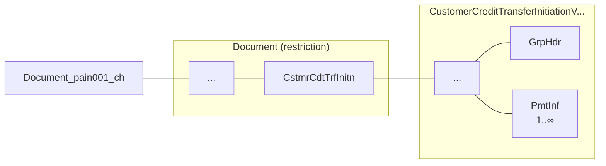

Abbildung 3: Beispiel einer grafischen XML-Meldungsdarstellung

Version 2.2 – 24.02.2025
Seite 14 von 91

SIX
Customer Credit Transfer Initiation Customer Credit Transfer Initiation (pain.001)

# 2 Customer Credit Transfer Initiation (pain.001)

## 2.1 Allgemeines

Die XML-Meldung «Customer Credit Transfer Initiation» (pain.001) wird zur elektronischen Beauftragung von Überweisungsaufträgen durch Kunden an das überweisende Finanzinstitut verwendet. Sie wird auf der Basis des ISO-20022-XML-Schemas «pain.001.001.09» eingesetzt.

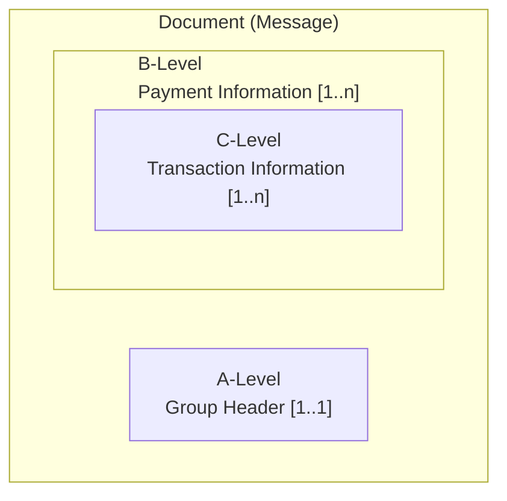

Die XML-Meldung «pain.001» ist grundsätzlich wie folgt strukturiert:

*   **A-Level:** Meldungsebene, «Group Header». Dieser Block muss genau einmal vorhanden sein.
*   **B-Level:** Beim Zahlungspflichtigen (auf der Belastungsseite), «Payment Information». Dieser Block muss mindestens einmal vorkommen und enthält in der Regel mehrere C-Levels.
*   **C-Level:** Beim Zahlungsempfänger (auf der Gutschriftsseite), «Credit Transfer Transaction Information». Dieser Block muss mindestens einmal pro B-Level vorkommen. Er enthält alle zum B-Level (Belastung) zugehörigen C-Levels (Transaktionen).

Abbildung 4: Grundsätzliche Meldungsstruktur der XML-Meldung «pain.001»

Die im Kapitel 3 «Fachliche Spezifikationen» enthaltenen **fachlichen Spezifikationen** decken u.a. folgende Themen ab:

*   Zeichensatz
*   Referenzen
*   Duplikatsprüfung

Die im Kapitel 4 «Technische Spezifikationen» enthaltenen **technischen Spezifikationen** der XML-Meldung «Customer Credit Transfer Initiation» (pain.001) beschreiben jede dieser Meldungsebenen in einem eigenen Unterkapitel:

*   4.1 «Group Header (GrpHdr, A-Level)»
*   4.2 «Payment Information (PmtInf, B-Level)»
*   4.3 «Credit Transfer Transaction Information (CdtTrfTxInf, C-Level)»

Version 2.2 – 24.02.2025 Seite 15 von 91

Customer Credit Transfer Initiation
Fachliche Spezifikationen

# 3 Fachliche Spezifikationen

## 3.1 Zeichensatz

In ISO-20022-XML-Meldungen dürfen grundsätzlich Zeichen des Unicode-Zeichensatzes UTF-8 (8-Bit Unicode Transformation Format) verwendet werden (Meldung muss UTF-8 codiert sein, ohne BOM – Byte Order Mark).

In den XML-Meldungen gemäss den *Swiss Payment Standards* (SPS) wird daraus nur eine Teilmenge von Zeichen zugelassen. Diese umfasst die druckbaren Zeichen der folgenden Unicodeblöcke:

* Basic-Latin (Unicodepoint U+0020 – U+007E)
* Latin1-Supplement (Unicodepoint U+00A0 – U+00FF)
* Latin Extended-A (Unicodepoint U+0100 – U+017F)

sowie zusätzlich die folgenden Zeichen:

* Ș – (LATIN CAPITAL LETTER S WITH COMMA BELOW, Unicodepoint U+0218)
* ș – (LATIN SMALL LETTER S WITH COMMA BELOW, Unicodepoint U+0219)
* Ț – (LATIN CAPITAL LETTER T WITH COMMA BELOW, Unicodepoint U+021A)
* ț – (LATIN SMALL LETTER T WITH COMMA BELOW, Unicodepoint U+021B)
* € – (EURO SIGN, Unicodepoint U+20AC)

Werden nicht zugelassene Zeichen übermittelt, wird die Meldung abgewiesen. Für die Weiterleitung im Interbankbereich (z. B. SEPA, Swift, etc.) müssen einige der Zeichen von den Banken gemäss der Tabelle 29 in Anhang C umgewandelt werden.

**Escapes**

Für die nachstehenden Zeichen ist die escaped-Darstellung zu verwenden (teilweise optional):

<table>
  <tbody>
    <tr>
        <td>Zeichen</td>
        <td>Beschreibung</td>
        <td>Escape</td>
        <td>Bemerkungen</td>
    </tr>
    <tr>
        <th>&amp;</th>
        <th>AMPERSAND</th>
        <th>&amp;amp;</th>
        <th>nur Escape erlaubt</th>
    </tr>
    <tr>
        <th>&lt;</th>
        <th>KLEINER-ALS-ZEICHEN</th>
        <th>&amp;lt;</th>
        <th>nur Escape erlaubt</th>
    </tr>
    <tr>
        <th>&gt;</th>
        <th>GRÖSSER-ALS-ZEICHEN</th>
        <th>&amp;gt;</th>
        <th>Escape oder Zeichen erlaubt</th>
    </tr>
    <tr>
        <th>'</th>
        <th>APOSTROPHE</th>
        <th>&amp;apos;</th>
        <th>Escape oder Zeichen erlaubt</th>
    </tr>
    <tr>
        <th>"</th>
        <th>ANFÜHRUNGSZEICHEN</th>
        <th>&amp;quot;</th>
        <th>Escape oder Zeichen erlaubt</th>
    </tr>
  </tbody>
</table>
*Tabelle 5: Escape-Zeichen*

Version 2.2 – 24.02.2025
Seite 16 von 91

SIX
Customer Credit Transfer Initiation Fachliche Spezifikationen

## 3.2 Zeichensatz für Referenzelemente

Für die folgenden Referenzelemente ist nur ein eingeschränkter Zeichensatz zugelassen:

* «Message Identification» (A-Level)
* «Payment Information Identification» (B-Level)
* «Instruction Identification» (C-Level)
* «End To End Identification» (C-Level)

Die zulässigen Zeichen für diese Elemente sind:

* ABCDEFGHIJKLMNOPQRSTUVWXYZ
* abcdefghijklmnopqrstuvwxyz
* 1234567890
* Leerzeichen
* Die folgenden Sonderzeichen:

<table>
  <thead>
    <tr>
        <th>Character</th>
        <th>Description</th>
        <th>Code</th>
    </tr>
  </thead>
  <tbody>
    <tr>
        <td>'</td>
        <td>Apostrophe</td>
        <td>U+0027</td>
    </tr>
    <tr>
        <td>(</td>
        <td>Left parenthesis</td>
        <td>U+0028</td>
    </tr>
    <tr>
        <td>)</td>
        <td>Right parenthesis</td>
        <td>U+0029</td>
    </tr>
    <tr>
        <td>+</td>
        <td>Plus sign</td>
        <td>U+002B</td>
    </tr>
    <tr>
        <td>,</td>
        <td>Comma</td>
        <td>U+002C</td>
    </tr>
    <tr>
        <td>-</td>
        <td>Hyphen-minus</td>
        <td>U+002D</td>
    </tr>
    <tr>
        <td>.</td>
        <td>Full stop</td>
        <td>U+002E</td>
    </tr>
    <tr>
        <td>/</td>
        <td>Slash (Solidus)</td>
        <td>U+002F</td>
    </tr>
    <tr>
        <td>:</td>
        <td>Colon</td>
        <td>U+003A</td>
    </tr>
    <tr>
        <td>?</td>
        <td>Question mark</td>
        <td>U+003F</td>
    </tr>
  </tbody>
</table>
Tabelle 6: Sonderzeichen für Referenzelemente

Diese Referenzelemente dürfen nicht mit Leerzeichen oder «/» beginnen, nicht mit «/» enden und dürfen an keiner Stelle «//» enthalten.

**Hinweis:** Generell gelten die von der EPC erarbeiteten Anforderungen gemäss dem Dokument *EPC230-15 EPC Clarification Paper on the Use of Slashes in References, Identifications and Identifiers*.

## 3.3 Leerzeichen

Für die Verwendung von Leerzeichen sind folgende Regeln zu beachten:

* Als Leerzeichen darf ausschliesslich das Zeichen SP (SPACE, 0x20) verwendet werden
* Referenzelemente dürfen nicht mit Leerzeichen beginnen
* Elemente, welche Code-Werte enthalten, dürfen keine Leerzeichen enthalten, z. B. Element «Category Purpose» oder «Service Level»

Leerzeichen können aber weiterhin innerhalb eines Elements vorkommen, beispielsweise bei einem Doppelnamen ohne Bindestrich wie: «Meier Mueller» oder «Muster AG».

Version 2.2 – 24.02.2025 Seite 17 von 91

SIX
Customer Credit Transfer Initiation Fachliche Spezifikationen

## 3.4 Lieferung leerer Elemente

* Die Verwendung leerer Elemente ist nicht zulässig
* Elemente dürfen nicht ausschliesslich Leerzeichen enthalten
* Gruppenelemente dürfen nicht leer geliefert werden und müssen immer mindestens ein Sub-element enthalten

Falls leere Elemente geliefert werden, kann es zu einem Schemafehler oder zu einer Zurückweisung in Folge einer Business-Validierung kommen.

## 3.5 Verwendung von XML-CDATA-Abschnitten

Die Verwendung von CDATA wird nicht unterstützt, allfällige Informationen werden ignoriert.

Version 2.2 – 24.02.2025 Seite 18 von 91

SIX
Customer Credit Transfer Initiation Fachliche Spezifikationen

## 3.6 XML-Schema-Validierung

Die technische Validierung der verschiedenen XML-Meldungen erfolgt mit Hilfe von XML-Schemas. Diese definieren die zu verwendenden Elemente, deren Status (obligatorisch, fakultativ, abhängig), das Format ihres Inhalts und den Inhalt selbst (in bestimmten Fällen werden die zulässigen Codes im XML-Schema aufgeführt).

Für die *Swiss Payment Standards* werden eigene XML-Schemas als Varianten der ISO-20022-XML-Schemas herausgegeben, bei denen z. B. nicht benötigte Elemente weggelassen oder Status geändert worden sind. Diese XML-Schemas definieren den für die Schweiz gültigen Datenumfang.

Fehlerhafte Meldungen aufgrund einer Schema-Verletzung werden von den Finanzinstituten abgewiesen.

Um kundenseitig File-Rejects bei der File-Einlieferung infolge eines Schema-Fehlers zu verhindern, sind Softwarehersteller angewiesen, eine ISO-20022 Meldung vorgängig gegen das entsprechende pain.001-Schema zu prüfen.

Die Bezeichnungen der XML-Schemas in den *Swiss Payment Standards* sowie Links zu den Original-XSD-Dateien sind im Anhang A aufgeführt.

**Verwendung des Schweizer XML-Schemas**

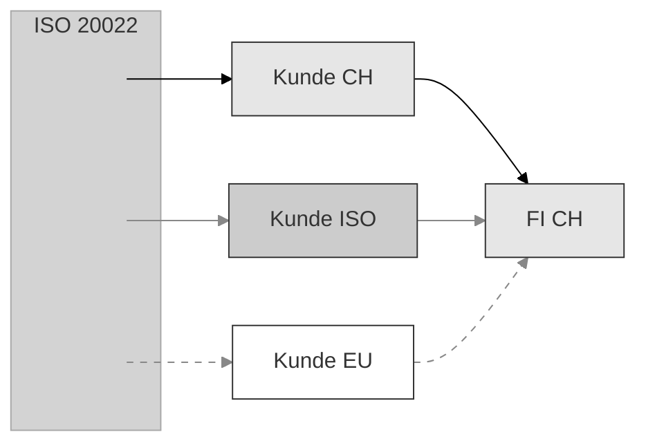

*   $\longrightarrow$ Schweizer Schema, gemäss diesen Implementation Guidelines
*   $\color{grey}\longrightarrow$ ISO-20022-Schema
*   $\color{grey}-\, -\, \rightarrow$ Anderes Schema auf Basis ISO 20022

*Abbildung 5: Verwendung des Schweizer XML-Schemas*

Die Definitionen im Schweizer XML-Schema entsprechen den Beschreibungen in diesen Implementation Guidelines und sollen primär zur Validierung erstellter XML-Dateien dienen.

Version 2.2 – 24.02.2025 Seite 19 von 91

SIX
Customer Credit Transfer Initiation
Fachliche Spezifikationen

## 3.7 Darstellungskonventionen für Betragsfelder

Im XML-Kontext sind in Betragsfeldern unterschiedliche Darstellungsformen zugelassen. Um eine reibungslose Verarbeitung der Zahlung zu gewährleisten, wird folgende Darstellung empfohlen:

* Keine Verwendung von führenden oder abschliessenden Auffüllzeichen (Space, White Space, Nullen, Plus-Zeichen).
* Wird ein Dezimaltrennzeichen verwendet, dann muss dafür ein Punkt verwendet werden.
* Maximale Anzahl Dezimalstellen ist währungsabhängig gemäss ISO 4217.

Unabhängig vom verwendeten Darstellungsformat ist es den Finanzinstituten erlaubt, sämtliche Betragsfelder für die Weiterverarbeitung in ein einheitliches Darstellungsformat umzuwandeln.

Korrekte Beispiele für Betragsfelder sind z. B. für CHF:

* Fünf Rappen: 0.05
* Ein Franken zehn: 1.1 oder 1.10
* Ein Franken: 1 oder 1.0 oder 1.00

Nicht korrekt Beispiele für Betragsfelder wären:

* Fünf Rappen: 05 oder .05
* Ein Franken: 000001 oder 1.

## 3.8 Duplikatsprüfung

Die Duplikatsprüfung von eingereichten Meldungen «pain.001» kann von Finanzinstitut zu Finanzinstitut variieren. Es sind sowohl Prüfungen einzelner eingelieferter inhaltlicher Elemente als auch Prüfungen auf Ebene des Einlieferungskanals denkbar.

Die Duplikatsprüfung erfolgt bei den Schweizer Finanzinstituten mindestens auf Ebene «Document» (Message). Aus diesem Grund muss das Element «Message Identification» (`<MsgId>`) eindeutig belegt werden, um als Kriterium für die Verhinderung einer Doppelverarbeitung bei versehentlich doppelt eingereichten Dateien zu dienen. Die Eindeutigkeit wird hierbei von den meisten Finanzinstituten auf einen Zeitraum von mindestens 90 Tagen geprüft.

Es wird empfohlen, die «Message Identification» generell so lange wie möglich eindeutig zu halten, um auch langfristig Nachforschungen zu erleichtern.

Version 2.2 – 24.02.2025
Seite 20 von 91

SIX
Customer Credit Transfer Initiation Fachliche Spezifikationen

# 3.9 Software-Informationen

Die Schweizer Finanzinstitute empfehlen zur Erleichterung von Supportanfragen in der «pain.001»-Meldung immer Informationen über die zur Erstellung der Meldung verwendete Software zu liefern. Die Lieferung der korrekten und vollständigen Informationen ist freiwillig.

Dafür ist das Element `<GrpHdr>/<InitgPty>/<CtctDtls>/<Othr>` wie folgt zu verwenden. Dieses Element kann maximal 4-mal geliefert werden, wobei die Subelemente wie in nachfolgender Tabelle beschrieben zu befüllen sind:

<table>
  <thead>
    <tr>
        <th>Instanz</th>
        <th>Subelement</th>
        <th>Wert</th>
        <th>Beschreibung</th>
    </tr>
  </thead>
  <tbody>
    <tr>
        <td rowspan="2">1</td>
        <td>&lt;ChanlTp&gt;</td>
        <td>NAME</td>
        <td>Code (in Grossbuchstaben)</td>
    </tr>
    <tr>
        <td>&lt;Id&gt;</td>
        <td>*Produkt-Name*</td>
        <td>Name des SW-Produkts</td>
    </tr>
    <tr>
        <td rowspan="2">2</td>
        <td>&lt;ChanlTp&gt;</td>
        <td>PRVD</td>
        <td>Code (in Grossbuchstaben)</td>
    </tr>
    <tr>
        <td>&lt;Id&gt;</td>
        <td>*Hersteller-Name*</td>
        <td>Name des SW-Herstellers</td>
    </tr>
    <tr>
        <td rowspan="2">3</td>
        <td>&lt;ChanlTp&gt;</td>
        <td>VRSN</td>
        <td>Code (in Grossbuchstaben)</td>
    </tr>
    <tr>
        <td>&lt;Id&gt;</td>
        <td>*Software-Version*</td>
        <td>Version der Software</td>
    </tr>
    <tr>
        <td rowspan="2">4</td>
        <td>&lt;ChanlTp&gt;</td>
        <td>SPSV</td>
        <td>Code (in Grossbuchstaben)</td>
    </tr>
    <tr>
        <td>&lt;Id&gt;</td>
        <td>*SPS IG-Version*</td>
        <td>Version des SPS-IGs im Format nnnn (z. B.<br/>0200 für IG Version 2.0), die von der Soft-<br/>ware umgesetzt wurde (Format wird nicht<br/>validiert)</td>
    </tr>
  </tbody>
</table>

Tabelle 7: Software-Informationen

Version 2.2 – 24.02.2025 Seite 21 von 91

SIX
Customer Credit Transfer Initiation | Fachliche Spezifikationen

## 3.10 Bezeichnung der Parteien einer Zahlung

Bei Zahlungen mit «pain.001» werden die beteiligten Parteien wie folgt benannt:

<table>
  <thead>
    <tr>
        <th>**Bezeichnung**</th>
        <th>**Bemerkung**</th>
        <th>**ISO 20022**</th>
    </tr>
  </thead>
  <tbody>
    <tr>
        <td>Einliefernde Partei</td>
        <td>Einreicher der «pain.001»<br/>Zahlungsmeldung</td>
        <td>Initiating Party</td>
    </tr>
    <tr>
        <td>Ursprünglicher Zahlungspflichtiger</td>
        <td></td>
        <td>Ultimate Debtor</td>
    </tr>
    <tr>
        <td>Zahler</td>
        <td>Ist Kunde des Instituts des Zahlers</td>
        <td>Debtor</td>
    </tr>
    <tr>
        <td>&lt;mark style="background-color: lightgrey"&gt;Institut des Zahlers</mark></td>
        <td>&lt;mark style="background-color: lightgrey"&gt;Führt das Konto des Zahlers</mark></td>
        <td>&lt;mark style="background-color: lightgrey"&gt;Debtor Agent</mark></td>
    </tr>
    <tr>
        <td>&lt;mark style="background-color: lightgrey"&gt;Intermediäres Institut</mark></td>
        <td>&lt;mark style="background-color: lightgrey"&gt;Führt, wenn vorhanden, das Konto des Instituts des Zahlungsempfängers</mark></td>
        <td>&lt;mark style="background-color: lightgrey"&gt;Intermediary Agent</mark></td>
    </tr>
    <tr>
        <td>&lt;mark style="background-color: lightgrey"&gt;Institut des Zahlungsempfängers</mark></td>
        <td>&lt;mark style="background-color: lightgrey"&gt;Führt das Konto des Zahlungsempfängers</mark></td>
        <td>&lt;mark style="background-color: lightgrey"&gt;Creditor Agent</mark></td>
    </tr>
    <tr>
        <td>Zahlungsempfänger</td>
        <td>Ist Kunde des Instituts des Zahlungsempfängers</td>
        <td>Creditor</td>
    </tr>
    <tr>
        <td>Endgültiger Zahlungsempfänger</td>
        <td></td>
        <td>Ultimate Creditor</td>
    </tr>
  </tbody>
</table>

*Tabelle 8: Bezeichnungen der Parteien in Überweisungen*

Die in der Tabelle grau hinterlegten Parteien sind Finanzinstitute (Agents), die weiss hinterlegten Parteien sind die sonstigen Parteien (Parties).

Die Identifikation der Agents und Parties in den «pain»-Meldungen erfolgt über jeweils eigene spezifische Datenstrukturen, welche in den nachfolgenden Kapiteln generisch beschrieben werden.

Abweichungen von den generischen Regeln bei einzelnen Parteien werden im Kapitel 4 «Technische Spezifikationen» bei der jeweiligen Partei beschrieben.

Version 2.2 – 24.02.2025 | Seite 22 von 91

SIX
Customer Credit Transfer Initiation
Fachliche Spezifikationen

## 3.11 Verwendung von Adressinformationen

Die folgenden Adresselemente können in «pain.001» eingesetzt werden:

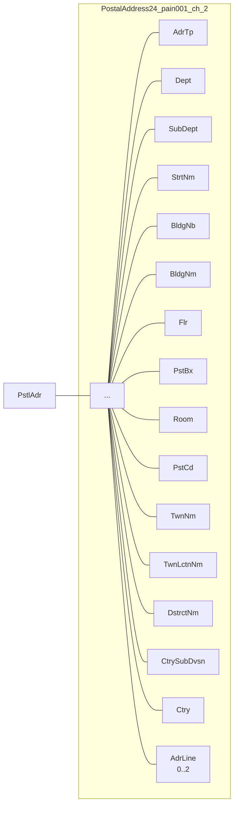

*Abbildung 6: Datenelemente für Adressdaten (generisch)*

Version 2.2 – 24.02.2025
Seite 23 von 91

SIX
Customer Credit Transfer Initiation | Fachliche Spezifikationen

<table>
  <thead>
    <tr>
        <th colspan="3">ISO-20022-Standard</th>
        <th colspan="3">Swiss Payment Standards</th>
    </tr>
    <tr>
        <th>Message Item</th>
        <th>XML-Tag</th>
        <th>Mult</th>
        <th>Generelle Definition</th>
        <th>Status</th>
        <th>Bemerkung</th>
    </tr>
  </thead>
  <tbody>
    <tr>
        <td>Address Type</td>
        <td>AdrTp</td>
        <td>0..1</td>
        <td>Adress-Typ</td>
        <td>N</td>
        <td>Darf nicht geliefert werden.</td>
    </tr>
    <tr>
        <td>Department</td>
        <td>Dept</td>
        <td>0..1</td>
        <td>Abteilung</td>
        <td>O</td>
        <td></td>
    </tr>
    <tr>
        <td>Sub Department</td>
        <td>SubDept</td>
        <td>0..1</td>
        <td>Bereich</td>
        <td>O</td>
        <td></td>
    </tr>
    <tr>
        <td>Street Name</td>
        <td>StrtNm</td>
        <td>0..1</td>
        <td>Strasse</td>
        <td>R</td>
        <td>Empfehlung: Verwenden</td>
    </tr>
    <tr>
        <td>Building Number</td>
        <td>BldgNb</td>
        <td>0..1</td>
        <td>Hausnummer</td>
        <td>R</td>
        <td>Empfehlung: Verwenden</td>
    </tr>
    <tr>
        <td>Building Name</td>
        <td>BldgNm</td>
        <td>0..1</td>
        <td>Gebäudename</td>
        <td>O</td>
        <td></td>
    </tr>
    <tr>
        <td>Floor</td>
        <td>Flr</td>
        <td>0..1</td>
        <td>Stockwerk</td>
        <td>O</td>
        <td></td>
    </tr>
    <tr>
        <td>Post Box</td>
        <td>PstBx</td>
        <td>0..1</td>
        <td>Postfach</td>
        <td>O</td>
        <td></td>
    </tr>
    <tr>
        <td>Room</td>
        <td>Room</td>
        <td>0..1</td>
        <td>Raum</td>
        <td>O</td>
        <td></td>
    </tr>
    <tr>
        <td>Post Code</td>
        <td>PstCd</td>
        <td>0..1</td>
        <td>Postleitzahl</td>
        <td>R</td>
        <td>Empfehlung: Verwenden</td>
    </tr>
    <tr>
        <td>Town Name</td>
        <td>TwnNm</td>
        <td>0..1</td>
        <td>Ort</td>
        <td>M</td>
        <td>Muss verwendet werden.</td>
    </tr>
    <tr>
        <td>Town Location Name</td>
        <td>TwnLctnNm</td>
        <td>0..1</td>
        <td></td>
        <td>O</td>
        <td></td>
    </tr>
    <tr>
        <td>District Name</td>
        <td>DstrctNm</td>
        <td>0..1</td>
        <td>Bezirk</td>
        <td>O</td>
        <td></td>
    </tr>
    <tr>
        <td>Country Sub Division</td>
        <td>CtrySubDvsn</td>
        <td>0..1</td>
        <td>Landesteil (z. B.<br/>Kanton, Provinz,<br/>Bundesland)</td>
        <td>O</td>
        <td></td>
    </tr>
    <tr>
        <td>Country</td>
        <td>Ctry</td>
        <td>0..1</td>
        <td>Land (Landescode<br/>gemäss ISO 3166,<br/>Alpha-2 code)</td>
        <td>M</td>
        <td>Muss verwendet werden.</td>
    </tr>
    <tr>
        <td>Address Line</td>
        <td>AdrLine</td>
        <td>0..7</td>
        <td>Unstrukturierte<br/>Adressinformationen</td>
        <td>BD</td>
        <td>Maximal 2 Zeilen zugelassen,<br/>sofern als Teil der hybriden<br/>Adresse angeboten. Kann für<br/>Adressinformationen<br/>verwendet werden, die nicht<br/>in einem strukturierten<br/>Element geliefert werden<br/>können. Es dürfen keine<br/>Daten wiederholt werden, die<br/>schon in einem anderen<br/>Element geliefert werden.</td>
    </tr>
  </tbody>
</table>

*Tabelle 9: Datenelemente für Adressdaten (generisch)*

Version 2.2 – 24.02.2025 | Seite 24 von 91

SIX
Customer Credit Transfer Initiation Fachliche Spezifikationen

Die Adressen der beteiligten Parteien wie zum Beispiel Creditor können im Element «Name» und im Element «Postal Address» entweder strukturiert (die empfohlene Subelemente sind: «Street Name», «Building Number», «Post Code», «Town Name» und «Country») oder hybrid (Subelement «Address Line») erfolgen. Bei allen Zahlungsarten wird die Verwendung von strukturierten Adressen empfohlen.

Generell sind die Subelemente der «Postal Address» nur in Kombination mit dem Element «Name» zulässig. Das Element «Name» kann jedoch auch ohne ein Subelement der «Postal Address» verwendet werden. Dabei sind die regulatorischen und sonstigen Vorgaben für die jeweilige Zahlungsart bzw. Destination zu beachten.

Ab November 2025 können Adressen im «pain.001» in einer der beiden nachfolgenden Varianten mitgeliefert werden:

**Variante «strukturiert»:**

* «Name»
* «Street Name» und «Building Number» (empfohlen)
* sonstige strukturierte Elemente
* «Post Code» und «Town Name»
* «Country»
* Die Subelemente «Town Name» und «Country» müssen immer geliefert werden.

Dies würde im «pain.001» zum Beispiel wie folgt aussehen:

```xml
<Cdtr>
   <Nm>MUSTER AG</Nm>
   <PstlAdr>
      <StrtNm>Musterstrasse</StrtNm>
      <BldgNb>24</BldgNb>
      <PstCd>3000</PstCd>
      <TwnNm>Bern</TwnNm>
      <Ctry>CH</Ctry>
   </PstlAdr>
</Cdtr>
```

Bis auf weiteres ist die Angabe der Hausnummer (Subelement «Building Number») im Subelement «Street Name» zugelassen. Insbesondere bei SEPA- und grenzüberschreitenden Zahlungen (Zahlungsarten **«S»** und **«X»**) kann die Transaktion je nach Regelung und Handhabung im Empfängerland dennoch zurückgewiesen werden.

Bei dem Element «Name» besteht bei SEPA – Zahlungsart **«S»** - weiterhin die Einschränkung von 70 Zeichen.

Version 2.2 – 24.02.2025 Seite 25 von 91

SIX
Customer Credit Transfer Initiation Fachliche Spezifikationen

**Variante «hybrid» (ab November 2025):**

* «Name»
* sämtliche strukturierte Elemente
* Die Subelemente «Town Name» und «Country» müssen immer geliefert werden.
* Zwei Verwendungen von «Address Line» – maximal 2*70 Stellen sind zugelassen, belegt mit Informationen, die nicht in den strukturierten Feldern abgebildet werden können. Es dürfen keine Daten wiederholt werden, die schon in einem anderen strukturierten Addresselement geliefert werden.

Dies würde im «pain.001» zum Beispiel wie folgt aussehen:

```xml
<Cdtr>
  <Nm>John Smith</Nm>
  <PstlAdr>
    <StrtNm>Keppel Bay</StrtNm>
    <BldgNb>24</BldgNb>
    <PstCd>123456</PstCd>
    <TwnNm>Singapore</TwnNm >
    <Ctry>SG</Ctry>
    <AdrLine>Carribean At Keppel Bay</AdrLine>
    <AdrLine>05-66</AdrLine>
  </PstlAdr>
</Cdtr>
```

**Anmerkungen zur Anwendung bei grenzüberschreitenden Aufträgen:**

Bei dem Element «Name» besteht bei SEPA – Zahlungsart **«S»** – weiterhin die Einschränkung von 70 Zeichen.

Es wird empfohlen, vor Erteilung des Auftrages das Finanzinstitut des Debtors bezüglich der weitergehenden Regeln für die Adresselemente anzufragen. Die Regeln können nach Währung, Zielland oder Korrespondenzbank unterschiedlich sein.

Version 2.2 – 24.02.2025 Seite 26 von 91

SIX
Customer Credit Transfer Initiation
Fachliche Spezifikationen

## 3.12 Identifikation von Finanzinstituten (Agents)

Das Element für die Identifikation von Instituten «Financial Institution Identification» enthält die folgenden Subelemente:

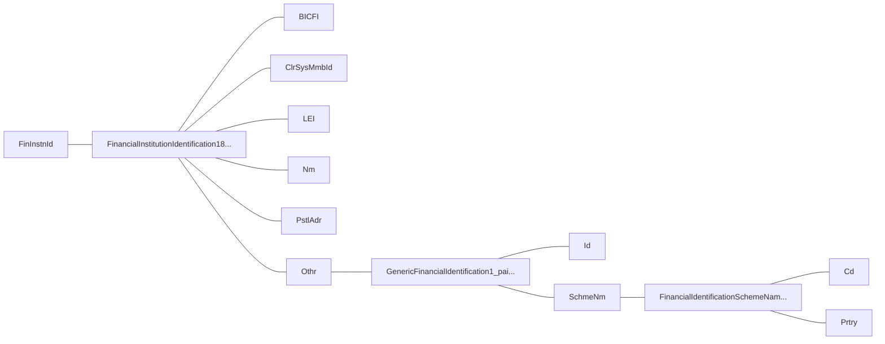

Abbildung 7: Datenelemente zur Identifikation von Finanzinstituten (generisch)

Die Adressierung des Creditor Agent muss zwingend über mindestens eine der folgenden Optionen erfolgen. Je nach Zahlungsart sind nur bestimmt Optionen erlaubt.

- Option 1: Bei Verwendung einer IBAN (CH/LI) für Zahlungsart «D» und generell für Zahlungsart «S» kann die Angabe des Creditor Agent entfallen.
- Option 2: Schweizer/Liechtensteiner Instituts-Identifikation (IID) im Element *.../FinInstnId/ClrSysMmbId* (Zahlungsarten «D» und «X» V1)
- Option 3: BIC im Element *.../FinInstnId/BICFI* (für Zahlungsart «X» empfohlen)
- Option 4: Proprietäre Instituts-Identifikation im Element *.../FinInstnId/ClrSysMmbId* zusammen mit Volladresse (Zahlungsart «X»; bei «X» V1 ist die Schweizer IID nach Option 2 erforderlich)
- Option 5: Nur Volladresse (Name und Adresse in den Elementen *.../FinInstnId/Nm* und *.../FinInstnId/PstlAdr* (Zahlungsart «X»))

Einschränkungen:

* Werden sowohl IBAN/QR-IBAN als auch IID oder BIC geliefert, wird der Creditor Agent bei der Ausführung der Zahlung aus der IBAN ermittelt.
* Die Subelemente *.../FinInstnId/BICFI* und *.../FinInstnId/ClrSysMmbId* dürfen nicht gleichzeitig verwendet werden.
* «Postal Address» ist nur in Kombination mit «Name» zulässig.

Version 2.2 – 24.02.2025
Seite 27 von 91

SIX
Customer Credit Transfer Initiation
Fachliche Spezifikationen

Die Identifikation im «pain.001» erfolgt gemäss den erwähnten Vorgaben mit folgenden Datenelementen:

<table>
  <thead>
    <tr>
        <th colspan="3">**ISO-20022-Standard**</th>
        <th colspan="2">**Swiss Payment Standards**</th>
    </tr>
    <tr>
        <th>**Message Item**</th>
        <th>**XML Tag**</th>
        <th>**Mult**</th>
        <th>**Generelle Definition**</th>
        <th>**Bemerkung**</th>
    </tr>
  </thead>
  <tbody>
    <tr>
        <td>Financial Institution Identification</td>
        <td>FinInstnId</td>
        <td>1..1</td>
        <td>Identifikation des Finanzinstituts</td>
        <td></td>
    </tr>
    <tr>
        <td>Financial Institution Identification<br/>+BICFI</td>
        <td>BICFI</td>
        <td>0..1</td>
        <td>BIC des Finanzinstituts gem. ISO 9362</td>
        <td></td>
    </tr>
    <tr>
        <td>Financial Institution Identification<br/>+Clearing System Member Identification</td>
        <td>ClrSysMmbId</td>
        <td>0..1</td>
        <td>Identifikation des Clearing Systems</td>
        <td></td>
    </tr>
    <tr>
        <td>Financial Institution Identification<br/>+Clearing System Member Identification<br/>++Clearing System Identification</td>
        <td>ClrSysId</td>
        <td>0..1</td>
        <td>Clearing System Identifikator</td>
        <td></td>
    </tr>
    <tr>
        <td>Financial Institution Identification<br/>+Clearing System Member Identification<br/>++Clearing System Identification<br/>+++Code</td>
        <td>Cd</td>
        <td>1..1</td>
        <td>Code</td>
        <td></td>
    </tr>
    <tr>
        <td>Financial Institution Identification<br/>+Clearing System Member Identification<br/>++Clearing System Identification<br/>+++Proprietary</td>
        <td>Prtry</td>
        <td>1..1</td>
        <td>Proprietär</td>
        <td></td>
    </tr>
    <tr>
        <td>Financial Institution Identification<br/>+Clearing System Member Identification<br/>++Member Identification</td>
        <td>MmbId</td>
        <td>1..1</td>
        <td>Clearingsystem Teilnehmer Identifikator (z. B. IID, BLZ)</td>
        <td></td>
    </tr>
    <tr>
        <td>Financial Institution Identification<br/>+LEI</td>
        <td>LEI</td>
        <td>0..1</td>
        <td>Legal Entity Identifier</td>
        <td></td>
    </tr>
    <tr>
        <td>Financial Institution Identification<br/>+Name</td>
        <td>Nm</td>
        <td>0..1</td>
        <td>Name des Finanzinstituts</td>
        <td></td>
    </tr>
    <tr>
        <td>Financial Institution Identification<br/>+Postal Address</td>
        <td>PstlAdr</td>
        <td>0..1</td>
        <td>Postadresse</td>
        <td>Generelle Beschreibung der Subelemente siehe Kapitel 3.11 «Verwendung von Adressinformationen»</td>
    </tr>
    <tr>
        <td>Financial Institution Identification<br/>+Other</td>
        <td>Othr</td>
        <td>0..1</td>
        <td>Sonstige Identifikation des Finanzinstituts</td>
        <td></td>
    </tr>
    <tr>
        <td>Financial Institution Identification<br/>+Other<br/>++Identification</td>
        <td>Id</td>
        <td>1..1</td>
        <td>Identifikator</td>
        <td></td>
    </tr>
    <tr>
        <td>Financial Institution Identification<br/>+Other<br/>++Scheme Name</td>
        <td>SchmeNm</td>
        <td>0..1</td>
        <td>Bezeichnung des Identifikationsschemas</td>
        <td></td>
    </tr>
    <tr>
        <td>Financial Institution Identification<br/>+Other<br/>++Scheme Name<br/>+++Code</td>
        <td>Cd</td>
        <td>1..1</td>
        <td></td>
        <td></td>
    </tr>
    <tr>
        <td>Financial Institution Identification<br/>+Other<br/>++Scheme Name<br/>+++Proprietary</td>
        <td>Prtry</td>
        <td>1..1</td>
        <td colspan="2"></td>
    </tr>
  </tbody>
</table>

*Tabelle 10: Identifikation von Finanzinstituten nach Zahlungsarten*

Version 2.2 – 24.02.2025
Seite 28 von 91

SIX
Customer Credit Transfer Initiation
Fachliche Spezifikationen

## Zahlungsarten

<table>
  <thead>
    <tr>
        <th>Zahlungsart</th>
        <th>D</th>
        <th>S</th>
        <th>X</th>
        <th>C</th>
    </tr>
  </thead>
  <tbody>
    <tr>
        <td>Titel</td>
        <td>Inland</td>
        <td>SEPA</td>
        <td>Ausland und<br/>Fremdwährung Inland</td>
        <td>Bankcheck/<br/>Postcash<br/>In- und Ausland</td>
    </tr>
    <tr>
        <td>Bemerkung</td>
        <td>V1: Zahlung<br/><br/>V2: Instant-Zahlung</td>
        <td></td>
        <td>V1: Fremdwährung<br/>(FW) Inland<br/>V2: Ausland</td>
        <td></td>
    </tr>
    <tr>
        <td>Payment Method</td>
        <td>TRF</td>
        <td>TRF</td>
        <td>TRF</td>
        <td>CHK</td>
    </tr>
    <tr>
        <td>Service Level</td>
        <td>Darf nicht SEPA<br/>sein</td>
        <td>SEPA</td>
        <td>Darf nicht SEPA sein</td>
        <td>Darf nicht SEPA<br/>sein</td>
    </tr>
    <tr>
        <td>Local Instrument</td>
        <td>V2: INST/ITP</td>
        <td></td>
        <td></td>
        <td></td>
    </tr>
    <tr>
        <td>Creditor Account</td>
        <td>V1: IBAN (QR-IBAN)<br/>oder Konto<br/>V2: IBAN (QR-IBAN)</td>
        <td>IBAN</td>
        <td>IBAN oder Konto</td>
        <td>Darf nicht<br/>geliefert werden</td>
    </tr>
    <tr>
        <td>Creditor Agent</td>
        <td>Finanzinstitut<br/>Inland (CH/LI oder<br/>mit SIC Anschluss):<br/>verpflichtende<br/>Angaben, wenn die<br/>Kontonummer<br/>anstelle der IBAN*<br/>verwendet wird:<br/>a. IID<br/>oder<br/>b. BICFI</td>
        <td>BICFI<br/>(optional)</td>
        <td>V1: Finanzinstitut<br/>Inland (CH/LI): wenn<br/>IBAN*, dann Agent<br/>optional<br/><br/>a. BICFI (CH)<br/><br/>b. IID (optional: Name<br/>und Adresse FI)<br/>c. Name und Adresse<br/>FI<br/><br/>V2: Finanzinstitut<br/>Ausland<br/>a. BICFI International<br/>b. Bankcode* und<br/>Name und Adresse FI<br/>c. Name und Adresse<br/>FI</td>
        <td>Darf nicht<br/>geliefert werden</td>
    </tr>
    <tr>
        <td>Currency</td>
        <td>V1: CHF/EUR<br/><br/>V2: CHF</td>
        <td>EUR</td>
        <td>V1: alle ausser<br/>CHF/EUR<br/>V2: alle</td>
        <td>alle</td>
    </tr>
  </tbody>
</table>

*Tabelle 11: SPS-Zahlungsarten*

\* Optional bei Verwendung einer IBAN/QR-IBAN, da der Creditor Agent dann aus IBAN/QR-IBAN ermittelt wird

Version 2.2 – 24.02.2025
Seite 29 von 91

SIX
Customer Credit Transfer Initiation
Fachliche Spezifikationen

## 3.13 Identifikation der sonstigen Parteien (Parties)

Folgende Elemente zur Identifikation der sonstigen Parteien (Debtor, Creditor, Ultimate Debtor, Ultimate Creditor, Account Owner, etc.) können im «pain.001» grundsätzlich eingesetzt werden:

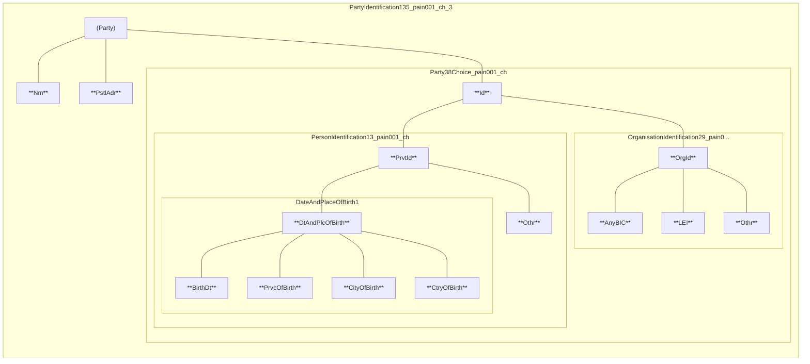

*Abbildung 8: Datenelemente zur Identifikation sonstiger Parteien (generisch)*

### Debtor/Creditor, Ultimate Debtor / Ultimate Creditor

Die Beschreibung besteht aus den folgenden Elementen:

- Name im Element *…/Nm* **(zwingend)**
- dem Subelement *…/PstlAdr* wobei die Angabe des Ortes im Element */TwnNm* und des Domizilandes im Element */Ctry* bei Verwendung der strukturierten Adresse zwingend ist.
- Zusätzliche Angaben in nachfolgenden Subelementen:
    a) *…/Id/OrgId/AnyBIC* (Business Identification Code)
    b) *…/Id/OrgId/LEI* (Legal Entity Identification)
    c) *…/Id/OrgId/Othr* (Organisation Identification / Other)
    d) *…/Id/PrvtId* (Private Identification)

Die Weitergabe der betreffenden Informationen richten sich nach den Regeln des jeweiligen Netzwerkes oder Schemes und ist in Kapitel 4 beschrieben.

Version 2.2 – 24.02.2025
Seite 30 von 91

SIX
Customer Credit Transfer Initiation
Fachliche Spezifikationen

<table>
  <thead>
    <tr>
        <th colspan="2">ISO-20022-Standard</th>
        <th colspan="3">Swiss Payment Standards</th>
    </tr>
    <tr>
        <th>Message Item</th>
        <th>XML Tag</th>
        <th>Mult</th>
        <th>Generelle Definition</th>
        <th>Bemerkung</th>
    </tr>
  </thead>
  <tbody>
    <tr>
        <td>Name</td>
        <td>Nm</td>
        <td>0..1</td>
        <td>Name</td>
        <td></td>
    </tr>
    <tr>
        <td>Postal Address</td>
        <td>PstlAdr</td>
        <td>0..1</td>
        <td>Adresse</td>
        <td>Generelle Beschreibung der<br/>Subelemente siehe Kapitel<br/>3.11 «Verwendung von<br/>Adressinformationen»</td>
    </tr>
    <tr>
        <td>Identification</td>
        <td>Id</td>
        <td>0..1</td>
        <td>Identifikation</td>
        <td></td>
    </tr>
    <tr>
        <td>Identification<br/>+Organisation Identification</td>
        <td>{Or OrgId</td>
        <td>1..1</td>
        <td>Identifikation einer<br/>juristischen Person</td>
        <td></td>
    </tr>
    <tr>
        <td>Identification<br/>+Organisation Identification<br/>++Any BIC</td>
        <td>AnyBIC</td>
        <td>0..1</td>
        <td>BIC gem. ISO 9362</td>
        <td></td>
    </tr>
    <tr>
        <td>Identification<br/>+Organisation Identification<br/>++LEI</td>
        <td>LEI</td>
        <td>0..1</td>
        <td>Legal Entity Identifier</td>
        <td></td>
    </tr>
    <tr>
        <td>Identification<br/>+Organisation Identification<br/>++Other</td>
        <td>Othr</td>
        <td>0..n</td>
        <td>Sonstiger Identifikator<br/>der juristischen Person</td>
        <td></td>
    </tr>
    <tr>
        <td>Identification<br/>+Organisation Identification<br/>++Other<br/>+++Identification</td>
        <td>Id</td>
        <td>1..1</td>
        <td>Identifikator</td>
        <td></td>
    </tr>
    <tr>
        <td>Identification<br/>+Organisation Identification<br/>++Other<br/>+++Scheme Name</td>
        <td>SchmeNm</td>
        <td>0..1</td>
        <td>Bezeichnung des<br/>Identifikationsschemas</td>
        <td></td>
    </tr>
    <tr>
        <td>Identification<br/>+Organisation Identification<br/>++Other<br/>+++Scheme Name<br/>++++Code</td>
        <td>{Or Cd</td>
        <td>1..1</td>
        <td>Identifikations-Code</td>
        <td></td>
    </tr>
    <tr>
        <td>Identification<br/>+Organisation Identification<br/>++Other<br/>+++Scheme Name<br/>++++Proprietary</td>
        <td>Or} Prtry</td>
        <td>1..1</td>
        <td>Proprietäre<br/>Identifikation</td>
        <td></td>
    </tr>
    <tr>
        <td>Identification<br/>+Organisation Identification<br/>++Other<br/>+++Issuer</td>
        <td>Issr</td>
        <td>0..1</td>
        <td>Herausgeber der<br/>Identifikation</td>
        <td></td>
    </tr>
    <tr>
        <td>Identification<br/>+Private Identification</td>
        <td>Or} PrvtId</td>
        <td>1..1</td>
        <td>Identifikation einer<br/>natürlichen Person</td>
        <td></td>
    </tr>
    <tr>
        <td>Identification<br/>+Private Identification<br/>++Date And Place Of Birth</td>
        <td>DtAndPlcOfBirth</td>
        <td>0..1</td>
        <td>Datum und Ort der<br/>Geburt</td>
        <td></td>
    </tr>
    <tr>
        <td>Identification<br/>+Private Identification<br/>++Date And Place Of Birth<br/>+++Birth Date</td>
        <td>BirthDt</td>
        <td>1..1</td>
        <td>Geburtsdatum</td>
        <td></td>
    </tr>
    <tr>
        <td>Identification<br/>+Private Identification<br/>++Date And Place Of Birth<br/>+++Province Of Birth</td>
        <td>PrvcOfBirth</td>
        <td>0..1</td>
        <td>Landesteil (z. B.<br/>Kanton, Provinz,<br/>Bundesland)</td>
        <td></td>
    </tr>
    <tr>
        <td>Identification<br/>+Private Identification<br/>++Date And Place Of Birth<br/>+++City Of Birth</td>
        <td>CityOfBirth</td>
        <td>1..1</td>
        <td>Geburtsort</td>
        <td></td>
    </tr>
  </tbody>
</table>

Version 2.2 – 24.02.2025
Seite 31 von 91

Customer Credit Transfer Initiation
Fachliche Spezifikationen

SIX

<table>
  <thead>
    <tr>
        <th colspan="3">ISO-20022-Standard</th>
        <th colspan="2">Swiss Payment Standards</th>
    </tr>
    <tr>
        <th>Message Item</th>
        <th>XML Tag</th>
        <th>Mult</th>
        <th>Generelle Definition</th>
        <th>Bemerkung</th>
    </tr>
  </thead>
  <tbody>
    <tr>
        <td>Identification<br/>+Private Identification<br/>++Date And Place Of Birth<br/>+++Country Of Birth</td>
        <td>CtryOfBirth</td>
        <td>1..1</td>
        <td>Geburtsland</td>
        <td></td>
    </tr>
    <tr>
        <td>Identification<br/>+Private Identification<br/>++Other</td>
        <td>Othr</td>
        <td>0..n</td>
        <td>Sonstiger Identifikator<br/>der natürlichen Person</td>
        <td></td>
    </tr>
    <tr>
        <td>Identification<br/>+Private Identification<br/>++Other<br/>+++Identification</td>
        <td>Id</td>
        <td>1..1</td>
        <td>Identifikator</td>
        <td></td>
    </tr>
    <tr>
        <td>Identification<br/>+Private Identification<br/>++Other<br/>+++Scheme Name</td>
        <td>SchmeNm</td>
        <td>0..1</td>
        <td>Bezeichnung des<br/>Identifikationsschemas</td>
        <td></td>
    </tr>
    <tr>
        <td>Identification<br/>+Private Identification<br/>++Other<br/>+++Scheme Name<br/>++++Code</td>
        <td>Cd<br/>{Or</td>
        <td>1..1</td>
        <td>Identifikations-Code</td>
        <td></td>
    </tr>
    <tr>
        <td>Identification<br/>+Private Identification<br/>++Other<br/>+++Scheme Name<br/>++++Proprietary</td>
        <td>Prtry<br/>Or}</td>
        <td>1..1</td>
        <td>Proprietäre<br/>Identifikation</td>
        <td></td>
    </tr>
    <tr>
        <td>Identification<br/>+Private Identification<br/>++Other<br/>+++Issuer</td>
        <td>Issr</td>
        <td>0..1</td>
        <td>Herausgeber der<br/>Identifikation</td>
        <td></td>
    </tr>
    <tr>
        <td>Country Of Residence</td>
        <td>CtryOfRes</td>
        <td>0..1</td>
        <td></td>
        <td></td>
    </tr>
    <tr>
        <td>Contact Details</td>
        <td>CtctDtls</td>
        <td>0..1</td>
        <td colspan="2"></td>
    </tr>
  </tbody>
</table>

*Tabelle 12: Datenelemente zur Identifikation sonstiger Parteien (generisch)*

Version 2.2 – 24.02.2025
Seite 32 von 91

SIX
Customer Credit Transfer Initiation | Fachliche Spezifikationen

# 3.14 Referenzen

Bei jeder Überweisung sorgen verschiedene Referenzen beziehungsweise Identifikationen dafür, dass der Geschäftsfall in jedem Fall auf allen Stufen eindeutig identifiziert werden kann.

Es wird unterschieden zwischen durchgängigen Referenzen, die auf dem gesamten Übertragungsweg vom Zahlungspflichtigen bis zum Zahlungsempfänger Gültigkeit haben und Punkt-zu-Punkt-Referenzen, die nur zwischen den einzelnen «Agents» (Finanzinstituten) verwendet werden (Transaktionsreferenz und «Instruction Identification»).

```mermaid
flowchart TD
    subgraph References [ ]
        direction TB
        R3[3 Remittance Information]
        R4[4 End To End Identification]
        R1[1 Payment Information Identification]
    end

    subgraph Flow [ ]
        direction LR
        ZP[Debtor<br/>(ZP)] -- "pain.001" --> ZPFI[Debtor Bank<br/>(ZP-FI)]
        ZPFI -- "pacs.008" --> ACH[ACH]
        ACH -- "pacs.008" --> ZEFI[Creditor Bank<br/>(ZE-FI)]
        ZEFI -- "Buchungs-<br/>avisierung" --> ZE[Creditor<br/>(ZE)]
    end

    subgraph LowerRefs [ ]
        direction TB
        R2[2 Instruction Identification]
        R5[5 UETR]
    end

    %% Connections for 3 and 4
    ZP -.-> R3 -.-> ZE
    ZP -.-> R4 -.-> ZE

    %% Connection for 1
    ZP -.-> R1 -.-> ZPFI

    %% Connection for 2
    ZPFI -.-> R2 -.-> ZEFI

    %% Connection for 5
    ZP -. "Option 1" .-> R5
    ZPFI -. "Option 2" .-> R5
    R5 -.-> ZE

    style References fill:none,stroke:none
    style Flow fill:none,stroke:none
    style LowerRefs fill:none,stroke:none
```

*Abbildung 9: Referenzen*

### 3.14.1 Referenzen in der Verarbeitungskette

**«Payment Information Identification» ①**

Diese Referenz wird durch die Software des Zahlungspflichtigen vergeben und im «pain.001» (im B-Level) mitgegeben. Sie dient zur Referenzierung einer Zahlungsgruppe (Gruppe von einzelnen Transaktionen mit identischem Belastungskonto, gewünschtem Ausführungsdatum usw.).

**«Instruction Identification» ②**

Diese Referenz ist eindeutig innerhalb der sendenden und empfangenden Partei (Laufnummer). Sie wird durch jede Partei in der Verarbeitungskette neu vergeben (im «pain.001» auf Stufe C-Level).

### 3.14.2 Kundenreferenzen

Zusätzlich zu den oben aufgeführten Referenzen in der Verarbeitungskette kann eine Kundenreferenz (Creditor-Referenz) in der «Remittance Information» in strukturierter oder unstrukturierter Form mitgegeben werden.

**Strukturierte Kundenreferenz als «Remittance Information» ③**

Folgende Arten von strukturierten Referenzen können im Element «CdtrRefInf/Ref» geliefert werden:

Version 2.2 – 24.02.2025 | Seite 33 von 91

SIX
Customer Credit Transfer Initiation Fachliche Spezifikationen

**Verwendung der Schweizer QR-Referenz**

In der Schweiz ermöglicht die QR-Referenz dem Zahlungsempfänger den automatischen Abgleich zwischen seinen Rechnungen und den eingehenden Zahlungen. Die QR-Referenz entspricht von der Form her der früheren ESR-Referenz: 26 Stellen numerisch (vom Kunden frei zu vergeben) plus Prüfziffer. Die QR-Referenz darf nur und muss in Zusammenhang mit einer QR-IBAN im Element «Creditor Account/IBAN» verwendet werden.

**Verwendung der ISO-Creditor-Referenz**

Die ISO-Creditor-Referenz (ISO 11649) ermöglicht dem Zahlungsempfänger den automatischen Abgleich zwischen seinen Rechnungen und den eingehenden Zahlungen.

Diese Referenz darf nicht verändert werden. Sie muss auf Position 1-2 den Wert «RF» und auf Position 3-4 eine korrekte Prüfziffer enthalten und kann bis maximal 25 Zeichen umfassen.

Anmerkung: Für die Zahlungsart «D» (Inland, Zahlung in CHF und EUR) muss bei Verwendung des Referenz-Typ-Codes «SCOR» die ISO-Creditor-Referenz gemäss ISO 11649 geliefert werden.

**Verwendung der IPI-Referenz**

Die IPI-Referenz ist eine weitere in SPS unterstützte strukturierte Referenzart, die analog zur ISO-Creditor-Referenz verwendet werden kann.

**Unstrukturierte Kundenreferenz als «Remittance Information» <mark>3</mark>**

An Stelle der strukturierten Referenz kann auch eine Kundenreferenz in unstrukturierter Form mitgegeben werden, Länge maximal 140 Zeichen.

**«End To End Identification» <mark>4</mark>**

Die «End To End Identification» dient der eindeutigen Kennzeichnung einer Transaktion und wird durch den Zahlungspflichtigen vergeben. Im Gegensatz zur «Instruction Identification» wird die «End To End Identification» (z. B. die Auftragsnummer) über die gesamte Verarbeitungskette unverändert weitergereicht.

**«UETR» <mark>5</mark>**

Die «UETR» ist eine global eindeutige Referenz, die entweder durch die Software des Zahlungspflichtigen vergeben und im «pain.001» mitgegeben wird (Option 1) oder durch das Finanzinstitut des Zahlungspflichtigen für die Weiterleitung der Zahlung im Interbankverkehr erstellt wird (Option 2). Im Fall von Option 1 wird die vom Zahlungspflichtigen vergebene UETR unverändert in die Interbankmeldung übernommen, wenn das Finanzinstitut diesen Service anbietet.

## 3.15 Zahlungsarten

Basis für die Definition der nachfolgenden Zahlungsarten bildet die Definition der Geschäftsfälle gemäss *Schweizer Business Rules* [6]. Die Definition deckt alle heutigen Möglichkeiten von Zahlungsarten in der Schweiz ab (national, grenzüberschreitend, SEPA usw.).

Pro Transaktion eines «pain.001» wird in einem ersten Schritt geprüft, welcher Zahlungsart dieser Geschäftsfall entspricht (siehe *Schweizer Business Rules* [6]). Um die jeweilige Zahlungsart zu identifizieren, werden einzelne Schlüsselelemente analysiert.

Ist die Zahlungsart identifiziert, erfolgt eine Validierung der Daten gegen die Vorgaben zu dieser Zahlungsart gemäss den *Schweizer Implementation Guidelines* (dieses Dokument).

Version 2.2 – 24.02.2025 Seite 34 von 91

SIX
Customer Credit Transfer Initiation
Fachliche Spezifikationen

**Schritt 1: Zuordnung der Transaktion zu einer Zahlungsart (bzw. «Identifikation der Zahlungsart»)**

Die Zuordnung zu Zahlungsarten kann allein aufgrund der nachfolgend schwarz gekennzeichneten Angaben erfolgen. <mark>Blau gekennzeichnete Ausprägungen müssen für die reine Zuordnung zur Zahlungsart nicht geprüft werden.</mark> Siehe auch Tabellen im Kapitel 2 «Geschäftsfälle» der *Schweizer Business Rules* [6]).

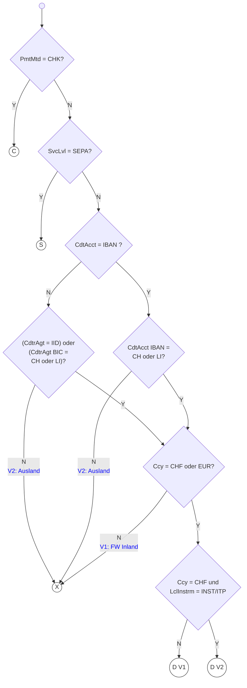

Abbildung 10: Bestimmung der Zahlungsart

Version 2.2 – 24.02.2025
Seite 35 von 91

Customer Credit Transfer Initiation
Fachliche Spezifikationen

## Schritt 2: Validierung der Transaktion gemäss Zahlungsart

Ist die Zahlungsart identifiziert, werden alle weiteren Elemente gemäss *Schweizer Implementation Guidelines* (dieses Dokument) validiert. Je nach Umfang der implementierten Logik kann eine Unstimmigkeit mit den Definitionen in diesem Dokument zur Rückweisung der Transaktion führen oder auch in bestimmten Fällen bei einzelnen Instituten zum Ignorieren von vorhandenen, nicht vorgesehenen Elementen und zur Weiterverarbeitung der Transaktion.

<table>
  <thead>
    <tr>
        <th>Zahlungsart</th>
        <th>D</th>
        <th>S</th>
        <th>X</th>
        <th>C</th>
    </tr>
  </thead>
  <tbody>
    <tr>
        <td>Titel</td>
        <td>Inland</td>
        <td>SEPA</td>
        <td>Ausland und<br/>Fremdwährung Inland</td>
        <td>Bankcheck/<br/>Postcash<br/>In- und Ausland</td>
    </tr>
    <tr>
        <td>Bemerkung</td>
        <td>V1: Zahlung<br/><br/>V2: Instant-Zahlung</td>
        <td></td>
        <td>V1: Fremdwährung<br/>(FW) Inland<br/>V2: Ausland</td>
        <td></td>
    </tr>
    <tr>
        <td>Payment Method</td>
        <td>TRF</td>
        <td>TRF</td>
        <td>TRF</td>
        <td>CHK</td>
    </tr>
    <tr>
        <td>Service Level</td>
        <td>Darf nicht SEPA<br/>sein</td>
        <td>SEPA</td>
        <td>Darf nicht SEPA sein</td>
        <td>Darf nicht SEPA<br/>sein</td>
    </tr>
    <tr>
        <td>Local Instrument</td>
        <td>V2: INST/ITP</td>
        <td></td>
        <td></td>
        <td></td>
    </tr>
    <tr>
        <td>Creditor Account</td>
        <td>V1: IBAN (QR-IBAN)<br/>oder Konto<br/>V2: IBAN (QR-IBAN)</td>
        <td>IBAN</td>
        <td>IBAN oder Konto</td>
        <td>Darf nicht<br/>geliefert werden</td>
    </tr>
    <tr>
        <td>Creditor Agent</td>
        <td>Finanzinstitut<br/>Inland (CH/LI oder<br/>mit SIC Anschluss):<br/>verpflichtende<br/>Angaben, wenn die<br/>Kontonummer<br/>anstelle der IBAN*<br/>verwendet wird:<br/>a. IID<br/>oder<br/>b. BICFI</td>
        <td>BICFI<br/>(optional)</td>
        <td>V1: Finanzinstitut<br/>Inland (CH/LI): wenn<br/>IBAN*, dann Agent<br/>optional<br/><br/>a. BICFI (CH)<br/><br/>b. IID (optional: Name<br/>und Adresse FI)<br/>c. Name und Adresse<br/>FI<br/><br/>V2: Finanzinstitut<br/>Ausland<br/>a. BICFI International<br/>b. Bankcode* und<br/>Name und Adresse FI<br/>c. Name und Adresse<br/>FI</td>
        <td>Darf nicht<br/>geliefert werden</td>
    </tr>
    <tr>
        <td>Currency</td>
        <td>V1: CHF/EUR<br/><br/>V2: CHF</td>
        <td>EUR</td>
        <td>V1: alle ausser<br/>CHF/EUR<br/>V2: alle</td>
        <td>alle</td>
    </tr>
  </tbody>
</table>
Tabelle 13: SPS-Zahlungsarten

\* *Optional bei Verwendung einer IBAN/QR-IBAN, da der Creditor Agent dann aus IBAN/QR-IBAN ermittelt wird*

Version 2.2 – 24.02.2025
Seite 36 von 91

SIX
Customer Credit Transfer Initiation Fachliche Spezifikationen

## 3.16 QR-Rechnung

Eine Rechnung kann als «QR-Rechnung» bezeichnet werden, wenn sie einen Zahlteil mit Swiss QR-Code enthält.

*Siehe Schweizer Implementation Guidelines QR-Rechnung [7].*

Der Swiss QR-Code enthält die erforderlichen Daten für die Auslösung einer Zahlung mittels ISO 20022 «pain.001», Zahlungsart **«D»**. Das Mapping der Daten des Swiss QR-Codes in einen «pain.001» wird im *Anhang B: Mapping Swiss QR-Code im Zahlteil der QR-Rechnung in «pain.001»* beschrieben.

Die QR-IBAN ist eine Kontonummer, die bei Zahlungen mit QR-Referenz als Angabe des Gutschriftskontos verwendet werden muss. Der formelle Aufbau dieser IBAN entspricht den Regeln gemäss ISO 13616.

Die QR-Referenz ist eine strukturierte Referenz des Rechnungsstellers im Zahlteil der QR-Rechnung.

Neben der QR-Referenz kann der Zahlteil der QR-Rechnung auch eine ISO-Referenz (gemäss ISO 11649) als «strukturierte Referenz» enthalten.

## 3.17 Instant-Zahlungen in der Schweiz und Liechtenstein

Instant-Zahlungen – Zahlungsart **«D»** V2 – in der Schweiz können nur in CHF und zu Gunsten einer IBAN ausgeführt werden. Die Finanzinstitute können im Rahmen ihres Kundenangebotes Aufträge für Instant-Zahlungen mit «pain.001» entgegennehmen. Weitere Einschränkungen im Datenhaushalt sind im Kapitel 4 beschrieben.

Die Kennzeichnung erfolgt mit dem Element «Local Instrument» mit dem Code «INST». Kann ein Auftrag nicht als Instant-Zahlung ausgeführt werden, wird der Auftrag zurückgewiesen und mit einem entsprechende Status Report (pain.002) quittiert.

Die Finanzinstitute können zusätzlich die Option anbieten, dass ein als Instant-Zahlung abgelehnter Auftrag als normale Zahlung ausgeführt wird. Die Kennzeichnung erfolgt ebenfalls im Element «Local Instrument» mit dem Code «ITP». Das Finanzinstitut kann dies mit einem Status Report (pain.002) und dem Code «ACWC» avisieren.

## 3.18 Weiterleitung und Trunkierung von Datenelementen

Bei der Weiterleitung von SEPA-Zahlungen (Zahlungsart **«S»**) kann die Möglichkeit der Weitergabe der mit SPS «pain.001» eingelieferten Daten bei einigen Datenelementen limitiert sein bzw. nicht unterstützt werden.

Dies betrifft zum Beispiel das Datenelement «UETR», welches nicht an SEPA (Zahlungsart **«S»**) weitergeleitet werden kann, oder «Name» und Adressdaten (`<PstlAdr>`), welche Längenbeschränkungen unterliegen können.

Version 2.2 – 24.02.2025 Seite 37 von 91

SIX
Customer Credit Transfer Initiation
Technische Spezifikationen

# 4 Technische Spezifikationen

## 4.1 Group Header (GrpHdr, A-Level)

Der «Group Header» (A-Level der Meldung) enthält alle Elemente, die für sämtliche Transaktionen in der XML-Meldung «Customer Credit Transfer Initiation» (pain.001) gelten. Er kommt in der Meldung genau einmal vor.

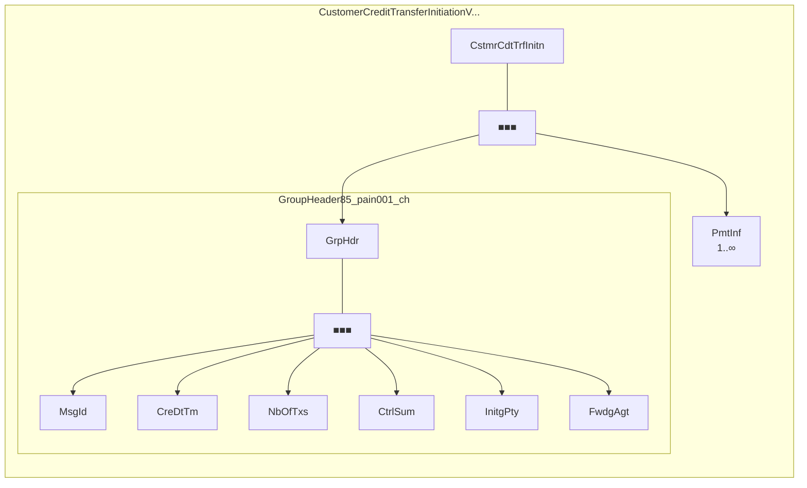

Abbildung 11: Group Header (GrpHdr)

Die nachstehende Tabelle spezifiziert alle für die *Swiss Payment Standards* relevanten Elemente des «Group Header».

Version 2.2 – 24.02.2025
Seite 38 von 91

SIX
Customer Credit Transfer Initiation
Technische Spezifikationen

<table>
  <thead>
    <tr>
        <th colspan="3">ISO-20022-Standard</th>
        <th colspan="2">Swiss Payment Standards</th>
        <th>Zahlungsartspezifische Definition</th>
        <th>Fehler</th>
    </tr>
    <tr>
        <th>Message Item</th>
        <th>XML Tag</th>
        <th>Mult</th>
        <th>St.</th>
        <th>Generelle Definition</th>
        <th></th>
        <th></th>
    </tr>
  </thead>
  <tbody>
    <tr>
        <td>Document<br/>+Customer Credit Transfer Initiation V09</td>
        <td>CstmrCdtTrfInitn</td>
        <td>1..1</td>
        <td>M</td>
        <td></td>
        <td></td>
        <td></td>
    </tr>
    <tr>
        <td>Group Header</td>
        <td>GrpHdr</td>
        <td>1..1</td>
        <td>M</td>
        <td></td>
        <td></td>
        <td></td>
    </tr>
    <tr>
        <td>Group Header<br/>+Message Identification</td>
        <td>MsgId</td>
        <td>1..1</td>
        <td>M</td>
        <td>Die Duplikatsprüfung erfolgt bei den Schweizer Finanzinstituten in der Regel auf Ebene Dokument (Message). Aus diesem Grund muss das Element «Message Identification» &amp;lt;MsgId&amp;gt; eindeutig belegt werden. Die Eindeutigkeit wird hierbei von den meisten Finanzinstituten auf einen Zeitraum von mindestens 90 Tagen geprüft. Es wird empfohlen, die «Message Identification» generell so lange wie möglich eindeutig zu halten.<br/>Für dieses Element ist nur der Zeichensatz für Referenzelemente zugelassen (siehe Kapitel 3.2).</td>
        <td></td>
        <td>DU01,<br/>CH16</td>
    </tr>
    <tr>
        <td>Group Header<br/>+Creation Date Time</td>
        <td>CreDtTm</td>
        <td>1..1</td>
        <td>M</td>
        <td>Empfehlung: Soll dem effektiven Erstellungsdatum/-zeitpunkt entsprechen.</td>
        <td></td>
        <td>DT01</td>
    </tr>
    <tr>
        <td>Group Header<br/>+Number Of Transactions</td>
        <td>NbOfTxs</td>
        <td>1..1</td>
        <td>M</td>
        <td>Falls fehlerhaft, wird die gesamte Meldung abgewiesen.<br/>Meldungen, welche die Grösse von 99'999 Zahlungen (C-Level) überschreiten, werden von den Finanzinstituten abgewiesen.<br/>Je nach Finanzinstitut kann die Grösse der einzuliefernden Meldung kleiner sein.</td>
        <td></td>
        <td>AM18</td>
    </tr>
    <tr>
        <td>Group Header<br/>+Control Sum</td>
        <td>CtrlSum</td>
        <td>0..1</td>
        <td>R</td>
        <td>Empfehlung: Verwenden.<br/>Wert identisch mit Summe aller Elemente «Amount» («Instructed Amount» oder «Equivalent Amount»)<br/>Falls fehlerhaft, wird die gesamte Meldung abgewiesen.</td>
        <td></td>
        <td>AM10</td>
    </tr>
    <tr>
        <td>Group Header<br/>+Initiating Party</td>
        <td>InitgPty</td>
        <td>1..1</td>
        <td>M</td>
        <td>Mindestens eines der Elemente «Name» oder «Identification» muss geliefert werden.<br/>Beschreibt die absendende Partei. Dies kann der Debtor oder eine andere, beauftragte Partei sein, die als Absender der Meldung handelt.</td>
        <td></td>
        <td>CH21</td>
    </tr>
    <tr>
        <td>Group Header<br/>+Initiating Party<br/>++Name</td>
        <td>Nm</td>
        <td>0..1</td>
        <td>R</td>
        <td>Empfehlung: Verwenden.<br/>Bezeichnung oder Name, unter dem die absendende Partei des Absenders der Meldung bekannt ist oder üblicherweise zu deren Identifikation verwendet.</td>
        <td>S: max. 70 Zeichen</td>
        <td>CH16</td>
    </tr>
    <tr>
        <td>Group Header<br/>+Initiating Party<br/>++Identification</td>
        <td>Id</td>
        <td>0..1</td>
        <td>R</td>
        <td>Empfehlung: Verwenden.<br/>Identifikation des Absenders der Meldung.</td>
        <td></td>
        <td>CH17</td>
    </tr>
  </tbody>
</table>

Version 2.2 – 24.02.2025
pain.001: A-Level (GrpHdr)
Seite 39 von 91

SIX
Customer Credit Transfer Initiation
Technische Spezifikationen

<table>
  <thead>
    <tr>
        <th colspan="3">ISO-20022-Standard</th>
        <th colspan="4">Swiss Payment Standards</th>
    </tr>
    <tr>
        <th>Message Item</th>
        <th>XML Tag</th>
        <th>Mult</th>
        <th>St.</th>
        <th>Generelle Definition</th>
        <th>Zahlungsartspezifische Definition</th>
        <th>Fehler</th>
    </tr>
  </thead>
  <tbody>
    <tr>
        <td>Group Header<br/>+Initiating Party<br/>++Identification<br/>+++Organisation Identification</td>
        <td>OrgId</td>
        <td>1..1<br/>{Or</td>
        <td>D</td>
        <td>Nur &lt;AnyBIC&gt; oder eine Instanz des Elements aus «Other» und optional das Element &lt;LEI&gt; zulässig.</td>
        <td></td>
        <td>CH16,<br/>CH17,<br/>CH21</td>
    </tr>
    <tr>
        <td>Group Header<br/>+Initiating Party<br/>++Identification<br/>+++Organisation Identification<br/>++++Any BIC</td>
        <td>AnyBIC</td>
        <td>0..1</td>
        <td>D</td>
        <td>Wenn verwendet, darf «Other» nicht vorkommen.</td>
        <td></td>
        <td>RC01,<br/>CH16,<br/>CH17</td>
    </tr>
    <tr>
        <td>Group Header<br/>+Initiating Party<br/>++Identification<br/>+++Organisation Identification<br/>++++LEI</td>
        <td>LEI</td>
        <td>0..1</td>
        <td>O</td>
        <td>Die Weiterleitung des Elements kann nicht in allen Fällen gewährleistet werden.<br/>Darf zusätzlich zu &lt;AnyBIC&gt; oder &lt;Othr&gt; geliefert werden</td>
        <td></td>
        <td></td>
    </tr>
    <tr>
        <td>Group Header<br/>+Initiating Party<br/>++Identification<br/>+++Organisation Identification<br/>++++Other</td>
        <td>Othr</td>
        <td>0..n</td>
        <td>D</td>
        <td>Wenn verwendet, darf &lt;AnyBIC&gt; nicht vorkommen.</td>
        <td></td>
        <td>CH17</td>
    </tr>
    <tr>
        <td>Group Header<br/>+Initiating Party<br/>++Identification<br/>+++Private Identification</td>
        <td>PrvtId</td>
        <td>1..1<br/>Or}</td>
        <td>D</td>
        <td>Nur «Date And Place Of Birth» oder eine Instanz des Elements «Other» zulässig.</td>
        <td></td>
        <td>CH16,<br/>CH17</td>
    </tr>
    <tr>
        <td>Group Header<br/>+Initiating Party<br/>++Contact Details</td>
        <td>CtctDtls</td>
        <td>0..1</td>
        <td>R</td>
        <td>Das Subelement &lt;Othr&gt; ist für die Angaben zur verwendeten Software zu verwenden.</td>
        <td></td>
        <td></td>
    </tr>
    <tr>
        <td>Group Header<br/>+Initiating Party<br/>++Contact Details<br/>+++Other</td>
        <td>Othr</td>
        <td>0..n</td>
        <td>R</td>
        <td>Empfehlung: Verwenden.<br/>Enthält Angaben zur Software und Implementation Guide, die für die Erstellung der Meldung verwendet wurden.<br/>Maximal 4 Instanzen sind zugelassen</td>
        <td></td>
        <td>CH21</td>
    </tr>
  </tbody>
</table>

Version 2.2 – 24.02.2025
pain.001: A-Level (GrpHdr)
Seite 40 von 91

SIX
Customer Credit Transfer Initiation
Technische Spezifikationen

<table>
  <thead>
    <tr>
        <th colspan="3">ISO-20022-Standard</th>
        <th colspan="4">Swiss Payment Standards</th>
    </tr>
    <tr>
        <th>Message Item</th>
        <th>XML Tag</th>
        <th>Mult</th>
        <th>St.</th>
        <th>Generelle Definition</th>
        <th>Zahlungsartspezifische Definition</th>
        <th>Fehler</th>
    </tr>
  </thead>
  <tbody>
    <tr>
        <td>Group Header<br/>+Initiating Party<br/>++Contact Details<br/>+++Other<br/>++++Channel Type</td>
        <td>ChanlTp</td>
        <td>1..1</td>
        <td>M</td>
        <td>4-stelliger Code zur Bezeichnung des Informationstyps.<br/>Folgende Codes sind zugelassen:<br/>NAME - Name der Software<br/>PRVD - Name des Software-Herstellers<br/>VRSN - Version der Software<br/>SPSV - Version des SPS IGs</td>
        <td></td>
        <td>CH16</td>
    </tr>
    <tr>
        <td>Group Header<br/>+Initiating Party<br/>++Contact Details<br/>+++Other<br/>++++Identification</td>
        <td>Id</td>
        <td>0..1</td>
        <td>M</td>
        <td>Textuelle Information entsprechend dem Code im Element ChanlTp:<br/><br/>Zum Code NAME ist hier der Name der Software zu liefern<br/>Zum Code PRVD ist hier der Name des Softwareherstellers zu liefern<br/>Zum Code VRSN ist hier die Versionsnummer der Software zu liefern<br/>Zum Code SPSV ist hier die Version des SPS IGs zu liefern</td>
        <td></td>
        <td></td>
    </tr>
    <tr>
        <td>Group Header<br/>+Forwarding Agent</td>
        <td>FwdgAgt</td>
        <td>0..1</td>
        <td>BD</td>
        <td>Das Element wird entsprechend den Regeln des Finanzinstituts verarbeitet.<br/>Generelle Beschreibung der Subelemente siehe Kapitel 3.12 «Identifikation von Finanzinstituten».</td>
        <td colspan="2"></td>
    </tr>
  </tbody>
</table>

Tabelle 14: Group Header (GrpHdr, A-Level)

Version 2.2 – 24.02.2025
pain.001: A-Level (GrpHdr)
Seite 41 von 91

SIX
Customer Credit Transfer Initiation
Technische Spezifikationen

## 4.2 Payment Information (PmtInf, B-Level)

Die «Payment Information» (B-Level der Meldung) beinhaltet die Informationen zum Zahlungspflichtigen sowie weitere Schlüsselelemente wie Zahlungsart (Payment Method) oder das gewünschte Ausführungsdatum (Requested Execution Date), welche für alle Transaktionen (C-Level) dieses B-Levels gelten.

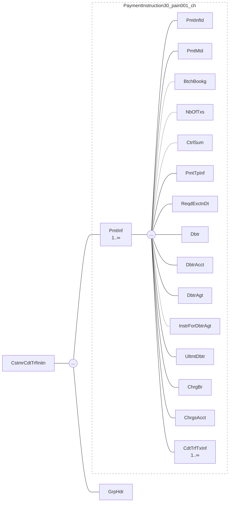

Abbildung 12: Payment Information (PmtInf)

Die nachstehende Tabelle spezifiziert alle für die *Swiss Payment Standards* relevanten Elemente der «Payment Information».

Version 2.2 – 24.02.2025
Seite 42 von 91

Customer Credit Transfer Initiation
Technische Spezifikationen

<table>
  <thead>
    <tr>
        <th colspan="3">ISO-20022-Standard</th>
        <th colspan="4">Swiss Payment Standards</th>
    </tr>
    <tr>
        <th>Message Item</th>
        <th>XML Tag</th>
        <th>Mult</th>
        <th>St.</th>
        <th>Generelle Definition</th>
        <th>Zahlungsartspezifische Definition</th>
        <th>Fehler</th>
    </tr>
  </thead>
  <tbody>
    <tr>
        <td>Payment Information</td>
        <td>PmtInf</td>
        <td>1..n</td>
        <td>M</td>
        <td></td>
        <td></td>
        <td></td>
    </tr>
    <tr>
        <td>Payment Information<br/>+Payment Information Identification</td>
        <td>PmtInfId</td>
        <td>1..1</td>
        <td>M</td>
        <td>Der Wert muss innerhalb der gesamten Meldung eindeutig sein<br/>(wird im Status Report «pain.002» als Referenz verwendet).<br/>Für dieses Element ist nur der Zeichensatz für Referenzelemente<br/>zugelassen (siehe Kapitel 3.2).</td>
        <td></td>
        <td>DU02,<br/>CH16</td>
    </tr>
    <tr>
        <td>Payment Information<br/>+Payment Method</td>
        <td>PmtMtd</td>
        <td>1..1</td>
        <td>M</td>
        <td>Darf nur TRF enthalten</td>
        <td>C: Darf nur CHK enthalten</td>
        <td>CH16</td>
    </tr>
    <tr>
        <td>Payment Information<br/>+Batch Booking</td>
        <td>BtchBookg</td>
        <td>0..1</td>
        <td>O</td>
        <td>Empfohlen wird die Option «true»<br/>«true»: Es erfolgt, soweit möglich, eine Sammelbuchung pro<br/>«Payment Information» (B).<br/>Pro transferierte Währung ist ein eigener B-Level zu erstellen. Die<br/>Identifizierung der Buchung erfolgt über «Payment Information<br/>Identification» (B).<br/>«false»: Es soll eine Buchung pro «Credit Transfer Transaction<br/>Information» (C) erfolgen. Die Identifizierung der Buchungen<br/>erfolgt in der Regel über «Payment Identification» (C). Alternativ<br/>kann das Finanzinstitut die Buchung auch z.B. mit dem Element<br/>«Payment Information Identification» (B) identifizieren.<br/>Die Option «true» in Kombination mit Category Purpose Code (B-<br/>Level) SALA und Anzeigesteuerung CND/NOA führt zu einer<br/>vertraulichen Zahlung.<br/>Wird das Element nicht geliefert, erfolgt die Buchung analog<br/>«true» oder gemäss dem beim Finanzinstitut hinterlegten<br/>Stammdatenwert.</td>
        <td>D: V2: «true» und «leer» darf nur in Absprache<br/>mit dem Finanzinstitut verwendet werden.</td>
        <td></td>
    </tr>
    <tr>
        <td>Payment Information<br/>+Number Of Transactions</td>
        <td>NbOfTxs</td>
        <td>0..1</td>
        <td>O</td>
        <td>Wird in der Regel von den Schweizer Instituten nicht geprüft. Die<br/>Prüfung erfolgt mit dem entsprechenden Element des A-Levels.</td>
        <td></td>
        <td></td>
    </tr>
    <tr>
        <td>Payment Information<br/>+Control Sum</td>
        <td>CtrlSum</td>
        <td>0..1</td>
        <td>O</td>
        <td>Wird in der Regel von den Schweizer Instituten nicht geprüft. Die<br/>Prüfung erfolgt mit dem entsprechenden Element des A-Levels.</td>
        <td></td>
        <td></td>
    </tr>
    <tr>
        <td>Payment Information<br/>+Payment Type Information</td>
        <td>PmtTpInf</td>
        <td>0..1</td>
        <td>O</td>
        <td>Kann auf B-Level oder C-Level verwendet werden, jedoch generell<br/>nicht auf beiden gleichzeitig. Einzelne Institute lassen die<br/>Einlieferung auf beiden Leveln zu, jedoch nicht das gleiche<br/>Subelement auf beiden Leveln.</td>
        <td></td>
        <td>CH07</td>
    </tr>
  </tbody>
</table>

Version 2.2 – 24.02.2025
pain.001: B-Level (PmtInf)
Seite 43 von 91

SIX
Customer Credit Transfer Initiation
Technische Spezifikationen

<table>
  <thead>
    <tr>
        <th colspan="3">ISO-20022-Standard</th>
        <th colspan="4">Swiss Payment Standards</th>
    </tr>
    <tr>
        <th>Message Item</th>
        <th>XML Tag</th>
        <th>Mult</th>
        <th>St.</th>
        <th>Generelle Definition</th>
        <th>Zahlungsartspezifische Definition</th>
        <th>Fehler</th>
    </tr>
  </thead>
  <tbody>
    <tr>
        <td>Payment Information<br/>+Payment Type Information<br/>++Instruction Priority</td>
        <td>InstrPrty</td>
        <td>0..1</td>
        <td>BD</td>
        <td>Das Element wird entsprechend den Regeln des Finanzinstituts verarbeitet.<br/>Für eine normale Ausführung kann das Element entfallen.<br/>Allfällige Angaben zu Express-Ausführung (HIGH) sind auf B-Level mitzugeben, Werte auf C-Level werden ignoriert.</td>
        <td>S: Der gelieferte Wert wird ignoriert</td>
        <td></td>
    </tr>
    <tr>
        <td>Payment Information<br/>+Payment Type Information<br/>++Service Level</td>
        <td>SvcLvl</td>
        <td>0..n</td>
        <td>O</td>
        <td>Service Level beeinflusst den Zahlungsausgang beim Finanzinstitut. Der Fokus liegt auf der möglichst schnellen Gutschrift beim Zahlungsempfänger.<br/>Darf genau einmal geliefert werden.</td>
        <td>S: Muss verwendet werden</td>
        <td>CH21</td>
    </tr>
    <tr>
        <td>Payment Information<br/>+Payment Type Information<br/>++Service Level<br/>+++Code</td>
        <td>Cd {Or</td>
        <td>1..1</td>
        <td>BD</td>
        <td>Codes gemäss «Payments External Code Lists» [8], sofern das Finanzinstitut den entsprechenden Service anbietet, sonst ignoriert.</td>
        <td>S: Nur SEPA erlaubt</td>
        <td>CH16</td>
    </tr>
    <tr>
        <td>Payment Information<br/>+Payment Type Information<br/>++Service Level<br/>+++Proprietary</td>
        <td>Prtry Or}</td>
        <td>1..1</td>
        <td>BD</td>
        <td>Das Element wird entsprechend den Regeln des Finanzinstituts verarbeitet.</td>
        <td>S: Darf nicht geliefert werden</td>
        <td>CH17</td>
    </tr>
    <tr>
        <td>Payment Information<br/>+Payment Type Information<br/>++Local Instrument</td>
        <td>LclInstrm</td>
        <td>0..1</td>
        <td>BD</td>
        <td></td>
        <td>D: V2: Muss geliefert werden.<br/>D: V1 Darf nicht geliefert werden</td>
        <td>CH17</td>
    </tr>
    <tr>
        <td>Payment Information<br/>+Payment Type Information<br/>++Local Instrument<br/>+++Code</td>
        <td>Cd {Or</td>
        <td>1..1</td>
        <td>BD</td>
        <td>Codes gemäss «Payments External Code Lists» [8].<br/>Wenn verwendet, darf «Proprietary» nicht vorkommen.</td>
        <td>D: V2: Muss INST oder ITP enthalten. (ITP nur in Absprache mit dem Finanzinstitut)</td>
        <td>CH17</td>
    </tr>
    <tr>
        <td>Payment Information<br/>+Payment Type Information<br/>++Local Instrument<br/>+++Proprietary</td>
        <td>Prtry Or}</td>
        <td>1..1</td>
        <td>BD</td>
        <td>Wenn verwendet, darf «Code» nicht vorkommen.</td>
        <td>D: Darf nicht geliefert werden.<br/>S: Wird ignoriert<br/>X: Wird ignoriert</td>
        <td></td>
    </tr>
    <tr>
        <td>Payment Information<br/>+Payment Type Information<br/>++Category Purpose</td>
        <td>CtgyPurp</td>
        <td>0..1</td>
        <td>O</td>
        <td>Gibt Auskunft über den Zweck des Zahlungsauftrags.</td>
        <td colspan="2"></td>
    </tr>
  </tbody>
</table>

Version 2.2 – 24.02.2025
pain.001: B-Level (PmtInf)
Seite 44 von 91

SIX
Customer Credit Transfer Initiation
Technische Spezifikationen

<table>
  <thead>
    <tr>
        <th colspan="3">ISO-20022-Standard</th>
        <th colspan="4">Swiss Payment Standards</th>
    </tr>
    <tr>
        <th>Message Item</th>
        <th>XML Tag</th>
        <th>Mult</th>
        <th>St.</th>
        <th>Generelle Definition</th>
        <th>Zahlungsartspezifische Definition</th>
        <th>Fehler</th>
    </tr>
  </thead>
  <tbody>
    <tr>
        <td>Payment Information<br/>+Payment Type Information<br/>++Category Purpose<br/>+++Code</td>
        <td>Cd</td>
        <td>1..1</td>
        <td>M</td>
        <td>Codes gemäss «Payments External Code Lists» [8]. Die Weiterleitung des Codes an das Empfängerinstitut erfolgt abhängig vom Angebot des Finanzinstituts des Auftraggebers. Der Code SALA oder PENS muss bei Bedarf immer auf B-Level mitgegeben werden. Der Code SALA in Kombination mit Batch Booking Option «true» und Anzeigesteuerung CND/NOA führt zu einer vertraulichen Zahlung. Soweit vom Finanzinstitut unterstützt, wird mit dem Code RRCT eine Rückzahlung auf Basis eines vorherigen Zahlungseingangs beauftragt.</td>
        <td></td>
        <td>CH16</td>
    </tr>
    <tr>
        <td>Payment Information<br/>+Requested Execution Date</td>
        <td>ReqdExctnDt</td>
        <td>1..1</td>
        <td>M</td>
        <td>Enthält das gewünschte Ausführungsdatum. Allfällige automatische Anpassung des Valutadatums auf nächstmöglichen Bankwerktag.</td>
        <td></td>
        <td>DT01,<br/>CH03,<br/>CH04,<br/>DT06</td>
    </tr>
    <tr>
        <td>Payment Information<br/>+Requested Execution Date<br/>++Date</td>
        <td>Dt<br/>{Or</td>
        <td>1..1</td>
        <td>D</td>
        <td></td>
        <td></td>
        <td></td>
    </tr>
    <tr>
        <td>Payment Information<br/>+Requested Execution Date<br/>++Date Time</td>
        <td>DtTm<br/>Or}</td>
        <td>1..1</td>
        <td>D</td>
        <td>Das Element darf nur geliefert werden, wenn das Finanzinstitut dies unterstützt.</td>
        <td></td>
        <td></td>
    </tr>
    <tr>
        <td>Payment Information<br/>+Debtor</td>
        <td>Dbtr</td>
        <td>1..1</td>
        <td>M</td>
        <td>Der Zahler wird nur anhand des Elements «Debtor Account» identifiziert. Angaben im Feld «Debtor» werden ignoriert. Ausschlaggebend sind die Stammdaten des Finanzinstituts zum Zahler.</td>
        <td></td>
        <td></td>
    </tr>
    <tr>
        <td>Payment Information<br/>+Debtor<br/>++Name</td>
        <td>Nm</td>
        <td>0..1</td>
        <td>R</td>
        <td>Empfehlung: Verwenden.</td>
        <td>S: max. 70 Zeichen</td>
        <td></td>
    </tr>
    <tr>
        <td>Payment Information<br/>+Debtor<br/>++Postal Address</td>
        <td>PstlAdr</td>
        <td>0..1</td>
        <td>O</td>
        <td>Empfehlung: Nicht verwenden.</td>
        <td></td>
        <td></td>
    </tr>
    <tr>
        <td>Payment Information<br/>+Debtor<br/>++Identification</td>
        <td>Id</td>
        <td>0..1</td>
        <td>O</td>
        <td>Wird zurzeit von Finanzinstituten ignoriert.</td>
        <td></td>
        <td>CH17</td>
    </tr>
  </tbody>
</table>

Version 2.2 – 24.02.2025
pain.001: B-Level (PmtInf)
Seite 45 von 91

SIX
Customer Credit Transfer Initiation
Technische Spezifikationen

<table>
  <thead>
    <tr>
        <th colspan="2">ISO-20022-Standard</th>
        <th colspan="5">Swiss Payment Standards</th>
    </tr>
    <tr>
        <th>Message Item</th>
        <th>XML Tag</th>
        <th>Mult</th>
        <th>St.</th>
        <th>Generelle Definition</th>
        <th>Zahlungsartspezifische Definition</th>
        <th>Fehler</th>
    </tr>
  </thead>
  <tbody>
    <tr>
        <td>Payment Information<br/>+Debtor<br/>++Identification<br/>+++Organisation Identification</td>
        <td>OrgId {Or</td>
        <td>1..1</td>
        <td>D</td>
        <td>Nur \&lt;AnyBIC\&gt; oder eine Instanz des Elements aus «Other» und optional das Element \&lt;LEI\&gt; zulässig.</td>
        <td></td>
        <td>CH16,<br/>CH17,<br/>CH21</td>
    </tr>
    <tr>
        <td>Payment Information<br/>+Debtor<br/>++Identification<br/>+++Private Identification</td>
        <td>PrvtId Or}</td>
        <td>1..1</td>
        <td>D</td>
        <td>Nur «Date And Place Of Birth» oder eine Instanz des Elements «Other» zulässig.</td>
        <td></td>
        <td>CH16,<br/>CH17</td>
    </tr>
    <tr>
        <td>Payment Information<br/>+Debtor Account</td>
        <td>DbtrAcct</td>
        <td>1..1</td>
        <td>M</td>
        <td>Empfehlung: IBAN sollte verwendet werden. Zusätzlich kann im Element «Type/Proprietary» die Anzeigesteuerung bestimmt werden.<br/>Bei Verwendung des AOS «Zusätzliche Akteure» (Multibanking) ist hier die Drittbank-Kontonummer anzugeben.</td>
        <td></td>
        <td></td>
    </tr>
    <tr>
        <td>Payment Information<br/>+Debtor Account<br/>++Identification</td>
        <td>Id</td>
        <td>1..1</td>
        <td>M</td>
        <td></td>
        <td></td>
        <td></td>
    </tr>
    <tr>
        <td>Payment Information<br/>+Debtor Account<br/>++Identification<br/>+++IBAN</td>
        <td>IBAN {Or</td>
        <td>1..1</td>
        <td>R</td>
        <td>Empfehlung: Verwenden.<br/>Darf keine QR-IBAN sein.</td>
        <td></td>
        <td>BE09,<br/>CH16,<br/>AC01</td>
    </tr>
    <tr>
        <td>Payment Information<br/>+Debtor Account<br/>++Identification<br/>+++Other</td>
        <td>Othr Or}</td>
        <td>1..1</td>
        <td>D</td>
        <td></td>
        <td></td>
        <td>CH17,<br/>CH21</td>
    </tr>
    <tr>
        <td>Payment Information<br/>+Debtor Account<br/>++Identification<br/>+++Other<br/>++++Identification</td>
        <td>Id</td>
        <td>1..1</td>
        <td>M</td>
        <td>Proprietäre Kontonummer.<br/>Muss verwendet werden, wenn «Other» verwendet wird.</td>
        <td></td>
        <td>CH16,<br/>AC01</td>
    </tr>
    <tr>
        <td>Payment Information<br/>+Debtor Account<br/>++Type</td>
        <td>Tp</td>
        <td>0..1</td>
        <td>O</td>
        <td colspan="3"></td>
    </tr>
  </tbody>
</table>

Version 2.2 – 24.02.2025
pain.001: B-Level (PmtInf)
Seite 46 von 91

SIX
Customer Credit Transfer Initiation
Technische Spezifikationen

<table>
  <thead>
    <tr>
        <th colspan="2">ISO-20022-Standard</th>
        <th></th>
        <th colspan="4">Swiss Payment Standards</th>
    </tr>
    <tr>
        <th>Message Item</th>
        <th>XML Tag</th>
        <th>Mult</th>
        <th>St.</th>
        <th>Generelle Definition</th>
        <th>Zahlungsartspezifische Definition</th>
        <th>Fehler</th>
    </tr>
  </thead>
  <tbody>
    <tr>
        <td>Payment Information<br/>+Debtor Account<br/>++Type<br/>+++Code</td>
        <td>{Or Cd</td>
        <td>1..1</td>
        <td>BD</td>
        <td>Das Element wird entsprechend den Regeln des Finanzinstituts verarbeitet.</td>
        <td></td>
        <td></td>
    </tr>
    <tr>
        <td>Payment Information<br/>+Debtor Account<br/>++Type<br/>+++Proprietary</td>
        <td>Or} Prtry</td>
        <td>1..1</td>
        <td>D</td>
        <td>Kann zur Anzeigesteuerung verwendet werden. Folgende Ausprägungen stehen zur Verfügung:<br/>• NOA No Advice<br/>• SIA Single Advice<br/>• CND Collective Advice No Details<br/>• CWD Collective Advice With Details<br/>Der Code CND/NOA in Kombination mit Category Purpose Code (B-Level) SALA und Batch Booking Option «true» führt zu einer vertraulichen Zahlung.</td>
        <td></td>
        <td>CH16</td>
    </tr>
    <tr>
        <td>Payment Information<br/>+Debtor Account<br/>++Currency</td>
        <td>Ccy</td>
        <td>0..1</td>
        <td>O</td>
        <td>Wird zurzeit von Finanzinstituten ignoriert.</td>
        <td></td>
        <td></td>
    </tr>
    <tr>
        <td>Payment Information<br/>+Debtor Account<br/>++Proxy</td>
        <td>Prxy</td>
        <td>0..1</td>
        <td>BD</td>
        <td>Wird zurzeit von Finanzinstituten ignoriert.</td>
        <td>S: Darf nur in Absprache mit dem Finanzinstitut geliefert werden. Es sind [5] die spezifischen Regel zum Attribut AT-E003 zu beachten.</td>
        <td></td>
    </tr>
    <tr>
        <td>Payment Information<br/>+Debtor Agent</td>
        <td>DbtrAgt</td>
        <td>1..1</td>
        <td>M</td>
        <td>Die Schweizer Finanzinstitute empfehlen in diesem Element die BIC oder IID (Instituts-Identifikation) zu hinterlegen.<br/>Bei Verwendung des AOS «Zusätzliche Akteure» (Multibanking) ist hier die Drittbank anzugeben.<br/>Generelle Beschreibung der Subelemente siehe Kapitel 3.12 «Identifikation von Finanzinstituten».</td>
        <td></td>
        <td></td>
    </tr>
    <tr>
        <td>Payment Information<br/>+Debtor Agent<br/>++Financial Institution Identification</td>
        <td>FinInstnId</td>
        <td>1..1</td>
        <td>M</td>
        <td></td>
        <td></td>
        <td></td>
    </tr>
    <tr>
        <td>Payment Information<br/>+Debtor Agent<br/>++Financial Institution Identification<br/>+++BICFI</td>
        <td>BICFI</td>
        <td>0..1</td>
        <td>D</td>
        <td>BIC des Finanzinstituts des Zahlers<br/>Wenn verwendet, darf «Clearing System Member Identification» nicht vorkommen.</td>
        <td></td>
        <td>RC01,<br/>AGNT,<br/>CH21</td>
    </tr>
  </tbody>
</table>

Version 2.2 – 24.02.2025
pain.001: B-Level (PmtInf)
Seite 47 von 91

SIX
Customer Credit Transfer Initiation
Technische Spezifikationen

<table>
  <thead>
    <tr>
        <th colspan="3">ISO-20022-Standard</th>
        <th colspan="4">Swiss Payment Standards</th>
    </tr>
    <tr>
        <th>Message Item</th>
        <th>XML Tag</th>
        <th>Mult</th>
        <th>St.</th>
        <th>Generelle Definition</th>
        <th>Zahlungsartspezifische Definition</th>
        <th>Fehler</th>
    </tr>
  </thead>
  <tbody>
    <tr>
        <td>Payment Information<br/>+Debtor Agent<br/>++Financial Institution Identification<br/>+++Clearing System Member Identification</td>
        <td>ClrSysMmbId</td>
        <td>0..1</td>
        <td>D</td>
        <td>Wenn verwendet, darf BICFI nicht vorkommen.</td>
        <td></td>
        <td>CH21</td>
    </tr>
    <tr>
        <td>Payment Information<br/>+Debtor Agent<br/>++Financial Institution Identification<br/>+++Clearing System Member Identification<br/>++++Clearing System Identification</td>
        <td>ClrSysId</td>
        <td>0..1</td>
        <td>M</td>
        <td>Muss verwendet werden, wenn «Clearing System Member Identification» verwendet wird.</td>
        <td></td>
        <td></td>
    </tr>
    <tr>
        <td>Payment Information<br/>+Debtor Agent<br/>++Financial Institution Identification<br/>+++Clearing System Member Identification<br/>++++Clearing System Identification<br/>+++++Code</td>
        <td>Cd</td>
        <td>1..1</td>
        <td>M</td>
        <td>Codes gemäss «Payments External Code Lists» [8].<br/>In der Schweiz ist nur CHBCC zugelassen.</td>
        <td></td>
        <td>CH16</td>
    </tr>
    <tr>
        <td>Payment Information<br/>+Debtor Agent<br/>++Financial Institution Identification<br/>+++Clearing System Member Identification<br/>++++Member Identification</td>
        <td>MmbId</td>
        <td>1..1</td>
        <td>M</td>
        <td>IID des Finanzinstituts des Zahlungspflichtigen<br/>Muss verwendet werden, wenn «Clearing System Member Identification» verwendet wird.</td>
        <td></td>
        <td>RC01,<br/>AGNT</td>
    </tr>
    <tr>
        <td>Payment Information<br/>+Debtor Agent<br/>++Financial Institution Identification<br/>+++LEI</td>
        <td>LEI</td>
        <td>0..1</td>
        <td>O</td>
        <td>Die Weiterleitung des Elements kann nicht in allen Fällen gewährleistet werden.<br/>Darf zusätzlich zu &lt;BICFI&gt; oder &lt;Othr&gt; geliefert werden.<br/>Element wird ignoriert und nicht weitergeleitet.</td>
        <td></td>
        <td></td>
    </tr>
    <tr>
        <td>Payment Information<br/>+Instruction For Debtor Agent</td>
        <td>InstrForDbtrAgt</td>
        <td>0..1</td>
        <td>BD</td>
        <td>Das Element wird entsprechend den Regeln des Finanzinstituts verarbeitet.</td>
        <td>S: Nicht erlaubt.</td>
        <td></td>
    </tr>
    <tr>
        <td>Payment Information<br/>+Ultimate Debtor</td>
        <td>UltmtDbtr</td>
        <td>0..1</td>
        <td>O</td>
        <td>Endgültiger Zahlungspflichtiger<br/>Kann auf B-Level oder C-Level verwendet werden, nicht jedoch auf beiden gleichzeitig.</td>
        <td></td>
        <td>CH07</td>
    </tr>
  </tbody>
</table>

Version 2.2 – 24.02.2025
pain.001: B-Level (PmtInf)
Seite 48 von 91

SIX
Customer Credit Transfer Initiation
Technische Spezifikationen

<table>
  <thead>
    <tr>
        <th colspan="3">ISO-20022-Standard</th>
        <th colspan="4">Swiss Payment Standards</th>
    </tr>
    <tr>
        <th>Message Item</th>
        <th>XML Tag</th>
        <th>Mult</th>
        <th>St.</th>
        <th>Generelle Definition</th>
        <th>Zahlungsartspezifische Definition</th>
        <th>Fehler</th>
    </tr>
  </thead>
  <tbody>
    <tr>
        <td>Payment Information<br/>+Ultimate Debtor<br/>++Name</td>
        <td>Nm</td>
        <td>0..1</td>
        <td>O</td>
        <td>Muss verwendet werden, wenn «Postal Address» verwendet wird</td>
        <td>S: max. 70 Zeichen</td>
        <td>CH16</td>
    </tr>
    <tr>
        <td>Payment Information<br/>+Ultimate Debtor<br/>++Postal Address</td>
        <td>PstlAdr</td>
        <td>0..1</td>
        <td>O</td>
        <td>Generelle Beschreibung der Subelemente siehe Kapitel 3.11<br/>«Verwendung von Adressinformationen»</td>
        <td>S: Wird im Interbankverkehr nicht weitergeleitet</td>
        <td></td>
    </tr>
    <tr>
        <td>Payment Information<br/>+Ultimate Debtor<br/>++Postal Address<br/>+++Town Name</td>
        <td>TwnNm</td>
        <td>0..1</td>
        <td>R</td>
        <td>Muss verwendet werden</td>
        <td></td>
        <td>CH21</td>
    </tr>
    <tr>
        <td>Payment Information<br/>+Ultimate Debtor<br/>++Postal Address<br/>+++Country</td>
        <td>Ctry</td>
        <td>0..1</td>
        <td>R</td>
        <td>Muss verwendet werden</td>
        <td></td>
        <td>CH21</td>
    </tr>
    <tr>
        <td>Payment Information<br/>+Ultimate Debtor<br/>++Postal Address<br/>+++Address Line</td>
        <td>AdrLine</td>
        <td>0..7</td>
        <td>BD</td>
        <td>Maximal 2 Zeilen zugelassen, sofern ageboten als Teil der<br/>hybriden Adresse.</td>
        <td></td>
        <td></td>
    </tr>
    <tr>
        <td>Payment Information<br/>+Ultimate Debtor<br/>++Identification</td>
        <td>Id</td>
        <td>0..1</td>
        <td>O</td>
        <td></td>
        <td></td>
        <td>CH17</td>
    </tr>
    <tr>
        <td>Payment Information<br/>+Ultimate Debtor<br/>++Identification<br/>+++Organisation Identification</td>
        <td>OrgId</td>
        <td>{Or 1..1</td>
        <td>D</td>
        <td>Nur &lt;AnyBIC&gt; oder eine Instanz des Elements aus «Other» und<br/>optional das Element &lt;LEI&gt; zulässig.</td>
        <td>D: Alle Angaben werden weitergeleitet.<br/>S: Werden mehrere Elemente geliefert, wird nur<br/>eines der Elemente weitergeleitet mit folgender<br/>Priorität: 1. Prio AnyBIC, 2.Prio LEI, 3. Prio Other<br/>X: Bei gleichzeitiger Verwendung von Name/<br/>Adresse und AnyBIC, wird nur AnyBIC<br/>weitergeleitet.</td>
        <td>CH16,<br/>CH17,<br/>CH21</td>
    </tr>
    <tr>
        <td>Payment Information<br/>+Ultimate Debtor<br/>++Identification<br/>+++Organisation Identification<br/>++++Any BIC</td>
        <td>AnyBIC</td>
        <td>0..1</td>
        <td>O</td>
        <td></td>
        <td></td>
        <td>RC01,<br/>CH16,<br/>CH17</td>
    </tr>
  </tbody>
</table>

Version 2.2 – 24.02.2025
pain.001: B-Level (PmtInf)
Seite 49 von 91

SIX
Customer Credit Transfer Initiation
Technische Spezifikationen

<table>
  <thead>
    <tr>
        <th colspan="3">ISO-20022-Standard</th>
        <th colspan="4">Swiss Payment Standards</th>
    </tr>
    <tr>
        <th>Message Item</th>
        <th>XML Tag</th>
        <th>Mult</th>
        <th>St.</th>
        <th>Generelle Definition</th>
        <th>Zahlungsartspezifische Definition</th>
        <th>Fehler</th>
    </tr>
  </thead>
  <tbody>
    <tr>
        <td>Payment Information<br/>+Ultimate Debtor<br/>++Identification<br/>+++Organisation Identification<br/>++++LEI</td>
        <td>LEI</td>
        <td>0..1</td>
        <td>O<br/>O</td>
        <td>Die Weiterleitung des Elements kann nicht in allen Fällen gewährleistet werden.<br/>Darf zusätzlich zu «AnyBIC» oder «Othr» geliefert werden,</td>
        <td></td>
        <td></td>
    </tr>
    <tr>
        <td>Payment Information<br/>+Ultimate Debtor<br/>++Identification<br/>+++Organisation Identification<br/>++++Other</td>
        <td>Othr</td>
        <td>0..n</td>
        <td>O</td>
        <td></td>
        <td></td>
        <td>CH17</td>
    </tr>
    <tr>
        <td>Payment Information<br/>+Ultimate Debtor<br/>++Identification<br/>+++Private Identification</td>
        <td>PrvtId<br/>Or}</td>
        <td>1..1</td>
        <td>D</td>
        <td>Nur «Date And Place Of Birth» oder eine Instanz des Elements «Other» zulässig.</td>
        <td></td>
        <td>CH16,<br/>CH17</td>
    </tr>
    <tr>
        <td>Payment Information<br/>+Charge Bearer</td>
        <td>ChrgBr</td>
        <td>0..1</td>
        <td>D</td>
        <td>Kann auf B-Level oder C-Level verwendet werden, nicht jedoch auf beiden gleichzeitig. Zulässige Codes sind:<br/>* DEBT Borne by Debtor (ex OUR)<br/>* CRED Borne by Creditor (ex BEN)<br/>* SHAR Shared (ex. SHA)<br/>* SLEV Service Level</td>
        <td>S: Wenn verwendet, dann muss SLEV verwendet werden</td>
        <td>CH16</td>
    </tr>
    <tr>
        <td>Payment Information<br/>+Charges Account</td>
        <td>ChrgsAcct</td>
        <td>0..1</td>
        <td>BD</td>
        <td>Wird in der Regel nicht verwendet (allfällige Gebühren werden in diesem Fall für gewöhnlich auf dem «Debtor Account» belastet).</td>
        <td></td>
        <td></td>
    </tr>
    <tr>
        <td>Payment Information<br/>+Charges Account<br/>++Identification</td>
        <td>Id</td>
        <td>1..1</td>
        <td>M</td>
        <td>Muss verwendet werden, wenn «Charges Account» verwendet wird.</td>
        <td></td>
        <td>CH21</td>
    </tr>
    <tr>
        <td>Payment Information<br/>+Charges Account<br/>++Identification<br/>+++IBAN</td>
        <td>IBAN<br/>{Or</td>
        <td>1..1</td>
        <td>R</td>
        <td>Empfehlung: Verwenden.</td>
        <td></td>
        <td>AC01</td>
    </tr>
    <tr>
        <td>Payment Information<br/>+Charges Account<br/>++Identification<br/>+++Other</td>
        <td>Othr<br/>Or}</td>
        <td>1..1</td>
        <td>D</td>
        <td colspan="3"></td>
    </tr>
  </tbody>
</table>

Version 2.2 – 24.02.2025 pain.001: B-Level (PmtInf) Seite 50 von 91

SIX
Customer Credit Transfer Initiation
Technische Spezifikationen

<table>
  <thead>
    <tr>
        <th colspan="2">ISO-20022-Standard</th>
        <th colspan="5">Swiss Payment Standards</th>
    </tr>
    <tr>
        <th>Message Item</th>
        <th>XML Tag</th>
        <th>Mult</th>
        <th>St.</th>
        <th>Generelle Definition</th>
        <th>Zahlungsartspezifische Definition</th>
        <th>Fehler</th>
    </tr>
  </thead>
  <tbody>
    <tr>
        <td>Payment Information<br/>+Charges Account<br/>++Identification<br/>+++Other<br/>++++Identification</td>
        <td>Id</td>
        <td>1..1</td>
        <td>M</td>
        <td>Proprietäre Kontonummer.</td>
        <td></td>
        <td>AC01</td>
    </tr>
    <tr>
        <td>Payment Information<br/>+Charges Account<br/>++Currency</td>
        <td>Ccy</td>
        <td>0..1</td>
        <td>O</td>
        <td>Wird zurzeit von Finanzinstituten ignoriert.</td>
        <td></td>
        <td></td>
    </tr>
    <tr>
        <td>&lt;mark style="background-color: lightblue"&gt;Payment Information<br/>+Charges Account<br/>++Proxy</mark></td>
        <td>&lt;mark style="background-color: lightblue"&gt;Prxy</mark></td>
        <td>&lt;mark style="background-color: lightblue"&gt;0..1</mark></td>
        <td>&lt;mark style="background-color: lightblue"&gt;BD</mark></td>
        <td>&lt;mark style="background-color: lightblue"&gt;Darf zusätzlich zu `&amp;lt;Id&amp;gt;` geliefert werden.<br/>Das Element wird ignoriert und nicht weitergeleitet.</mark></td>
        <td colspan="2"></td>
    </tr>
  </tbody>
</table>

Tabelle 15: Payment Information (PmtInf, B-Level)

Version 2.2 – 24.02.2025
pain.001: B-Level (PmtInf)
Seite 51 von 91

SIX
Customer Credit Transfer Initiation Technische Spezifikationen

## 4.3 Credit Transfer Transaction Information (CdtTrfTxInf, C-Level)

Die «Credit Transfer Transaction Information» (C-Level der Meldung) beinhaltet alle Angaben zum Zahlungsempfänger sowie weitere Informationen zur Transaktion (Übermittlungsinformationen, Zahlungszweck usw.).

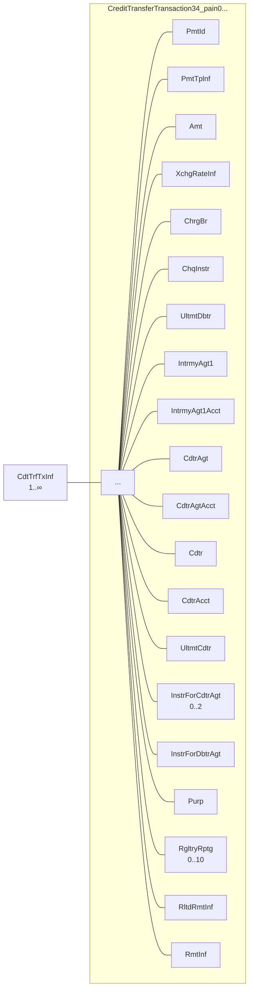

*Abbildung 13: Credit Transfer Transaction Information (CdtTrfTxInf)*

Die nachstehende Tabelle spezifiziert alle für die *Swiss Payment Standards* relevanten Elemente der «Credit Transfer Transaction Information».

Version 2.2 – 24.02.2025 Seite 52 von 91

SIX
Customer Credit Transfer Initiation
Technische Spezifikationen

<table>
  <thead>
    <tr>
        <th colspan="3">ISO-20022-Standard</th>
        <th colspan="4">Swiss Payment Standards</th>
    </tr>
    <tr>
        <th>Message Item</th>
        <th>XML Tag</th>
        <th>Mult</th>
        <th>St.</th>
        <th>Generelle Definition</th>
        <th>Zahlungsartspezifische Definition</th>
        <th>Fehler</th>
    </tr>
  </thead>
  <tbody>
    <tr>
        <td>Credit Transfer Transaction Information</td>
        <td>CdtTrfTxInf</td>
        <td>1..n</td>
        <td>M</td>
        <td></td>
        <td></td>
        <td>CH21</td>
    </tr>
    <tr>
        <td>Credit Transfer Transaction Information<br/>+Payment Identification</td>
        <td>PmtId</td>
        <td>1..1</td>
        <td>M</td>
        <td></td>
        <td></td>
        <td></td>
    </tr>
    <tr>
        <td>Credit Transfer Transaction Information<br/>+Payment Identification<br/>++Instruction Identification</td>
        <td>InstrId</td>
        <td>0..1</td>
        <td>R</td>
        <td>Empfehlung: Verwenden.<br/>Soll verwendet werden, muss innerhalb des B-Levels eindeutig sein.<br/>Für dieses Element ist nur der Zeichensatz für Referenzelemente zugelassen (siehe Kapitel 3.2).</td>
        <td></td>
        <td>DU05,<br/>CH16</td>
    </tr>
    <tr>
        <td>Credit Transfer Transaction Information<br/>+Payment Identification<br/>++End To End Identification</td>
        <td>EndToEndId</td>
        <td>1..1</td>
        <td>M</td>
        <td>Zahlungspflichtigen-Referenz, wird in der Regel bis zum Zahlungsempfänger weitergeleitet.<br/>Für dieses Element ist nur der Zeichensatz für Referenzelemente zugelassen (siehe Kapitel 3.2).</td>
        <td></td>
        <td>CH16</td>
    </tr>
    <tr>
        <td>Credit Transfer Transaction Information<br/>+Payment Identification<br/>++UETR</td>
        <td>UETR</td>
        <td>0..1</td>
        <td>BD</td>
        <td>Darf immer geliefert werden.<br/>Wenn vom Finanzinsitut unterstützt, wird das Element im Interbankverkehr weitergeleitet.</td>
        <td>S: Wird im Interbankverkehr nicht weitergeleitet</td>
        <td></td>
    </tr>
    <tr>
        <td>Credit Transfer Transaction Information<br/>+Payment Type Information</td>
        <td>PmtTpInf</td>
        <td>0..1</td>
        <td>D</td>
        <td>Kann auf B-Level oder C-Level verwendet werden, jedoch generell nicht auf beiden gleichzeitig. Einzelne Institute lassen die Einlieferung auf beiden Leveln zu, jedoch nicht das gleiche Subelement auf beiden Leveln.</td>
        <td></td>
        <td>CH21</td>
    </tr>
    <tr>
        <td>Credit Transfer Transaction Information<br/>+Payment Type Information<br/>++Instruction Priority</td>
        <td>InstrPrty</td>
        <td>0..1</td>
        <td>O</td>
        <td>Allfällige Angaben zu Express-Ausführung sind auf B-Level mitzugeben, Werte in diesem Element werden ignoriert.</td>
        <td></td>
        <td></td>
    </tr>
    <tr>
        <td>Credit Transfer Transaction Information<br/>+Payment Type Information<br/>++Service Level</td>
        <td>SvcLvl</td>
        <td>0..n</td>
        <td>O</td>
        <td>Service Level beeinflusst den Zahlungsausgang beim Finanzinstitut. Der Fokus liegt auf der möglichst schnellen Gutschrift beim Zahlungsempfänger.<br/>Darf genau einmal verwendet werden.</td>
        <td>S: Muss verwendet werden</td>
        <td>CH21</td>
    </tr>
    <tr>
        <td>Credit Transfer Transaction Information<br/>+Payment Type Information<br/>++Service Level<br/>+++Code</td>
        <td>Cd {Or</td>
        <td>1..1</td>
        <td>BD</td>
        <td>Codes gemäss «Payments External Code Lists» [8], sofern das Finanzinstitut den entsprechenden Service anbietet, sonst ignoriert.</td>
        <td>S: Nur SEPA erlaubt</td>
        <td>CH16</td>
    </tr>
  </tbody>
</table>

Version 2.2 – 24.02.2025
pain.001: C-Level (CdtTrfTxInf)
Seite 53 von 91

SIX
Customer Credit Transfer Initiation
Technische Spezifikationen

<table>
  <thead>
    <tr>
        <th colspan="3">ISO-20022-Standard</th>
        <th colspan="4">Swiss Payment Standards</th>
    </tr>
    <tr>
        <th>Message Item</th>
        <th>XML Tag</th>
        <th>Mult</th>
        <th>St.</th>
        <th>Generelle Definition</th>
        <th>Zahlungsartspezifische Definition</th>
        <th>Fehler</th>
    </tr>
  </thead>
  <tbody>
    <tr>
        <td>Credit Transfer Transaction Information<br/>+Payment Type Information<br/>++Service Level<br/>+++Proprietary</td>
        <td>Prtry Or}</td>
        <td>1..1</td>
        <td>BD</td>
        <td>Das Element wird entsprechend den Regeln des Finanzinstituts verarbeitet.</td>
        <td>S: Darf nicht geliefert werden.</td>
        <td>CH17</td>
    </tr>
    <tr>
        <td>Credit Transfer Transaction Information<br/>+Payment Type Information<br/>++Local Instrument</td>
        <td>LclInstrm</td>
        <td>0..1</td>
        <td>BD</td>
        <td></td>
        <td>D: V1 und V2 darf nicht geliefert werden.</td>
        <td>CH17</td>
    </tr>
    <tr>
        <td>Credit Transfer Transaction Information<br/>+Payment Type Information<br/>++Category Purpose</td>
        <td>CtgyPurp</td>
        <td>0..1</td>
        <td>O</td>
        <td>Angaben zu SALA/PENS sind auf B-Level mitzugeben. Weitere ISO-Codes werden nach Absprache mit dem Finanzinstitut unterstützt.</td>
        <td></td>
        <td></td>
    </tr>
    <tr>
        <td>Credit Transfer Transaction Information<br/>+Payment Type Information<br/>++Category Purpose<br/>+++Code</td>
        <td>Cd {Or</td>
        <td>1..1</td>
        <td>D</td>
        <td></td>
        <td></td>
        <td></td>
    </tr>
    <tr>
        <td>Credit Transfer Transaction Information<br/>+Payment Type Information<br/>++Category Purpose<br/>+++Proprietary</td>
        <td>Prtry Or}</td>
        <td>1..1</td>
        <td>D</td>
        <td></td>
        <td></td>
        <td></td>
    </tr>
    <tr>
        <td>Credit Transfer Transaction Information<br/>+Amount</td>
        <td>Amt</td>
        <td>1..1</td>
        <td>M</td>
        <td>Entweder als «Instructed Amount» oder als «Equivalent Amount». Pro transferierte Währung muss ein B-Level erstellt werden.</td>
        <td></td>
        <td></td>
    </tr>
    <tr>
        <td>Credit Transfer Transaction Information<br/>+Amount<br/>++Instructed Amount</td>
        <td>InstdAmt {Or</td>
        <td>1..1</td>
        <td>D</td>
        <td></td>
        <td>D: V1: Darf nur CHF oder EUR enthalten, der Betrag muss zwischen 0.01 und 9'999'999'999.99 liegen.<br/>V2: Darf nur CHF enthalten, der Betrag muss zwischen 0.01 und der Instant-Zahlung Betragslimite liegen.<br/><br/>S: Darf nur EUR enthalten, der Betrag muss zwischen 0.01 und 999'999'999.99 liegen.<br/>X: (V1, Inland) - Alle Währungen (nach Absprache mit Finanzinstitut) ausser CHF und EUR erlaubt.<br/>(V2 , Ausland) - Alle Währungen (nach Absprache mit Finanzinstitut) erlaubt.</td>
        <td>AM01, AM02, CURR, AM03, CH20</td>
    </tr>
  </tbody>
</table>

Version 2.2 – 24.02.2025
pain.001: C-Level (CdtTrfTxInf)
Seite 54 von 91

SIX
Customer Credit Transfer Initiation
Technische Spezifikationen

<table>
  <thead>
    <tr>
        <th colspan="2">ISO-20022-Standard</th>
        <th colspan="5">Swiss Payment Standards</th>
    </tr>
    <tr>
        <th>Message Item</th>
        <th>XML Tag</th>
        <th>Mult</th>
        <th>St.</th>
        <th>Generelle Definition</th>
        <th>Zahlungsartspezifische Definition</th>
        <th>Fehler</th>
    </tr>
  </thead>
  <tbody>
    <tr>
        <td>Credit Transfer Transaction Information<br/>+Amount<br/>++Equivalent Amount</td>
        <td>EqvtAmt</td>
        <td>1..1 Or}</td>
        <td>BD</td>
        <td>Das Element wird entsprechend den Regeln des Finanzinstituts verarbeitet.</td>
        <td></td>
        <td>CH21</td>
    </tr>
    <tr>
        <td>Credit Transfer Transaction Information<br/>+Amount<br/>++Equivalent Amount<br/>+++Amount</td>
        <td>Amt</td>
        <td>1..1</td>
        <td>M</td>
        <td>Muss verwendet werden, wenn «Equivalent Amount» verwendet wird.</td>
        <td>D: V1: Darf nur CHF oder EUR enthalten, der Betrag muss zwischen 0.01 und 9'999'999'999.99 liegen.<br/>D: V2: Der Betrag muss zwischen 0.01 und der Instant-Zahlung Betragslimite liegen.<br/><br/>S: Der Betrag muss zwischen 0.01 und 999'999'999.99 liegen.</td>
        <td>AM01, AM02, CURR, AM03, CH20</td>
    </tr>
    <tr>
        <td>Credit Transfer Transaction Information<br/>+Amount<br/>++Equivalent Amount<br/>+++Currency Of Transfer</td>
        <td>CcyOfTrf</td>
        <td>1..1</td>
        <td>M</td>
        <td>Muss verwendet werden, wenn «Equivalent Amount» verwendet wird.</td>
        <td>D: V1: Darf nur CHF oder EUR enthalten.<br/>D: V2: Darf nur CHF enthalten.<br/><br/>S: Darf nur EUR enthalten.<br/>X: (V1, Inland) - Alle Währungen (nach Absprache mit Finanzinstitut) ausser CHF und EUR erlaubt.<br/>(V2, Ausland) - Alle Währungen (nach Absprache mit Finanzinstitut) erlaubt.</td>
        <td>CURR, AM03</td>
    </tr>
    <tr>
        <td>Credit Transfer Transaction Information<br/>+Exchange Rate Information</td>
        <td>XchgRateInf</td>
        <td>0..1</td>
        <td>BD</td>
        <td>Das Element wird entsprechend den Regeln des Finanzinstituts verarbeitet.</td>
        <td>S: Darf nicht geliefert werden.</td>
        <td>CH17, CH21</td>
    </tr>
    <tr>
        <td>Credit Transfer Transaction Information<br/>+Exchange Rate Information<br/>++Unit Currency</td>
        <td>UnitCcy</td>
        <td>0..1</td>
        <td>O</td>
        <td>Währung, in der das Umtauschverhältnis angegeben wird. Bei z.B. 1 CHF = xxx CUR ist dies die Währung CHF.</td>
        <td></td>
        <td>CURR</td>
    </tr>
    <tr>
        <td>Credit Transfer Transaction Information<br/>+Exchange Rate Information<br/>++Exchange Rate</td>
        <td>XchgRate</td>
        <td>0..1</td>
        <td>O</td>
        <td>Muss verwendet werden, wenn «Exchange Rate Information» verwendet wird.<br/>Umrechnungskurse können immer in Währungseinheit 1 oder in der gängigen Usanz des Finanzplatzes geliefert werden (z.B. in Währungseinheit 1 für EUR, USD, GBP oder in Währungseinheit 100 bei YEN, DKK, SEK).</td>
        <td colspan="2"></td>
    </tr>
  </tbody>
</table>

Version 2.2 – 24.02.2025
pain.001: C-Level (CdtTrfTxInf)
Seite 55 von 91

SIX
Customer Credit Transfer Initiation
Technische Spezifikationen

<table>
  <thead>
    <tr>
        <th>ISO-20022-Standard</th>
        <th colspan="6">Swiss Payment Standards</th>
    </tr>
    <tr>
        <th>Message Item</th>
        <th>XML Tag</th>
        <th>Mult</th>
        <th>St.</th>
        <th>Generelle Definition</th>
        <th>Zahlungsartspezifische Definition</th>
        <th>Fehler</th>
    </tr>
  </thead>
  <tbody>
    <tr>
        <td>Credit Transfer Transaction Information<br/>+Exchange Rate Information<br/>++Rate Type</td>
        <td>RateTp</td>
        <td>0..1</td>
        <td>O</td>
        <td>Wird zurzeit von Finanzinstituten ignoriert.</td>
        <td></td>
        <td></td>
    </tr>
    <tr>
        <td>Credit Transfer Transaction Information<br/>+Exchange Rate Information<br/>++Contract Identification</td>
        <td>CtrctId</td>
        <td>0..1</td>
        <td>O</td>
        <td>Wird zurzeit von Finanzinstituten ignoriert.</td>
        <td></td>
        <td></td>
    </tr>
    <tr>
        <td>Credit Transfer Transaction Information<br/>+Charge Bearer</td>
        <td>ChrgBr</td>
        <td>0..1</td>
        <td>O</td>
        <td>Kann auf B-Level oder C-Level verwendet werden, nicht jedoch auf beiden gleichzeitig. Zulässige Codes sind:<br/>• DEBT Borne by Debtor (ex OUR)<br/>• CRED Borne by Creditor (ex BEN)<br/>• SHAR Shared (ex. SHA)<br/>• SLEV Service Level</td>
        <td>S: Wenn verwendet, dann muss SLEV verwendet werden</td>
        <td>CH07,<br/>CH16</td>
    </tr>
    <tr>
        <td>Credit Transfer Transaction Information<br/>+Cheque Instruction</td>
        <td>ChqInstr</td>
        <td>0..1</td>
        <td>D</td>
        <td>Darf nur in Kombination mit «PmtMtd» = CHK verwendet werden.</td>
        <td>S: Darf nicht geliefert werden.<br/>D: Darf nicht geliefert werden.<br/>X: Darf nicht geliefert werden.</td>
        <td>CH17</td>
    </tr>
    <tr>
        <td>Credit Transfer Transaction Information<br/>+Cheque Instruction<br/>++Cheque Type</td>
        <td>ChqTp</td>
        <td>0..1</td>
        <td>O</td>
        <td></td>
        <td></td>
        <td></td>
    </tr>
    <tr>
        <td>Credit Transfer Transaction Information<br/>+Cheque Instruction<br/>++Delivery Method</td>
        <td>DlvryMtd</td>
        <td>0..1</td>
        <td>O</td>
        <td></td>
        <td></td>
        <td></td>
    </tr>
    <tr>
        <td>Credit Transfer Transaction Information<br/>+Ultimate Debtor</td>
        <td>UltmtDbtr</td>
        <td>0..1</td>
        <td>O</td>
        <td>Endgültiger Zahlungspflichtige<br/>Kann auf B-Level oder C-Level verwendet werden, nicht jedoch auf beiden gleichzeitig.</td>
        <td></td>
        <td>CH07,<br/>CH21</td>
    </tr>
    <tr>
        <td>Credit Transfer Transaction Information<br/>+Ultimate Debtor<br/>++Name</td>
        <td>Nm</td>
        <td>0..1</td>
        <td>O</td>
        <td>Muss verwendet werden, wenn Postal Address verwendet wird.</td>
        <td>S: max. 70 Zeichen</td>
        <td>CH16</td>
    </tr>
    <tr>
        <td>Credit Transfer Transaction Information<br/>+Ultimate Debtor<br/>++Postal Address</td>
        <td>PstlAdr</td>
        <td>0..1</td>
        <td>O</td>
        <td>Generelle Beschreibung der Subelemente siehe Kapitel 3.11 «Verwendung von Adressinformationen».</td>
        <td>S: Wird im Interbankverkehr nicht weitergeleitet</td>
        <td></td>
    </tr>
  </tbody>
</table>

Version 2.2 – 24.02.2025
pain.001: C-Level (CdtTrfTxInf)
Seite 56 von 91

Customer Credit Transfer Initiation
Technische Spezifikationen

<table>
  <thead>
    <tr>
        <th colspan="3">ISO-20022-Standard</th>
        <th colspan="4">Swiss Payment Standards</th>
    </tr>
    <tr>
        <th>Message Item</th>
        <th>XML Tag</th>
        <th>Mult</th>
        <th>St.</th>
        <th>Generelle Definition</th>
        <th>Zahlungsartspezifische Definition</th>
        <th>Fehler</th>
    </tr>
  </thead>
  <tbody>
    <tr>
        <td>Credit Transfer Transaction Information<br/>+Ultimate Debtor<br/>++Postal Address<br/>+++Street Name</td>
        <td>StrtNm</td>
        <td>0..1</td>
        <td>R</td>
        <td>Empfehlung: Verwenden</td>
        <td></td>
        <td></td>
    </tr>
    <tr>
        <td>Credit Transfer Transaction Information<br/>+Ultimate Debtor<br/>++Postal Address<br/>+++Town Name</td>
        <td>TwnNm</td>
        <td>0..1</td>
        <td>R</td>
        <td>Muss verwendet werden</td>
        <td></td>
        <td>CH21</td>
    </tr>
    <tr>
        <td>Credit Transfer Transaction Information<br/>+Ultimate Debtor<br/>++Postal Address<br/>+++Country</td>
        <td>Ctry</td>
        <td>0..1</td>
        <td>R</td>
        <td>Muss verwendet werden</td>
        <td></td>
        <td>CH21</td>
    </tr>
    <tr>
        <td>Credit Transfer Transaction Information<br/>+Ultimate Debtor<br/>++Postal Address<br/>+++Address Line</td>
        <td>AdrLine</td>
        <td>0..7</td>
        <td>BD</td>
        <td>Maximal 2 Zeilen zugelassen, sofern als Teil der hybriden Adresse angeboten.</td>
        <td></td>
        <td>CH17</td>
    </tr>
    <tr>
        <td>Credit Transfer Transaction Information<br/>+Ultimate Debtor<br/>++Identification</td>
        <td>Id</td>
        <td>0..1</td>
        <td>O</td>
        <td></td>
        <td></td>
        <td>CH17</td>
    </tr>
    <tr>
        <td>Credit Transfer Transaction Information<br/>+Ultimate Debtor<br/>++Identification<br/>+++Organisation Identification</td>
        <td>OrgId</td>
        <td>1..1<br/>{Or</td>
        <td>D</td>
        <td>Nur &lt;AnyBIC&gt; oder eine Instanz des Elements aus «Other» und optional das Element &lt;LEI&gt; zulässig.</td>
        <td>D: Alle Angaben werden weitergeleitet.<br/>S: Werden mehrere Elemente geliefert, wird nur eines der Elemente weitergeleitet mit folgender Priorität: 1. Prio AnyBIC, 2.Prio LEI, 3. Prio Other<br/>X: Bei gleichzeitiger Verwendung von Name/ Adresse und AnyBIC, wird nur AnyBIC weitergeleitet.</td>
        <td>CH16,<br/>CH17,<br/>CH21</td>
    </tr>
    <tr>
        <td>Credit Transfer Transaction Information<br/>+Ultimate Debtor<br/>++Identification<br/>+++Organisation Identification<br/>++++Any BIC</td>
        <td>AnyBIC</td>
        <td>0..1</td>
        <td>O</td>
        <td></td>
        <td></td>
        <td>RC01,<br/>CH16,<br/>CH17</td>
    </tr>
  </tbody>
</table>

Version 2.2 – 24.02.2025
pain.001: C-Level (CdtTrfTxInf)
Seite 57 von 91

SIX
Customer Credit Transfer Initiation
Technische Spezifikationen

<table>
  <thead>
    <tr>
        <th colspan="3">ISO-20022-Standard</th>
        <th colspan="4">Swiss Payment Standards</th>
    </tr>
    <tr>
        <th>Message Item</th>
        <th>XML Tag</th>
        <th>Mult</th>
        <th>St.</th>
        <th>Generelle Definition</th>
        <th>Zahlungsartspezifische Definition</th>
        <th>Fehler</th>
    </tr>
  </thead>
  <tbody>
    <tr>
        <td>Credit Transfer Transaction Information<br/>+Ultimate Debtor<br/>++Identification<br/>+++Organisation Identification<br/>++++LEI</td>
        <td>LEI</td>
        <td>0..1</td>
        <td>O</td>
        <td>Die Weiterleitung des Elements kann nicht in allen Fällen gewährleistet werden. Darf zusätzlich zu &lt;AnyBIC&gt; oder &lt;Othr&gt; geliefert werden</td>
        <td></td>
        <td></td>
    </tr>
    <tr>
        <td>Credit Transfer Transaction Information<br/>+Ultimate Debtor<br/>++Identification<br/>+++Organisation Identification<br/>++++Other</td>
        <td>Othr</td>
        <td>0..n</td>
        <td>O</td>
        <td></td>
        <td></td>
        <td></td>
    </tr>
    <tr>
        <td>Credit Transfer Transaction Information<br/>+Ultimate Debtor<br/>++Identification<br/>+++Private Identification</td>
        <td>PrvtId<br/>Or}</td>
        <td>1..1</td>
        <td>D</td>
        <td>Nur «Date And Place Of Birth» oder eine Instanz des Elements «Other» zulässig.</td>
        <td></td>
        <td>CH16,<br/>CH17</td>
    </tr>
    <tr>
        <td>Credit Transfer Transaction Information<br/>+Intermediary Agent 1</td>
        <td>IntrmyAgt1</td>
        <td>0..1</td>
        <td>BD</td>
        <td>Das Element wird entsprechend den Regeln des Finanzinstituts verarbeitet.<br/>Generelle Beschreibung der Subelemente siehe Kapitel 3.12 «Identifikation von Finanzinstituten».</td>
        <td></td>
        <td>RC01</td>
    </tr>
    <tr>
        <td>Credit Transfer Transaction Information<br/>+Intermediary Agent 1Account</td>
        <td>IntrmyAgt1Acct</td>
        <td>0..1</td>
        <td>BD</td>
        <td>Das Element wird entsprechend den Regeln des Finanzinstituts verarbeitet.</td>
        <td></td>
        <td>CH21</td>
    </tr>
    <tr>
        <td>Credit Transfer Transaction Information<br/>+Intermediary Agent 1Account<br/>++Identification</td>
        <td>Id</td>
        <td>1..1</td>
        <td>M</td>
        <td>Empfehlung: Wenn immer möglich soll IBAN verwendet werden.</td>
        <td></td>
        <td></td>
    </tr>
    <tr>
        <td>Credit Transfer Transaction Information<br/>+Intermediary Agent 1Account<br/>++Identification<br/>+++IBAN</td>
        <td>IBAN<br/>{Or</td>
        <td>1..1</td>
        <td>BD</td>
        <td></td>
        <td></td>
        <td></td>
    </tr>
    <tr>
        <td>Credit Transfer Transaction Information<br/>+Intermediary Agent 1Account<br/>++Identification<br/>+++Other</td>
        <td>Othr<br/>Or}</td>
        <td>1..1</td>
        <td>BD</td>
        <td colspan="3"></td>
    </tr>
  </tbody>
</table>

Version 2.2 – 24.02.2025
pain.001: C-Level (CdtTrfTxInf)
Seite 58 von 91

SIX
Customer Credit Transfer Initiation
Technische Spezifikationen

<table>
  <thead>
    <tr>
        <th colspan="3">ISO-20022-Standard</th>
        <th colspan="4">Swiss Payment Standards</th>
    </tr>
    <tr>
        <th>Message Item</th>
        <th>XML Tag</th>
        <th>Mult</th>
        <th>St.</th>
        <th>Generelle Definition</th>
        <th>Zahlungsartspezifische Definition</th>
        <th>Fehler</th>
    </tr>
  </thead>
  <tbody>
    <tr>
        <td>Credit Transfer Transaction Information<br/>+Intermediary Agent 1Account<br/>++Identification<br/>+++Other<br/>++++Identification</td>
        <td>Id</td>
        <td>1..1</td>
        <td>M</td>
        <td></td>
        <td></td>
        <td></td>
    </tr>
    <tr>
        <td>Credit Transfer Transaction Information<br/>+Intermediary Agent 1Account<br/>++Identification<br/>+++Other<br/>++++Scheme Name</td>
        <td>SchmeNm</td>
        <td>0..1</td>
        <td>BD</td>
        <td>Das Element wird entsprechend den Regeln des Finanzinstituts verarbeitet.</td>
        <td></td>
        <td></td>
    </tr>
    <tr>
        <td>Credit Transfer Transaction Information<br/>+Intermediary Agent 1Account<br/>++Identification<br/>+++Other<br/>++++Issuer</td>
        <td>Issr</td>
        <td>0..1</td>
        <td>BD</td>
        <td>Das Element wird entsprechend den Regeln des Finanzinstituts verarbeitet.</td>
        <td></td>
        <td></td>
    </tr>
    <tr>
        <td>Credit Transfer Transaction Information<br/>+Creditor Agent</td>
        <td>CdtrAgt</td>
        <td>0..1</td>
        <td>D</td>
        <td>Generelle Beschreibung der Subelemente siehe Kapitel 3.12 «Identifikation von Finanzinstituten»</td>
        <td>D: Creditor Agent kann bei der Lieferung von IBAN/QR-IBAN (CH/LI) im Creditor Account entfallen. Werden sowohl IBAN/QR-IBAN als auch IID oder BIC geliefert, wird der Creditor Agent bei der Ausführung der Zahlung aus der IBAN ermittelt.<br/>C: Darf nicht geliefert werden.<br/>S: Die Angabe des Creditor Agent ist optional. Der Creditor Agent wird immer aus der IBAN ermittelt<br/>X: Creditor Agent kann bei der Lieferung von IBAN/QR-IBAN (CH/LI) im Creditor Account entfallen. Werden sowohl IBAN/QR-IBAN als auch IID oder BIC geliefert, wird der Creditor Agent bei der Ausführung der Zahlung aus der IBAN ermittelt.</td>
        <td>CH17,<br/>CH21</td>
    </tr>
  </tbody>
</table>

Version 2.2 – 24.02.2025
pain.001: C-Level (CdtTrfTxInf)
Seite 59 von 91

SIX
Customer Credit Transfer Initiation
Technische Spezifikationen

<table>
  <thead>
    <tr>
        <th>ISO-20022-Standard</th>
        <th></th>
        <th></th>
        <th colspan="3">Swiss Payment Standards</th>
        <th></th>
    </tr>
    <tr>
        <th>Message Item</th>
        <th>XML Tag</th>
        <th>Mult</th>
        <th>St.</th>
        <th>Generelle Definition</th>
        <th>Zahlungsartspezifische Definition</th>
        <th>Fehler</th>
    </tr>
  </thead>
  <tbody>
    <tr>
        <td>Credit Transfer Transaction Information<br/>+Creditor Agent<br/>++Financial Institution Identification</td>
        <td>FinInstnId</td>
        <td>1..1</td>
        <td>M</td>
        <td></td>
        <td>D: Wenn geliefert, IID oder BIC Inland (CH/LI)<br/>X: (V1, Inland) - Wenn geliefert, IID oder BIC Inland (CH/LI)<br/>(V2, Ausland) - BIC empfohlen</td>
        <td></td>
    </tr>
    <tr>
        <td>Credit Transfer Transaction Information<br/>+Creditor Agent<br/>++Financial Institution Identification<br/>+++BICFI</td>
        <td>BICFI</td>
        <td>0..1</td>
        <td>D</td>
        <td>Wenn verwendet, darf «Clearing System Member Identification» nicht vorkommen.</td>
        <td>D: BIC (Bank mit SIC Anschluss)<br/>X: (V1, Inland) - BIC Inland (CH/LI)</td>
        <td>AGNT, CH17</td>
    </tr>
    <tr>
        <td>Credit Transfer Transaction Information<br/>+Creditor Agent<br/>++Financial Institution Identification<br/>+++Clearing System Member Identification</td>
        <td>ClrSysMmbId</td>
        <td>0..1</td>
        <td>D</td>
        <td>Wenn verwendet, darf «BICFI» nicht vorkommen.</td>
        <td>S: Darf nicht geliefert werden.<br/>X: (V2, Ausland) - Muss zusammen mit Name und Adresse geliefert werden</td>
        <td>CH17, CH21</td>
    </tr>
    <tr>
        <td>Credit Transfer Transaction Information<br/>+Creditor Agent<br/>++Financial Institution Identification<br/>+++Clearing System Member Identification<br/>++++Clearing System Identification</td>
        <td>ClrSysId</td>
        <td>0..1</td>
        <td>M</td>
        <td>Muss verwendet werden, wenn «Clearing System Member Identification» verwendet wird.</td>
        <td></td>
        <td></td>
    </tr>
    <tr>
        <td>Credit Transfer Transaction Information<br/>+Creditor Agent<br/>++Financial Institution Identification<br/>+++Clearing System Member Identification<br/>++++Clearing System Identification<br/>+++++Code</td>
        <td>Cd</td>
        <td>1..1</td>
        <td>M</td>
        <td>Art der Clearing-ID (Bankcode, «National Identifier»). Gibt Auskunft, um welche Art Identifikation es sich im Feld «Member Identification» handelt.<br/>Codes gemäss «Payments External Code Lists» [8].</td>
        <td>D: Muss CHBCC beinhalten<br/>X: (V1, Inland) - Muss CHBCC beinhalten<br/>(V2, Ausland) - Code CHBCC darf nicht verwendet werden</td>
        <td>CH16</td>
    </tr>
    <tr>
        <td>Credit Transfer Transaction Information<br/>+Creditor Agent<br/>++Financial Institution Identification<br/>+++Clearing System Member Identification<br/>++++Member Identification</td>
        <td>MmbId</td>
        <td>1..1</td>
        <td>M</td>
        <td>Clearing-ID (Bankcode, «National Identifier») des Empfängerinstitutes.<br/>Muss verwendet werden, wenn «Clearing System Member Identification» verwendet wird.</td>
        <td>X: (V1, Inland) - Bei der Ausführung der Zahlung wird der Creditor Agent immer aus der IBAN (CH/LI) ermittelt, sofern vorhanden.<br/><br/>D: Bei der Ausführung der Zahlung wird der Creditor Agent immer aus der IBAN (CH/LI) ermittelt, sofern vorhanden.</td>
        <td>AGNT</td>
    </tr>
  </tbody>
</table>

Version 2.2 – 24.02.2025
pain.001: C-Level (CdtTrfTxInf)
Seite 60 von 91

SIX
Customer Credit Transfer Initiation
Technische Spezifikationen

<table>
  <thead>
    <tr>
        <th>ISO-20022-Standard</th>
        <th colspan="6">Swiss Payment Standards</th>
    </tr>
    <tr>
        <th>Message Item</th>
        <th>XML Tag</th>
        <th>Mult</th>
        <th>St.</th>
        <th>Generelle Definition</th>
        <th>Zahlungsartspezifische Definition</th>
        <th>Fehler</th>
    </tr>
  </thead>
  <tbody>
    <tr>
        <td>Credit Transfer Transaction Information<br/>+Creditor Agent<br/>++Financial Institution Identification<br/>+++LEI</td>
        <td>LEI</td>
        <td>0..1</td>
        <td>O</td>
        <td>Die Weiterleitung des Elements kann nicht in allen Fällen gewährleistet werden.<br/>Darf zusätzlich zu &lt;BICFI&gt; oder &lt;Othr&gt; geliefert werden.<br/>Element wird ignoriert und nicht weitergeleitet.</td>
        <td></td>
        <td></td>
    </tr>
    <tr>
        <td>Credit Transfer Transaction Information<br/>+Creditor Agent<br/>++Financial Institution Identification<br/>+++Name</td>
        <td>Nm</td>
        <td>0..1</td>
        <td>D</td>
        <td>Darf nicht zusammen mit BIC geliefert werden</td>
        <td>X: V2 Ausland: Muss verwendet werden, wenn &lt;ClrSysMmbId&gt; verwendet wird. Muss zusammen mit Adresse geliefert werden.<br/>D: Darf nicht geliefert werden.<br/>S: Darf nicht geliefert werden.<br/>C: Darf nicht geliefert werden.</td>
        <td>CH17,<br/>CH21,<br/>CH16</td>
    </tr>
    <tr>
        <td>Credit Transfer Transaction Information<br/>+Creditor Agent<br/>++Financial Institution Identification<br/>+++Postal Address</td>
        <td>PstlAdr</td>
        <td>0..1</td>
        <td>D</td>
        <td>Generelle Beschreibung der Subelemente siehe Kapitel 3.11 «Verwendung von Adressinformationen»</td>
        <td>C: Darf nicht geliefert werden.<br/>S: Darf nicht geliefert werden.<br/>D: Darf nicht geliefert werden.<br/>X: Muss geliefert werden, wenn &lt;Name&gt; verwendet wird.</td>
        <td>CH17,<br/>CH21</td>
    </tr>
    <tr>
        <td>Credit Transfer Transaction Information<br/>+Creditor Agent<br/>++Financial Institution Identification<br/>+++Postal Address<br/>++++Town Name</td>
        <td>TwnNm</td>
        <td>0..1</td>
        <td>M</td>
        <td>Muss verwendet werden</td>
        <td></td>
        <td>CH21</td>
    </tr>
    <tr>
        <td>Credit Transfer Transaction Information<br/>+Creditor Agent<br/>++Financial Institution Identification<br/>+++Postal Address<br/>++++Country</td>
        <td>Ctry</td>
        <td>0..1</td>
        <td>M</td>
        <td>Muss verwendet werden</td>
        <td></td>
        <td>AG06</td>
    </tr>
    <tr>
        <td>Credit Transfer Transaction Information<br/>+Creditor Agent<br/>++Financial Institution Identification<br/>+++Postal Address<br/>++++Address Line</td>
        <td>AdrLine</td>
        <td>0..7</td>
        <td>BD</td>
        <td>Maximal 2 Zeilen zugelassen sofern angeboten als Teil der hybriden Adresse.</td>
        <td colspan="2"></td>
    </tr>
  </tbody>
</table>

Version 2.2 – 24.02.2025
pain.001: C-Level (CdtTrfTxInf)
Seite 61 von 91

SIX
Customer Credit Transfer Initiation
Technische Spezifikationen

<table>
  <thead>
    <tr>
        <th>ISO-20022-Standard</th>
        <th colspan="6">Swiss Payment Standards</th>
    </tr>
    <tr>
        <th>Message Item</th>
        <th>XML Tag</th>
        <th>Mult</th>
        <th>St.</th>
        <th>Generelle Definition</th>
        <th>Zahlungsartspezifische Definition</th>
        <th>Fehler</th>
    </tr>
  </thead>
  <tbody>
    <tr>
        <td>Credit Transfer Transaction Information<br/>+Creditor Agent<br/>++Financial Institution Identification<br/>+++Other</td>
        <td>Othr</td>
        <td>0..1</td>
        <td>N</td>
        <td></td>
        <td></td>
        <td></td>
    </tr>
    <tr>
        <td>Credit Transfer Transaction Information<br/>+Creditor Agent Account</td>
        <td>CdtrAgtAcct</td>
        <td>0..1</td>
        <td>BD</td>
        <td>Das Element wird entsprechend den Regeln des Finanzinstituts verarbeitet.</td>
        <td></td>
        <td>CH21</td>
    </tr>
    <tr>
        <td>Credit Transfer Transaction Information<br/>+Creditor Agent Account<br/>++Identification</td>
        <td>Id</td>
        <td>1..1</td>
        <td>M</td>
        <td>Empfehlung: Wenn immer möglich soll IBAN verwendet werden.</td>
        <td></td>
        <td></td>
    </tr>
    <tr>
        <td>Credit Transfer Transaction Information<br/>+Creditor Agent Account<br/>++Identification<br/>+++IBAN</td>
        <td>IBAN</td>
        <td>{Or 1..1</td>
        <td>D</td>
        <td></td>
        <td></td>
        <td></td>
    </tr>
    <tr>
        <td>Credit Transfer Transaction Information<br/>+Creditor Agent Account<br/>++Identification<br/>+++Other</td>
        <td>Othr</td>
        <td>Or} 1..1</td>
        <td>D</td>
        <td></td>
        <td></td>
        <td></td>
    </tr>
    <tr>
        <td>Credit Transfer Transaction Information<br/>+Creditor</td>
        <td>Cdtr</td>
        <td>0..1</td>
        <td>M</td>
        <td>Muss geliefert werden.</td>
        <td></td>
        <td>CH21</td>
    </tr>
    <tr>
        <td>Credit Transfer Transaction Information<br/>+Creditor<br/>++Name</td>
        <td>Nm</td>
        <td>0..1</td>
        <td>M</td>
        <td>Muss verwendet werden, wenn Postal Address verwendet wird.</td>
        <td>S: max. 70 Zeichen</td>
        <td>CH16</td>
    </tr>
    <tr>
        <td>Credit Transfer Transaction Information<br/>+Creditor<br/>++Postal Address</td>
        <td>PstlAdr</td>
        <td>0..1</td>
        <td>O</td>
        <td>Generelle Beschreibung der Subelemente siehe Kapitel 3.11 «Verwendung von Adressinformationen»</td>
        <td></td>
        <td>CH16</td>
    </tr>
    <tr>
        <td>Credit Transfer Transaction Information<br/>+Creditor<br/>++Postal Address<br/>+++Department</td>
        <td>Dept</td>
        <td>0..1</td>
        <td>O</td>
        <td colspan="3"></td>
    </tr>
  </tbody>
</table>

Version 2.2 – 24.02.2025
pain.001: C-Level (CdtTrfTxInf)
Seite 62 von 91

SIX
Customer Credit Transfer Initiation
Technische Spezifikationen

<table>
  <thead>
    <tr>
        <th colspan="3">ISO-20022-Standard</th>
        <th colspan="4">Swiss Payment Standards</th>
    </tr>
    <tr>
        <th>Message Item</th>
        <th>XML Tag</th>
        <th>Mult</th>
        <th>St.</th>
        <th>Generelle Definition</th>
        <th>Zahlungsartspezifische Definition</th>
        <th>Fehler</th>
    </tr>
  </thead>
  <tbody>
    <tr>
        <td>Credit Transfer Transaction Information<br/>+Creditor<br/>++Postal Address<br/>+++Sub Department</td>
        <td>SubDept</td>
        <td>0..1</td>
        <td>O</td>
        <td></td>
        <td></td>
        <td></td>
    </tr>
    <tr>
        <td>Credit Transfer Transaction Information<br/>+Creditor<br/>++Postal Address<br/>+++Street Name</td>
        <td>StrtNm</td>
        <td>0..1</td>
        <td>R</td>
        <td>Empfehlung: Verwenden.</td>
        <td></td>
        <td></td>
    </tr>
    <tr>
        <td>Credit Transfer Transaction Information<br/>+Creditor<br/>++Postal Address<br/>+++Building Number</td>
        <td>BldgNb</td>
        <td>0..1</td>
        <td>R</td>
        <td>Empfehlung: Verwenden.</td>
        <td></td>
        <td></td>
    </tr>
    <tr>
        <td>Credit Transfer Transaction Information<br/>+Creditor<br/>++Postal Address<br/>+++Building Name</td>
        <td>BldgNm</td>
        <td>0..1</td>
        <td>O</td>
        <td></td>
        <td></td>
        <td></td>
    </tr>
    <tr>
        <td>Credit Transfer Transaction Information<br/>+Creditor<br/>++Postal Address<br/>+++Floor</td>
        <td>Flr</td>
        <td>0..1</td>
        <td>O</td>
        <td></td>
        <td></td>
        <td></td>
    </tr>
    <tr>
        <td>Credit Transfer Transaction Information<br/>+Creditor<br/>++Postal Address<br/>+++Post Box</td>
        <td>PstBx</td>
        <td>0..1</td>
        <td>O</td>
        <td></td>
        <td></td>
        <td></td>
    </tr>
    <tr>
        <td>Credit Transfer Transaction Information<br/>+Creditor<br/>++Postal Address<br/>+++Room</td>
        <td>Room</td>
        <td>0..1</td>
        <td>O</td>
        <td></td>
        <td></td>
        <td></td>
    </tr>
    <tr>
        <td>Credit Transfer Transaction Information<br/>+Creditor<br/>++Postal Address<br/>+++Post Code</td>
        <td>PstCd</td>
        <td>0..1</td>
        <td>R</td>
        <td>Empfehlung: Verwenden.</td>
        <td>C: Muss vorhanden sein</td>
        <td>CH21</td>
    </tr>
  </tbody>
</table>

Version 2.2 – 24.02.2025
pain.001: C-Level (CdtTrfTxInf)
Seite 63 von 91

SIX
Customer Credit Transfer Initiation
Technische Spezifikationen

<table>
  <thead>
    <tr>
        <th colspan="3">ISO-20022-Standard</th>
        <th colspan="4">Swiss Payment Standards</th>
    </tr>
    <tr>
        <th>Message Item</th>
        <th>XML Tag</th>
        <th>Mult</th>
        <th>St.</th>
        <th>Generelle Definition</th>
        <th>Zahlungsartspezifische Definition</th>
        <th>Fehler</th>
    </tr>
  </thead>
  <tbody>
    <tr>
        <td>Credit Transfer Transaction Information<br/>+Creditor<br/>++Postal Address<br/>+++Town Name</td>
        <td>TwnNm</td>
        <td>0..1</td>
        <td>R</td>
        <td>Muss verwendet werden.</td>
        <td></td>
        <td>CH21</td>
    </tr>
    <tr>
        <td>Credit Transfer Transaction Information<br/>+Creditor<br/>++Postal Address<br/>+++Town Location Name</td>
        <td>TwnLctnNm</td>
        <td>0..1</td>
        <td>O</td>
        <td></td>
        <td></td>
        <td></td>
    </tr>
    <tr>
        <td>Credit Transfer Transaction Information<br/>+Creditor<br/>++Postal Address<br/>+++District Name</td>
        <td>DstrctNm</td>
        <td>0..1</td>
        <td>O</td>
        <td></td>
        <td></td>
        <td></td>
    </tr>
    <tr>
        <td>Credit Transfer Transaction Information<br/>+Creditor<br/>++Postal Address<br/>+++Country Sub Division</td>
        <td>CtrySubDvsn</td>
        <td>0..1</td>
        <td>O</td>
        <td></td>
        <td></td>
        <td></td>
    </tr>
    <tr>
        <td>Credit Transfer Transaction Information<br/>+Creditor<br/>++Postal Address<br/>+++Country</td>
        <td>Ctry</td>
        <td>0..1</td>
        <td>R</td>
        <td>Muss verwendet werden.</td>
        <td></td>
        <td>CH21,<br/>BE09</td>
    </tr>
    <tr>
        <td>Credit Transfer Transaction Information<br/>+Creditor<br/>++Postal Address<br/>+++Address Line</td>
        <td>AdrLine</td>
        <td>0..7</td>
        <td>BD</td>
        <td>Maximal 2 Zeilen zugelassen sofern angeboten als Teil der hybriden Adresse.</td>
        <td></td>
        <td>CH17</td>
    </tr>
    <tr>
        <td>Credit Transfer Transaction Information<br/>+Creditor<br/>++Identification</td>
        <td>Id</td>
        <td>0..1</td>
        <td>D</td>
        <td></td>
        <td>C: Darf nicht vorhanden sein</td>
        <td>CH17</td>
    </tr>
    <tr>
        <td>Credit Transfer Transaction Information<br/>+Creditor<br/>++Identification<br/>+++Organisation Identification</td>
        <td>OrgId</td>
        <td>1..1<br/>{Or</td>
        <td>D</td>
        <td>Nur `&lt;AnyBIC&gt;` oder eine Instanz des Elements aus «Other» und optional das Element `&lt;LEI&gt;` zulässig.</td>
        <td>D: Alle Angaben werden weitergeleitet.<br/>S: Werden mehrere Elemente geliefert, wird nur eines der Elemente weitergeleitet mit folgender Priorität: 1. Prio AnyBIC, 2. Prio LEI, 3. Prio Other<br/>X: Bei gleichzeitiger Verwendung von Name/Adresse und OrgID/AnyBIC wird nur `&lt;AnyBIC&gt;` weitergeleitet.</td>
        <td>CH16,<br/>CH17,<br/>CH21</td>
    </tr>
  </tbody>
</table>

Version 2.2 – 24.02.2025
pain.001: C-Level (CdtTrfTxInf)
Seite 64 von 91

SIX
Customer Credit Transfer Initiation
Technische Spezifikationen

<table>
  <thead>
    <tr>
        <th colspan="3">ISO-20022-Standard</th>
        <th colspan="4">Swiss Payment Standards</th>
    </tr>
    <tr>
        <th>Message Item</th>
        <th>XML Tag</th>
        <th>Mult</th>
        <th>St.</th>
        <th>Generelle Definition</th>
        <th>Zahlungsartspezifische Definition</th>
        <th>Fehler</th>
    </tr>
  </thead>
  <tbody>
    <tr>
        <td>Credit Transfer Transaction Information<br/>+Creditor<br/>++Identification<br/>+++Organisation Identification<br/>++++Any BIC</td>
        <td>AnyBIC</td>
        <td>0..1</td>
        <td>O</td>
        <td></td>
        <td></td>
        <td></td>
    </tr>
    <tr>
        <td>Credit Transfer Transaction Information<br/>+Creditor<br/>++Identification<br/>+++Organisation Identification<br/>++++LEI</td>
        <td>LEI</td>
        <td>0..1</td>
        <td>O</td>
        <td>Die Weiterleitung des Elements kann nicht in allen Fällen gewährleistet werden. Darf zusätzlich zu &amp;lt;AnyBIC&amp;gt; oder &amp;lt;Othr&amp;gt; geliefert werden.</td>
        <td></td>
        <td></td>
    </tr>
    <tr>
        <td>Credit Transfer Transaction Information<br/>+Creditor<br/>++Identification<br/>+++Organisation Identification<br/>++++Other</td>
        <td>Othr</td>
        <td>0..n</td>
        <td>O</td>
        <td></td>
        <td></td>
        <td></td>
    </tr>
    <tr>
        <td>Credit Transfer Transaction Information<br/>+Creditor<br/>++Identification<br/>+++Private Identification</td>
        <td>PrvtId</td>
        <td>1..1</td>
        <td>D</td>
        <td>Nur «Date And Place Of Birth» oder eine Instanz des Elements «Other» zulässig.</td>
        <td></td>
        <td>CH16,<br/>CH17</td>
    </tr>
    <tr>
        <td>Credit Transfer Transaction Information<br/>+Creditor Account</td>
        <td>CdtrAcct</td>
        <td>0..1</td>
        <td>D</td>
        <td>Muss vorhanden sein.</td>
        <td>C: Darf nicht geliefert werden.</td>
        <td>CH17,<br/>CH21</td>
    </tr>
    <tr>
        <td>Credit Transfer Transaction Information<br/>+Creditor Account<br/>++Identification</td>
        <td>Id</td>
        <td>1..1</td>
        <td>M</td>
        <td>Empfehlung: Wenn immer möglich soll IBAN verwendet werden. Muss verwendet werden, wenn «Creditor Account» verwendet wird.</td>
        <td></td>
        <td>CH21</td>
    </tr>
    <tr>
        <td>Credit Transfer Transaction Information<br/>+Creditor Account<br/>++Identification<br/>+++IBAN</td>
        <td>IBAN</td>
        <td>1..1</td>
        <td>D</td>
        <td>Verwendung empfohlen.</td>
        <td>D: V1: Wenn verwendet, muss eine IBAN oder QR-IBAN (CH/LI) (IBAN-only) vorhanden sein.<br/>D: V2: Muss verwendet werden.<br/>S: Muss verwendet werden.</td>
        <td>AC01,<br/>CH21,<br/>BE09,<br/>CH16</td>
    </tr>
    <tr>
        <td>Credit Transfer Transaction Information<br/>+Creditor Account<br/>++Identification<br/>+++Other</td>
        <td>Othr</td>
        <td>1..1</td>
        <td>D</td>
        <td>Proprietäre Kontonummer</td>
        <td>D: V2: Darf nicht geliefert werden<br/>S: Darf nicht geliefert werden, ausgenommen bei Rückzahlungen (Category Purpose Code: RRCT).</td>
        <td>CH17,<br/>CH21</td>
    </tr>
  </tbody>
</table>

Version 2.2 – 24.02.2025
pain.001: C-Level (CdtTrfTxInf)
Seite 65 von 91

SIX
Customer Credit Transfer Initiation
Technische Spezifikationen

<table>
  <thead>
    <tr>
        <th rowspan="2">ISO-20022-Standard<br/>Message Item</th>
        <th rowspan="2">XML Tag</th>
        <th rowspan="2">Mult</th>
        <th colspan="4">Swiss Payment Standards</th>
    </tr>
    <tr>
        <th>St.</th>
        <th>Generelle Definition</th>
        <th>Zahlungsartspezifische Definition</th>
        <th>Fehler</th>
    </tr>
  </thead>
  <tbody>
    <tr>
        <td>Credit Transfer Transaction Information<br/>+Creditor Account<br/>++Identification<br/>+++Other<br/>++++Identification</td>
        <td>Id</td>
        <td>1..1</td>
        <td>M</td>
        <td>Muss verwendet werden, wenn «Other» verwendet wird.<br/>Bei Rückzahlungen (Category Purpose Code: RRCT) muss hier die Account Servicer Reference der Gutschrift angegeben werden.</td>
        <td>D: V2: Darf nicht geliefert werden.</td>
        <td>AC01</td>
    </tr>
    <tr>
        <td>Credit Transfer Transaction Information<br/>+Creditor Account<br/>++Proxy</td>
        <td>Prxy</td>
        <td>0..1</td>
        <td>O</td>
        <td>Darf zusätzlich zu «Id» geliefert werden</td>
        <td>D: V2: Darf nicht geliefert werden.<br/>S: Darf nur in Absprache mit dem Finanstinstitut geliefert werden. Es sind die spezifischen Regel zum Attribut AT-E003 zu beachten.</td>
        <td></td>
    </tr>
    <tr>
        <td>Credit Transfer Transaction Information<br/>+Ultimate Creditor</td>
        <td>UltmtCdtr</td>
        <td>0..1</td>
        <td>D</td>
        <td>Endbegünstigter<br/>In diesem Element kann der Creditor und/oder der Debtor den Endbegünstigten für eigene Zwecke weiter spezifizieren. Die Daten werden von den Finanzinstituten lediglich weitergeleitet (soweit technisch möglich).</td>
        <td></td>
        <td></td>
    </tr>
    <tr>
        <td>Credit Transfer Transaction Information<br/>+Ultimate Creditor<br/>++Name</td>
        <td>Nm</td>
        <td>0..1</td>
        <td>O</td>
        <td>Muss verwendet werden, wenn Postal Address verwendet wird.</td>
        <td>S: max. 70 Zeichen</td>
        <td>CH16</td>
    </tr>
    <tr>
        <td>Credit Transfer Transaction Information<br/>+Ultimate Creditor<br/>++Postal Address</td>
        <td>PstlAdr</td>
        <td>0..1</td>
        <td>D</td>
        <td>Generelle Beschreibung der Subelemente siehe Kapitel 3.11 «Verwendung von Adressinformationen»</td>
        <td>S: Wird im Interbankenverkehr nicht weitergeleitet.</td>
        <td>CH17</td>
    </tr>
    <tr>
        <td>Credit Transfer Transaction Information<br/>+Ultimate Creditor<br/>++Postal Address<br/>+++Town Name</td>
        <td>TwnNm</td>
        <td>0..1</td>
        <td>R</td>
        <td>Muss verwendet werden</td>
        <td></td>
        <td>CH21</td>
    </tr>
    <tr>
        <td>Credit Transfer Transaction Information<br/>+Ultimate Creditor<br/>++Postal Address<br/>+++Country</td>
        <td>Ctry</td>
        <td>0..1</td>
        <td>R</td>
        <td>Muss verwendet werden.</td>
        <td></td>
        <td>BE09</td>
    </tr>
    <tr>
        <td>Credit Transfer Transaction Information<br/>+Ultimate Creditor<br/>++Postal Address<br/>+++Address Line</td>
        <td>AdrLine</td>
        <td>0..7</td>
        <td>BD</td>
        <td>Maximal 2 Zeilen zugelassen sofern angeboten als Teil der hybriden Adresse.</td>
        <td></td>
        <td>CH17</td>
    </tr>
  </tbody>
</table>

Version 2.2 – 24.02.2025
pain.001: C-Level (CdtTrfTxInf)
Seite 66 von 91

SIX
Customer Credit Transfer Initiation
Technische Spezifikationen

<table>
  <thead>
    <tr>
        <th colspan="3">ISO-20022-Standard</th>
        <th colspan="4">Swiss Payment Standards</th>
    </tr>
    <tr>
        <th>Message Item</th>
        <th>XML Tag</th>
        <th>Mult</th>
        <th>St.</th>
        <th>Generelle Definition</th>
        <th>Zahlungsartspezifische Definition</th>
        <th>Fehler</th>
    </tr>
  </thead>
  <tbody>
    <tr>
        <td>Credit Transfer Transaction Information<br/>+Ultimate Creditor<br/>++Identification</td>
        <td>Id</td>
        <td>0..1</td>
        <td>D</td>
        <td></td>
        <td>C: Darf nicht geliefert werden.</td>
        <td>CH17</td>
    </tr>
    <tr>
        <td>Credit Transfer Transaction Information<br/>+Ultimate Creditor<br/>++Identification<br/>+++Organisation Identification</td>
        <td>OrgId</td>
        <td>1..1<br/>{Or</td>
        <td>D</td>
        <td>Nur &lt;AnyBIC&gt; oder eine Instanz des Elements aus «Other» und optional zusätzlich das Element &lt;LEI&gt; zulässig.</td>
        <td>D: Alle Angaben werden weitergeleitet.<br/>S: Werden mehrere Elemente geliefert, wird nur eines der Elemente weitergeleitet mit folgender Priorität: 1. Prio AnyBIC, 2.Prio LEI, 3. Prio Other<br/>X: Bei gleichzeitiger Verwendung von Name/Adresse und AnyBIC, wird nur AnyBIC weitergeleitet.</td>
        <td>CH16,<br/>CH17,<br/>CH21</td>
    </tr>
    <tr>
        <td>Credit Transfer Transaction Information<br/>+Ultimate Creditor<br/>++Identification<br/>+++Organisation Identification<br/>++++Any BIC</td>
        <td>AnyBIC</td>
        <td>0..1</td>
        <td>O</td>
        <td></td>
        <td></td>
        <td></td>
    </tr>
    <tr>
        <td>Credit Transfer Transaction Information<br/>+Ultimate Creditor<br/>++Identification<br/>+++Organisation Identification<br/>++++LEI</td>
        <td>LEI</td>
        <td>0..1</td>
        <td>O</td>
        <td>Die Weiterleitung des Elements kann nicht in allen Fällen gewährleistet werden. Darf zusätzlich zu &lt;AnyBIC&gt; oder &lt;Othr&gt; geliefert werden.</td>
        <td></td>
        <td></td>
    </tr>
    <tr>
        <td>Credit Transfer Transaction Information<br/>+Ultimate Creditor<br/>++Identification<br/>+++Organisation Identification<br/>++++Other</td>
        <td>Othr</td>
        <td>0..n</td>
        <td>O</td>
        <td></td>
        <td></td>
        <td></td>
    </tr>
    <tr>
        <td>Credit Transfer Transaction Information<br/>+Ultimate Creditor<br/>++Identification<br/>+++Private Identification</td>
        <td>PrvtId</td>
        <td>1..1<br/>Or}</td>
        <td>D</td>
        <td>Nur «Date And Place Of Birth» oder eine Instanz des Elements «Other» zulässig.</td>
        <td></td>
        <td>CH16,<br/>CH17</td>
    </tr>
  </tbody>
</table>

Version 2.2 – 24.02.2025
pain.001: C-Level (CdtTrfTxInf)
Seite 67 von 91

SIX
Customer Credit Transfer Initiation
Technische Spezifikationen

<table>
  <thead>
    <tr>
        <th colspan="3">ISO-20022-Standard</th>
        <th colspan="4">Swiss Payment Standards</th>
    </tr>
    <tr>
        <th>Message Item</th>
        <th>XML Tag</th>
        <th>Mult</th>
        <th>St.</th>
        <th>Generelle Definition</th>
        <th>Zahlungsartspezifische Definition</th>
        <th>Fehler</th>
    </tr>
  </thead>
  <tbody>
    <tr>
        <td>Credit Transfer Transaction Information<br/>+Instruction For Creditor Agent</td>
        <td>InstrForCdtrAgt</td>
        <td>0..n</td>
        <td>BD</td>
        <td>Das Element wird entsprechend den Regeln des Finanzinstituts verarbeitet.</td>
        <td>D: Darf nicht geliefert werden.<br/>S: Darf nicht geliefert werden.<br/>C: Darf nicht geliefert werden.</td>
        <td>CH16,<br/>CH17</td>
    </tr>
    <tr>
        <td>Credit Transfer Transaction Information<br/>+Instruction For Creditor Agent<br/>++Code</td>
        <td>Cd</td>
        <td>0..1</td>
        <td>D</td>
        <td></td>
        <td></td>
        <td></td>
    </tr>
    <tr>
        <td>Credit Transfer Transaction Information<br/>+Instruction For Creditor Agent<br/>++Instruction Information</td>
        <td>InstrInf</td>
        <td>0..1</td>
        <td>D</td>
        <td></td>
        <td></td>
        <td></td>
    </tr>
    <tr>
        <td>Credit Transfer Transaction Information<br/>+Instruction For Debtor Agent</td>
        <td>InstrForDbtrAgt</td>
        <td>0..1</td>
        <td>BD</td>
        <td>Das Element wird entsprechend den Regeln des Finanzinstituts verarbeitet.</td>
        <td>D: V2: Darf nicht geliefert werden.<br/>S: Darf nicht geliefert werden.</td>
        <td>CH17</td>
    </tr>
    <tr>
        <td>Credit Transfer Transaction Information<br/>+Purpose</td>
        <td>Purp</td>
        <td>0..1</td>
        <td>O</td>
        <td></td>
        <td></td>
        <td></td>
    </tr>
    <tr>
        <td>Credit Transfer Transaction Information<br/>+Purpose<br/>++Code</td>
        <td>Cd</td>
        <td>1..1</td>
        <td>M</td>
        <td>Codes gemäss «Payments External Code Lists» [8].<br/>Muss verwendet werden, wenn «Purpose» verwendet wird.</td>
        <td></td>
        <td></td>
    </tr>
    <tr>
        <td>Credit Transfer Transaction Information<br/>+Regulatory Reporting</td>
        <td>RgltryRptg</td>
        <td>0..10</td>
        <td>O</td>
        <td>Wird nur im Interbankverkehr ins Ausland weitergeleitet. Ist erforderlich bei Zahlungen in bestimmte Länder (z. B. Vereinigte Arabische Emirate). Darf nur einmal vorhanden sein. Wenn mehr Angaben vorhanden sind, werden sie von den Finanzinstituten ignoriert.</td>
        <td>D: V2: Darf nicht geliefert werden.</td>
        <td>CH21</td>
    </tr>
    <tr>
        <td>Credit Transfer Transaction Information<br/>+Regulatory Reporting<br/>++Debit Credit Reporting Indicator</td>
        <td>DbtCdtRptgInd</td>
        <td>0..1</td>
        <td>O</td>
        <td>Definiert, ob die Information den Auftraggeber, den Begünstigten oder beide betrifft.<br/>Die Verwendung dieses Feldes ist mit dem jeweiligen Finanzinstitut abzuklären.<br/>Für Vereinigte Arabische Emirate ist das Element verpflichtend.<br/>Zulässige Codes sind:<br/>• CRED (entspricht BENEFRES im Swift Feld 77B),<br/>• DEBT (entspricht ORDERRES im Swift Feld 77B),<br/>• BOTH</td>
        <td colspan="2"></td>
    </tr>
  </tbody>
</table>

Version 2.2 – 24.02.2025
pain.001: C-Level (CdtTrfTxInf)
Seite 68 von 91

SIX
Customer Credit Transfer Initiation
Technische Spezifikationen

<table>
  <thead>
    <tr>
        <th colspan="3">ISO-20022-Standard</th>
        <th colspan="4">Swiss Payment Standards</th>
    </tr>
    <tr>
        <th>Message Item</th>
        <th>XML Tag</th>
        <th>Mult</th>
        <th>St.</th>
        <th>Generelle Definition</th>
        <th>Zahlungsartspezifische Definition</th>
        <th>Fehler</th>
    </tr>
  </thead>
  <tbody>
    <tr>
        <td>Credit Transfer Transaction Information<br/>+Regulatory Reporting<br/>++Authority</td>
        <td>Authrty</td>
        <td>0..1</td>
        <td>O</td>
        <td>Angaben zur zuständigen Regulierungsbehörde (Zentralbank)</td>
        <td></td>
        <td></td>
    </tr>
    <tr>
        <td>Credit Transfer Transaction Information<br/>+Regulatory Reporting<br/>++Authority<br/>+++Name</td>
        <td>Nm</td>
        <td>0..1</td>
        <td>O</td>
        <td>Name der zuständigen Regulierungsbehörde (Zentralbank)</td>
        <td></td>
        <td></td>
    </tr>
    <tr>
        <td>Credit Transfer Transaction Information<br/>+Regulatory Reporting<br/>++Authority<br/>+++Country</td>
        <td>Ctry</td>
        <td>0..1</td>
        <td>O</td>
        <td>Land der zuständigen Regulierungsbehörde (Zentralbank)</td>
        <td></td>
        <td>BE09</td>
    </tr>
    <tr>
        <td>Credit Transfer Transaction Information<br/>+Regulatory Reporting<br/>++Details</td>
        <td>Dtls</td>
        <td>0..n</td>
        <td>M</td>
        <td>Muss geliefert werden, wenn «Regulatory Reporting» verwendet wird.<br/>Darf nur einmal verwendet werden.</td>
        <td></td>
        <td>CH21</td>
    </tr>
    <tr>
        <td>Credit Transfer Transaction Information<br/>+Regulatory Reporting<br/>++Details<br/>+++Type</td>
        <td>Tp</td>
        <td>0..1</td>
        <td>O</td>
        <td></td>
        <td></td>
        <td></td>
    </tr>
    <tr>
        <td>Credit Transfer Transaction Information<br/>+Regulatory Reporting<br/>++Details<br/>+++Date</td>
        <td>Dt</td>
        <td>0..1</td>
        <td>O</td>
        <td></td>
        <td></td>
        <td></td>
    </tr>
    <tr>
        <td>Credit Transfer Transaction Information<br/>+Regulatory Reporting<br/>++Details<br/>+++Country</td>
        <td>Ctry</td>
        <td>0..1</td>
        <td>D</td>
        <td>Land für welches die Angabe der Regulierungsinformation vorgesehen ist (i.d.R. Land der Regulierungsbehörde).<br/>Wenn `&lt;Ctry&gt;` verwendet wird, muss entweder das Element `&lt;Cd&gt;` oder `&lt;Inf&gt;` vorhanden sein.</td>
        <td></td>
        <td>BE09,<br/>CH21</td>
    </tr>
    <tr>
        <td>Credit Transfer Transaction Information<br/>+Regulatory Reporting<br/>++Details<br/>+++Code</td>
        <td>Cd</td>
        <td>0..1</td>
        <td>D</td>
        <td>Reporting Code gemäss Definition der entsprechenden Regulierungsbehörde (Zentralbank). Gibt Auskunft über die Art oder Zwecke der Zahlung.<br/>Darf nur mit dem Feld `&lt;Ctry&gt;` verwendet werden.</td>
        <td></td>
        <td>RR05,<br/>CH21</td>
    </tr>
  </tbody>
</table>

Version 2.2 – 24.02.2025
pain.001: C-Level (CdtTrfTxInf)
Seite 69 von 91

SIX
Customer Credit Transfer Initiation
Technische Spezifikationen

<table>
  <thead>
    <tr>
        <th colspan="3">ISO-20022-Standard</th>
        <th colspan="4">Swiss Payment Standards</th>
    </tr>
    <tr>
        <th>Message Item</th>
        <th>XML Tag</th>
        <th>Mult</th>
        <th>St.</th>
        <th>Generelle Definition</th>
        <th>Zahlungsartspezifische Definition</th>
        <th>Fehler</th>
    </tr>
  </thead>
  <tbody>
    <tr>
        <td>Credit Transfer Transaction Information<br/>+Regulatory Reporting<br/>++Details<br/>+++Amount</td>
        <td>Amt</td>
        <td>0..1</td>
        <td>O</td>
        <td></td>
        <td></td>
        <td></td>
    </tr>
    <tr>
        <td>Credit Transfer Transaction Information<br/>+Regulatory Reporting<br/>++Details<br/>+++Information</td>
        <td>Inf</td>
        <td>0..n</td>
        <td>O</td>
        <td>Darf nur zweimal verwendet werden. Wenn mehr Angaben vorhanden sind, werden sie von den Finanzinstituten ignoriert. Die Verwendung dieses Feldes ist mit dem jeweiligen Finanzinstitut abzuklären.</td>
        <td></td>
        <td>CH17</td>
    </tr>
    <tr>
        <td>Credit Transfer Transaction Information<br/>+Related Remittance Information</td>
        <td>RltdRmtInf</td>
        <td>0..10</td>
        <td>D</td>
        <td>Das Element wird entsprechend den Regeln des Finanzinstituts verarbeitet.<br/>Darf nicht zusammen mit dem Element `&lt;RmtInf&gt;` geliefert werden.</td>
        <td>D: V2: Darf nicht geliefert werden.<br/>S: Wird im Interbankenverkehr nicht weitergeleitet.</td>
        <td></td>
    </tr>
    <tr>
        <td>Credit Transfer Transaction Information<br/>+Remittance Information</td>
        <td>RmtInf</td>
        <td>0..1</td>
        <td>O</td>
        <td>Entweder strukturiert oder unstrukturiert.</td>
        <td></td>
        <td></td>
    </tr>
    <tr>
        <td>Credit Transfer Transaction Information<br/>+Remittance Information<br/>++Unstructured</td>
        <td>Ustrd</td>
        <td>0..n</td>
        <td>D</td>
        <td>Darf nur einmal vorhanden sein, maximal 140 Zeichen.</td>
        <td>D: In Zusammenhang mit QR-IBAN (CH/LI) darf dieses Element nicht geliefert werden.<br/>S: Bei Zahlungsaufträgen in Zusammenhang mit Verkaufsgeschäften an Endkunden ist die Regelung gemäss dem aktuellen EPC Guidance Document «Improve Transparency for Retail Payment End-Users» zu beachten.</td>
        <td>CH17</td>
    </tr>
    <tr>
        <td>Credit Transfer Transaction Information<br/>+Remittance Information<br/>++Structured</td>
        <td>Strd</td>
        <td>0..n</td>
        <td>D</td>
        <td>Darf nur einmal vorhanden sein. Die vollständige Weitergabe des Elements kann nicht gewährleistet werden.<br/>Falls das Element nicht vollständig weitergeleitet werden kann, wird die Weitergabe des Subelements `&lt;CdtrRefInf&gt;` priorisiert.<br/>Die Anzahl aller innerhalb des Elements `&lt;Strd&gt;` gelieferten Zeichen darf 9000 Zeichen nicht übersteigen (ohne Tags der Subelemente)</td>
        <td>D: In Zusammenhang mit QR-IBAN (CH/LI) muss dieses Element verwendet werden.<br/>S: Darf innerhalb des Elementes maximal 140 Zeichen einschliesslich der XML-Tags der Sub-Elemente beinhalten.</td>
        <td>CH17,<br/>CH15,<br/>CH21,<br/>RR07</td>
    </tr>
    <tr>
        <td>Credit Transfer Transaction Information<br/>+Remittance Information<br/>++Structured<br/>+++Referred Document Information</td>
        <td>RfrdDocInf</td>
        <td>0..n</td>
        <td>O</td>
        <td></td>
        <td>S: Darf nicht geliefert werden.</td>
        <td>CH17</td>
    </tr>
  </tbody>
</table>

Version 2.2 – 24.02.2025
pain.001: C-Level (CdtTrfTxInf)
Seite 70 von 91

SIX
Customer Credit Transfer Initiation
Technische Spezifikationen

<table>
  <thead>
    <tr>
        <th colspan="3">ISO-20022-Standard</th>
        <th colspan="4">Swiss Payment Standards</th>
    </tr>
    <tr>
        <th>Message Item</th>
        <th>XML Tag</th>
        <th>Mult</th>
        <th>St.</th>
        <th>Generelle Definition</th>
        <th>Zahlungsartspezifische Definition</th>
        <th>Fehler</th>
    </tr>
  </thead>
  <tbody>
    <tr>
        <td>Credit Transfer Transaction Information<br/>+Remittance Information<br/>++Structured<br/>+++Referred Document Amount</td>
        <td>RfrdDocAmt</td>
        <td>0..1</td>
        <td>O</td>
        <td></td>
        <td>S: Darf nicht geliefert werden.</td>
        <td>CH17</td>
    </tr>
    <tr>
        <td>Credit Transfer Transaction Information<br/>+Remittance Information<br/>++Structured<br/>+++Creditor Reference Information</td>
        <td>CdtrRefInf</td>
        <td>0..1</td>
        <td>O</td>
        <td>Creditor Reference Information</td>
        <td>D: In Zusammenhang mit QR-IBAN (CH/LI) muss dieses Element verwendet werden.</td>
        <td>CH21,<br/>CH16</td>
    </tr>
    <tr>
        <td>Credit Transfer Transaction Information<br/>+Remittance Information<br/>++Structured<br/>+++Creditor Reference Information<br/>++++Type</td>
        <td>Tp</td>
        <td>0..1</td>
        <td>D</td>
        <td>Reference Type</td>
        <td>D: Muss verwendet werden, wenn «Creditor Reference Information» verwendet wird.<br/>S: Muss verwendet werden, wenn «Creditor Reference Information» verwendet wird.</td>
        <td>CH21</td>
    </tr>
    <tr>
        <td>Credit Transfer Transaction Information<br/>+Remittance Information<br/>++Structured<br/>+++Creditor Reference Information<br/>++++Type<br/>+++++Code Or Proprietary</td>
        <td>CdOrPrtry</td>
        <td>1..1</td>
        <td>M</td>
        <td>Muss verwendet werden, wenn «Type» verwendet wird.</td>
        <td></td>
        <td>CH21</td>
    </tr>
    <tr>
        <td>Credit Transfer Transaction Information<br/>+Remittance Information<br/>++Structured<br/>+++Creditor Reference Information<br/>++++Type<br/>+++++Code Or Proprietary<br/>++++++Code</td>
        <td>Cd<br/>{Or</td>
        <td>1..1</td>
        <td>D</td>
        <td>Reference Type (Code)<br/>Muss verwendet werden, wenn im Element \&lt;Ref\&gt; eine «ISO Creditor Reference» gemäss ISO 11649 verwendet wird.<br/>Es ist nur der Code «SCOR» erlaubt.</td>
        <td>D: Darf nicht zusammen mit einer QR-IBAN im Element «Creditor Account/IBAN» verwendet werden.</td>
        <td>CH16</td>
    </tr>
  </tbody>
</table>

Version 2.2 – 24.02.2025
pain.001: C-Level (CdtTrfTxInf)
Seite 71 von 91

SIX
Customer Credit Transfer Initiation
Technische Spezifikationen

<table>
  <thead>
    <tr>
        <th>ISO-20022-Standard</th>
        <th colspan="5">Swiss Payment Standards</th>
        <th>Fehler</th>
    </tr>
    <tr>
        <th>Message Item</th>
        <th>XML Tag</th>
        <th>Mult</th>
        <th>St.</th>
        <th>Generelle Definition</th>
        <th>Zahlungsartspezifische Definition</th>
        <th></th>
    </tr>
  </thead>
  <tbody>
    <tr>
        <td>Credit Transfer Transaction Information<br/>+Remittance Information<br/>++Structured<br/>+++Creditor Reference Information<br/>++++Type<br/>+++++Code Or Proprietary<br/>++++++Proprietary</td>
        <td>Prtry</td>
        <td>1..1 Or}</td>
        <td>D</td>
        <td>Reference Type (Proprietary)<br/>Folgende Codewerte sind zugelassen:<br/>• IPI = Strukturierte Referenz gemäss IPI<br/>• QRR = QR-Referenz (in Zusammenhang mit QR-Rechnung)<br/>Wenn verwendet, darf «Code» nicht vorkommen.</td>
        <td>D: Für die Angabe der strukturierten QR-Referenz aus der QR-Rechnung muss dieses Element QRR beinhalten und darf nur in Zusammenhang mit einer QR-IBAN im Element «Creditor Account/IBAN» verwendet werden.<br/><br/>Kann IPI für die Angabe der strukturierten Referenz gemäss IPI beinhalten.<br/><br/>S: Darf nicht verwendet wird.<br/>X: Kann IPI für die Angabe der strukturierten Referenz gemäss IPI beinhalten.</td>
        <td>CH17,<br/>CH16</td>
    </tr>
    <tr>
        <td>Credit Transfer Transaction Information<br/>+Remittance Information<br/>++Structured<br/>+++Creditor Reference Information<br/>++++Type<br/>+++++Issuer</td>
        <td>Issr</td>
        <td>0..1</td>
        <td>O</td>
        <td>Wird in diesem Element der Wert «ISO» geliefert und im Element &amp;lt;Cd&amp;gt; der Wert «SCOR», dann muss das Element &amp;lt;Ref&amp;gt; eine formell korrekte «Creditor Reference» gemäss ISO 11649 beinhalten.</td>
        <td>D: Wenn das Element &amp;lt;Cd&amp;gt; = «SCOR» und das Element &amp;lt;Issr&amp;gt; nicht geliefert wird , wird die Referenz gemäss ISO 11649 validiert</td>
        <td>CH16</td>
    </tr>
    <tr>
        <td>Credit Transfer Transaction Information<br/>+Remittance Information<br/>++Structured<br/>+++Creditor Reference Information<br/>++++Reference</td>
        <td>Ref</td>
        <td>0..1</td>
        <td>D</td>
        <td>Muss verwendet werden, wenn «Creditor Reference Information» verwendet wird</td>
        <td>D: Muss «Creditor Reference» gemäss ISO 11649 oder QR-Referenz oder IPI Referenz beinhalten.<br/>S: Muss «Creditor Reference» gemäss ISO 11649 beinhalten, falls im Element «Issuer» der Wert «ISO» geliefert wird.</td>
        <td>CH16</td>
    </tr>
    <tr>
        <td>Credit Transfer Transaction Information<br/>+Remittance Information<br/>++Structured<br/>+++Invoicer</td>
        <td>Invcr</td>
        <td>0..1</td>
        <td>O</td>
        <td></td>
        <td>D: V2: Darf nicht geliefert werden.<br/>S: Darf nicht geliefert werden.</td>
        <td>CH17</td>
    </tr>
    <tr>
        <td>Credit Transfer Transaction Information<br/>+Remittance Information<br/>++Structured<br/>+++Invoicee</td>
        <td>Invcee</td>
        <td>0..1</td>
        <td>O</td>
        <td></td>
        <td>D: V2: Darf nicht geliefert werden.<br/>S: Darf nicht geliefert werden.</td>
        <td>CH17</td>
    </tr>
  </tbody>
</table>

Version 2.2 – 24.02.2025 pain.001: C-Level (CdtTrfTxInf) Seite 72 von 91

SIX
Customer Credit Transfer Initiation
Technische Spezifikationen

<table>
  <thead>
    <tr>
        <th colspan="3">ISO-20022-Standard</th>
        <th colspan="4">Swiss Payment Standards</th>
    </tr>
    <tr>
        <th>Message Item</th>
        <th>XML Tag</th>
        <th>Mult</th>
        <th>St.</th>
        <th>Generelle Definition</th>
        <th>Zahlungsartspezifische Definition</th>
        <th>Fehler</th>
    </tr>
  </thead>
  <tbody>
    <tr>
        <td>Credit Transfer Transaction Information<br/>+Remittance Information<br/>++Structured<br/>+++Tax Remittance</td>
        <td>TaxRmt</td>
        <td>0..1</td>
        <td>O</td>
        <td></td>
        <td>S: Darf nicht geliefert werden.<br/>D: Wird in CH/LI aktuell nicht verwendet</td>
        <td>CH17</td>
    </tr>
    <tr>
        <td>Credit Transfer Transaction Information<br/>+Remittance Information<br/>++Structured<br/>+++Garnishment Remittance</td>
        <td>GrnshmtRmt</td>
        <td>0..1</td>
        <td>O</td>
        <td></td>
        <td>S: Darf nicht geliefert werden.<br/>D: Wird in CH/LI aktuell nicht verwendet</td>
        <td>CH17</td>
    </tr>
    <tr>
        <td>Credit Transfer Transaction Information<br/>+Remittance Information<br/>++Structured<br/>+++Additional Remittance Information</td>
        <td>AddtlRmtInf</td>
        <td>0..3</td>
        <td>O</td>
        <td>Darf nur als Ergänzung zu weiteren Subelement der strukturierten Mitteilung/Remittance verwendet werden.</td>
        <td>D: Darf nur einmal vorkommen.<br/>S: Darf nicht geliefert werden.<br/>C: Darf nicht geliefert werden.</td>
        <td>CH17, CH21</td>
    </tr>
  </tbody>
</table>

*Tabelle 16: Credit Transfer Transaction Information (CdtTrfTxInf, C-Level)*

Version 2.2 – 24.02.2025
pain.001: C-Level (CdtTrfTxInf)
Seite 73 von 91

SIX
Customer Credit Transfer Initiation
Beispiele von Zahlungsaufträgen als «pain.001»-Meldungen

# 5 Beispiele von Zahlungsaufträgen als «pain.001»-Meldungen

## 5.1 Geschäftsfall zu QR-Rechnung mit QR-Referenz und SCOR-Referenz

Für die Spezifikation dieses Beispiels in XML wurden folgende Annahmen getroffen:

Der Zahlungspflichtige «Muster AG, Seldwyla, CH» erstellt eine Meldung «pain.001» per 15.02.2023 mit zwei Zahlungsgruppen. Die Zahlungsgruppe 1 enthält eine Transaktion per 22.02.2023 aus einer QR-Rechnung mit QR-IBAN und QR-Referenz. Die Zahlungsgruppe 2 enthält eine Transaktion per 18.02.2023 aus einer QR-Rechnung mit IBAN und SCOR-Referenz.
XML-Ausprägungen des Beispiels siehe Anhang A.

### 5.1.1 Daten des Beispiels

**Zahlungsgruppe 1 mit einer Transaktion aus einer QR-Rechnung mit QR-IBAN und QR-Referenz**

<table>
  <thead>
    <tr>
        <th>Feldbezeichnung</th>
        <th>Inhalt</th>
    </tr>
  </thead>
  <tbody>
    <tr>
        <td>Identifikation der Gruppe</td>
        <td>PMTINF-01</td>
    </tr>
    <tr>
        <td>Gewünschtes Ausführungsdatum</td>
        <td>22.02.2023</td>
    </tr>
    <tr>
        <td>Name/Adresse des Zahlungspflichtigen</td>
        <td>MUSTER AG, SELDWYLA, CH</td>
    </tr>
    <tr>
        <td>IBAN des Zahlungspflichtigen</td>
        <td>CH72 8000 5000 0888 7776 6</td>
    </tr>
    <tr>
        <td>BIC des Finanzinstituts des Zahlungspflichtigen</td>
        <td>RAIFCH22005</td>
    </tr>
  </tbody>
</table>
*Tabelle 17: Daten der Zahlungsgruppe 1*

<table>
  <thead>
    <tr>
        <th>Feldbezeichnung</th>
        <th>Inhalt</th>
    </tr>
  </thead>
  <tbody>
    <tr>
        <td>Transaktionsreferenz</td>
        <td>INSTRID-01-01</td>
    </tr>
    <tr>
        <td>«End To End Identification»</td>
        <td>ENDTOENDID-QRR</td>
    </tr>
    <tr>
        <td>Währung/Betrag</td>
        <td>CHF 3‘949.75</td>
    </tr>
    <tr>
        <td>Name/Adresse des Zahlungsempfängers</td>
        <td>Robert Scheider AG<br/>Rue du Lac 1268<br/>2501 Biel</td>
    </tr>
    <tr>
        <td>IBAN des Zahlungsempfängers</td>
        <td>CH44 3199 9123 0008 8901 2</td>
    </tr>
    <tr>
        <td>Referenztyp (proprietär)</td>
        <td>QRR</td>
    </tr>
    <tr>
        <td>Verwendungszweck (strukturiert)</td>
        <td>210000000003139471430009017</td>
    </tr>
    <tr>
        <td>Zusätzliche Informationen</td>
        <td>Auftrag vom 10.02.2023</td>
    </tr>
  </tbody>
</table>
*Tabelle 18: Daten der Transaktion*

Version 2.2 – 24.02.2025
Seite 74 von 91

SIX
Customer Credit Transfer Initiation
Beispiele von Zahlungsaufträgen als «pain.001»-Meldungen

### Zahlungsgruppe 2 mit einer Transaktion aus einer QR-Rechnung mit IBAN und SCOR-Referenz

<table>
  <thead>
    <tr>
        <th>Feldbezeichnung</th>
        <th>Inhalt</th>
    </tr>
  </thead>
  <tbody>
    <tr>
        <td>Identifikation der Gruppe</td>
        <td>PMTINF-02</td>
    </tr>
    <tr>
        <td>Gewünschtes Ausführungsdatum</td>
        <td>18.02.2023</td>
    </tr>
    <tr>
        <td>Name/Adresse des Zahlungspflichtigen</td>
        <td>MUSTER AG, SELDWYLA, CH</td>
    </tr>
    <tr>
        <td>IBAN des Zahlungspflichtigen</td>
        <td>CH72 8000 5000 0888 7776 6</td>
    </tr>
    <tr>
        <td>BIC des Finanzinstituts des Zahlungspflichtigen</td>
        <td>RAIFCH22005</td>
    </tr>
  </tbody>
</table>
*Tabelle 19: Daten der Zahlungsgruppe 2*

<table>
  <thead>
    <tr>
        <th>Feldbezeichnung</th>
        <th>Inhalt</th>
    </tr>
  </thead>
  <tbody>
    <tr>
        <td>Transaktionsreferenz</td>
        <td>INSTRID-02-01</td>
    </tr>
    <tr>
        <td>«End To End Identification»</td>
        <td>ENDTOENDID-SCOR</td>
    </tr>
    <tr>
        <td>Währung/Betrag</td>
        <td>EUR 199.95</td>
    </tr>
    <tr>
        <td>Name/Adresse des Zahlungsempfängers</td>
        <td>Peter Haller<br/>Rosenauweg 4<br/>CH-8036 Zürich</td>
    </tr>
    <tr>
        <td>IBAN des Zahlungsempfängers</td>
        <td>CH48 2196 6000 0096 1338 8</td>
    </tr>
    <tr>
        <td>Referenztyp (code)</td>
        <td>SCOR</td>
    </tr>
    <tr>
        <td>Issuer</td>
        <td>ISO</td>
    </tr>
    <tr>
        <td>Verwendungszweck (strukturiert)</td>
        <td>RF18539007547034</td>
    </tr>
  </tbody>
</table>
*Tabelle 20: Daten der Transaktion*

Version 2.2 – 24.02.2025
Seite 75 von 91

SIX
Customer Credit Transfer Initiation
Beispiele von Zahlungsaufträgen als «pain.001»-Meldungen

## 5.2 Geschäftsfall zu Fremdwährungszahlung (Inland) und SEPA

Für die Spezifikation dieses Beispiels in XML wurden folgende Annahmen getroffen:

Der Zahlungspflichtige «Muster AG, Seldwyla, CH» erstellt eine Meldung «pain.001» per 15.02.2023 mit zwei Zahlungsgruppen.
Die Zahlungsgruppe 1 enthält eine einzelne Fremdwährungs-Transaktion per 22.02.2023.
Die Zahlungsgruppe 2 enthält zwei Transaktionen per 18.02.2023, je eine SEPA-Zahlung mit und ohne BIC.
XML-Ausprägungen des Beispiels siehe Anhang A.

### 5.2.1 Daten des Beispiels

**Zahlungsgruppe 1 mit einer Fremdwährungszahlung (Inland)**

<table>
  <thead>
    <tr>
        <th>Feldbezeichnung</th>
        <th>Inhalt</th>
    </tr>
  </thead>
  <tbody>
    <tr>
        <td>Identifikation der Gruppe</td>
        <td>PMTINF-01</td>
    </tr>
    <tr>
        <td>Gewünschtes Ausführungsdatum</td>
        <td>22.02.2023</td>
    </tr>
    <tr>
        <td>Name/Adresse des Zahlungspflichtigen</td>
        <td>MUSTER AG, SELDWYLA, CH</td>
    </tr>
    <tr>
        <td>IBAN des Zahlungspflichtigen</td>
        <td>CH72 8000 5000 0888 7776 6</td>
    </tr>
    <tr>
        <td>BIC des Finanzinstituts des Zahlungspflichtigen</td>
        <td>RAIFCH22005</td>
    </tr>
  </tbody>
</table>
*Tabelle 21: Daten der Zahlungsgruppe 1*

<table>
  <thead>
    <tr>
        <th>Feldbezeichnung</th>
        <th>Inhalt</th>
    </tr>
  </thead>
  <tbody>
    <tr>
        <td>Transaktionsreferenz</td>
        <td>INSTRID-01-01</td>
    </tr>
    <tr>
        <td>«End To End Identification»</td>
        <td>ENDTOENDID-001</td>
    </tr>
    <tr>
        <td>Währung/Betrag</td>
        <td>USD 3949.75</td>
    </tr>
    <tr>
        <td>Name/Adresse des Zahlungsempfängers</td>
        <td>Peter Haller<br/>Rosenauweg 4<br/>CH-8036 Zürich</td>
    </tr>
    <tr>
        <td>IBAN des Zahlungsempfängers</td>
        <td>CH50 2197 7000 0043 3134 6</td>
    </tr>
    <tr>
        <td>Referenztyp (code)</td>
        <td>SCOR</td>
    </tr>
    <tr>
        <td>Verwendungszweck (strukturiert)</td>
        <td>RF4220210323103704APG0018</td>
    </tr>
  </tbody>
</table>
*Tabelle 22: Daten der Transaktion*

Version 2.2 – 24.02.2025
Seite 76 von 91

SIX
Customer Credit Transfer Initiation    Beispiele von Zahlungsaufträgen als «pain.001»-Meldungen

**Zahlungsgruppe 2 mit 2 SEPA-Zahlungen**

<table>
  <thead>
    <tr>
        <th>Feldbezeichnung</th>
        <th>Inhalt</th>
    </tr>
  </thead>
  <tbody>
    <tr>
        <td>Identifikation der Gruppe</td>
        <td>PMTINF-02</td>
    </tr>
    <tr>
        <td>Gewünschtes Ausführungsdatum</td>
        <td>18.02.2022</td>
    </tr>
    <tr>
        <td>Servicelevel</td>
        <td>SEPA</td>
    </tr>
    <tr>
        <td>Name/Adresse des Zahlungspflichtigen</td>
        <td>MUSTER AG, SELDWYLA, CH</td>
    </tr>
    <tr>
        <td>IBAN des Zahlungspflichtigen</td>
        <td>CH72 8000 5000 0888 7776 6</td>
    </tr>
    <tr>
        <td>BIC des Finanzinstituts des Zahlungspflichtigen</td>
        <td>RAIFCH22005</td>
    </tr>
  </tbody>
</table>
*Tabelle 23: Daten der Zahlungsgruppe 2*

<table>
  <thead>
    <tr>
        <th>Feldbezeichnung</th>
        <th>Inhalt</th>
    </tr>
  </thead>
  <tbody>
    <tr>
        <td>Transaktionsreferenz</td>
        <td>INSTRID-02-01</td>
    </tr>
    <tr>
        <td>«End To End Identification»</td>
        <td>ENDTOENDID-002</td>
    </tr>
    <tr>
        <td>Währung/Betrag</td>
        <td>EUR 8‘479.25</td>
    </tr>
    <tr>
        <td>Name/Adresse des Zahlungsempfängers</td>
        <td>Robert Scheider SA<br/>Rue de la gare 24<br/>2501 Biel</td>
    </tr>
    <tr>
        <td>IBAN des Zahlungsempfängers</td>
        <td>CH42 2198 8000 0095 2286 5</td>
    </tr>
    <tr>
        <td>Verwendungszweck (unstrukturiert)</td>
        <td>Rechnung Nr. 408</td>
    </tr>
  </tbody>
</table>
*Tabelle 24: Daten der ersten Transaktion dieser Zahlungsgruppe*

<table>
  <thead>
    <tr>
        <th>Feldbezeichnung</th>
        <th>Inhalt</th>
    </tr>
  </thead>
  <tbody>
    <tr>
        <td>Transaktionsreferenz</td>
        <td>INSTRID-02-02</td>
    </tr>
    <tr>
        <td>«End To End Identification»</td>
        <td>ENDTOENDID-003</td>
    </tr>
    <tr>
        <td>Währung/Betrag</td>
        <td>EUR 3‘421.00</td>
    </tr>
    <tr>
        <td>Name/Adresse des Zahlungsempfängers</td>
        <td>Peter Haller<br/>Rosenauweg 4<br/>CH 8036 Zürich</td>
    </tr>
    <tr>
        <td>IBAN des Zahlungsempfängers</td>
        <td>DE62 0076 2011 0623 8529 57</td>
    </tr>
    <tr>
        <td>Referenztyp (code)</td>
        <td>SCOR</td>
    </tr>
    <tr>
        <td>Issuer</td>
        <td>ISO</td>
    </tr>
    <tr>
        <td>Verwendungszweck (strukturiert)</td>
        <td>RF712348231</td>
    </tr>
    <tr>
        <td>BIC des Finanzinstituts des Zahlungsempfängers</td>
        <td>UBSWDEFF</td>
    </tr>
  </tbody>
</table>
*Tabelle 25: Daten der zweiten Transaktion dieser Zahlungsgruppe*

Version 2.2 – 24.02.2025    Seite 77 von 91

SIX
Customer Credit Transfer Initiation
Anhang A: XML-Schema und Beispiel

# Anhang A: XML-Schema und Beispiel

**XML-Schema**

Das SPS XML-Schema
* ***pain.001.001.09.ch.03.xsd***
ist auf der Webseite www.iso-payments.ch publiziert.

Es ist vorzugsweise mit einer spezifischen XML-Software zu öffnen.

Version 2.2 – 24.02.2025
Seite 78 von 91

SIX
Customer Credit Transfer Initiation
Anhang B Mapping Swiss QR-Code

# Anhang B: Mapping Swiss QR-Code im Zahlteil der QR-Rechnung in «pain.001»

<table>
  <thead>
    <tr>
        <th>QR Element</th>
        <th>Element Name</th>
        <th>St.</th>
        <th>Generelle Definition</th>
        <th>Element pain.001</th>
    </tr>
  </thead>
  <tbody>
    <tr>
        <td>QRCH<br/>+Header</td>
        <td>Header</td>
        <td></td>
        <td>**Header**<br/>Header Daten. Enthält grundlegende Informationen über den QR-Code</td>
        <td>N/A</td>
    </tr>
    <tr>
        <td>QRCH<br/>+Header<br/>++QRType</td>
        <td>QRType</td>
        <td>M</td>
        <td>**QRType**<br/>Eindeutiges Kennzeichen für den QR-Code.<br/>Fixer Wert SPC (Swiss Payments Code)</td>
        <td>N/A</td>
    </tr>
    <tr>
        <td>QRCH<br/>+Header<br/>++Version</td>
        <td>Version</td>
        <td>M</td>
        <td>**Version**<br/>Beinhaltet die zum Zeitpunkt der QR Code-Erstellung verwendete Version der Spezifikation (IG). Die ersten beiden Stellen bezeichnen die Hauptversion, die folgenden beiden Stellen die Unterversion. Fester Wert «0200» für Version 2.0</td>
        <td>N/A</td>
    </tr>
    <tr>
        <td>QRCH<br/>+Header<br/>++Coding</td>
        <td>Coding</td>
        <td>M</td>
        <td>**Coding Type**<br/>Zeichensatz-Code. Fixer Wert 1 (kennzeichnet UTF-8 eingeschränkt auf das Latin Character Set)</td>
        <td>N/A</td>
    </tr>
    <tr>
        <td>QRCH<br/>+CdtrInf</td>
        <td>CdtrInf</td>
        <td></td>
        <td>**Zahlungsempfänger Informationen**<br/>*Konto / Zahlbar an*</td>
        <td>N/A</td>
    </tr>
    <tr>
        <td>QRCH<br/>+CdtrInf<br/>++IBAN</td>
        <td>IBAN</td>
        <td>M</td>
        <td>**IBAN**<br/>IBAN bzw. QR-IBAN des Begünstigten.</td>
        <td>Creditor Account – IBAN</td>
    </tr>
    <tr>
        <td>QRCH<br/>+CdtrInf<br/>++Cdtr</td>
        <td>Cdtr</td>
        <td></td>
        <td>**Zahlungsempfänger**</td>
        <td>N/A</td>
    </tr>
    <tr>
        <td>QRCH<br/>+CdtrInf<br/>++Cdtr<br/>+++AdrTp</td>
        <td>AdrTp</td>
        <td>M</td>
        <td>**Adress-Typ**<br/>Der Adress-Typ wird mittels eines Codes spezifiziert. Folgende Codes sind definiert:<br/>S = Strukturierte Adresse</td>
        <td>N/A</td>
    </tr>
    <tr>
        <td>QRCH<br/>+CdtrInf<br/>++Cdtr<br/>+++Name</td>
        <td>Name</td>
        <td>M</td>
        <td>**Name**<br/>Name bzw. Firma des Zahlungsempfängers gemäss Kontobezeichnung<br/>Anmerkung: entspricht immer dem Kontoinhaber<br/>(muss geliefert werden)</td>
        <td>Creditor – Name</td>
    </tr>
    <tr>
        <td>QRCH<br/>+CdtrInf<br/>++Cdtr<br/>+++StrtNmOr<br/>AdrLine1</td>
        <td>StrtNmOr<br/>AdrLine1</td>
        <td>O</td>
        <td>**Strasse oder Adresszeile 1**<br/>Strukturierte Adresse: Strasse/Postfach der Zahlungsempfängeradresse</td>
        <td>Wenn AdrTp = S:<br/>Creditor – Street Name</td>
    </tr>
    <tr>
        <td>QRCH<br/>+CdtrInf<br/>++Cdtr<br/>+++BldgNbOr<br/>AdrLine2</td>
        <td>BldgNbOr<br/>AdrLine2</td>
        <td>O</td>
        <td>**Hausnummer oder Adresszeile 2**<br/>Strukturierte Adresse: Hausnummer der Zahlungsempfängeradresse</td>
        <td>Wenn AdrTp = S:<br/>Creditor – Building Number</td>
    </tr>
  </tbody>
</table>

Version 2.2 – 24.02.2025
Seite 79 von 91

SIX
Customer Credit Transfer Initiation Anhang B Mapping Swiss QR-Code

<table>
  <thead>
    <tr>
        <th>QR Element</th>
        <th>Element Name</th>
        <th>St.</th>
        <th>Generelle Definition</th>
        <th>Element pain.001</th>
    </tr>
  </thead>
  <tbody>
    <tr>
        <td>QRCH<br/>+CdtrInf<br/>++Cdtr<br/>+++PstCd</td>
        <td>PstCd</td>
        <td>M<br/>(D<sup>1</sup>)</td>
        <td>**Postleitzahl**<br/>Postleitzahl der Zahlungsempfängeradresse<br/>(muss geliefert werden)</td>
        <td>Creditor – Post Code</td>
    </tr>
    <tr>
        <td>QRCH<br/>+CdtrInf<br/>++Cdtr<br/>+++TwnNm</td>
        <td>TwnNm</td>
        <td>M<br/>(D<sup>2</sup>)</td>
        <td>**Ort**<br/>Ort der Zahlungsempfängeradresse<br/>(muss geliefert werden)</td>
        <td>Creditor – Town Name</td>
    </tr>
    <tr>
        <td>QRCH<br/>+CdtrInf<br/>++Cdtr<br/>+++Ctry</td>
        <td>Ctry</td>
        <td>M</td>
        <td>**Land**<br/>Land der Zahlungsempfängeradresse<br/>(muss geliefert werden)</td>
        <td>Creditor – Country</td>
    </tr>
    <tr>
        <td>QRCH<br/>+CcyAmt</td>
        <td>CcyAmt</td>
        <td></td>
        <td>**Zahlbetragsinformation**</td>
        <td>N/A</td>
    </tr>
    <tr>
        <td>QRCH<br/>+CcyAmt<br/>++Amt</td>
        <td>Amt</td>
        <td>O</td>
        <td>**Betrag**<br/>Betrag der Zahlung</td>
        <td>Instructed Amount</td>
    </tr>
    <tr>
        <td>QRCH<br/>+CcyAmtDate<br/>++Ccy</td>
        <td>Ccy</td>
        <td>M</td>
        <td>**Währung**<br/>Währung der Zahlung, 3-stelliger<br/>alphabetischer Währungscode gemäss ISO<br/>4217</td>
        <td>Instructed Amount</td>
    </tr>
    <tr>
        <td>QRCH<br/>+UltmtDbtr</td>
        <td>UltmtDbtr</td>
        <td></td>
        <td>**Endgültiger Zahlungspflichtiger**<br/>*Zahlbar durch*</td>
        <td>N/A</td>
    </tr>
    <tr>
        <td>QRCH<br/>+UltmtDbtr<br/>++AdrTp</td>
        <td>AdrTp</td>
        <td>D</td>
        <td>**Adress-Typ**<br/>Der Adress-Typ wird mittels eines Codes<br/>spezifiziert. Folgende Codes sind definiert:<br/>S = Strukturierte Adresse</td>
        <td>N/A</td>
    </tr>
    <tr>
        <td>QRCH<br/>+UltmtDbtr<br/>++Name</td>
        <td>Name</td>
        <td>D</td>
        <td>**Name**<br/>Name bzw. Firma des endgültigen Zahlungs-<br/>pflichtigen</td>
        <td>Ultimate Debtor – Name</td>
    </tr>
    <tr>
        <td>QRCH<br/>+UltmtDbtr<br/>++StrtNmOr<br/>AdrLine1</td>
        <td>StrtNmOr<br/>AdrLine1</td>
        <td>O</td>
        <td>**Strasse oder Adresszeile 1**<br/>Strukturierte Adresse: Strasse/Postfach der<br/>Adresse des endgültigen Zahlungspflichtigen</td>
        <td>Wenn AdrTp = S:<br/>Ultimate Debtor – Street Name</td>
    </tr>
    <tr>
        <td>QRCH<br/>+UltmtDbtr<br/>++BldgNbOr<br/>AdrLine2</td>
        <td>BldgNbOr<br/>AdrLine2</td>
        <td>O</td>
        <td>**Hausnummer oder Adresszeile 1**<br/>Strukturierte Adresse: Hausnummer der<br/>Adresse des endgültigen Zahlungspflichtigen</td>
        <td>Wenn AdrTp = S:<br/>Ultimate Debtor – Building Number</td>
    </tr>
    <tr>
        <td>QRCH<br/>+UltmtDbtr<br/>++PstCd</td>
        <td>PstCd</td>
        <td>D</td>
        <td>**Postleitzahl**<br/>Postleitzahl der Adresse des endgültigen<br/>Zahlungspflichtigen</td>
        <td>Ultimate Debtor – Post Code</td>
    </tr>
    <tr>
        <td>QRCH<br/>+UltmtDbtr<br/>++TwnNm</td>
        <td>TwnNm</td>
        <td>D</td>
        <td>**Ort**<br/>Ort der Adresse des endgültigen Zahlungs-<br/>pflichtigen</td>
        <td>Ultimate Debtor – Town Name</td>
    </tr>
    <tr>
        <td>QRCH<br/>+UltmtDbtr<br/>++Ctry</td>
        <td>Ctry</td>
        <td>D</td>
        <td>**Land**<br/>Land der Adresse des endgültigen Zahlungs-<br/>pflichtigen</td>
        <td>Ultimate Debtor – Country</td>
    </tr>
    <tr>
        <td>QRCH<br/>+RmtInf</td>
        <td>RmtInf</td>
        <td></td>
        <td>**Zahlungsreferenz**</td>
        <td>N/A</td>
    </tr>
  </tbody>
</table>

<sup>1</sup> Da nur noch die strukturierte Adresse verwendet werden kann, ist dies ein Pflichtfeld (M).
<sup>2</sup> Da nur noch die strukturierte Adresse verwendet werden kann, ist dies ein Pflichtfeld (M).

Version 2.2 – 24.02.2025 Seite 80 von 91

Customer Credit Transfer Initiation
Anhang B Mapping Swiss QR-Code

<table>
  <thead>
    <tr>
        <th>QR Element</th>
        <th>Element Name</th>
        <th>St.</th>
        <th>Generelle Definition</th>
        <th>Element pain.001</th>
    </tr>
  </thead>
  <tbody>
    <tr>
        <td>QRCH<br/>+RmtInf<br/>++Tp</td>
        <td>Tp</td>
        <td>M</td>
        <td>**Referenztyp**<br/>Referenztyp (QR, ISO)<br/>Die folgenden Codes sind zugelassen:<br/>QRR – QR-Referenz<br/>SCOR – Creditor Reference (ISO 11649)<br/>NON – ohne Referenz</td>
        <td>Credit Transfer Transaction Information +Remittance Information<br/>Siehe nachfolgende Detailbeschreibung zu Remittance Information.</td>
    </tr>
    <tr>
        <td>QRCH<br/>+RmtInf<br/>++Ref</td>
        <td>Ref</td>
        <td>D</td>
        <td>**Referenz**<br/>Anmerkung: Die strukturierte Referenz ist entweder eine QR-Referenz oder eine Creditor Reference (ISO 11649)</td>
        <td>Remittance Information – Reference<br/>Siehe nachfolgende Detailbeschreibung zu Remittance Information.</td>
    </tr>
    <tr>
        <td>QRCH<br/>+RmtInf<br/>++AddInf</td>
        <td>AddInf</td>
        <td></td>
        <td>**Zusätzliche Informationen**<br/>Zusätzliche Informationen können beim Verfahren mit Mitteilung und beim Verfahren mit strukturierter Referenz verwendet werden.</td>
        <td>N/A</td>
    </tr>
    <tr>
        <td>QRCH<br/>+RmtInf<br/>++AddInf<br/>+++Ustrd</td>
        <td>Ustrd</td>
        <td>O</td>
        <td>**Unstrukturierte Mitteilung**<br/>Unstrukturierte Informationen können zur Angabe eines Zahlungszwecks oder für ergänzende textuelle Informationen zu Zahlungen mit strukturierter Referenz verwendet werden.</td>
        <td>Verfahren mit Mitteilung:<br/>Remittance Information – unstructured<br/>Verfahren mit strukturierter Referenz für zusätzliche Informationen:<br/>AddtlRmtInf</td>
    </tr>
    <tr>
        <td>QRCH<br/>+RmtInf<br/>++AddInf<br/>+++Trailer</td>
        <td>Trailer</td>
        <td>M</td>
        <td>**Trailer**<br/>Eindeutiges Kennzeichen für Ende der Zahlungsdaten. Fixer Wert EPD (End Payment Data).</td>
        <td>N/A</td>
    </tr>
    <tr>
        <td>QRCH<br/>+RmtInf<br/>++AddInf<br/>+++StrdBkgInf</td>
        <td>StrdBkgInf</td>
        <td>O</td>
        <td>**Rechnungsinformationen**<br/>Rechnungsinformationen enthalten codierte Informationen für die automatisierte Verbuchung der Zahlung. Die Daten werden nicht mit der Zahlung weitergeleitet.</td>
        <td>N/A</td>
    </tr>
    <tr>
        <td>QRCH<br/>+AltPmtInf</td>
        <td>AltPmtInf</td>
        <td></td>
        <td>**Alternative Verfahren**<br/>Parameter und Daten weiterer unterstützter Verfahren</td>
        <td>N/A</td>
    </tr>
    <tr>
        <td>QRCH<br/>+AltPmtInf<br/>++AltPmt</td>
        <td>AltPmt</td>
        <td>A</td>
        <td>**Alternatives Verfahren Parameter**<br/>Parameter-Zeichenkette des alternativen Verfahrens gemäss Syntaxdefinition in Kapitel «Alternative Verfahren»</td>
        <td>N/A</td>
    </tr>
  </tbody>
</table>

*Tabelle 26: Mapping Swiss QR-Code im Zahlteil der QR-Rechnung in «pain.001»*

**Anmerkung:** Im Implementation Guideline QR-Rechnung wird der

* Status Wert X wie folgt definiert: «Nicht befüllen. Feld darf nicht befüllt, muss aber geliefert werden (konzeptionell vorgesehen «for future use», das Feldtrennzeichen muss geliefert werden).»
* Status Wert A wie folgt definiert: «Additional. Feld muss nicht geliefert werden.»

Version 2.2 – 24.02.2025
Seite 81 von 91

SIX
Customer Credit Transfer Initiation
Anhang B Mapping Swiss QR-Code

**Detailbeschreibung zu Remittance Information Structured und Unstructured**

<table>
  <thead>
    <tr>
        <th colspan="3">**QR-Code**</th>
        <th colspan="2">**pain.001**</th>
    </tr>
    <tr>
        <th>**QRCH**<br/>**+RmtInf**<br/>**++Ref**</th>
        <th>**QRCH**<br/>**+RmtInf**<br/>**++AddInf**<br/>**+++Ustrd**</th>
        <th>**QRCH**<br/>**+RmtInf**<br/>**++Tp**</th>
        <th>**Remittance**<br/>**Information**</th>
        <th>**Remittance**<br/>**Information/Type**</th>
    </tr>
  </thead>
  <tbody>
    <tr>
        <td>Befüllt</td>
        <td>Nicht befüllt</td>
        <td>QRR oder SCOR</td>
        <td>Reference</td>
        <td>Element Prtry QRR oder<br/>Element Code SCOR</td>
    </tr>
    <tr>
        <td rowspan="2">Befüllt</td>
        <td rowspan="2">Befüllt</td>
        <td rowspan="2">QRR oder SCOR</td>
        <td>Reference</td>
        <td>Element Prtry QRR oder<br/>Element Code SCOR</td>
    </tr>
    <tr>
        <td></td>
        <td></td>
        <td>AddtlRmtInf</td>
        <td>N/A</td>
    </tr>
    <tr>
        <td>Nicht befüllt</td>
        <td>Befüllt</td>
        <td>NON</td>
        <td>Remittance Information<br/>– unstructured</td>
        <td>N/A</td>
    </tr>
    <tr>
        <td>Nicht befüllt</td>
        <td>Nicht befüllt</td>
        <td>NON</td>
        <td>N/A</td>
        <td>N/A</td>
    </tr>
  </tbody>
</table>

Tabelle 27: Detailbeschreibung zu Remittance Information Structured und Unstructured

Version 2.2 – 24.02.2025
Seite 82 von 91

SIX
Customer Credit Transfer Initiation
Anhang C: Zeichenumwandlungstabelle

# Anhang C: Zeichenumwandlungstabelle

Die in Tabelle 29 aufgeführten Zeichen sind in «pain.001» zugelassen und werden vom Finanzinstitut bei Bedarf gemäss nachfolgender farblicher Codierung umgewandelt.

**Hinweis:** Für die Zahlungsart «D» erfolgt keine Zeichenumwandlung, da hier alle zugelassenen Zeichen unverändert weitergegeben werden können.

<table>
<tbody>
<tr>
<td>Schattierung</td>
<td>Bedeutung</td>
</tr>
<tr>
<th>&lt;mark style="background-color: lightgreen"&gt;          </mark></th>
<th>Darf nur in escaped Darstellung geliefert werden, wird daher nicht umgewandelt (siehe Kapitel 3.1)</th>
</tr>
<tr>
<th>&lt;mark style="background-color: grey"&gt;          </mark></th>
<th>Zugelassenes Zeichen, das zu «.» (Punkt) umgewandelt wird</th>
</tr>
<tr>
<th>&lt;mark style="background-color: lightblue"&gt;          </mark></th>
<th>Zugelassene Zeichen, werden gemäss Spalte «Umwandlung zu» durch die Bank umgewandelt.</th>
</tr>
<tr>
<th></th>
<th>Zugelassene Zeichen, werden unverändert weitergegeben. «Umwandlung zu» = none</th>
</tr>
</tbody>
</table>

Tabelle 28: Farbliche Codierung der Zeichenumwandlungstabelle

In der Spalte «Umwandlung zu» wird eine mögliche Umwandlung in andere Zeichen aufgezeigt.

<table>
<tbody>
<tr>
<td>Zeichen</td>
<td>Unicode Zeichen-Beschreibung</td>
<td>Code point in Unicode</td>
<td colspan="2">Umwandlung zu</td>
</tr>
<tr>
<th></th>
<th></th>
<th></th>
<th>Zeichen</th>
<th>Unicode code point</th>
</tr>
<tr>
<td></td>
<td>SPACE</td>
<td>U+0020</td>
<td>none</td>
<td></td>
</tr>
<tr>
<td>&lt;mark style="background-color: grey"&gt;!</mark></td>
<td>&lt;mark style="background-color: grey"&gt;EXCLAMATION MARK</mark></td>
<td>&lt;mark style="background-color: grey"&gt;U+0021</mark></td>
<td>&lt;mark style="background-color: grey"&gt;.</mark></td>
<td>&lt;mark style="background-color: grey"&gt;U+002E</mark></td>
</tr>
<tr>
<td>&lt;mark style="background-color: lightgreen"&gt;"</mark></td>
<td>&lt;mark style="background-color: lightgreen"&gt;QUOTATION MARK</mark></td>
<td>&lt;mark style="background-color: lightgreen"&gt;U+0022</mark></td>
<td>&lt;mark style="background-color: lightgreen"&gt;N/A</mark></td>
<td>&lt;mark style="background-color: lightgreen"&gt;N/A</mark></td>
</tr>
<tr>
<td>&lt;mark style="background-color: grey"&gt;#</mark></td>
<td>&lt;mark style="background-color: grey"&gt;NUMBER SIGN</mark></td>
<td>&lt;mark style="background-color: grey"&gt;U+0023</mark></td>
<td>&lt;mark style="background-color: grey"&gt;.</mark></td>
<td>&lt;mark style="background-color: grey"&gt;U+002E</mark></td>
</tr>
<tr>
<td>&lt;mark style="background-color: grey"&gt;$</mark></td>
<td>&lt;mark style="background-color: grey"&gt;DOLLAR SIGN</mark></td>
<td>&lt;mark style="background-color: grey"&gt;U+0024</mark></td>
<td>&lt;mark style="background-color: grey"&gt;.</mark></td>
<td>&lt;mark style="background-color: grey"&gt;U+002E</mark></td>
</tr>
<tr>
<td>&lt;mark style="background-color: grey"&gt;%</mark></td>
<td>&lt;mark style="background-color: grey"&gt;PERCENT SIGN</mark></td>
<td>&lt;mark style="background-color: grey"&gt;U+0025</mark></td>
<td>&lt;mark style="background-color: grey"&gt;.</mark></td>
<td>&lt;mark style="background-color: grey"&gt;U+002E</mark></td>
</tr>
<tr>
<td>&lt;mark style="background-color: lightgreen"&gt;&amp;</mark></td>
<td>&lt;mark style="background-color: lightgreen"&gt;AMPERSAND</mark></td>
<td>&lt;mark style="background-color: lightgreen"&gt;U+0026</mark></td>
<td>&lt;mark style="background-color: lightgreen"&gt;N/A</mark></td>
<td>&lt;mark style="background-color: lightgreen"&gt;N/A</mark></td>
</tr>
<tr>
<td>&lt;mark style="background-color: lightgreen"&gt;'</mark></td>
<td>&lt;mark style="background-color: lightgreen"&gt;APOSTROPHE</mark></td>
<td>&lt;mark style="background-color: lightgreen"&gt;U+0027</mark></td>
<td>&lt;mark style="background-color: lightgreen"&gt;N/A</mark></td>
<td>&lt;mark style="background-color: lightgreen"&gt;N/A</mark></td>
</tr>
<tr>
<td>(</td>
<td>LEFT PARENTHESIS</td>
<td>U+0028</td>
<td>none</td>
<td></td>
</tr>
<tr>
<td>)</td>
<td>RIGHT PARENTHESIS</td>
<td>U+0029</td>
<td>none</td>
<td></td>
</tr>
<tr>
<td>&lt;mark style="background-color: grey"&gt;*</mark></td>
<td>&lt;mark style="background-color: grey"&gt;ASTERISK</mark></td>
<td>&lt;mark style="background-color: grey"&gt;U+002A</mark></td>
<td>&lt;mark style="background-color: grey"&gt;.</mark></td>
<td>&lt;mark style="background-color: grey"&gt;U+002E</mark></td>
</tr>
<tr>
<td>+</td>
<td>PLUS SIGN</td>
<td>U+002B</td>
<td>none</td>
<td></td>
</tr>
<tr>
<td>,</td>
<td>COMMA</td>
<td>U+002C</td>
<td>none</td>
<td></td>
</tr>
<tr>
<td>-</td>
<td>HYPHEN-MINUS</td>
<td>U+002D</td>
<td>none</td>
<td></td>
</tr><tr>
<td>.</td>
<td>FULL STOP</td>
<td>U+002E</td>
<td>none</td>
<td></td>
</tr><tr>
<td>/</td>
<td>SOLIDUS</td>
<td>U+002F</td>
<td>none</td>
<td></td>
</tr><tr>
<td>0</td>
<td>DIGIT ZERO</td>
<td>U+0030</td>
<td>none</td>
<td></td>
</tr><tr>
<td>1</td>
<td>DIGIT ONE</td>
<td>U+0031</td>
<td>none</td>
<td></td>
</tr><tr>
<td>2</td>
<td>DIGIT TWO</td>
<td>U+0032</td>
<td>none</td>
<td></td>
</tr><tr>
<td>3</td>
<td>DIGIT THREE</td>
<td>U+0033</td>
<td>none</td>
<td></td>
</tr>
<tr>
<td>4</td>
<td>DIGIT FOUR</td>
<td>U+0034</td>
<td>none</td>
<td></td>
</tr>
<tr>
<td>5</td>
<td>DIGIT FIVE</td>
<td>U+0035</td>
<td>none</td>
<td></td>
</tr>
<tr>
<td>6</td>
<td>DIGIT SIX</td>
<td>U+0036</td>
<td>none</td>
<td></td>
</tr>
</tbody>
</table>

Version 2.2 – 24.02.2025
Seite 83 von 91

SIX
Customer Credit Transfer Initiation Anhang C: Zeichenumwandlungstabelle

<table>
    <thead>
    <tr>
        <th rowspan="2">Zeichen</th>
        <th rowspan="2">Unicode Zeichen-Beschreibung</th>
        <th rowspan="2">Code point
in Unicode</th>
        <th colspan="2">Umwandlung zu</th>
    </tr>
    <tr>
        <th>Zeichen</th>
        <th>Unicode code
point</th>
    </tr>
    </thead>
    <tr>
        <td>7</td>
        <td>DIGIT SEVEN</td>
        <td>U+0037</td>
        <td>none</td>
        <td></td>
    </tr>
    <tr>
        <td>8</td>
        <td>DIGIT EIGHT</td>
        <td>U+0038</td>
        <td>none</td>
        <td></td>
    </tr>
    <tr>
        <td>9</td>
        <td>DIGIT NINE</td>
        <td>U+0039</td>
        <td>none</td>
        <td></td>
    </tr>
    <tr>
        <td>:</td>
        <td>COLON</td>
        <td>U+003A</td>
        <td>none</td>
        <td></td>
    </tr>
    <tr>
        <td>;</td>
        <td>SEMICOLON</td>
        <td>U+003B</td>
        <td>,</td>
        <td>U+002C</td>
    </tr>
    <tr>
        <td><</td>
        <td>LESS-THAN SIGN</td>
        <td>U+003C</td>
        <td>N/A</td>
        <td>N/A</td>
    </tr>
    <tr>
        <td>=</td>
        <td>EQUALS SIGN</td>
        <td>U+003D</td>
        <td>.</td>
        <td>U+002E</td>
    </tr>
    <tr>
        <td>></td>
        <td>GREATER-THAN SIGN</td>
        <td>U+003E</td>
        <td>N/A</td>
        <td>N/A</td>
    </tr>
    <tr>
        <td>?</td>
        <td>QUESTION MARK</td>
        <td>U+003F</td>
        <td>none</td>
        <td></td>
    </tr>
    <tr>
        <td>@</td>
        <td>COMMERCIAL AT</td>
        <td>U+0040</td>
        <td>.</td>
        <td></td>
    </tr>
    <tr>
        <td>A</td>
        <td>LATIN CAPITAL LETTER A</td>
        <td>U+0041</td>
        <td>none</td>
        <td></td>
    </tr>
    <tr>
        <td>B</td>
        <td>LATIN CAPITAL LETTER B</td>
        <td>U+0042</td>
        <td>none</td>
        <td></td>
    </tr>
    <tr>
        <td>C</td>
        <td>LATIN CAPITAL LETTER C</td>
        <td>U+0043</td>
        <td>none</td>
        <td></td>
    </tr>
    <tr>
        <td>D</td>
        <td>LATIN CAPITAL LETTER D</td>
        <td>U+0044</td>
        <td>none</td>
        <td></td>
    </tr>
    <tr>
        <td>E</td>
        <td>LATIN CAPITAL LETTER E</td>
        <td>U+0045</td>
        <td>none</td>
        <td></td>
    </tr>
    <tr>
        <td>F</td>
        <td>LATIN CAPITAL LETTER F</td>
        <td>U+0046</td>
        <td>none</td>
        <td></td>
    </tr>
    <tr>
        <td>G</td>
        <td>LATIN CAPITAL LETTER G</td>
        <td>U+0047</td>
        <td>none</td>
        <td></td>
    </tr>
    <tr>
        <td>H</td>
        <td>LATIN CAPITAL LETTER H</td>
        <td>U+0048</td>
        <td>none</td>
        <td></td>
    </tr>
    <tr>
        <td>I</td>
        <td>LATIN CAPITAL LETTER I</td>
        <td>U+0049</td>
        <td>none</td>
        <td></td>
    </tr>
    <tr>
        <td>J</td>
        <td>LATIN CAPITAL LETTER J</td>
        <td>U+004A</td>
        <td>none</td>
        <td></td>
    </tr>
    <tr>
        <td>K</td>
        <td>LATIN CAPITAL LETTER K</td>
        <td>U+004B</td>
        <td>none</td>
        <td></td>
    </tr>
    <tr>
        <td>L</td>
        <td>LATIN CAPITAL LETTER L</td>
        <td>U+004C</td>
        <td>none</td>
        <td></td>
    </tr>
    <tr>
        <td>M</td>
        <td>LATIN CAPITAL LETTER M</td>
        <td>U+004D</td>
        <td>none</td>
        <td></td>
    </tr>
    <tr>
        <td>N</td>
        <td>LATIN CAPITAL LETTER N</td>
        <td>U+004E</td>
        <td>none</td>
        <td></td>
    </tr>
    <tr>
        <td>O</td>
        <td>LATIN CAPITAL LETTER O</td>
        <td>U+004F</td>
        <td>none</td>
        <td></td>
    </tr>
    <tr>
        <td>P</td>
        <td>LATIN CAPITAL LETTER P</td>
        <td>U+0050</td>
        <td>none</td>
        <td></td>
    </tr>
    <tr>
        <td>Q</td>
        <td>LATIN CAPITAL LETTER Q</td>
        <td>U+0051</td>
        <td>none</td>
        <td></td>
    </tr>
    <tr>
        <td>R</td>
        <td>LATIN CAPITAL LETTER R</td>
        <td>U+0052</td>
        <td>none</td>
        <td></td>
    </tr>
    <tr>
        <td>S</td>
        <td>LATIN CAPITAL LETTER S</td>
        <td>U+0053</td>
        <td>none</td>
        <td></td>
    </tr>
    <tr>
        <td>T</td>
        <td>LATIN CAPITAL LETTER T</td>
        <td>U+0054</td>
        <td>none</td>
        <td></td>
    </tr>
    <tr>
        <td>U</td>
        <td>LATIN CAPITAL LETTER U</td>
        <td>U+0055</td>
        <td>none</td>
        <td></td>
    </tr>
    <tr>
        <td>V</td>
        <td>LATIN CAPITAL LETTER V</td>
        <td>U+0056</td>
        <td>none</td>
        <td></td>
    </tr>
    <tr>
        <td>W</td>
        <td>LATIN CAPITAL LETTER W</td>
        <td>U+0057</td>
        <td>none</td>
        <td></td>
    </tr>
    <tr>
        <td>X</td>
        <td>LATIN CAPITAL LETTER X</td>
        <td>U+0058</td>
        <td>none</td>
        <td></td>
    </tr>
    <tr>
        <td>Y</td>
        <td>LATIN CAPITAL LETTER Y</td>
        <td>U+0059</td>
        <td>none</td>
        <td></td>
    </tr>
    <tr>
        <td>Z</td>
        <td>LATIN CAPITAL LETTER Z</td>
        <td>U+005A</td>
        <td>none</td>
        <td></td>
    </tr>
    <tr>
        <td>[</td>
        <td>LEFT SQUARE BRACKET</td>
        <td>U+005B</td>
        <td>(</td>
        <td>U+0028</td>
    </tr>
    <tr>
        <td>\</td>
        <td>REVERSE SOLIDUS</td>
        <td>U+005C</td>
        <td>/</td>
        <td>U+002F</td>
    </tr>
    <tr>
        <td>]</td>
        <td>RIGHT SQUARE BRACKET</td>
        <td>U+005D</td>
        <td>)</td>
        <td>U+0029</td>
    </tr>
</table>

Version 2.2 – 24.02.2025 Seite 84 von 91

SIX
Customer Credit Transfer Initiation
Anhang C: Zeichenumwandlungstabelle

<table>
    <thead>
    <tr>
        <th rowspan="2">Zeichen</th>
        <th rowspan="2">Unicode Zeichen-Beschreibung</th>
        <th rowspan="2">Code point
in Unicode</th>
        <th colspan="2">Umwandlung zu</th>
    </tr>
    <tr>
        <th>Zeichen</th>
        <th>Unicode code
point</th>
    </tr>
    </thead>
    <tr>
        <td>^</td>
        <td>CIRCUMFLEX ACCENT</td>
        <td>U+005E</td>
        <td>.</td>
        <td>U+002E</td>
    </tr>
    <tr>
        <td>_</td>
        <td>LOW LINE</td>
        <td>U+005F</td>
        <td>-</td>
        <td>U+002D</td>
    </tr>
    <tr>
        <td>`</td>
        <td>GRAVE ACCENT</td>
        <td>U+0060</td>
        <td>'</td>
        <td>U+0027</td>
    </tr>
    <tr>
        <td>a</td>
        <td>LATIN SMALL LETTER A</td>
        <td>U+0061</td>
        <td>none</td>
        <td></td>
    </tr>
    <tr>
        <td>b</td>
        <td>LATIN SMALL LETTER B</td>
        <td>U+0062</td>
        <td>none</td>
        <td></td>
    </tr>
    <tr>
        <td>c</td>
        <td>LATIN SMALL LETTER C</td>
        <td>U+0063</td>
        <td>none</td>
        <td></td>
    </tr>
    <tr>
        <td>d</td>
        <td>LATIN SMALL LETTER D</td>
        <td>U+0064</td>
        <td>none</td>
        <td></td>
    </tr>
    <tr>
        <td>e</td>
        <td>LATIN SMALL LETTER E</td>
        <td>U+0065</td>
        <td>none</td>
        <td></td>
    </tr>
    <tr>
        <td>f</td>
        <td>LATIN SMALL LETTER F</td>
        <td>U+0066</td>
        <td>none</td>
        <td></td>
    </tr>
    <tr>
        <td>g</td>
        <td>LATIN SMALL LETTER G</td>
        <td>U+0067</td>
        <td>none</td>
        <td></td>
    </tr>
    <tr>
        <td>h</td>
        <td>LATIN SMALL LETTER H</td>
        <td>U+0068</td>
        <td>none</td>
        <td></td>
    </tr>
    <tr>
        <td>i</td>
        <td>LATIN SMALL LETTER I</td>
        <td>U+0069</td>
        <td>none</td>
        <td></td>
    </tr>
    <tr>
        <td>j</td>
        <td>LATIN SMALL LETTER J</td>
        <td>U+006A</td>
        <td>none</td>
        <td></td>
    </tr>
    <tr>
        <td>k</td>
        <td>LATIN SMALL LETTER K</td>
        <td>U+006B</td>
        <td>none</td>
        <td></td>
    </tr>
    <tr>
        <td>l</td>
        <td>LATIN SMALL LETTER L</td>
        <td>U+006C</td>
        <td>none</td>
        <td></td>
    </tr>
    <tr>
        <td>m</td>
        <td>LATIN SMALL LETTER M</td>
        <td>U+006D</td>
        <td>none</td>
        <td></td>
    </tr>
    <tr>
        <td>n</td>
        <td>LATIN SMALL LETTER N</td>
        <td>U+006E</td>
        <td>none</td>
        <td></td>
    </tr>
    <tr>
        <td>o</td>
        <td>LATIN SMALL LETTER O</td>
        <td>U+006F</td>
        <td>none</td>
        <td></td>
    </tr>
    <tr>
        <td>p</td>
        <td>LATIN SMALL LETTER P</td>
        <td>U+0070</td>
        <td>none</td>
        <td></td>
    </tr>
    <tr>
        <td>q</td>
        <td>LATIN SMALL LETTER Q</td>
        <td>U+0071</td>
        <td>none</td>
        <td></td>
    </tr>
    <tr>
        <td>r</td>
        <td>LATIN SMALL LETTER R</td>
        <td>U+0072</td>
        <td>none</td>
        <td></td>
    </tr>
    <tr>
        <td>s</td>
        <td>LATIN SMALL LETTER S</td>
        <td>U+0073</td>
        <td>none</td>
        <td></td>
    </tr>
    <tr>
        <td>t</td>
        <td>LATIN SMALL LETTER T</td>
        <td>U+0074</td>
        <td>none</td>
        <td></td>
    </tr>
    <tr>
        <td>u</td>
        <td>LATIN SMALL LETTER U</td>
        <td>U+0075</td>
        <td>none</td>
        <td></td>
    </tr>
    <tr>
        <td>v</td>
        <td>LATIN SMALL LETTER V</td>
        <td>U+0076</td>
        <td>none</td>
        <td></td>
    </tr>
    <tr>
        <td>w</td>
        <td>LATIN SMALL LETTER W</td>
        <td>U+0077</td>
        <td>none</td>
        <td></td>
    </tr>
    <tr>
        <td>x</td>
        <td>LATIN SMALL LETTER X</td>
        <td>U+0078</td>
        <td>none</td>
        <td></td>
    </tr>
    <tr>
        <td>y</td>
        <td>LATIN SMALL LETTER Y</td>
        <td>U+0079</td>
        <td>none</td>
        <td></td>
    </tr>
    <tr>
        <td>z</td>
        <td>LATIN SMALL LETTER Z</td>
        <td>U+007A</td>
        <td>none</td>
        <td></td>
    </tr>
    <tr>
        <td>{</td>
        <td>LEFT CURLY BRACKET</td>
        <td>U+007B</td>
        <td>(</td>
        <td>U+0028</td>
    </tr>
    <tr>
        <td>|</td>
        <td>VERTICAL LINE</td>
        <td>U+007C</td>
        <td>/</td>
        <td>U+002F</td>
    </tr>
    <tr>
        <td>}</td>
        <td>RIGHT CURLY BRACKET</td>
        <td>U+007D</td>
        <td>)</td>
        <td>U+0029</td>
    </tr>
    <tr>
        <td>~</td>
        <td>TILDE</td>
        <td>U+007E</td>
        <td>-</td>
        <td>U+002D</td>
    </tr>
    <tr>
        <td></td>
        <td>NO-BREAK SPACE</td>
        <td>U+00A0</td>
        <td>space</td>
        <td>U+0020</td>
    </tr>
    <tr>
        <td>¡</td>
        <td>INVERTED EXCLAMATION MARK</td>
        <td>U+00A1</td>
        <td>.</td>
        <td>U+002E</td>
    </tr>
    <tr>
        <td>¢</td>
        <td>CENT SIGN</td>
        <td>U+00A2</td>
        <td>.</td>
        <td>U+002E</td>
    </tr>
    <tr>
        <td>£</td>
        <td>POUND SIGN</td>
        <td>U+00A3</td>
        <td>.</td>
        <td>U+002E</td>
    </tr>
    <tr>
        <td>¤</td>
        <td>CURRENCY SIGN</td>
        <td>U+00A4</td>
        <td>.</td>
        <td>U+002E</td>
    </tr>
    <tr>
        <td>¥</td>
        <td>YEN SIGN</td>
        <td>U+00A5</td>
        <td>.</td>
        <td>U+002E</td>
    </tr>
    <tr>
        <td>¦</td>
        <td>BROKEN BAR</td>
        <td>U+00A6</td>
        <td>.</td>
        <td>U+002E</td>
    </tr>
</table>

Version 2.2 – 24.02.2025
Seite 85 von 91

SIX
Customer Credit Transfer Initiation
Anhang C: Zeichenumwandlungstabelle

<table>
    <thead>
    <tr>
        <th rowspan="2">Zeichen</th>
        <th rowspan="2">Unicode Zeichen-Beschreibung</th>
        <th rowspan="2">Code point
in Unicode</th>
        <th colspan="2">Umwandlung zu</th>
    </tr>
    <tr>
        <th>Zeichen</th>
        <th>Unicode code
point</th>
    </tr>
    </thead>
    <tr>
        <td>§</td>
        <td>SECTION SIGN</td>
        <td>U+00A7</td>
        <td>.</td>
        <td>U+002E</td>
    </tr>
    <tr>
        <td>¨</td>
        <td>DIAERESIS</td>
        <td>U+00A8</td>
        <td>.</td>
        <td>U+002E</td>
    </tr>
    <tr>
        <td>©</td>
        <td>COPYRIGHT SIGN</td>
        <td>U+00A9</td>
        <td>.</td>
        <td>U+002E</td>
    </tr>
    <tr>
        <td>ª</td>
        <td>FEMININE ORDINAL INDICATOR</td>
        <td>U+00AA</td>
        <td>.</td>
        <td>U+002E</td>
    </tr>
    <tr>
        <td>«</td>
        <td>LEFT-POINTING DOUBLE ANGLE QUOTATION
MARK</td>
        <td>U+00AB</td>
        <td>.</td>
        <td>U+002E</td>
    </tr>
    <tr>
        <td>¬</td>
        <td>NOT SIGN</td>
        <td>U+00AC</td>
        <td>.</td>
        <td>U+002E</td>
    </tr>
    <tr>
        <td></td>
        <td>SOFT HYPHEN</td>
        <td>U+00AD</td>
        <td>.</td>
        <td>U+002E</td>
    </tr>
    <tr>
        <td>®</td>
        <td>REGISTERED SIGN</td>
        <td>U+00AE</td>
        <td>.</td>
        <td>U+002E</td>
    </tr>
    <tr>
        <td>¯</td>
        <td>MACRON</td>
        <td>U+00AF</td>
        <td>.</td>
        <td>U+002E</td>
    </tr>
    <tr>
        <td>°</td>
        <td>DEGREE SIGN</td>
        <td>U+00B0</td>
        <td>.</td>
        <td>U+002E</td>
    </tr>
    <tr>
        <td>±</td>
        <td>PLUS-MINUS SIGN</td>
        <td>U+00B1</td>
        <td>.</td>
        <td>U+002E</td>
    </tr>
    <tr>
        <td><sup>2</sup></td>
        <td>SUPERSCRIPT TWO</td>
        <td>U+00B2</td>
        <td>.</td>
        <td>U+002E</td>
    </tr>
    <tr>
        <td><sup>3</sup></td>
        <td>SUPERSCRIPT THREE</td>
        <td>U+00B3</td>
        <td>.</td>
        <td>U+002E</td>
    </tr>
    <tr>
        <td>´</td>
        <td>ACUTE ACCENT</td>
        <td>U+00B4</td>
        <td>.</td>
        <td>U+002E</td>
    </tr>
    <tr>
        <td>μ</td>
        <td>MICRO SIGN</td>
        <td>U+00B5</td>
        <td>.</td>
        <td>U+002E</td>
    </tr>
    <tr>
        <td>¶</td>
        <td>PILCROW SIGN</td>
        <td>U+00B6</td>
        <td>.</td>
        <td>U+002E</td>
    </tr>
    <tr>
        <td>·</td>
        <td>MIDDLE DOT</td>
        <td>U+00B7</td>
        <td>.</td>
        <td>U+002E</td>
    </tr>
    <tr>
        <td>¸</td>
        <td>CEDILLA</td>
        <td>U+00B8</td>
        <td>.</td>
        <td>U+002E</td>
    </tr>
    <tr>
        <td><sup>1</sup></td>
        <td>SUPERSCRIPT ONE</td>
        <td>U+00B9</td>
        <td>.</td>
        <td>U+002E</td>
    </tr>
    <tr>
        <td>º</td>
        <td>MASCULINE ORDINAL INDICATOR</td>
        <td>U+00BA</td>
        <td>.</td>
        <td>U+002E</td>
    </tr>
    <tr>
        <td>»</td>
        <td>RIGHT-POINTING DOUBLE ANGLE QUOTATION
MARK</td>
        <td>U+00BB</td>
        <td>.</td>
        <td>U+002E</td>
    </tr>
    <tr>
        <td>¼</td>
        <td>VULGAR FRACTION ONE QUARTER</td>
        <td>U+00BC</td>
        <td>.</td>
        <td>U+002E</td>
    </tr>
    <tr>
        <td>½</td>
        <td>VULGAR FRACTION ONE HALF</td>
        <td>U+00BD</td>
        <td>.</td>
        <td>U+002E</td>
    </tr>
    <tr>
        <td>¾</td>
        <td>VULGAR FRACTION THREE QUARTERS</td>
        <td>U+00BE</td>
        <td>.</td>
        <td>U+002E</td>
    </tr>
    <tr>
        <td>¿</td>
        <td>INVERTED QUESTION MARK</td>
        <td>U+00BF</td>
        <td>?</td>
        <td>U+003F</td>
    </tr>
    <tr>
        <td>À</td>
        <td>LATIN CAPITAL LETTER A WITH GRAVE</td>
        <td>U+00C0</td>
        <td>A</td>
        <td>U+0041</td>
    </tr>
    <tr>
        <td>Á</td>
        <td>LATIN CAPITAL LETTER A WITH ACUTE</td>
        <td>U+00C1</td>
        <td>A</td>
        <td>U+0041</td>
    </tr>
    <tr>
        <td>Â</td>
        <td>LATIN CAPITAL LETTER A WITH CIRCUMFLEX</td>
        <td>U+00C2</td>
        <td>A</td>
        <td>U+0041</td>
    </tr>
    <tr>
        <td>Ã</td>
        <td>LATIN CAPITAL LETTER A WITH TILDE</td>
        <td>U+00C3</td>
        <td>A</td>
        <td>U+0041</td>
    </tr>
    <tr>
        <td>Ä</td>
        <td>LATIN CAPITAL LETTER A WITH DIAERESIS</td>
        <td>U+00C4</td>
        <td>A, AE</td>
        <td>U+0041</td>
    </tr>
    <tr>
        <td>Å</td>
        <td>LATIN CAPITAL LETTER A WITH RING ABOVE</td>
        <td>U+00C5</td>
        <td>A</td>
        <td>U+0041</td>
    </tr>
    <tr>
        <td>Æ</td>
        <td>LATIN CAPITAL LETTER AE</td>
        <td>U+00C6</td>
        <td>A</td>
        <td>U+0041</td>
    </tr>
    <tr>
        <td>Ç</td>
        <td>LATIN CAPITAL LETTER C WITH CEDILLA</td>
        <td>U+00C7</td>
        <td>C</td>
        <td>U+0043</td>
    </tr>
    <tr>
        <td>È</td>
        <td>LATIN CAPITAL LETTER E WITH GRAVE</td>
        <td>U+00C8</td>
        <td>E</td>
        <td>U+0045</td>
    </tr>
    <tr>
        <td>É</td>
        <td>LATIN CAPITAL LETTER E WITH ACUTE</td>
        <td>U+00C9</td>
        <td>E</td>
        <td>U+0045</td>
    </tr>
    <tr>
        <td>Ê</td>
        <td>LATIN CAPITAL LETTER E WITH CIRCUMFLEX</td>
        <td>U+00CA</td>
        <td>E</td>
        <td>U+0045</td>
    </tr>
    <tr>
        <td>Ë</td>
        <td>LATIN CAPITAL LETTER E WITH DIAERESIS</td>
        <td>U+00CB</td>
        <td>E</td>
        <td>U+0045</td>
    </tr>
    <tr>
        <td>Ì</td>
        <td>LATIN CAPITAL LETTER I WITH GRAVE</td>
        <td>U+00CC</td>
        <td>I</td>
        <td>U+0049</td>
    </tr>
    <tr>
        <td>Í</td>
        <td>LATIN CAPITAL LETTER I WITH ACUTE</td>
        <td>U+00CD</td>
        <td>I</td>
        <td>U+0049</td>
    </tr>
</table>

Version 2.2 – 24.02.2025
Seite 86 von 91

SIX
Customer Credit Transfer Initiation    Anhang C: Zeichenumwandlungstabelle

<table>
    <thead>
    <tr>
        <th rowspan="2">Zeichen</th>
        <th rowspan="2">Unicode Zeichen-Beschreibung</th>
        <th rowspan="2">Code point
in Unicode</th>
        <th colspan="2">Umwandlung zu</th>
    </tr>
    <tr>
        <th>Zeichen</th>
        <th>Unicode code
point</th>
    </tr>
    </thead>
    <tr>
        <td>Î</td>
        <td>LATIN CAPITAL LETTER I WITH CIRCUMFLEX</td>
        <td>U+00CE</td>
        <td>I</td>
        <td>U+0049</td>
    </tr>
    <tr>
        <td>Ï</td>
        <td>LATIN CAPITAL LETTER I WITH DIAERESIS</td>
        <td>U+00CF</td>
        <td>I</td>
        <td>U+0049</td>
    </tr>
    <tr>
        <td>Ð</td>
        <td>LATIN CAPITAL LETTER ETH</td>
        <td>U+00D0</td>
        <td>D</td>
        <td>U+0044</td>
    </tr>
    <tr>
        <td>Ñ</td>
        <td>LATIN CAPITAL LETTER N WITH TILDE</td>
        <td>U+00D1</td>
        <td>N</td>
        <td>U+004E</td>
    </tr>
    <tr>
        <td>Ò</td>
        <td>LATIN CAPITAL LETTER O WITH GRAVE</td>
        <td>U+00D2</td>
        <td>O</td>
        <td>U+004F</td>
    </tr>
    <tr>
        <td>Ó</td>
        <td>LATIN CAPITAL LETTER O WITH ACUTE</td>
        <td>U+00D3</td>
        <td>O</td>
        <td>U+004F</td>
    </tr>
    <tr>
        <td>Ô</td>
        <td>LATIN CAPITAL LETTER O WITH CIRCUMFLEX</td>
        <td>U+00D4</td>
        <td>O</td>
        <td>U+004F</td>
    </tr>
    <tr>
        <td>Õ</td>
        <td>LATIN CAPITAL LETTER O WITH TILDE</td>
        <td>U+00D5</td>
        <td>O</td>
        <td>U+004F</td>
    </tr>
    <tr>
        <td>Ö</td>
        <td>LATIN CAPITAL LETTER O WITH DIAERESIS</td>
        <td>U+00D6</td>
        <td>O, OE</td>
        <td>U+004F</td>
    </tr>
    <tr>
        <td>×</td>
        <td>MULTIPLICATION SIGN</td>
        <td>U+00D7</td>
        <td>.</td>
        <td>U+002E</td>
    </tr>
    <tr>
        <td>Ø</td>
        <td>LATIN CAPITAL LETTER O WITH STROKE</td>
        <td>U+00D8</td>
        <td>O</td>
        <td>U+004F</td>
    </tr>
    <tr>
        <td>Ù</td>
        <td>LATIN CAPITAL LETTER U WITH GRAVE</td>
        <td>U+00D9</td>
        <td>U</td>
        <td>U+0055</td>
    </tr>
    <tr>
        <td>Ú</td>
        <td>LATIN CAPITAL LETTER U WITH ACUTE</td>
        <td>U+00DA</td>
        <td>U</td>
        <td>U+0055</td>
    </tr>
    <tr>
        <td>Û</td>
        <td>LATIN CAPITAL LETTER U WITH CIRCUMFLEX</td>
        <td>U+00DB</td>
        <td>U</td>
        <td>U+0055</td>
    </tr>
    <tr>
        <td>Ü</td>
        <td>LATIN CAPITAL LETTER U WITH DIAERESIS</td>
        <td>U+00DC</td>
        <td>U, UE</td>
        <td>U+0055</td>
    </tr>
    <tr>
        <td>Ý</td>
        <td>LATIN CAPITAL LETTER Y WITH ACUTE</td>
        <td>U+00DD</td>
        <td>Y</td>
        <td>U+0059</td>
    </tr>
    <tr>
        <td>Þ</td>
        <td>LATIN CAPITAL LETTER THORN</td>
        <td>U+00DE</td>
        <td>T</td>
        <td>U+0054</td>
    </tr>
    <tr>
        <td>ß</td>
        <td>LATIN SMALL LETTER SHARP S</td>
        <td>U+00DF</td>
        <td>s</td>
        <td>U+0073</td>
    </tr>
    <tr>
        <td>à</td>
        <td>LATIN SMALL LETTER A WITH GRAVE</td>
        <td>U+00E0</td>
        <td>a</td>
        <td>U+0061</td>
    </tr>
    <tr>
        <td>á</td>
        <td>LATIN SMALL LETTER A WITH ACUTE</td>
        <td>U+00E1</td>
        <td>a</td>
        <td>U+0061</td>
    </tr>
    <tr>
        <td>â</td>
        <td>LATIN SMALL LETTER A WITH CIRCUMFLEX</td>
        <td>U+00E2</td>
        <td>a</td>
        <td>U+0061</td>
    </tr>
    <tr>
        <td>ã</td>
        <td>LATIN SMALL LETTER A WITH TILDE</td>
        <td>U+00E3</td>
        <td>a</td>
        <td>U+0061</td>
    </tr>
    <tr>
        <td>ä</td>
        <td>LATIN SMALL LETTER A WITH DIAERESIS</td>
        <td>U+00E4</td>
        <td>a, ae</td>
        <td>U+0061</td>
    </tr>
    <tr>
        <td>å</td>
        <td>LATIN SMALL LETTER A WITH RING ABOVE</td>
        <td>U+00E5</td>
        <td>a</td>
        <td>U+0061</td>
    </tr>
    <tr>
        <td>æ</td>
        <td>LATIN SMALL LETTER AE</td>
        <td>U+00E6</td>
        <td>a</td>
        <td>U+0061</td>
    </tr>
    <tr>
        <td>ç</td>
        <td>LATIN SMALL LETTER C WITH CEDILLA</td>
        <td>U+00E7</td>
        <td>c</td>
        <td>U+0063</td>
    </tr>
    <tr>
        <td>è</td>
        <td>LATIN SMALL LETTER E WITH GRAVE</td>
        <td>U+00E8</td>
        <td>e</td>
        <td>U+0065</td>
    </tr>
    <tr>
        <td>é</td>
        <td>LATIN SMALL LETTER E WITH ACUTE</td>
        <td>U+00E9</td>
        <td>e</td>
        <td>U+0065</td>
    </tr>
    <tr>
        <td>ê</td>
        <td>LATIN SMALL LETTER E WITH CIRCUMFLEX</td>
        <td>U+00EA</td>
        <td>e</td>
        <td>U+0065</td>
    </tr>
    <tr>
        <td>ë</td>
        <td>LATIN SMALL LETTER E WITH DIAERESIS</td>
        <td>U+00EB</td>
        <td>e</td>
        <td>U+0065</td>
    </tr>
    <tr>
        <td>ì</td>
        <td>LATIN SMALL LETTER I WITH GRAVE</td>
        <td>U+00EC</td>
        <td>i</td>
        <td>U+0069</td>
    </tr>
    <tr>
        <td>í</td>
        <td>LATIN SMALL LETTER I WITH ACUTE</td>
        <td>U+00ED</td>
        <td>i</td>
        <td>U+0069</td>
    </tr>
    <tr>
        <td>î</td>
        <td>LATIN SMALL LETTER I WITH CIRCUMFLEX</td>
        <td>U+00EE</td>
        <td>i</td>
        <td>U+0069</td>
    </tr>
    <tr>
        <td>ï</td>
        <td>LATIN SMALL LETTER I WITH DIAERESIS</td>
        <td>U+00EF</td>
        <td>i</td>
        <td>U+0069</td>
    </tr>
    <tr>
        <td>ð</td>
        <td>LATIN SMALL LETTER ETH</td>
        <td>U+00F0</td>
        <td>d</td>
        <td>U+0064</td>
    </tr>
    <tr>
        <td>ñ</td>
        <td>LATIN SMALL LETTER N WITH TILDE</td>
        <td>U+00F1</td>
        <td>n</td>
        <td>U+006E</td>
    </tr>
    <tr>
        <td>ò</td>
        <td>LATIN SMALL LETTER O WITH GRAVE</td>
        <td>U+00F2</td>
        <td>o</td>
        <td>U+006F</td>
    </tr>
    <tr>
        <td>ó</td>
        <td>LATIN SMALL LETTER O WITH ACUTE</td>
        <td>U+00F3</td>
        <td>o</td>
        <td>U+006F</td>
    </tr>
    <tr>
        <td>ô</td>
        <td>LATIN SMALL LETTER O WITH CIRCUMFLEX</td>
        <td>U+00F4</td>
        <td>o</td>
        <td>U+006F</td>
    </tr>
</table>

Version 2.2 – 24.02.2025    Seite 87 von 91

SIX
Customer Credit Transfer Initiation Anhang C: Zeichenumwandlungstabelle

<table>
    <thead>
    <tr>
        <th rowspan="2">Zeichen</th>
        <th rowspan="2">Unicode Zeichen-Beschreibung</th>
        <th rowspan="2">Code point
in Unicode</th>
        <th colspan="2">Umwandlung zu</th>
    </tr>
    <tr>
        <th>Zeichen</th>
        <th>Unicode code
point</th>
    </tr>
    </thead>
    <tr>
        <td>õ</td>
        <td>LATIN SMALL LETTER O WITH TILDE</td>
        <td>U+00F5</td>
        <td>o</td>
        <td>U+006F</td>
    </tr>
    <tr>
        <td>ö</td>
        <td>LATIN SMALL LETTER O WITH DIAERESIS</td>
        <td>U+00F6</td>
        <td>o, oe</td>
        <td>U+006F</td>
    </tr>
    <tr>
        <td>÷</td>
        <td>DIVISION SIGN</td>
        <td>U+00F7</td>
        <td>.</td>
        <td>U+002E</td>
    </tr>
    <tr>
        <td>ø</td>
        <td>LATIN SMALL LETTER O WITH STROKE</td>
        <td>U+00F8</td>
        <td>o</td>
        <td>U+006F</td>
    </tr>
    <tr>
        <td>ù</td>
        <td>LATIN SMALL LETTER U WITH GRAVE</td>
        <td>U+00F9</td>
        <td>u</td>
        <td>U+0075</td>
    </tr>
    <tr>
        <td>ú</td>
        <td>LATIN SMALL LETTER U WITH ACUTE</td>
        <td>U+00FA</td>
        <td>u</td>
        <td>U+0075</td>
    </tr>
    <tr>
        <td>û</td>
        <td>LATIN SMALL LETTER U WITH CIRCUMFLEX</td>
        <td>U+00FB</td>
        <td>u</td>
        <td>U+0075</td>
    </tr>
    <tr>
        <td>ü</td>
        <td>LATIN SMALL LETTER U WITH DIAERESIS</td>
        <td>U+00FC</td>
        <td>u, ue</td>
        <td>U+0075</td>
    </tr>
    <tr>
        <td>ý</td>
        <td>LATIN SMALL LETTER Y WITH ACUTE</td>
        <td>U+00FD</td>
        <td>y</td>
        <td>U+0079</td>
    </tr>
    <tr>
        <td>þ</td>
        <td>LATIN SMALL LETTER THORN</td>
        <td>U+00FE</td>
        <td>t</td>
        <td>U+0074</td>
    </tr>
    <tr>
        <td>ÿ</td>
        <td>LATIN SMALL LETTER Y WITH DIAERESIS</td>
        <td>U+00FF</td>
        <td>y</td>
        <td>U+0079</td>
    </tr>
    <tr>
        <td>Ā</td>
        <td>LATIN CAPITAL LETTER A WITH MACRON</td>
        <td>U+0100</td>
        <td>A</td>
        <td>U+0041</td>
    </tr>
    <tr>
        <td>ā</td>
        <td>LATIN SMALL LETTER A WITH MACRON</td>
        <td>U+0101</td>
        <td>a</td>
        <td>U+0061</td>
    </tr>
    <tr>
        <td>Ă</td>
        <td>LATIN CAPITAL LETTER A WITH BREVE</td>
        <td>U+0102</td>
        <td>A</td>
        <td>U+0041</td>
    </tr>
    <tr>
        <td>ă</td>
        <td>LATIN SMALL LETTER A WITH BREVE</td>
        <td>U+0103</td>
        <td>a</td>
        <td>U+0061</td>
    </tr>
    <tr>
        <td>Ą</td>
        <td>LATIN CAPITAL LETTER A WITH OGONEK</td>
        <td>U+0104</td>
        <td>A</td>
        <td>U+0041</td>
    </tr>
    <tr>
        <td>ą</td>
        <td>LATIN SMALL LETTER A WITH OGONEK</td>
        <td>U+0105</td>
        <td>a</td>
        <td>U+0061</td>
    </tr>
    <tr>
        <td>Ć</td>
        <td>LATIN CAPITAL LETTER C WITH ACUTE</td>
        <td>U+0106</td>
        <td>C</td>
        <td>U+0043</td>
    </tr>
    <tr>
        <td>ć</td>
        <td>LATIN SMALL LETTER C WITH ACUTE</td>
        <td>U+0107</td>
        <td>c</td>
        <td>U+0063</td>
    </tr>
    <tr>
        <td>Ĉ</td>
        <td>LATIN CAPITAL LETTER C WITH CIRCUMFLEX</td>
        <td>U+0108</td>
        <td>C</td>
        <td>U+0043</td>
    </tr>
    <tr>
        <td>ĉ</td>
        <td>LATIN SMALL LETTER C WITH CIRCUMFLEX</td>
        <td>U+0109</td>
        <td>c</td>
        <td>U+0063</td>
    </tr>
    <tr>
        <td>Ċ</td>
        <td>LATIN CAPITAL LETTER C WITH DOT ABOVE</td>
        <td>U+010A</td>
        <td>C</td>
        <td>U+0043</td>
    </tr>
    <tr>
        <td>ċ</td>
        <td>LATIN SMALL LETTER C WITH DOT ABOVE</td>
        <td>U+010B</td>
        <td>c</td>
        <td>U+0063</td>
    </tr>
    <tr>
        <td>Č</td>
        <td>LATIN CAPITAL LETTER C WITH CARON</td>
        <td>U+010C</td>
        <td>C</td>
        <td>U+0043</td>
    </tr>
    <tr>
        <td>č</td>
        <td>LATIN SMALL LETTER C WITH CARON</td>
        <td>U+010D</td>
        <td>c</td>
        <td>U+0063</td>
    </tr>
    <tr>
        <td>Ď</td>
        <td>LATIN CAPITAL LETTER D WITH CARON</td>
        <td>U+010E</td>
        <td>D</td>
        <td>U+0044</td>
    </tr>
    <tr>
        <td>ď</td>
        <td>LATIN SMALL LETTER D WITH CARON</td>
        <td>U+010F</td>
        <td>d</td>
        <td>U+0064</td>
    </tr>
    <tr>
        <td>Đ</td>
        <td>LATIN CAPITAL LETTER D WITH STROKE</td>
        <td>U+0110</td>
        <td>D</td>
        <td>U+0044</td>
    </tr>
    <tr>
        <td>đ</td>
        <td>LATIN SMALL LETTER D WITH STROKE</td>
        <td>U+0111</td>
        <td>d</td>
        <td>U+0064</td>
    </tr>
    <tr>
        <td>Ē</td>
        <td>LATIN CAPITAL LETTER E WITH MACRON</td>
        <td>U+0112</td>
        <td>E</td>
        <td>U+0045</td>
    </tr>
    <tr>
        <td>ē</td>
        <td>LATIN SMALL LETTER E WITH MACRON</td>
        <td>U+0113</td>
        <td>e</td>
        <td>U+0065</td>
    </tr>
    <tr>
        <td>Ĕ</td>
        <td>LATIN CAPITAL LETTER E WITH BREVE</td>
        <td>U+0114</td>
        <td>E</td>
        <td>U+0045</td>
    </tr>
    <tr>
        <td>ĕ</td>
        <td>LATIN SMALL LETTER E WITH BREVE</td>
        <td>U+0115</td>
        <td>e</td>
        <td>U+0065</td>
    </tr>
    <tr>
        <td>Ė</td>
        <td>LATIN CAPITAL LETTER E WITH DOT ABOVE</td>
        <td>U+0116</td>
        <td>E</td>
        <td>U+0045</td>
    </tr>
    <tr>
        <td>ė</td>
        <td>LATIN SMALL LETTER E WITH DOT ABOVE</td>
        <td>U+0117</td>
        <td>e</td>
        <td>U+0065</td>
    </tr>
    <tr>
        <td>Ę</td>
        <td>LATIN CAPITAL LETTER E WITH OGONEK</td>
        <td>U+0118</td>
        <td>E</td>
        <td>U+0045</td>
    </tr>
    <tr>
        <td>ę</td>
        <td>LATIN SMALL LETTER E WITH OGONEK</td>
        <td>U+0119</td>
        <td>e</td>
        <td>U+0065</td>
    </tr>
    <tr>
        <td>Ě</td>
        <td>LATIN CAPITAL LETTER E WITH CARON</td>
        <td>U+011A</td>
        <td>E</td>
        <td>U+0045</td>
    </tr>
    <tr>
        <td>ě</td>
        <td>LATIN SMALL LETTER E WITH CARON</td>
        <td>U+011B</td>
        <td>e</td>
        <td>U+0065</td>
    </tr>
</table>

Version 2.2 – 24.02.2025 Seite 88 von 91

SIX
Customer Credit Transfer Initiation [space] Anhang C: Zeichenumwandlungstabelle

<table>
  <thead>
    <tr>
        <th rowspan="2">Zeichen</th>
        <th rowspan="2">Unicode Zeichen-Beschreibung</th>
        <th rowspan="2">Code point in Unicode</th>
        <th colspan="2">Umwandlung zu</th>
    </tr>
    <tr>
        <th></th>
        <th></th>
        <th>Zeichen</th>
        <th>Unicode code point</th>
    </tr>
  </thead>
  <tbody>
    <tr>
        <td>Ĝ</td>
        <td>LATIN CAPITAL LETTER G WITH CIRCUMFLEX</td>
        <td>U+011C</td>
        <td>G</td>
        <td>U+0047</td>
    </tr>
    <tr>
        <td>ĝ</td>
        <td>LATIN SMALL LETTER G WITH CIRCUMFLEX</td>
        <td>U+011D</td>
        <td>g</td>
        <td>U+0067</td>
    </tr>
    <tr>
        <td>Ğ</td>
        <td>LATIN CAPITAL LETTER G WITH BREVE</td>
        <td>U+011E</td>
        <td>G</td>
        <td>U+0047</td>
    </tr>
    <tr>
        <td>ğ</td>
        <td>LATIN SMALL LETTER G WITH BREVE</td>
        <td>U+011F</td>
        <td>g</td>
        <td>U+0067</td>
    </tr>
    <tr>
        <td>Ġ</td>
        <td>LATIN CAPITAL LETTER G WITH DOT ABOVE</td>
        <td>U+0120</td>
        <td>G</td>
        <td>U+0047</td>
    </tr>
    <tr>
        <td>ġ</td>
        <td>LATIN SMALL LETTER G WITH DOT ABOVE</td>
        <td>U+0121</td>
        <td>g</td>
        <td>U+0067</td>
    </tr>
    <tr>
        <td>Ģ</td>
        <td>LATIN CAPITAL LETTER G WITH CEDILLA</td>
        <td>U+0122</td>
        <td>G</td>
        <td>U+0047</td>
    </tr>
    <tr>
        <td>ģ</td>
        <td>LATIN SMALL LETTER G WITH CEDILLA</td>
        <td>U+0123</td>
        <td>g</td>
        <td>U+0067</td>
    </tr>
    <tr>
        <td>Ĥ</td>
        <td>LATIN CAPITAL LETTER H WITH CIRCUMFLEX</td>
        <td>U+0124</td>
        <td>H</td>
        <td>U+0048</td>
    </tr>
    <tr>
        <td>ĥ</td>
        <td>LATIN SMALL LETTER H WITH CIRCUMFLEX</td>
        <td>U+0125</td>
        <td>h</td>
        <td>U+0069</td>
    </tr>
    <tr>
        <td>Ħ</td>
        <td>LATIN CAPITAL LETTER H WITH STROKE</td>
        <td>U+0126</td>
        <td>H</td>
        <td>U+0048</td>
    </tr>
    <tr>
        <td>ħ</td>
        <td>LATIN SMALL LETTER H WITH STROKE</td>
        <td>U+0127</td>
        <td>h</td>
        <td>U+0068</td>
    </tr>
    <tr>
        <td>Ĩ</td>
        <td>LATIN CAPITAL LETTER I WITH TILDE</td>
        <td>U+0128</td>
        <td>I</td>
        <td>U+0049</td>
    </tr>
    <tr>
        <td>ĩ</td>
        <td>LATIN SMALL LETTER I WITH TILDE</td>
        <td>U+0129</td>
        <td>i</td>
        <td>U+0069</td>
    </tr>
    <tr>
        <td>Ī</td>
        <td>LATIN CAPITAL LETTER I WITH MACRON</td>
        <td>U+012A</td>
        <td>I</td>
        <td>U+0049</td>
    </tr>
    <tr>
        <td>ī</td>
        <td>LATIN SMALL LETTER I WITH MACRON</td>
        <td>U+012B</td>
        <td>i</td>
        <td>U+0069</td>
    </tr>
    <tr>
        <td>Ĭ</td>
        <td>LATIN CAPITAL LETTER I WITH BREVE</td>
        <td>U+012C</td>
        <td>I</td>
        <td>U+0049</td>
    </tr>
    <tr>
        <td>ĭ</td>
        <td>LATIN SMALL LETTER I WITH BREVE</td>
        <td>U+012D</td>
        <td>i</td>
        <td>U+0069</td>
    </tr>
    <tr>
        <td>Į</td>
        <td>LATIN CAPITAL LETTER I WITH OGONEK</td>
        <td>U+012E</td>
        <td>I</td>
        <td>U+0049</td>
    </tr>
    <tr>
        <td>į</td>
        <td>LATIN SMALL LETTER I WITH OGONEK</td>
        <td>U+012F</td>
        <td>i</td>
        <td>U+0069</td>
    </tr>
    <tr>
        <td>İ</td>
        <td>LATIN CAPITAL LETTER I WITH DOT ABOVE</td>
        <td>U+0130</td>
        <td>I</td>
        <td>U+0049</td>
    </tr>
    <tr>
        <td>ı</td>
        <td>LATIN SMALL LETTER DOTLESS I</td>
        <td>U+0131</td>
        <td>i</td>
        <td>U+0069</td>
    </tr>
    <tr>
        <td>IJ</td>
        <td>LATIN CAPITAL LIGATURE IJ</td>
        <td>U+0132</td>
        <td>I</td>
        <td>U+0049</td>
    </tr>
    <tr>
        <td>ij</td>
        <td>LATIN SMALL LIGATURE IJ</td>
        <td>U+0133</td>
        <td>i</td>
        <td>U+0069</td>
    </tr>
    <tr>
        <td>Ĵ</td>
        <td>LATIN CAPITAL LETTER J WITH CIRCUMFLEX</td>
        <td>U+0134</td>
        <td>J</td>
        <td>U+004A</td>
    </tr>
    <tr>
        <td>ĵ</td>
        <td>LATIN SMALL LETTER J WITH CIRCUMFLEX</td>
        <td>U+0135</td>
        <td>j</td>
        <td>U+006A</td>
    </tr>
    <tr>
        <td>Ķ</td>
        <td>LATIN CAPITAL LETTER K WITH CEDILLA</td>
        <td>U+0136</td>
        <td>K</td>
        <td>U+004B</td>
    </tr>
    <tr>
        <td>ķ</td>
        <td>LATIN SMALL LETTER K WITH CEDILLA</td>
        <td>U+0137</td>
        <td>k</td>
        <td>U+006B</td>
    </tr>
    <tr>
        <td>ĸ</td>
        <td>LATIN SMALL LETTER KRA</td>
        <td>U+0138</td>
        <td>.</td>
        <td>U+002E</td>
    </tr>
    <tr>
        <td>Ĺ</td>
        <td>LATIN CAPITAL LETTER L WITH ACUTE</td>
        <td>U+0139</td>
        <td>L</td>
        <td>U+004C</td>
    </tr>
    <tr>
        <td>ĺ</td>
        <td>LATIN SMALL LETTER L WITH ACUTE</td>
        <td>U+013A</td>
        <td>l</td>
        <td>U+006C</td>
    </tr>
    <tr>
        <td>Ļ</td>
        <td>LATIN CAPITAL LETTER L WITH CEDILLA</td>
        <td>U+013B</td>
        <td>L</td>
        <td>U+004C</td>
    </tr>
    <tr>
        <td>ļ</td>
        <td>LATIN SMALL LETTER L WITH CEDILLA</td>
        <td>U+013C</td>
        <td>l</td>
        <td>U+006C</td>
    </tr>
    <tr>
        <td>Ľ</td>
        <td>LATIN CAPITAL LETTER L WITH CARON</td>
        <td>U+013D</td>
        <td>L</td>
        <td>U+004C</td>
    </tr>
    <tr>
        <td>ľ</td>
        <td>LATIN SMALL LETTER L WITH CARON</td>
        <td>U+013E</td>
        <td>l</td>
        <td>U+006C</td>
    </tr>
    <tr>
        <td>Ŀ</td>
        <td>LATIN CAPITAL LETTER L WITH MIDDLE DOT</td>
        <td>U+013F</td>
        <td>L</td>
        <td>U+004C</td>
    </tr>
    <tr>
        <td>ŀ</td>
        <td>LATIN SMALL LETTER L WITH MIDDLE DOT</td>
        <td>U+0140</td>
        <td>l</td>
        <td>U+006C</td>
    </tr>
  </tbody>
</table>

Version 2.2 – 24.02.2025 [space] Seite 89 von 91

SIX
Customer Credit Transfer Initiation
Anhang C: Zeichenumwandlungstabelle

<table>
<thead>
<tr>
<th>Zeichen</th>
<th rowspan="2">Unicode Zeichen-Beschreibung</th>
<th rowspan="2">Code point<br/>in Unicode</th>
<th colspan="2">Umwandlung zu</th>
</tr>
<tr>
<th></th>
<th></th>
<th>Zeichen</th>
<th>Unicode code point</th>
</tr>
</thead>
<tbody>
<tr>
<td>Ł</td>
<td>LATIN CAPITAL LETTER L WITH STROKE</td>
<td>U+0141</td>
<td>L</td>
<td>U+004C</td>
</tr>
<tr>
<td>ł</td>
<td>LATIN SMALL LETTER L WITH STROKE</td>
<td>U+0142</td>
<td>l</td>
<td>U+006C</td>
</tr>
<tr>
<td>Ń</td>
<td>LATIN CAPITAL LETTER N WITH ACUTE</td>
<td>U+0143</td>
<td>N</td>
<td>U+004E</td>
</tr>
<tr>
<td>ń</td>
<td>LATIN SMALL LETTER N WITH ACUTE</td>
<td>U+0144</td>
<td>n</td>
<td>U+006E</td>
</tr>
<tr>
<td>Ņ</td>
<td>LATIN CAPITAL LETTER N WITH CEDILLA</td>
<td>U+0145</td>
<td>N</td>
<td>U+004E</td>
</tr>
<tr>
<td>ņ</td>
<td>LATIN SMALL LETTER N WITH CEDILLA</td>
<td>U+0146</td>
<td>n</td>
<td>U+006E</td>
</tr>
<tr>
<td>Ň</td>
<td>LATIN CAPITAL LETTER N WITH CARON</td>
<td>U+0147</td>
<td>N</td>
<td>U+004E</td>
</tr>
<tr>
<td>ň</td>
<td>LATIN SMALL LETTER N WITH CARON</td>
<td>U+0148</td>
<td>n</td>
<td>U+006E</td>
</tr>
<tr>
<td>ʼn</td>
<td>LATIN SMALL LETTER N PRECEDED BY<br/>APOSTROPHE</td>
<td>U+0149</td>
<td>.</td>
<td>U+002E</td>
</tr>
<tr>
<td>Ŋ</td>
<td>LATIN CAPITAL LETTER ENG</td>
<td>U+014A</td>
<td>.</td>
<td>U+002E</td>
</tr>
<tr>
<td>ŋ</td>
<td>LATIN SMALL LETTER ENG</td>
<td>U+014B</td>
<td>.</td>
<td>U+002E</td>
</tr>
<tr>
<td>Ō</td>
<td>LATIN CAPITAL LETTER O WITH MACRON</td>
<td>U+014C</td>
<td>.</td>
<td>U+002E</td>
</tr>
<tr>
<td>ō</td>
<td>LATIN SMALL LETTER O WITH MACRON</td>
<td>U+014D</td>
<td>.</td>
<td>U+002E</td>
</tr>
<tr>
<td>Ŏ</td>
<td>LATIN CAPITAL LETTER O WITH BREVE</td>
<td>U+014E</td>
<td>.</td>
<td>U+002E</td>
</tr>
<tr>
<td>ŏ</td>
<td>LATIN SMALL LETTER O WITH BREVE</td>
<td>U+014F</td>
<td>.</td>
<td>U+002E</td>
</tr>
<tr>
<td>Ő</td>
<td>LATIN CAPITAL LETTER O WITH DOUBLE<br/>ACUTE</td>
<td>U+0150</td>
<td>O</td>
<td>U+004F</td>
</tr>
<tr>
<td>ő</td>
<td>LATIN SMALL LETTER O WITH DOUBLE ACUTE</td>
<td>U+0151</td>
<td>o</td>
<td>U+006F</td>
</tr>
<tr>
<td>Œ</td>
<td>LATIN CAPITAL LIGATURE OE</td>
<td>U+0152</td>
<td>O</td>
<td>U+004F</td>
</tr>
<tr>
<td>œ</td>
<td>LATIN SMALL LIGATURE OE</td>
<td>U+0153</td>
<td>o</td>
<td>U+006F</td>
</tr>
<tr>
<td>Ŕ</td>
<td>LATIN CAPITAL LETTER R WITH ACUTE</td>
<td>U+0154</td>
<td>R</td>
<td>U+0052</td>
</tr><tr>
<td>ŕ</td>
<td>LATIN SMALL LETTER R WITH ACUTE</td>
<td>U+0155</td>
<td>r</td>
<td>U+0072</td>
</tr><tr>
<td>Ŗ</td>
<td>LATIN CAPITAL LETTER R WITH CEDILLA</td>
<td>U+0156</td>
<td>R</td>
<td>U+0052</td>
</tr><tr>
<td>ŗ</td>
<td>LATIN SMALL LETTER R WITH CEDILLA</td>
<td>U+0157</td>
<td>r</td>
<td>U+0072</td>
</tr><tr>
<td>Ř</td>
<td>LATIN CAPITAL LETTER R WITH CARON</td>
<td>U+0158</td>
<td>R</td>
<td>U+0052</td>
</tr>
<tr>
<td>ř</td>
<td>LATIN SMALL LETTER R WITH CARON</td>
<td>U+0159</td>
<td>r</td>
<td>U+0072</td>
</tr>
<tr>
<td>Ś</td>
<td>LATIN CAPITAL LETTER S WITH ACUTE</td>
<td>U+015A</td>
<td>S</td>
<td>U+0053</td>
</tr>
<tr>
<td>ś</td>
<td>LATIN SMALL LETTER S WITH ACUTE</td>
<td>U+015B</td>
<td>s</td>
<td>U+0073</td>
</tr>
<tr>
<td>Ŝ</td>
<td>LATIN CAPITAL LETTER S WITH CIRCUMFLEX</td>
<td>U+015C</td>
<td>S</td>
<td>U+0053</td>
</tr>
<tr>
<td>ŝ</td>
<td>LATIN SMALL LETTER S WITH CIRCUMFLEX</td>
<td>U+015D</td>
<td>s</td>
<td>U+0073</td>
</tr>
<tr>
<td>Ş</td>
<td>LATIN CAPITAL LETTER S WITH CEDILLA</td>
<td>U+015E</td>
<td>S</td>
<td>U+0053</td>
</tr>
<tr>
<td>ş</td>
<td>LATIN SMALL LETTER S WITH CEDILLA</td>
<td>U+015F</td>
<td>s</td>
<td>U+0073</td>
</tr>
<tr>
<td>Š</td>
<td>LATIN CAPITAL LETTER S WITH CARON</td>
<td>U+0160</td>
<td>S</td>
<td>U+0053</td>
</tr>
<tr>
<td>š</td>
<td>LATIN SMALL LETTER S WITH CARON</td>
<td>U+0161</td>
<td>s</td>
<td>U+0073</td>
</tr>
<tr>
<td>Ţ</td>
<td>LATIN CAPITAL LETTER T WITH CEDILLA</td>
<td>U+0162</td>
<td>T</td>
<td>U+0054</td>
</tr>
<tr>
<td>ţ</td>
<td>LATIN SMALL LETTER T WITH CEDILLA</td>
<td>U+0163</td>
<td>t</td>
<td>U+0074</td>
</tr>
<tr>
<td>Ť</td>
<td>LATIN CAPITAL LETTER T WITH CARON</td>
<td>U+0164</td>
<td>T</td>
<td>U+0054</td>
</tr>
<tr>
<td>ť</td>
<td>LATIN SMALL LETTER T WITH CARON</td>
<td>U+0165</td>
<td>t</td>
<td>U+0074</td>
</tr>
</tbody>
</table>

Version 2.2 – 24.02.2025
Seite 90 von 91

SIX
Customer Credit Transfer Initiation
Anhang C: Zeichenumwandlungstabelle

<table>
<thead>
<tr>
<th rowspan="2">**Zeichen**</th>
<th rowspan="2">**Unicode Zeichen-Beschreibung**</th>
<th rowspan="2">**Code point in Unicode**</th>
<th colspan="2">**Umwandlung zu**</th>
</tr>
<tr>
<th></th>
<th></th>
<th>**Zeichen**</th>
<th>**Unicode code point**</th>
</tr>
</thead>
<tbody>
<tr>
<td>Ŧ</td>
<td>LATIN CAPITAL LETTER T WITH STROKE</td>
<td>U+0166</td>
<td>T</td>
<td>U+0054</td>
</tr>
<tr>
<td>ŧ</td>
<td>LATIN SMALL LETTER T WITH STROKE</td>
<td>U+0167</td>
<td>t</td>
<td>U+0074</td>
</tr>
<tr>
<td>Ũ</td>
<td>LATIN CAPITAL LETTER U WITH TILDE</td>
<td>U+0168</td>
<td>U</td>
<td>U+0055</td>
</tr><tr>
<td>ũ</td>
<td>LATIN SMALL LETTER U WITH TILDE</td>
<td>U+0169</td>
<td>u</td>
<td>U+0075</td>
</tr><tr>
<td>Ū</td>
<td>LATIN CAPITAL LETTER U WITH MACRON</td>
<td>U+016A</td>
<td>U</td>
<td>U+0055</td>
</tr><tr>
<td>ū</td>
<td>LATIN SMALL LETTER U WITH MACRON</td>
<td>U+016B</td>
<td>u</td>
<td>U+0075</td>
</tr><tr>
<td>Ŭ</td>
<td>LATIN CAPITAL LETTER U WITH BREVE</td>
<td>U+016C</td>
<td>U</td>
<td>U+0055</td>
</tr>
<tr>
<td>ŭ</td>
<td>LATIN SMALL LETTER U WITH BREVE</td>
<td>U+016D</td>
<td>u</td>
<td>U+0075</td>
</tr>
<tr>
<td>Ů</td>
<td>LATIN CAPITAL LETTER U WITH RING ABOVE</td>
<td>U+016E</td>
<td>U</td>
<td>U+0055</td>
</tr>
<tr>
<td>ů</td>
<td>LATIN SMALL LETTER U WITH RING ABOVE</td>
<td>U+016F</td>
<td>u</td>
<td>U+0075</td>
</tr>
<tr>
<td>Ű</td>
<td>LATIN CAPITAL LETTER U WITH DOUBLE ACUTE</td>
<td>U+0170</td>
<td>U</td>
<td>U+0055</td>
</tr>
<tr>
<td>ű</td>
<td>LATIN SMALL LETTER U WITH DOUBLE ACUTE</td>
<td>U+0171</td>
<td>u</td>
<td>U+0075</td>
</tr>
<tr>
<td>Ų</td>
<td>LATIN CAPITAL LETTER U WITH OGONEK</td>
<td>U+0172</td>
<td>U</td>
<td>U+0055</td>
</tr>
<tr>
<td>ų</td>
<td>LATIN SMALL LETTER U WITH OGONEK</td>
<td>U+0173</td>
<td>u</td>
<td>U+0075</td>
</tr>
<tr>
<td>Ŵ</td>
<td>LATIN CAPITAL LETTER W WITH CIRCUMFLEX</td>
<td>U+0174</td>
<td>W</td>
<td>U+0057</td>
</tr>
<tr>
<td>ŵ</td>
<td>LATIN SMALL LETTER W WITH CIRCUMFLEX</td>
<td>U+0175</td>
<td>w</td>
<td>U+0077</td>
</tr>
<tr>
<td>Ŷ</td>
<td>LATIN CAPITAL LETTER Y WITH CIRCUMFLEX</td>
<td>U+0176</td>
<td>Y</td>
<td>U+0059</td>
</tr>
<tr>
<td>ŷ</td>
<td>LATIN SMALL LETTER Y WITH CIRCUMFLEX</td>
<td>U+0177</td>
<td>y</td>
<td>U+0079</td>
</tr>
<tr>
<td>Ÿ</td>
<td>LATIN CAPITAL LETTER Y WITH DIAERESIS</td>
<td>U+0178</td>
<td>Y</td>
<td>U+0059</td>
</tr>
<tr>
<td>Ź</td>
<td>LATIN CAPITAL LETTER Z WITH ACUTE</td>
<td>U+0179</td>
<td>Z</td>
<td>U+005A</td>
</tr>
<tr>
<td>ź</td>
<td>LATIN SMALL LETTER Z WITH ACUTE</td>
<td>U+017A</td>
<td>z</td>
<td>U+007A</td>
</tr>
<tr>
<td>Ż</td>
<td>LATIN CAPITAL LETTER Z WITH DOT ABOVE</td>
<td>U+017B</td>
<td>Z</td>
<td>U+005A</td>
</tr>
<tr>
<td>ż</td>
<td>LATIN SMALL LETTER Z WITH DOT ABOVE</td>
<td>U+017C</td>
<td>z</td>
<td>U+007A</td>
</tr>
<tr>
<td>Ž</td>
<td>LATIN CAPITAL LETTER Z WITH CARON</td>
<td>U+017D</td>
<td>Z</td>
<td>U+005A</td>
</tr>
<tr>
<td>ž</td>
<td>LATIN SMALL LETTER Z WITH CARON</td>
<td>U+017E</td>
<td>z</td>
<td>U+007A</td>
</tr>
<tr>
<td>ſ</td>
<td>LATIN SMALL LETTER LONG S</td>
<td>U+017F</td>
<td>.</td>
<td>U+002E</td>
</tr>
<tr>
<td>Ș</td>
<td>LATIN CAPITAL LETTER S WITH COMMA BELOW</td>
<td>U+0218</td>
<td>S</td>
<td>U+0053</td>
</tr>
<tr>
<td>ș</td>
<td>LATIN SMALL LETTER S WITH COMMA BELOW</td>
<td>U+0219</td>
<td>s</td>
<td>U+0073</td>
</tr>
<tr>
<td>Ț</td>
<td>LATIN CAPITAL LETTER T WITH COMMA BELOW</td>
<td>U+021A</td>
<td>T</td>
<td>U+0054</td>
</tr>
<tr>
<td>ț</td>
<td>LATIN SMALL LETTER T WITH COMMA BELOW</td>
<td>U+021B</td>
<td>t</td>
<td>U+0074</td>
</tr>
<tr>
<td>€</td>
<td>EURO SIGN</td>
<td>U+20AC</td>
<td>E</td>
<td>U+0045</td>
</tr>
</tbody>
</table>

*Tabelle 29: Zeichenumwandlung*

Version 2.2 – 24.02.2025
Seite 91 von 91